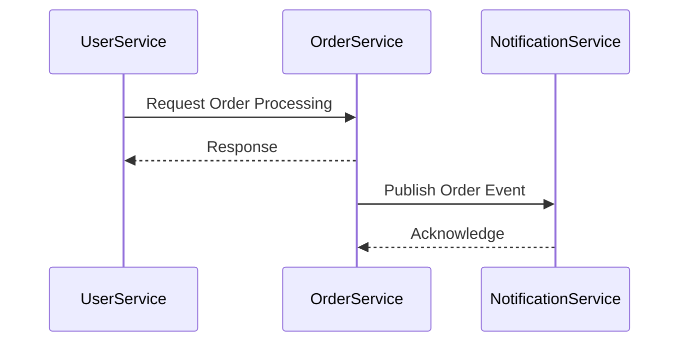

## 10.10 Microservices Communication Patterns

In the realm of microservices architecture, communication patterns play a pivotal role in ensuring that services interact efficiently and reliably. Haskell, with its strong type system and functional programming paradigms, offers unique advantages in implementing these patterns. In this section, we will delve into three fundamental communication patterns: Request-Response, Publish-Subscribe, and Circuit Breaker. We will explore how to implement these patterns using Haskell, leveraging messaging queues and HTTP clients, and provide a comprehensive example of orchestrating multiple Haskell microservices.

### Introduction to Microservices Communication Patterns

Microservices architecture involves decomposing a large application into smaller, independent services that communicate with each other. This architecture offers several benefits, including scalability, flexibility, and ease of deployment. However, it also introduces challenges in terms of communication between services. Understanding and implementing effective communication patterns is crucial for building robust microservices systems.

### Request-Response Pattern

#### Intent

The Request-Response pattern is a synchronous communication pattern where a client sends a request to a service and waits for a response. This pattern is commonly used in scenarios where immediate feedback is required, such as querying a database or retrieving data from an external API.

#### Key Participants

- **Client**: The entity that initiates the request.
- **Service**: The entity that processes the request and returns a response.

#### Applicability

Use the Request-Response pattern when:

- Immediate feedback is required.
- The client needs to know the outcome of the request.
- The operation is idempotent and can be retried safely.

#### Sample Code Snippet

Let's implement a simple Request-Response pattern using Haskell's `http-client` library.

```haskell
{-# LANGUAGE OverloadedStrings #-}

import Network.HTTP.Client
import Network.HTTP.Types.Status (statusCode)

main :: IO ()
main = do
    manager <- newManager defaultManagerSettings
    request <- parseRequest "http://httpbin.org/get"
    response <- httpLbs request manager

    putStrLn $ "The status code was: " ++ show (statusCode $ responseStatus response)
    putStrLn $ "The response body was: " ++ show (responseBody response)
```

In this example, we create an HTTP client manager, construct a request to `http://httpbin.org/get`, and then send the request. The response is printed to the console, showing the status code and body.

#### Design Considerations

- **Timeouts**: Implement timeouts to avoid blocking indefinitely.
- **Retries**: Consider implementing retry logic for transient errors.
- **Error Handling**: Gracefully handle errors and provide meaningful feedback to the client.

### Publish-Subscribe Pattern

#### Intent

The Publish-Subscribe pattern is an asynchronous communication pattern where publishers send messages to a topic, and subscribers receive messages from that topic. This pattern decouples the sender and receiver, allowing for scalable and flexible communication.

#### Key Participants

- **Publisher**: The entity that sends messages to a topic.
- **Subscriber**: The entity that receives messages from a topic.
- **Broker**: The intermediary that manages topics and routes messages.

#### Applicability

Use the Publish-Subscribe pattern when:

- Decoupling of sender and receiver is desired.
- Multiple subscribers need to receive the same message.
- Scalability and flexibility are priorities.

#### Sample Code Snippet

Let's implement a simple Publish-Subscribe pattern using Haskell's `amqp` library.

```haskell
{-# LANGUAGE OverloadedStrings #-}

import Network.AMQP

main :: IO ()
main = do
    conn <- openConnection "127.0.0.1" "/" "guest" "guest"
    chan <- openChannel conn

    declareQueue chan newQueue {queueName = "myQueue"}
    declareExchange chan newExchange {exchangeName = "myExchange", exchangeType = "fanout"}
    bindQueue chan "myQueue" "myExchange" ""

    publishMsg chan "myExchange" "" newMsg {msgBody = "Hello, world!", msgDeliveryMode = Just Persistent}

    closeConnection conn
    putStrLn "Message published"
```

In this example, we connect to an AMQP broker, declare a queue and an exchange, bind the queue to the exchange, and publish a message. Subscribers can then receive messages from the queue.

#### Design Considerations

- **Durability**: Ensure messages are durable to prevent loss in case of broker failure.
- **Scalability**: Use multiple brokers or partitions to handle high message volumes.
- **Error Handling**: Implement error handling for message processing failures.

### Circuit Breaker Pattern

#### Intent

The Circuit Breaker pattern is a fault-tolerance pattern that prevents a service from repeatedly trying to execute an operation that is likely to fail. It acts as a proxy that monitors the number of failures and opens the circuit to prevent further attempts.

#### Key Participants

- **Circuit Breaker**: The entity that monitors failures and controls access to the service.
- **Service**: The entity that the circuit breaker protects.

#### Applicability

Use the Circuit Breaker pattern when:

- A service is prone to transient failures.
- You want to prevent cascading failures in a distributed system.
- You need to provide fallback mechanisms.

#### Sample Code Snippet

Let's implement a simple Circuit Breaker pattern using Haskell's `circuit-breaker` library.

```haskell
{-# LANGUAGE OverloadedStrings #-}

import Control.Circuit
import Control.Monad.IO.Class (liftIO)

main :: IO ()
main = do
    let breaker = newBreaker defaultBreakerSettings
    result <- runCircuit breaker $ do
        liftIO $ putStrLn "Attempting operation..."
        return "Operation successful"

    case result of
        Left err -> putStrLn $ "Operation failed: " ++ show err
        Right msg -> putStrLn msg
```

In this example, we create a circuit breaker with default settings and attempt an operation. If the operation fails, the circuit breaker prevents further attempts and returns an error.

#### Design Considerations

- **Thresholds**: Configure failure thresholds and timeouts appropriately.
- **Fallbacks**: Provide fallback mechanisms for when the circuit is open.
- **Monitoring**: Monitor circuit breaker status and adjust settings as needed.

### Orchestrating Multiple Haskell Microservices

To demonstrate the power of these communication patterns, let's orchestrate a simple system of Haskell microservices using the patterns discussed.

#### System Overview

We'll build a system with three microservices:

1. **User Service**: Handles user-related operations.
2. **Order Service**: Manages orders and transactions.
3. **Notification Service**: Sends notifications to users.

#### Communication Flow

- The User Service communicates with the Order Service using the Request-Response pattern.
- The Order Service publishes order events to a topic, and the Notification Service subscribes to this topic using the Publish-Subscribe pattern.
- A Circuit Breaker protects the Order Service from failures in the Notification Service.

#### Implementation

Let's implement the User Service using the Request-Response pattern.

```haskell
{-# LANGUAGE OverloadedStrings #-}

import Network.HTTP.Client
import Network.HTTP.Types.Status (statusCode)

userService :: IO ()
userService = do
    manager <- newManager defaultManagerSettings
    request <- parseRequest "http://orderservice.local/processOrder"
    response <- httpLbs request manager

    putStrLn $ "Order processed with status: " ++ show (statusCode $ responseStatus response)
```

Next, let's implement the Order Service using the Publish-Subscribe pattern.

```haskell
{-# LANGUAGE OverloadedStrings #-}

import Network.AMQP

orderService :: IO ()
orderService = do
    conn <- openConnection "127.0.0.1" "/" "guest" "guest"
    chan <- openChannel conn

    declareQueue chan newQueue {queueName = "orderQueue"}
    declareExchange chan newExchange {exchangeName = "orderExchange", exchangeType = "fanout"}
    bindQueue chan "orderQueue" "orderExchange" ""

    publishMsg chan "orderExchange" "" newMsg {msgBody = "Order placed", msgDeliveryMode = Just Persistent}

    closeConnection conn
    putStrLn "Order event published"
```

Finally, let's implement the Notification Service with a Circuit Breaker.

```haskell
{-# LANGUAGE OverloadedStrings #-}

import Control.Circuit
import Control.Monad.IO.Class (liftIO)

notificationService :: IO ()
notificationService = do
    let breaker = newBreaker defaultBreakerSettings
    result <- runCircuit breaker $ do
        liftIO $ putStrLn "Sending notification..."
        return "Notification sent"

    case result of
        Left err -> putStrLn $ "Notification failed: " ++ show err
        Right msg -> putStrLn msg
```

### Visualizing Microservices Communication

To better understand the communication flow, let's visualize the interactions between these microservices using a sequence diagram.



This diagram illustrates the sequence of interactions between the User Service, Order Service, and Notification Service, highlighting the use of different communication patterns.

### Design Considerations for Microservices Communication

- **Latency**: Minimize latency by optimizing network communication and using efficient serialization formats.
- **Scalability**: Design services to scale independently, using load balancing and horizontal scaling.
- **Resilience**: Implement fault-tolerance mechanisms, such as retries and circuit breakers, to handle failures gracefully.
- **Security**: Secure communication channels using encryption and authentication mechanisms.

### Haskell Unique Features

Haskell's strong type system and functional programming paradigms offer several advantages for implementing microservices communication patterns:

- **Type Safety**: Haskell's type system ensures that communication protocols are adhered to, reducing runtime errors.
- **Concurrency**: Haskell's lightweight concurrency model, based on green threads, allows for efficient handling of concurrent requests.
- **Immutability**: Immutable data structures simplify reasoning about state changes and reduce the risk of race conditions.

### Differences and Similarities

While the Request-Response and Publish-Subscribe patterns are commonly used in many programming languages, Haskell's approach to implementing these patterns emphasizes immutability and type safety. The Circuit Breaker pattern, although similar in concept, benefits from Haskell's strong abstraction capabilities, allowing for more expressive and concise implementations.

### Try It Yourself

Experiment with the provided code examples by modifying the URLs, message bodies, and circuit breaker settings. Try adding new services or changing the communication patterns to see how they affect the system's behavior.

### Knowledge Check

- Explain the differences between synchronous and asynchronous communication patterns.
- Describe a scenario where the Circuit Breaker pattern would be beneficial.
- Implement a simple Publish-Subscribe system using Haskell's `amqp` library.

### Embrace the Journey

Remember, mastering microservices communication patterns is a journey. As you progress, you'll build more complex systems and encounter new challenges. Keep experimenting, stay curious, and enjoy the journey!

## Quiz: Microservices Communication Patterns



### What is the primary benefit of the Request-Response pattern?

- [x] Immediate feedback
- [ ] Asynchronous communication
- [ ] Decoupling of sender and receiver
- [ ] Fault tolerance

> **Explanation:** The Request-Response pattern provides immediate feedback to the client, making it suitable for scenarios where the client needs to know the outcome of the request.

### Which pattern is best suited for decoupling the sender and receiver?

- [ ] Request-Response
- [x] Publish-Subscribe
- [ ] Circuit Breaker
- [ ] Load Balancer

> **Explanation:** The Publish-Subscribe pattern decouples the sender and receiver, allowing for scalable and flexible communication.

### What is the role of a Circuit Breaker in microservices communication?

- [x] Prevents repeated execution of failing operations
- [ ] Manages message routing
- [ ] Provides immediate feedback
- [ ] Ensures message durability

> **Explanation:** The Circuit Breaker pattern prevents a service from repeatedly trying to execute an operation that is likely to fail, thereby avoiding cascading failures.

### In the provided example, which service uses the Publish-Subscribe pattern?

- [ ] User Service
- [x] Order Service
- [ ] Notification Service
- [ ] All of the above

> **Explanation:** The Order Service uses the Publish-Subscribe pattern to publish order events to a topic.

### What is a key advantage of using Haskell for microservices communication?

- [x] Type safety
- [ ] Dynamic typing
- [ ] Object-oriented design
- [ ] Manual memory management

> **Explanation:** Haskell's strong type system ensures type safety, reducing runtime errors in microservices communication.

### How does the Circuit Breaker pattern enhance fault tolerance?

- [x] By preventing repeated execution of failing operations
- [ ] By decoupling sender and receiver
- [ ] By providing immediate feedback
- [ ] By ensuring message durability

> **Explanation:** The Circuit Breaker pattern enhances fault tolerance by preventing repeated execution of failing operations, thereby avoiding cascading failures.

### Which library is used for implementing the Publish-Subscribe pattern in Haskell?

- [ ] http-client
- [x] amqp
- [ ] circuit-breaker
- [ ] aeson

> **Explanation:** The `amqp` library is used for implementing the Publish-Subscribe pattern in Haskell.

### What is a common use case for the Request-Response pattern?

- [x] Querying a database
- [ ] Broadcasting messages to multiple subscribers
- [ ] Preventing cascading failures
- [ ] Load balancing

> **Explanation:** The Request-Response pattern is commonly used for querying a database or retrieving data from an external API.

### What is the primary role of a broker in the Publish-Subscribe pattern?

- [x] Manages topics and routes messages
- [ ] Provides immediate feedback
- [ ] Ensures message durability
- [ ] Prevents repeated execution of failing operations

> **Explanation:** In the Publish-Subscribe pattern, the broker manages topics and routes messages between publishers and subscribers.

### True or False: Haskell's immutability simplifies reasoning about state changes.

- [x] True
- [ ] False

> **Explanation:** Haskell's immutability simplifies reasoning about state changes and reduces the risk of race conditions.


