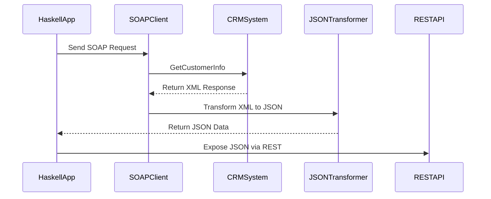

## 10.11 Integration with Enterprise Systems

In today's interconnected world, integrating disparate systems is a critical task for software engineers and architects. Haskell, with its strong type system and functional programming paradigm, offers unique advantages for building robust and maintainable integration solutions. In this section, we will explore the challenges of integrating Haskell applications with enterprise systems and provide solutions using design patterns such as adapters, bridges, and transformers.

### Challenges in Enterprise Integration

Integrating Haskell applications with enterprise systems presents several challenges:

- **Diverse Data Formats**: Enterprise systems often use various data formats such as XML, JSON, CSV, and proprietary formats. Haskell applications must be able to parse, transform, and generate these formats efficiently.
  
- **Multiple Protocols**: Communication with enterprise systems may involve different protocols like HTTP, SOAP, AMQP, or custom protocols. Haskell applications need to handle these protocols seamlessly.
  
- **Legacy Systems**: Many enterprises rely on legacy systems that may not be easily adaptable to modern technologies. Integrating with such systems requires careful handling of data and behavior discrepancies.
  
- **Scalability and Performance**: Integration solutions must be scalable to handle large volumes of data and performant to meet enterprise-level SLAs.

### Solutions with Haskell Design Patterns

To address these challenges, we can leverage Haskell's functional programming capabilities and design patterns such as adapters, bridges, and transformers.

#### Adapter Pattern

The Adapter pattern allows Haskell applications to work with incompatible interfaces by providing a wrapper that translates one interface into another. This is particularly useful when dealing with legacy systems or third-party libraries.

**Example: JSON to XML Adapter**

Suppose we have a Haskell application that needs to communicate with a legacy CRM system that only accepts XML data. We can create an adapter to convert JSON data to XML.

```haskell
{-# LANGUAGE OverloadedStrings #-}

import Data.Aeson (encode, decode)
import Data.ByteString.Lazy (ByteString)
import Text.XML.Light (Element, ppElement, unode)

-- Define a data type for customer information
data Customer = Customer
  { customerId :: Int
  , customerName :: String
  , customerEmail :: String
  } deriving (Show, Eq)

-- Convert Customer to JSON
customerToJson :: Customer -> ByteString
customerToJson = encode

-- Convert Customer to XML
customerToXml :: Customer -> Element
customerToXml customer =
  unode "customer"
    [ unode "id" (show $ customerId customer)
    , unode "name" (customerName customer)
    , unode "email" (customerEmail customer)
    ]

-- Adapter function to convert JSON to XML
jsonToXmlAdapter :: ByteString -> Maybe Element
jsonToXmlAdapter jsonData = do
  customer <- decode jsonData :: Maybe Customer
  return $ customerToXml customer

-- Example usage
main :: IO ()
main = do
  let customer = Customer 1 "John Doe" "john.doe@example.com"
  let json = customerToJson customer
  case jsonToXmlAdapter json of
    Just xml -> putStrLn $ ppElement xml
    Nothing -> putStrLn "Failed to convert JSON to XML"
```

In this example, we define a `Customer` data type and provide functions to convert it to JSON and XML. The `jsonToXmlAdapter` function acts as an adapter, converting JSON data to XML using the `decode` function from the Aeson library and the `unode` function from the XML Light library.

#### Bridge Pattern

The Bridge pattern separates an abstraction from its implementation, allowing them to vary independently. This is useful for integrating Haskell applications with multiple enterprise systems that share similar functionality but differ in implementation.

**Example: Payment Processing Bridge**

Consider a scenario where a Haskell application needs to integrate with multiple payment gateways. We can use the Bridge pattern to create a common interface for payment processing and separate implementations for each gateway.

```haskell
{-# LANGUAGE ExistentialQuantification #-}

-- Define a PaymentProcessor interface
class PaymentProcessor p where
  processPayment :: p -> Double -> IO Bool

-- Define a data type for PayPal
data PayPal = PayPal { paypalAccount :: String }

-- Define a data type for Stripe
data Stripe = Stripe { stripeApiKey :: String }

-- Implement PaymentProcessor for PayPal
instance PaymentProcessor PayPal where
  processPayment paypal amount = do
    putStrLn $ "Processing PayPal payment of " ++ show amount ++ " for account " ++ paypalAccount paypal
    return True

-- Implement PaymentProcessor for Stripe
instance PaymentProcessor Stripe where
  processPayment stripe amount = do
    putStrLn $ "Processing Stripe payment of " ++ show amount ++ " with API key " ++ stripeApiKey stripe
    return True

-- Define a Bridge for payment processing
data PaymentBridge = forall p. PaymentProcessor p => PaymentBridge p

-- Function to process payment using the bridge
processPaymentBridge :: PaymentBridge -> Double -> IO Bool
processPaymentBridge (PaymentBridge processor) amount = processPayment processor amount

-- Example usage
main :: IO ()
main = do
  let paypal = PayPal "john.doe@paypal.com"
  let stripe = Stripe "sk_test_4eC39HqLyjWDarjtT1zdp7dc"
  let paypalBridge = PaymentBridge paypal
  let stripeBridge = PaymentBridge stripe
  processPaymentBridge paypalBridge 100.0
  processPaymentBridge stripeBridge 200.0
```

In this example, we define a `PaymentProcessor` type class with a `processPayment` method. We then create data types for `PayPal` and `Stripe` and implement the `PaymentProcessor` interface for each. The `PaymentBridge` data type acts as a bridge, allowing us to process payments using different implementations.

#### Transformer Pattern

The Transformer pattern is used to convert data from one format to another. In Haskell, this can be achieved using functions or monads that transform data as it flows through the system.

**Example: CSV to JSON Transformer**

Suppose we have a Haskell application that needs to transform CSV data from a legacy system into JSON format for a modern web service.

```haskell
{-# LANGUAGE OverloadedStrings #-}

import Data.Aeson (encode, object, (.=))
import Data.ByteString.Lazy (ByteString)
import Data.Csv (decode, HasHeader(..))
import qualified Data.Vector as V

-- Define a data type for customer information
data Customer = Customer
  { customerId :: Int
  , customerName :: String
  , customerEmail :: String
  } deriving (Show, Eq)

-- Implement FromRecord for Customer to parse CSV
instance FromRecord Customer where
  parseRecord v
    | V.length v == 3 = Customer <$> v .! 0 <*> v .! 1 <*> v .! 2
    | otherwise = mzero

-- Convert Customer to JSON
customerToJson :: Customer -> ByteString
customerToJson customer = encode $ object
  [ "id" .= customerId customer
  , "name" .= customerName customer
  , "email" .= customerEmail customer
  ]

-- Transformer function to convert CSV to JSON
csvToJsonTransformer :: ByteString -> Either String [ByteString]
csvToJsonTransformer csvData = do
  customers <- decode NoHeader csvData
  return $ map customerToJson (V.toList customers)

-- Example usage
main :: IO ()
main = do
  let csvData = "1,John Doe,john.doe@example.com\n2,Jane Smith,jane.smith@example.com"
  case csvToJsonTransformer csvData of
    Left err -> putStrLn $ "Error: " ++ err
    Right jsons -> mapM_ (putStrLn . show) jsons
```

In this example, we define a `Customer` data type and implement the `FromRecord` type class to parse CSV data. The `csvToJsonTransformer` function transforms CSV data into JSON using the `decode` function from the Cassava library and the `encode` function from the Aeson library.

### Integrating with a Legacy CRM System

Let's consider a real-world example of integrating a Haskell application with a legacy CRM system. The CRM system uses a SOAP API and XML data format, while our Haskell application uses REST and JSON.

#### Step 1: SOAP Client in Haskell

First, we need to create a SOAP client in Haskell to communicate with the CRM system. We can use the `soap` library to generate Haskell bindings from the CRM's WSDL file.

```haskell
{-# LANGUAGE OverloadedStrings #-}

import Network.SOAP
import Network.SOAP.Transport.HTTP
import Text.XML.Light

-- Define a SOAP action for retrieving customer information
getCustomerInfo :: String -> IO (Either String Element)
getCustomerInfo customerId = do
  let soapAction = "GetCustomerInfo"
  let requestBody = unode "GetCustomerInfoRequest" [unode "CustomerId" customerId]
  response <- callSOAP "http://crm.example.com/soap" soapAction requestBody
  return $ parseSOAPResponse response

-- Example usage
main :: IO ()
main = do
  result <- getCustomerInfo "12345"
  case result of
    Left err -> putStrLn $ "Error: " ++ err
    Right xml -> putStrLn $ ppElement xml
```

In this example, we define a `getCustomerInfo` function that sends a SOAP request to the CRM system and parses the XML response using the `soap` library.

#### Step 2: XML to JSON Transformation

Next, we need to transform the XML response from the CRM system into JSON format for our Haskell application.

```haskell
import Data.Aeson (encode, object, (.=))
import Text.XML.Light

-- Function to transform XML to JSON
xmlToJsonTransformer :: Element -> ByteString
xmlToJsonTransformer xml =
  let customerId = findChild (unqual "CustomerId") xml >>= strContent
      customerName = findChild (unqual "CustomerName") xml >>= strContent
      customerEmail = findChild (unqual "CustomerEmail") xml >>= strContent
  in encode $ object
       [ "id" .= customerId
       , "name" .= customerName
       , "email" .= customerEmail
       ]

-- Example usage
main :: IO ()
main = do
  let xml = unode "CustomerInfo"
              [ unode "CustomerId" "12345"
              , unode "CustomerName" "John Doe"
              , unode "CustomerEmail" "john.doe@example.com"
              ]
  let json = xmlToJsonTransformer xml
  putStrLn $ "JSON: " ++ show json
```

In this example, we define an `xmlToJsonTransformer` function that extracts customer information from the XML response and encodes it as JSON using the Aeson library.

#### Step 3: REST API in Haskell

Finally, we need to expose a REST API in our Haskell application to provide customer information to other systems.

```haskell
{-# LANGUAGE OverloadedStrings #-}

import Web.Scotty
import Data.Aeson (encode)
import Network.Wai.Middleware.RequestLogger (logStdoutDev)

-- Define a REST endpoint for customer information
getCustomerInfoEndpoint :: ActionM ()
getCustomerInfoEndpoint = do
  customerId <- param "customerId"
  let customer = Customer 12345 "John Doe" "john.doe@example.com"
  json customer

-- Main function to start the server
main :: IO ()
main = scotty 3000 $ do
  middleware logStdoutDev
  get "/customer/:customerId" getCustomerInfoEndpoint
```

In this example, we use the Scotty library to create a simple REST API that returns customer information in JSON format.

### Visualizing Integration Patterns

To better understand the integration patterns, let's visualize the flow of data and transformations using a sequence diagram.



This diagram illustrates the sequence of interactions between the Haskell application, SOAP client, CRM system, JSON transformer, and REST API.

### Key Takeaways

- **Adapters**: Use adapters to bridge incompatible interfaces and facilitate communication between Haskell applications and legacy systems.
- **Bridges**: Employ bridges to separate abstractions from implementations, allowing flexible integration with multiple systems.
- **Transformers**: Leverage transformers to convert data formats and enable seamless data flow between systems.
- **Haskell's Strengths**: Utilize Haskell's strong type system, functional programming paradigm, and libraries to build robust and maintainable integration solutions.

### Try It Yourself

Experiment with the provided code examples by modifying data types, adding new fields, or changing the data formats. Try integrating with different enterprise systems or protocols to deepen your understanding of Haskell's integration capabilities.

### Further Reading

- [Haskell SOAP Library](https://hackage.haskell.org/package/soap)
- [Aeson JSON Library](https://hackage.haskell.org/package/aeson)
- [Scotty Web Framework](https://hackage.haskell.org/package/scotty)

## Quiz: Integration with Enterprise Systems



### What is the primary purpose of the Adapter pattern in Haskell?

- [x] To bridge incompatible interfaces
- [ ] To separate abstraction from implementation
- [ ] To convert data formats
- [ ] To handle multiple protocols

> **Explanation:** The Adapter pattern is used to bridge incompatible interfaces, allowing systems to communicate effectively.

### Which Haskell library is commonly used for JSON encoding and decoding?

- [x] Aeson
- [ ] Cassava
- [ ] Scotty
- [ ] Conduit

> **Explanation:** The Aeson library is widely used in Haskell for JSON encoding and decoding.

### What is the role of the Bridge pattern in enterprise integration?

- [ ] To convert data formats
- [x] To separate abstraction from implementation
- [ ] To handle legacy systems
- [ ] To parse XML data

> **Explanation:** The Bridge pattern separates abstraction from implementation, allowing flexible integration with multiple systems.

### Which pattern is used to transform data from one format to another in Haskell?

- [ ] Adapter
- [ ] Bridge
- [x] Transformer
- [ ] Proxy

> **Explanation:** The Transformer pattern is used to convert data formats, enabling seamless data flow between systems.

### What is a common challenge when integrating Haskell applications with enterprise systems?

- [x] Handling diverse data formats
- [ ] Implementing REST APIs
- [ ] Using monads
- [ ] Writing pure functions

> **Explanation:** Handling diverse data formats is a common challenge in enterprise integration, requiring careful data transformation.

### Which protocol is often used for communication with legacy enterprise systems?

- [x] SOAP
- [ ] HTTP
- [ ] MQTT
- [ ] WebSockets

> **Explanation:** SOAP is a protocol commonly used for communication with legacy enterprise systems.

### What is the purpose of the `jsonToXmlAdapter` function in the provided example?

- [x] To convert JSON data to XML
- [ ] To parse XML data
- [ ] To encode JSON data
- [ ] To handle HTTP requests

> **Explanation:** The `jsonToXmlAdapter` function converts JSON data to XML, acting as an adapter for communication with legacy systems.

### Which Haskell library is used for creating REST APIs in the provided example?

- [ ] Aeson
- [ ] Cassava
- [x] Scotty
- [ ] Conduit

> **Explanation:** The Scotty library is used for creating REST APIs in Haskell, as demonstrated in the example.

### What is a key benefit of using Haskell for enterprise integration?

- [x] Strong type system
- [ ] Object-oriented programming
- [ ] Dynamic typing
- [ ] Weak type system

> **Explanation:** Haskell's strong type system is a key benefit for building robust and maintainable integration solutions.

### True or False: The Bridge pattern is used to convert data formats in Haskell.

- [ ] True
- [x] False

> **Explanation:** The Bridge pattern is not used to convert data formats; it separates abstraction from implementation.



Remember, this is just the beginning. As you progress, you'll build more complex and interactive integration solutions. Keep experimenting, stay curious, and enjoy the journey!
