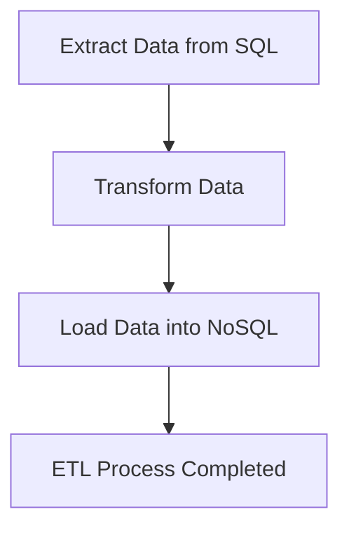

## 10.12 Data Integration and ETL Processes

In the realm of data engineering, **ETL (Extract, Transform, Load)** processes are fundamental for data migration, integration, and warehousing. This section delves into how Haskell, with its robust functional programming paradigms, can be leveraged to implement efficient and scalable ETL processes. We will explore the concepts, provide code examples, and discuss best practices for using Haskell in data integration tasks.

### Understanding ETL Processes

ETL processes are crucial for moving data from various sources into a centralized data warehouse. Let's break down each component:

- **Extract**: This phase involves retrieving data from different sources, such as databases, APIs, or flat files.
- **Transform**: In this phase, data is cleaned, normalized, and transformed into a suitable format for analysis.
- **Load**: The final phase involves loading the transformed data into a target system, such as a data warehouse or a NoSQL database.

### Why Use Haskell for ETL?

Haskell offers several advantages for ETL processes:

- **Immutability**: Haskell's immutable data structures ensure that data transformations are side-effect-free, leading to more predictable and reliable ETL processes.
- **Concurrency**: Haskell's lightweight concurrency model allows for efficient parallel processing of data, which is essential for handling large datasets.
- **Type Safety**: Haskell's strong static typing helps catch errors at compile time, reducing runtime failures.
- **Expressiveness**: Haskell's concise syntax and powerful abstractions make it easier to express complex data transformations.

### Implementing ETL in Haskell

Let's explore how to implement a basic ETL pipeline in Haskell. We'll focus on moving data from a SQL database to a NoSQL store, illustrating each step with code examples.

#### Step 1: Extracting Data

To extract data from a SQL database, we can use the `postgresql-simple` library, which provides a straightforward interface for interacting with PostgreSQL databases.

```haskell
{-# LANGUAGE OverloadedStrings #-}

import Database.PostgreSQL.Simple

-- Define a data type for the extracted data
data User = User { userId :: Int, userName :: String, userEmail :: String }

-- Function to extract data from the database
extractData :: IO [User]
extractData = do
    conn <- connect defaultConnectInfo { connectDatabase = "mydb" }
    query_ conn "SELECT id, name, email FROM users"
```

In this example, we define a `User` data type and a function `extractData` that connects to a PostgreSQL database and retrieves user data.

#### Step 2: Transforming Data

Once the data is extracted, we need to transform it. Haskell's powerful list processing capabilities make it easy to apply transformations.

```haskell
-- Function to transform user data
transformData :: [User] -> [User]
transformData = map (\user -> user { userName = map toUpper (userName user) })
```

Here, we define a `transformData` function that converts user names to uppercase. This is a simple transformation, but Haskell's higher-order functions allow for more complex operations.

#### Step 3: Loading Data

Finally, we load the transformed data into a NoSQL store. For this example, we'll use the `mongodb` library to interact with a MongoDB database.

```haskell
import Database.MongoDB

-- Function to load data into MongoDB
loadData :: [User] -> IO ()
loadData users = do
    pipe <- connect (host "127.0.0.1")
    let db = "mydb"
    access pipe master db $ do
        clearCollection "users"
        insertMany "users" (map toDocument users)
    close pipe

-- Helper function to convert User to BSON Document
toDocument :: User -> Document
toDocument user = ["_id" =: userId user, "name" =: userName user, "email" =: userEmail user]
```

In this code, we define a `loadData` function that connects to a MongoDB instance and inserts the transformed user data. The `toDocument` helper function converts a `User` to a BSON document.

### Complete ETL Pipeline

Now, let's put it all together into a complete ETL pipeline:

```haskell
main :: IO ()
main = do
    extractedData <- extractData
    let transformedData = transformData extractedData
    loadData transformedData
    putStrLn "ETL process completed successfully."
```

This `main` function orchestrates the ETL process by extracting, transforming, and loading the data in sequence.

### Visualizing the ETL Process

To better understand the flow of data through the ETL pipeline, let's visualize it using a Mermaid.js flowchart:



This diagram illustrates the sequential flow of data from extraction to transformation and finally loading.

### Best Practices for ETL in Haskell

- **Use Concurrency**: Leverage Haskell's concurrency features to parallelize data extraction and transformation, improving performance for large datasets.
- **Error Handling**: Implement robust error handling using Haskell's `Either` and `Maybe` types to manage failures gracefully.
- **Logging and Monitoring**: Integrate logging and monitoring to track the progress and performance of ETL processes.
- **Testing**: Use property-based testing to ensure the correctness of data transformations.

### Advanced ETL Techniques

For more complex ETL scenarios, consider the following advanced techniques:

- **Streaming Data**: Use libraries like `conduit` or `pipes` for streaming data processing, which is useful for handling large datasets that don't fit into memory.
- **Data Validation**: Implement data validation rules to ensure data quality before loading it into the target system.
- **Incremental Loads**: Optimize ETL processes by implementing incremental loads, which only process new or changed data.

### Haskell Unique Features in ETL

Haskell's unique features, such as lazy evaluation and type classes, can be leveraged to optimize ETL processes:

- **Lazy Evaluation**: Process large datasets efficiently by taking advantage of Haskell's lazy evaluation, which allows you to work with infinite data structures.
- **Type Classes**: Use type classes to define generic ETL operations that can be reused across different data types and sources.

### Differences and Similarities with Other Languages

Haskell's approach to ETL differs from imperative languages like Python or Java in several ways:

- **Immutability**: Unlike imperative languages, Haskell's immutable data structures prevent accidental data modification, leading to more reliable ETL processes.
- **Concurrency Model**: Haskell's lightweight threads and STM (Software Transactional Memory) provide a more efficient concurrency model compared to traditional threading in Java.
- **Expressiveness**: Haskell's concise syntax and higher-order functions make it easier to express complex transformations compared to verbose imperative code.

### Try It Yourself

Experiment with the provided ETL pipeline by modifying the transformation function to apply different data transformations. For example, try normalizing email addresses or filtering out users based on specific criteria.

### Knowledge Check

- What are the main phases of an ETL process?
- How does Haskell's immutability benefit ETL processes?
- What libraries can be used for streaming data processing in Haskell?

### Embrace the Journey

Remember, mastering ETL processes in Haskell is just the beginning. As you progress, you'll be able to tackle more complex data integration challenges and build scalable data pipelines. Keep experimenting, stay curious, and enjoy the journey!

## Quiz: Data Integration and ETL Processes



### What are the main phases of an ETL process?

- [x] Extract, Transform, Load
- [ ] Extract, Transfer, Load
- [ ] Extract, Transform, Link
- [ ] Extract, Translate, Load

> **Explanation:** The main phases of an ETL process are Extract, Transform, and Load.

### How does Haskell's immutability benefit ETL processes?

- [x] It ensures data transformations are side-effect-free.
- [ ] It makes data transformations faster.
- [ ] It allows for mutable data structures.
- [ ] It simplifies error handling.

> **Explanation:** Haskell's immutability ensures that data transformations are side-effect-free, leading to more predictable and reliable ETL processes.

### Which library can be used to interact with PostgreSQL in Haskell?

- [x] postgresql-simple
- [ ] mongodb
- [ ] conduit
- [ ] pipes

> **Explanation:** The `postgresql-simple` library provides a straightforward interface for interacting with PostgreSQL databases in Haskell.

### What is a benefit of using Haskell's concurrency model in ETL processes?

- [x] Efficient parallel processing of data
- [ ] Simplified syntax for data transformations
- [ ] Enhanced error handling capabilities
- [ ] Improved data validation

> **Explanation:** Haskell's lightweight concurrency model allows for efficient parallel processing of data, which is essential for handling large datasets in ETL processes.

### Which library is used for interacting with MongoDB in Haskell?

- [x] mongodb
- [ ] postgresql-simple
- [ ] aeson
- [ ] warp

> **Explanation:** The `mongodb` library is used for interacting with MongoDB databases in Haskell.

### What is a key advantage of using Haskell for ETL processes?

- [x] Strong static typing helps catch errors at compile time.
- [ ] Haskell allows for mutable data structures.
- [ ] Haskell has a verbose syntax.
- [ ] Haskell lacks concurrency support.

> **Explanation:** Haskell's strong static typing helps catch errors at compile time, reducing runtime failures in ETL processes.

### How can you optimize ETL processes for large datasets in Haskell?

- [x] Use libraries like conduit or pipes for streaming data processing.
- [ ] Use mutable data structures for faster processing.
- [ ] Avoid using type classes.
- [ ] Use imperative programming techniques.

> **Explanation:** Libraries like `conduit` or `pipes` can be used for streaming data processing, which is useful for handling large datasets that don't fit into memory.

### What is a common use case for incremental loads in ETL processes?

- [x] Processing only new or changed data
- [ ] Processing all data every time
- [ ] Simplifying data transformations
- [ ] Enhancing data validation

> **Explanation:** Incremental loads optimize ETL processes by processing only new or changed data, reducing the amount of data that needs to be processed.

### What is a benefit of using type classes in Haskell for ETL operations?

- [x] Defining generic ETL operations that can be reused across different data types
- [ ] Simplifying syntax for data transformations
- [ ] Allowing for mutable data structures
- [ ] Enhancing error handling capabilities

> **Explanation:** Type classes in Haskell allow you to define generic ETL operations that can be reused across different data types and sources.

### True or False: Haskell's lazy evaluation allows you to work with infinite data structures.

- [x] True
- [ ] False

> **Explanation:** Haskell's lazy evaluation allows you to work with infinite data structures by evaluating data only when needed.


