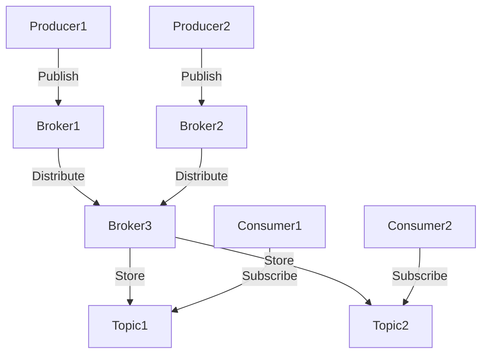
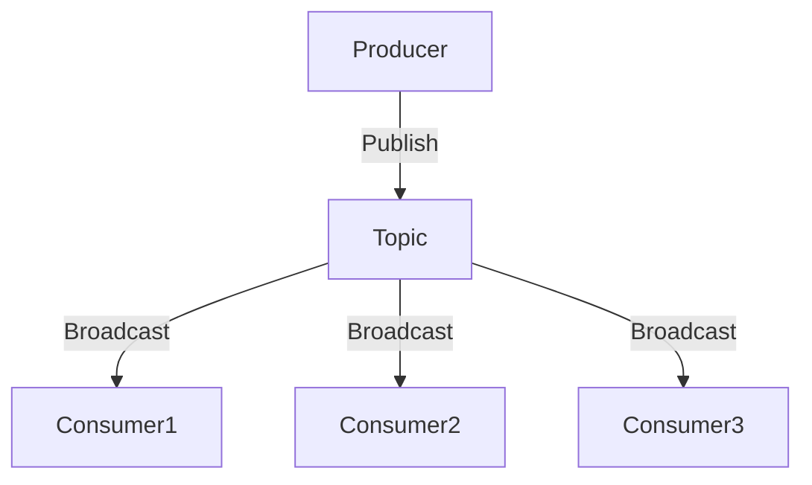

## 10.13 Using Apache Kafka and Other Message Brokers

In the realm of distributed systems, message brokers play a pivotal role in enabling asynchronous communication between services. They decouple the sender and receiver, allowing for more flexible and scalable architectures. Apache Kafka, a high-throughput, distributed messaging system, has become a cornerstone for building real-time data pipelines and streaming applications. In this section, we will explore how to integrate Apache Kafka and other message brokers into Haskell applications, leveraging advanced design patterns to create scalable and efficient systems.

### Understanding Message Brokers

**Message Brokers** are systems that facilitate the exchange of messages between different applications or services. They enable asynchronous communication, which is crucial for building scalable and resilient systems. By decoupling the sender and receiver, message brokers allow each component to operate independently, improving fault tolerance and scalability.

#### Key Features of Message Brokers

- **Asynchronous Communication**: Allows services to communicate without waiting for each other.
- **Decoupling**: Separates the sender and receiver, enabling independent scaling and maintenance.
- **Reliability**: Ensures message delivery even in the event of failures.
- **Scalability**: Supports high-throughput and large-scale message processing.
- **Flexibility**: Supports various messaging patterns such as publish-subscribe and point-to-point.

### Apache Kafka: A High-Throughput Distributed Messaging System

**Apache Kafka** is a distributed event streaming platform capable of handling trillions of events a day. It is designed to provide high-throughput, low-latency, and fault-tolerant messaging. Kafka is widely used for building real-time data pipelines and streaming applications.

#### Core Concepts of Kafka

- **Topics**: Categories or feeds to which messages are published.
- **Producers**: Applications that publish messages to Kafka topics.
- **Consumers**: Applications that subscribe to topics and process the messages.
- **Brokers**: Kafka servers that store and serve messages.
- **Partitions**: Sub-divisions of topics that allow parallel processing.

#### Kafka's Architecture

Kafka's architecture is designed for distributed processing and storage. It consists of multiple brokers that form a Kafka cluster. Each topic is divided into partitions, and each partition is replicated across multiple brokers for fault tolerance.



*Figure 1: Apache Kafka Architecture*

### Integrating Kafka with Haskell

Haskell, with its strong type system and functional programming paradigm, offers unique advantages for integrating with message brokers like Kafka. Libraries such as **hw-kafka-client** provide a robust interface for Kafka integration in Haskell applications.

#### Using `hw-kafka-client`

The `hw-kafka-client` library is a Haskell binding to the popular Kafka client library `librdkafka`. It provides a high-level API for producing and consuming messages from Kafka topics.

**Installation**

To use `hw-kafka-client`, add it to your project's dependencies:

```haskell
cabal install hw-kafka-client
```

**Producing Messages**

Here's a simple example of producing messages to a Kafka topic using `hw-kafka-client`:

```haskell
{-# LANGUAGE OverloadedStrings #-}

import Kafka.Producer

-- Define the Kafka broker and topic
brokerAddress :: BrokerAddress
brokerAddress = BrokerAddress "localhost:9092"

topic :: TopicName
topic = TopicName "example-topic"

-- Create a producer record
producerRecord :: ProducerRecord
producerRecord = ProducerRecord topic Nothing (Just "Hello, Kafka!")

-- Produce a message
produceMessage :: IO ()
produceMessage = do
    -- Create a producer
    producer <- newProducer (brokersList [brokerAddress]) defaultProducerProps

    -- Send the message
    result <- produceMessage producer producerRecord

    -- Handle the result
    case result of
        Just err -> putStrLn $ "Failed to produce message: " ++ show err
        Nothing  -> putStrLn "Message produced successfully"

    -- Close the producer
    closeProducer producer
```

**Consuming Messages**

To consume messages from a Kafka topic, use the following example:

```haskell
{-# LANGUAGE OverloadedStrings #-}

import Kafka.Consumer

-- Define the Kafka broker and topic
consumerProps :: ConsumerProperties
consumerProps = brokersList [BrokerAddress "localhost:9092"]
                <> groupId (ConsumerGroupId "example-group")

subscription :: Subscription
subscription = topics [TopicName "example-topic"]

-- Consume messages
consumeMessages :: IO ()
consumeMessages = do
    -- Create a consumer
    consumer <- newConsumer consumerProps subscription

    -- Poll for messages
    forever $ do
        msg <- pollMessage consumer (Timeout 1000)
        case msg of
            Left err -> putStrLn $ "Error: " ++ show err
            Right m  -> putStrLn $ "Received message: " ++ show (crValue m)

    -- Close the consumer
    closeConsumer consumer
```

### Design Patterns for Kafka Integration

Integrating Kafka into Haskell applications involves several design patterns that enhance scalability and maintainability.

#### Publish-Subscribe Pattern

The publish-subscribe pattern is a messaging pattern where producers publish messages to topics, and consumers subscribe to those topics to receive messages. This pattern is ideal for broadcasting messages to multiple consumers.

**Diagram: Publish-Subscribe Pattern**



*Figure 2: Publish-Subscribe Pattern*

#### Event Sourcing

Event sourcing is a pattern where state changes are stored as a sequence of events. Kafka's log-based architecture makes it an excellent fit for event sourcing, allowing you to replay events to reconstruct state.

#### CQRS (Command Query Responsibility Segregation)

CQRS is a pattern that separates the read and write operations of a system. Kafka can be used to implement CQRS by handling commands and queries through different channels.

### Other Message Brokers

While Kafka is a popular choice, other message brokers like RabbitMQ and Amazon SQS offer different features and trade-offs.

#### RabbitMQ

RabbitMQ is a message broker that supports multiple messaging protocols. It is known for its ease of use and flexibility.

#### Amazon SQS

Amazon SQS is a fully managed message queuing service that enables you to decouple and scale microservices, distributed systems, and serverless applications.

### Haskell Integration with Other Brokers

Haskell can integrate with other message brokers using libraries like `amqp` for RabbitMQ and `aws-sdk` for Amazon SQS.

**Example: RabbitMQ Integration**

```haskell
{-# LANGUAGE OverloadedStrings #-}

import Network.AMQP

-- Connect to RabbitMQ
connectToRabbitMQ :: IO ()
connectToRabbitMQ = do
    conn <- openConnection "localhost" "/" "guest" "guest"
    chan <- openChannel conn

    -- Declare a queue
    declareQueue chan newQueue {queueName = "example-queue"}

    -- Publish a message
    publishMsg chan "" "example-queue" newMsg {msgBody = "Hello, RabbitMQ!"}

    -- Close the connection
    closeConnection conn
```

### Design Considerations

When integrating message brokers into Haskell applications, consider the following:

- **Scalability**: Ensure that your system can handle increased load by scaling consumers and producers.
- **Fault Tolerance**: Implement retry mechanisms and error handling to ensure message delivery.
- **Latency**: Optimize message processing to reduce latency.
- **Security**: Secure communication between services using encryption and authentication.

### Haskell Unique Features

Haskell's strong type system and functional paradigm offer unique advantages for integrating with message brokers:

- **Type Safety**: Ensure message formats and protocols are correctly implemented.
- **Concurrency**: Leverage Haskell's concurrency primitives for efficient message processing.
- **Immutability**: Benefit from immutable data structures for reliable state management.

### Differences and Similarities

While Kafka and other message brokers share common features, they differ in terms of architecture, scalability, and use cases. Understanding these differences is crucial for selecting the right broker for your application.

### Try It Yourself

Experiment with the provided code examples by modifying the broker addresses, topics, and message contents. Try integrating with different message brokers and observe how they handle message delivery and processing.

### Knowledge Check

- What are the key features of message brokers?
- How does Kafka's architecture support high-throughput messaging?
- What are the benefits of using the publish-subscribe pattern?
- How can Haskell's type system enhance message broker integration?
- What are the differences between Kafka and RabbitMQ?

### Embrace the Journey

Integrating message brokers into Haskell applications opens up a world of possibilities for building scalable and resilient systems. Remember, this is just the beginning. As you progress, you'll discover more advanced patterns and techniques. Keep experimenting, stay curious, and enjoy the journey!

## Quiz: Using Apache Kafka and Other Message Brokers



### What is a key feature of message brokers?

- [x] Asynchronous communication
- [ ] Synchronous communication
- [ ] Direct communication
- [ ] Manual message routing

> **Explanation:** Message brokers enable asynchronous communication, allowing services to communicate without waiting for each other.

### Which library is used for Kafka integration in Haskell?

- [x] hw-kafka-client
- [ ] amqp
- [ ] aws-sdk
- [ ] kafka-python

> **Explanation:** The `hw-kafka-client` library provides a Haskell interface for integrating with Apache Kafka.

### What pattern is ideal for broadcasting messages to multiple consumers?

- [x] Publish-Subscribe
- [ ] Point-to-Point
- [ ] Event Sourcing
- [ ] CQRS

> **Explanation:** The publish-subscribe pattern allows producers to publish messages to topics, which are then broadcasted to multiple consumers.

### What is a benefit of using Haskell's type system in message broker integration?

- [x] Type safety
- [ ] Increased latency
- [ ] Reduced scalability
- [ ] Manual error handling

> **Explanation:** Haskell's strong type system ensures that message formats and protocols are correctly implemented, enhancing type safety.

### Which message broker is known for its ease of use and flexibility?

- [ ] Apache Kafka
- [x] RabbitMQ
- [ ] Amazon SQS
- [ ] ActiveMQ

> **Explanation:** RabbitMQ is known for its ease of use and flexibility, supporting multiple messaging protocols.

### What is a key consideration when integrating message brokers into Haskell applications?

- [x] Scalability
- [ ] Manual message routing
- [ ] Synchronous communication
- [ ] Direct communication

> **Explanation:** Scalability is crucial to ensure that the system can handle increased load by scaling consumers and producers.

### Which pattern separates the read and write operations of a system?

- [ ] Publish-Subscribe
- [ ] Point-to-Point
- [ ] Event Sourcing
- [x] CQRS

> **Explanation:** CQRS (Command Query Responsibility Segregation) separates the read and write operations of a system.

### What is a benefit of using Kafka for event sourcing?

- [x] Log-based architecture
- [ ] Synchronous communication
- [ ] Manual message routing
- [ ] Direct communication

> **Explanation:** Kafka's log-based architecture makes it an excellent fit for event sourcing, allowing you to replay events to reconstruct state.

### Which message broker is a fully managed message queuing service by Amazon?

- [ ] Apache Kafka
- [ ] RabbitMQ
- [x] Amazon SQS
- [ ] ActiveMQ

> **Explanation:** Amazon SQS is a fully managed message queuing service by Amazon, enabling you to decouple and scale microservices.

### True or False: Haskell's immutability benefits reliable state management in message broker integration.

- [x] True
- [ ] False

> **Explanation:** Haskell's immutability ensures reliable state management, which is beneficial in message broker integration.


