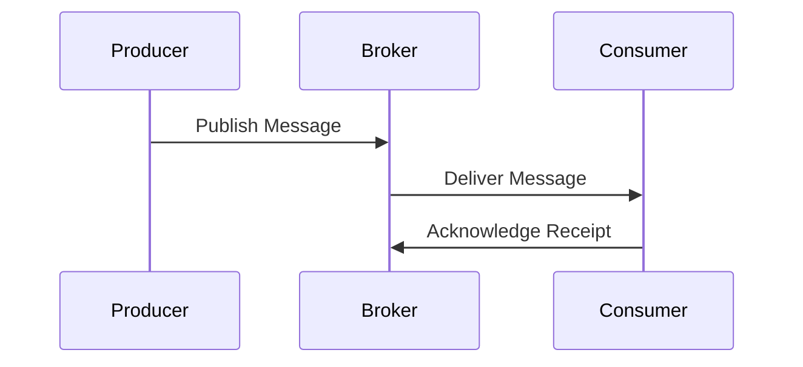
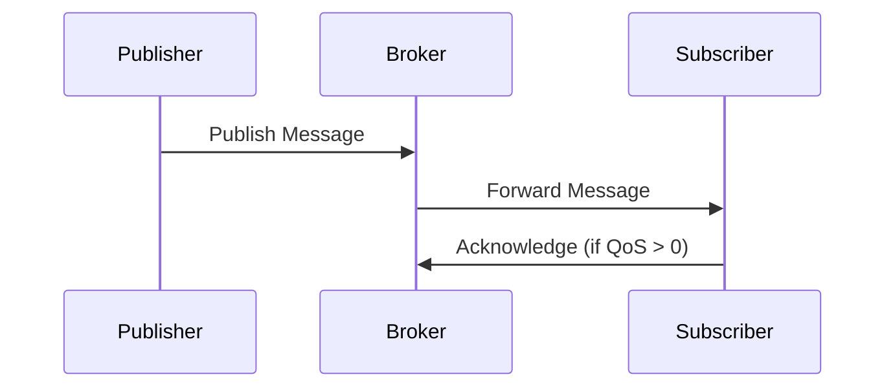

## 10.2 Messaging Systems and Protocols: AMQP and MQTT in Haskell

In the realm of enterprise integration, messaging systems play a pivotal role in enabling communication between distributed components. Two prominent protocols in this domain are the Advanced Message Queuing Protocol (AMQP) and the Message Queuing Telemetry Transport (MQTT). This section delves into these protocols, their applications, and how they can be effectively utilized in Haskell to build robust, scalable systems.

### Messaging Protocols: An Overview

Messaging protocols are standards that define the rules and formats for exchanging messages between systems. They are crucial for ensuring interoperability, reliability, and scalability in distributed systems. Let's explore two widely used messaging protocols: AMQP and MQTT.

#### Advanced Message Queuing Protocol (AMQP)

AMQP is a protocol designed for message-oriented middleware. It provides a robust framework for reliable communication, supporting features such as message queuing, routing, and transactions. AMQP is particularly suited for enterprise environments where message delivery guarantees are critical.

**Key Features of AMQP:**

- **Reliability:** Ensures messages are delivered once and only once.
- **Flexibility:** Supports various messaging patterns, including point-to-point and publish-subscribe.
- **Interoperability:** Allows different systems to communicate seamlessly.
- **Security:** Provides mechanisms for authentication and encryption.

#### Message Queuing Telemetry Transport (MQTT)

MQTT is a lightweight messaging protocol designed for machine-to-machine (M2M) communication. It is ideal for scenarios where bandwidth and power consumption are constraints, such as IoT applications.

**Key Features of MQTT:**

- **Simplicity:** Easy to implement and use.
- **Efficiency:** Minimizes network bandwidth and device resource usage.
- **Scalability:** Supports a large number of devices.
- **QoS Levels:** Offers three levels of Quality of Service for message delivery.

### Implementing Messaging Protocols in Haskell

Haskell, with its strong type system and functional paradigm, provides an excellent platform for implementing messaging protocols. Let's explore how we can leverage Haskell libraries to work with AMQP and MQTT.

#### Working with AMQP in Haskell

The `Network.AMQP` library is a popular choice for implementing AMQP in Haskell. It provides a comprehensive API for interacting with AMQP brokers, such as RabbitMQ.

**Setting Up AMQP in Haskell:**

1. **Install the Library:**

   To get started, install the `amqp` package using Cabal or Stack:

   ```bash
   cabal install amqp
   ```

2. **Establish a Connection:**

   Use the `Network.AMQP` module to establish a connection to the AMQP broker.

   ```haskell
   import Network.AMQP

   main :: IO ()
   main = do
       conn <- openConnection "localhost" "/" "guest" "guest"
       putStrLn "Connected to AMQP broker"
       closeConnection conn
   ```

3. **Declare a Queue:**

   Declare a queue to which messages will be sent.

   ```haskell
   declareQueue :: Channel -> IO ()
   declareQueue chan = do
       _ <- declareQueue chan newQueue {queueName = "myQueue"}
       return ()
   ```

4. **Publish a Message:**

   Publish a message to the declared queue.

   ```haskell
   publishMessage :: Channel -> IO ()
   publishMessage chan = do
       publishMsg chan "" "myQueue" newMsg {msgBody = "Hello, AMQP!"}
       putStrLn "Message published"
   ```

5. **Consume Messages:**

   Consume messages from the queue.

   ```haskell
   consumeMessages :: Channel -> IO ()
   consumeMessages chan = do
       consumeMsgs chan "myQueue" Ack (\\(msg, env) -> do
           putStrLn $ "Received message: " ++ (msgBody msg)
           ackEnv env)
   ```

**Try It Yourself:**

Experiment with the code by modifying the queue name, message content, or connection parameters. Observe how changes affect the behavior of the messaging system.

#### Working with MQTT in Haskell

For MQTT, the `mqtt` library provides a simple interface for connecting to MQTT brokers and exchanging messages.

**Setting Up MQTT in Haskell:**

1. **Install the Library:**

   Install the `mqtt` package using Cabal or Stack:

   ```bash
   cabal install mqtt
   ```

2. **Connect to an MQTT Broker:**

   Establish a connection to the MQTT broker.

   ```haskell
   import Network.MQTT.Client

   main :: IO ()
   main = do
       mqttClient <- connectURI mqttConfig "mqtt://broker.hivemq.com"
       putStrLn "Connected to MQTT broker"
       disconnect mqttClient
   ```

3. **Subscribe to a Topic:**

   Subscribe to a topic to receive messages.

   ```haskell
   subscribeToTopic :: MQTTClient -> IO ()
   subscribeToTopic client = do
       subscribe client [("myTopic", QoS1)] []
       putStrLn "Subscribed to topic"
   ```

4. **Publish a Message:**

   Publish a message to a topic.

   ```haskell
   publishMessage :: MQTTClient -> IO ()
   publishMessage client = do
       publishq client "myTopic" "Hello, MQTT!" False QoS1 []
       putStrLn "Message published"
   ```

5. **Receive Messages:**

   Set up a callback to handle incoming messages.

   ```haskell
   onMessage :: MQTTClient -> IO ()
   onMessage client = do
       addMessageCallback client $ \_ _ msg -> do
           putStrLn $ "Received message: " ++ msg
   ```

**Try It Yourself:**

Modify the topic name, QoS level, or broker URI to see how these changes impact message delivery and reception.

### Visualizing Messaging Protocols

To better understand the flow of messages in AMQP and MQTT, let's visualize the process using Mermaid.js diagrams.

#### AMQP Message Flow



**Diagram Description:**

- The producer publishes a message to the broker.
- The broker delivers the message to the consumer.
- The consumer acknowledges receipt of the message.

#### MQTT Message Flow



**Diagram Description:**

- The publisher sends a message to the broker.
- The broker forwards the message to the subscriber.
- The subscriber acknowledges receipt if the QoS level is greater than 0.

### Design Considerations

When implementing messaging protocols in Haskell, consider the following:

- **Performance:** Ensure the system can handle the expected message throughput.
- **Scalability:** Design the system to accommodate growth in the number of messages and clients.
- **Reliability:** Implement mechanisms to handle message loss and ensure delivery guarantees.
- **Security:** Protect sensitive data through encryption and authentication.

### Haskell Unique Features

Haskell's strong type system and functional paradigm offer unique advantages for implementing messaging protocols:

- **Type Safety:** Prevents common errors by enforcing type constraints.
- **Immutability:** Simplifies reasoning about state changes and concurrency.
- **Concurrency:** Haskell's lightweight threads and STM (Software Transactional Memory) facilitate concurrent message processing.

### Differences and Similarities

While AMQP and MQTT serve similar purposes, they differ in their design and use cases:

- **AMQP** is more feature-rich and suited for enterprise environments requiring complex routing and transactions.
- **MQTT** is lightweight and ideal for IoT applications where resource constraints are a concern.

### References and Links

- [AMQP Library](https://hackage.haskell.org/package/amqp)
- [MQTT Library](https://hackage.haskell.org/package/mqtt)
- [RabbitMQ Documentation](https://www.rabbitmq.com/documentation.html)
- [HiveMQ MQTT Broker](https://www.hivemq.com/mqtt-broker/)

### Knowledge Check

- What are the key differences between AMQP and MQTT?
- How does Haskell's type system benefit messaging protocol implementation?
- What are some design considerations when implementing messaging systems?

### Embrace the Journey

Remember, mastering messaging protocols in Haskell is a journey. As you progress, you'll build more complex and resilient systems. Keep experimenting, stay curious, and enjoy the journey!

## Quiz: Messaging Systems and Protocols (AMQP, MQTT)



### What is a key feature of AMQP?

- [x] Reliability
- [ ] Simplicity
- [ ] Low bandwidth usage
- [ ] High latency

> **Explanation:** AMQP is designed for reliable message delivery, ensuring messages are delivered once and only once.

### Which protocol is ideal for IoT applications?

- [ ] AMQP
- [x] MQTT
- [ ] HTTP
- [ ] FTP

> **Explanation:** MQTT is lightweight and efficient, making it ideal for IoT applications where bandwidth and power consumption are constraints.

### What library is used for AMQP in Haskell?

- [x] Network.AMQP
- [ ] Network.MQTT
- [ ] Network.HTTP
- [ ] Network.Socket

> **Explanation:** The `Network.AMQP` library is used for implementing AMQP in Haskell.

### What is the purpose of QoS levels in MQTT?

- [x] To define message delivery guarantees
- [ ] To encrypt messages
- [ ] To compress messages
- [ ] To authenticate users

> **Explanation:** QoS levels in MQTT define the quality of service for message delivery, ensuring different levels of delivery guarantees.

### How does Haskell's immutability benefit messaging systems?

- [x] Simplifies reasoning about state changes
- [ ] Increases memory usage
- [ ] Complicates concurrency
- [ ] Reduces performance

> **Explanation:** Immutability in Haskell simplifies reasoning about state changes and concurrency, making it easier to manage message processing.

### What is a common use case for AMQP?

- [x] Enterprise environments with complex routing
- [ ] Low-power IoT devices
- [ ] Static web pages
- [ ] File transfer

> **Explanation:** AMQP is suited for enterprise environments where complex routing and transactions are required.

### Which protocol uses a publish-subscribe model?

- [x] Both AMQP and MQTT
- [ ] Only AMQP
- [ ] Only MQTT
- [ ] Neither

> **Explanation:** Both AMQP and MQTT support the publish-subscribe messaging pattern.

### What is a benefit of using Haskell for messaging protocols?

- [x] Type safety
- [ ] High memory usage
- [ ] Lack of concurrency support
- [ ] Complex syntax

> **Explanation:** Haskell's type safety prevents common errors by enforcing type constraints, making it beneficial for implementing messaging protocols.

### What is the role of a broker in MQTT?

- [x] To forward messages between publishers and subscribers
- [ ] To store messages permanently
- [ ] To encrypt messages
- [ ] To authenticate users

> **Explanation:** In MQTT, the broker forwards messages from publishers to subscribers, acting as an intermediary.

### True or False: AMQP is more lightweight than MQTT.

- [ ] True
- [x] False

> **Explanation:** MQTT is more lightweight than AMQP, making it suitable for resource-constrained environments like IoT.




