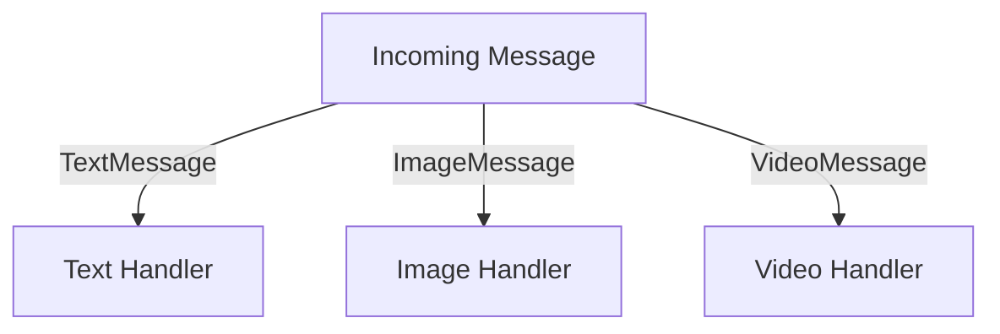
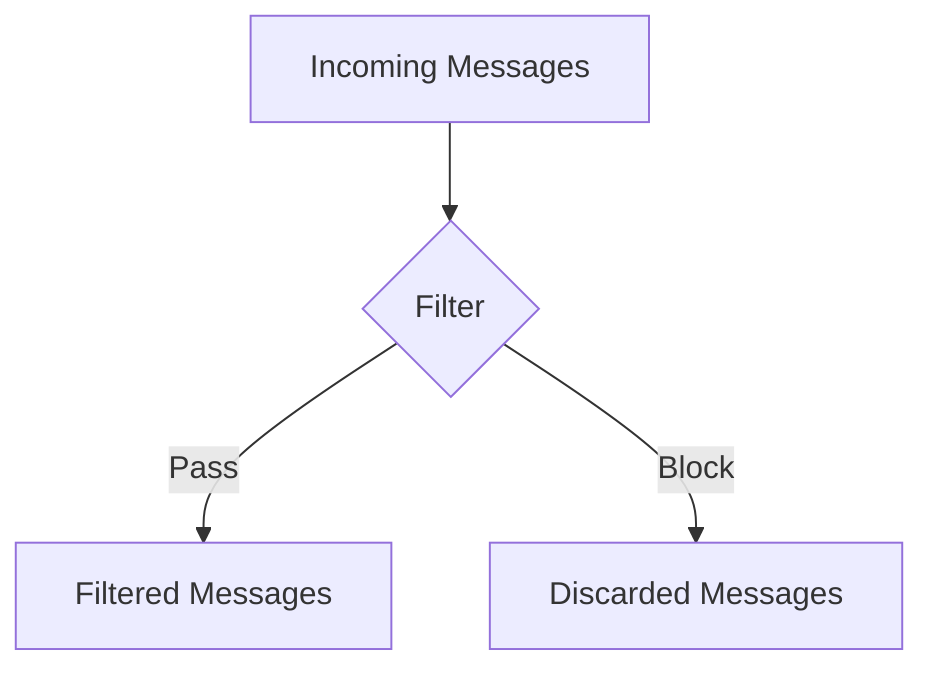
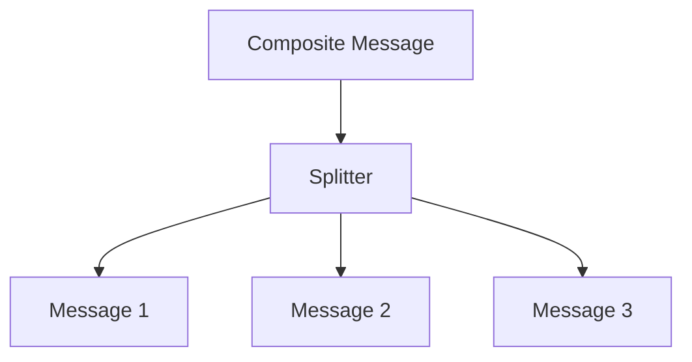

## 10.3 Message Routing Patterns

In the realm of enterprise integration, message routing patterns play a crucial role in directing messages to the appropriate destinations based on specific criteria. These patterns are essential for building scalable, maintainable, and efficient systems. In this section, we will delve into various message routing patterns, such as content-based routing, message filters, and splitter patterns, and demonstrate how to implement them using Haskell's powerful functional programming capabilities.

### Introduction to Message Routing Patterns

Message routing patterns are design patterns used to determine the path a message should take through a system. They are particularly useful in systems where messages need to be processed by different components based on their content or other attributes. These patterns help in decoupling the sender and receiver, allowing for more flexible and dynamic message processing.

#### Key Concepts

- **Content-Based Routing**: Directs messages to different destinations based on the content of the message.
- **Message Filters**: Allows messages to pass through only if they meet certain criteria.
- **Splitter Patterns**: Breaks a single message into multiple messages, each of which can be processed independently.

### Implementing Message Routing Patterns in Haskell

Haskell, with its strong type system and functional programming paradigm, provides an excellent platform for implementing message routing patterns. Let's explore how we can leverage Haskell's features to implement these patterns effectively.

#### Content-Based Routing

Content-based routing involves examining the content of a message and directing it to the appropriate handler. This can be achieved using Haskell's pattern matching and higher-order functions.

**Example: Content-Based Router**

```haskell
-- Define a data type for messages
data Message = TextMessage String | ImageMessage FilePath | VideoMessage FilePath

-- Define handlers for different message types
handleTextMessage :: String -> IO ()
handleTextMessage text = putStrLn $ "Handling text message: " ++ text

handleImageMessage :: FilePath -> IO ()
handleImageMessage path = putStrLn $ "Handling image message from: " ++ path

handleVideoMessage :: FilePath -> IO ()
handleVideoMessage path = putStrLn $ "Handling video message from: " ++ path

-- Content-based router function
routeMessage :: Message -> IO ()
routeMessage (TextMessage text) = handleTextMessage text
routeMessage (ImageMessage path) = handleImageMessage path
routeMessage (VideoMessage path) = handleVideoMessage path

-- Example usage
main :: IO ()
main = do
    let messages = [TextMessage "Hello, World!", ImageMessage "image.png", VideoMessage "video.mp4"]
    mapM_ routeMessage messages
```

In this example, we define a `Message` data type with three constructors: `TextMessage`, `ImageMessage`, and `VideoMessage`. The `routeMessage` function uses pattern matching to determine the type of message and calls the appropriate handler.

#### Message Filters

Message filters allow messages to be processed only if they meet certain criteria. This can be implemented using Haskell's higher-order functions and predicates.

**Example: Message Filter**

```haskell
-- Define a predicate to filter text messages containing a specific keyword
containsKeyword :: String -> Message -> Bool
containsKeyword keyword (TextMessage text) = keyword `elem` words text
containsKeyword _ _ = False

-- Filter function
filterMessages :: (Message -> Bool) -> [Message] -> [Message]
filterMessages predicate = filter predicate

-- Example usage
main :: IO ()
main = do
    let messages = [TextMessage "Hello, World!", TextMessage "Functional programming is great!", ImageMessage "image.png"]
    let keyword = "Functional"
    let filteredMessages = filterMessages (containsKeyword keyword) messages
    mapM_ routeMessage filteredMessages
```

In this example, we define a `containsKeyword` predicate that checks if a `TextMessage` contains a specific keyword. The `filterMessages` function uses this predicate to filter messages.

#### Splitter Patterns

Splitter patterns involve breaking a single message into multiple messages. This can be useful when a message contains multiple pieces of information that need to be processed separately.

**Example: Message Splitter**

```haskell
-- Define a data type for composite messages
data CompositeMessage = CompositeMessage [Message]

-- Splitter function
splitMessage :: CompositeMessage -> [Message]
splitMessage (CompositeMessage messages) = messages

-- Example usage
main :: IO ()
main = do
    let compositeMessage = CompositeMessage [TextMessage "Part 1", TextMessage "Part 2", ImageMessage "image.png"]
    let splitMessages = splitMessage compositeMessage
    mapM_ routeMessage splitMessages
```

In this example, we define a `CompositeMessage` data type that contains a list of `Message` values. The `splitMessage` function extracts these messages for individual processing.

### Visualizing Message Routing Patterns

To better understand how these patterns work, let's visualize the flow of messages through a system using Mermaid.js diagrams.

#### Content-Based Routing Diagram



**Description**: This diagram illustrates how a content-based router directs messages to different handlers based on their type.

#### Message Filter Diagram



**Description**: This diagram shows how a message filter allows only certain messages to pass through based on a predicate.

#### Splitter Pattern Diagram



**Description**: This diagram depicts how a splitter breaks a composite message into individual messages for separate processing.

### Haskell Unique Features

Haskell's unique features, such as its strong type system, pattern matching, and higher-order functions, make it particularly well-suited for implementing message routing patterns. These features allow for concise, expressive, and type-safe implementations.

#### Differences and Similarities with Other Languages

While message routing patterns are common across many programming languages, Haskell's functional approach offers a different perspective. Unlike object-oriented languages, Haskell emphasizes immutability and pure functions, which can lead to more predictable and maintainable code.

### Design Considerations

When implementing message routing patterns in Haskell, consider the following:

- **Performance**: Ensure that routing logic is efficient, especially when dealing with large volumes of messages.
- **Scalability**: Design patterns should support scaling to handle increased load.
- **Maintainability**: Use Haskell's type system to enforce constraints and ensure correctness.

### Try It Yourself

Experiment with the provided code examples by modifying the message types and routing logic. Try adding new message types and handlers to see how the system behaves. Consider implementing additional patterns, such as aggregator or resequencer, to further enhance your understanding.

### Knowledge Check

- What are the key differences between content-based routing and message filters?
- How does Haskell's pattern matching facilitate content-based routing?
- What are the benefits of using splitter patterns in message processing?

### Summary

In this section, we've explored various message routing patterns and demonstrated how to implement them using Haskell. By leveraging Haskell's functional programming capabilities, we can create efficient, scalable, and maintainable message routing systems. Remember, this is just the beginning. As you progress, you'll discover more advanced patterns and techniques to enhance your systems further. Keep experimenting, stay curious, and enjoy the journey!

## Quiz: Message Routing Patterns



### What is the primary purpose of message routing patterns?

- [x] To direct messages to appropriate destinations based on specific criteria.
- [ ] To encrypt messages for secure transmission.
- [ ] To compress messages for efficient storage.
- [ ] To format messages for display.

> **Explanation:** Message routing patterns are used to determine the path a message should take through a system, directing it to the appropriate destination based on specific criteria.

### Which Haskell feature is particularly useful for implementing content-based routing?

- [x] Pattern matching
- [ ] Lazy evaluation
- [ ] Type inference
- [ ] List comprehensions

> **Explanation:** Haskell's pattern matching allows for concise and expressive implementations of content-based routing by matching message types.

### What is a key benefit of using message filters?

- [x] They allow messages to pass through only if they meet certain criteria.
- [ ] They encrypt messages for secure transmission.
- [ ] They compress messages for efficient storage.
- [ ] They format messages for display.

> **Explanation:** Message filters enable selective processing of messages based on specific criteria, ensuring only relevant messages are processed.

### How does a splitter pattern function?

- [x] It breaks a single message into multiple messages for independent processing.
- [ ] It combines multiple messages into a single message.
- [ ] It encrypts messages for secure transmission.
- [ ] It compresses messages for efficient storage.

> **Explanation:** A splitter pattern divides a composite message into individual messages, allowing each to be processed separately.

### What is a common use case for content-based routing?

- [x] Directing different types of messages to appropriate handlers.
- [ ] Encrypting messages for secure transmission.
- [ ] Compressing messages for efficient storage.
- [ ] Formatting messages for display.

> **Explanation:** Content-based routing is used to direct messages to different handlers based on their content or type.

### Which of the following is NOT a message routing pattern?

- [x] Encryption pattern
- [ ] Content-based routing
- [ ] Message filter
- [ ] Splitter pattern

> **Explanation:** Encryption pattern is not a message routing pattern; it is related to securing messages.

### What is the role of a message filter in a routing system?

- [x] To allow only certain messages to pass through based on a predicate.
- [ ] To encrypt messages for secure transmission.
- [ ] To compress messages for efficient storage.
- [ ] To format messages for display.

> **Explanation:** A message filter uses a predicate to determine which messages should be allowed to pass through for processing.

### How can Haskell's higher-order functions be used in message routing?

- [x] By defining predicates for message filtering.
- [ ] By encrypting messages for secure transmission.
- [ ] By compressing messages for efficient storage.
- [ ] By formatting messages for display.

> **Explanation:** Higher-order functions in Haskell can be used to define predicates for filtering messages based on specific criteria.

### What is a potential challenge when implementing message routing patterns?

- [x] Ensuring efficient performance with large volumes of messages.
- [ ] Encrypting messages for secure transmission.
- [ ] Compressing messages for efficient storage.
- [ ] Formatting messages for display.

> **Explanation:** Implementing message routing patterns efficiently is crucial, especially when dealing with large volumes of messages.

### True or False: Haskell's immutability and pure functions can lead to more predictable and maintainable code in message routing systems.

- [x] True
- [ ] False

> **Explanation:** Haskell's emphasis on immutability and pure functions contributes to more predictable and maintainable code, particularly in message routing systems.


