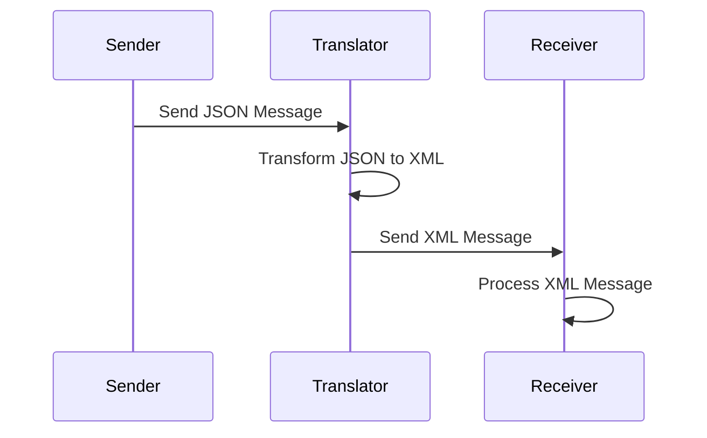

## 10.4 Message Transformation Patterns

In the realm of enterprise integration, message transformation patterns play a crucial role in ensuring that disparate systems can communicate effectively. These patterns are essential for modifying messages to match the receiver's format or protocol, enabling seamless data exchange across different services. In this section, we will delve into the intricacies of message transformation patterns, focusing on their implementation in Haskell. We will explore key patterns such as the Message Translator and Content Enricher, and demonstrate how to leverage Haskell's powerful features and libraries, like Aeson, for efficient message transformation.

### Understanding Message Transformation

**Message Transformation** involves altering the structure or content of a message to make it compatible with the receiving system. This is particularly important in heterogeneous environments where different systems may use varying data formats, protocols, or semantics. By transforming messages, we can ensure that data flows smoothly between systems without loss of meaning or integrity.

#### Key Concepts

- **Message Translator**: Converts a message from one format to another. This is akin to translating a document from one language to another, ensuring that the meaning is preserved while adapting to the syntax and semantics of the target language.
  
- **Content Enricher**: Enhances a message by adding additional data. This pattern is useful when the receiving system requires more information than what is provided by the sender.

### Implementing Message Transformation Patterns in Haskell

Haskell, with its strong type system and functional programming paradigm, offers unique advantages for implementing message transformation patterns. Let's explore how we can leverage Haskell's features to implement these patterns effectively.

#### Message Translator Pattern

The Message Translator pattern is used to convert messages from one format to another. In Haskell, we can achieve this using data serialization libraries like Aeson, which provides tools for encoding and decoding JSON data.

**Example: JSON to XML Transformation**

Let's consider a scenario where we need to transform a JSON message into an XML format. We'll use Aeson for JSON parsing and a simple XML library for constructing XML data.

```haskell
{-# LANGUAGE OverloadedStrings #-}

import Data.Aeson
import Data.Text (Text)
import qualified Data.ByteString.Lazy as B
import Text.XML.Light

-- Define a data type for the JSON message
data User = User
  { userId :: Int
  , userName :: Text
  , userEmail :: Text
  } deriving (Show)

instance FromJSON User where
  parseJSON = withObject "User" $ \v -> User
    <$> v .: "id"
    <*> v .: "name"
    <*> v .: "email"

-- Function to transform JSON to XML
jsonToXml :: B.ByteString -> Maybe Element
jsonToXml jsonData = do
  user <- decode jsonData :: Maybe User
  return $ Element (unqual "user") []
    [ Elem $ Element (unqual "id") [] [Text $ CData CDataText (show $ userId user) Nothing]
    , Elem $ Element (unqual "name") [] [Text $ CData CDataText (userName user) Nothing]
    , Elem $ Element (unqual "email") [] [Text $ CData CDataText (userEmail user) Nothing]
    ]

-- Example usage
main :: IO ()
main = do
  let jsonInput = "{\"id\": 1, \"name\": \"John Doe\", \"email\": \"john.doe@example.com\"}"
  case jsonToXml (B.pack jsonInput) of
    Just xml -> putStrLn $ showElement xml
    Nothing -> putStrLn "Failed to parse JSON"
```

In this example, we define a `User` data type and implement the `FromJSON` instance to parse JSON data. The `jsonToXml` function transforms the parsed JSON into an XML element. This demonstrates the Message Translator pattern by converting JSON to XML.

#### Content Enricher Pattern

The Content Enricher pattern involves augmenting a message with additional information. In Haskell, we can achieve this by composing functions that enrich the data.

**Example: Enriching User Data**

Suppose we have a basic user profile, and we want to enrich it with additional details such as the user's address and phone number.

```haskell
{-# LANGUAGE OverloadedStrings #-}

import Data.Aeson
import Data.Text (Text)
import qualified Data.ByteString.Lazy as B

-- Define a data type for the basic user profile
data BasicUser = BasicUser
  { basicUserId :: Int
  , basicUserName :: Text
  } deriving (Show)

instance FromJSON BasicUser where
  parseJSON = withObject "BasicUser" $ \v -> BasicUser
    <$> v .: "id"
    <*> v .: "name"

-- Define a data type for the enriched user profile
data EnrichedUser = EnrichedUser
  { enrichedUserId :: Int
  , enrichedUserName :: Text
  , userAddress :: Text
  , userPhone :: Text
  } deriving (Show)

-- Function to enrich user data
enrichUser :: BasicUser -> EnrichedUser
enrichUser user = EnrichedUser
  { enrichedUserId = basicUserId user
  , enrichedUserName = basicUserName user
  , userAddress = "123 Main St, Anytown, USA"
  , userPhone = "+1-555-1234"
  }

-- Example usage
main :: IO ()
main = do
  let jsonInput = "{\"id\": 1, \"name\": \"Jane Doe\"}"
  case decode (B.pack jsonInput) :: Maybe BasicUser of
    Just user -> print $ enrichUser user
    Nothing -> putStrLn "Failed to parse JSON"
```

In this example, we define a `BasicUser` data type and an `EnrichedUser` data type. The `enrichUser` function adds additional information to the basic user profile, demonstrating the Content Enricher pattern.

### Visualizing Message Transformation Patterns

To better understand the flow of message transformation patterns, let's visualize the process using a sequence diagram.



**Diagram Description**: This sequence diagram illustrates the Message Translator pattern. The sender sends a JSON message to the translator, which transforms it into XML and forwards it to the receiver for processing.

### Haskell's Unique Features for Message Transformation

Haskell's strong static typing and type inference provide a robust foundation for implementing message transformation patterns. Here are some unique features that make Haskell particularly well-suited for this task:

- **Type Safety**: Haskell's type system ensures that transformations are type-safe, reducing runtime errors.
- **Function Composition**: Haskell's support for higher-order functions and function composition allows for elegant and modular transformation logic.
- **Immutability**: Immutable data structures in Haskell ensure that transformations do not inadvertently modify the original data, preserving data integrity.
- **Lazy Evaluation**: Haskell's lazy evaluation model allows for efficient processing of large data sets, which is often required in message transformation scenarios.

### Differences and Similarities with Other Patterns

Message transformation patterns are often confused with other integration patterns, such as routing or filtering. Here are some key distinctions:

- **Message Routing**: Focuses on directing messages to the appropriate destination based on certain criteria, whereas transformation focuses on altering the message content or format.
- **Message Filtering**: Involves removing unwanted messages, while transformation modifies the message content to meet specific requirements.

### Design Considerations

When implementing message transformation patterns in Haskell, consider the following:

- **Performance**: Ensure that transformations are efficient, especially when dealing with large volumes of data.
- **Scalability**: Design transformations to be scalable, allowing them to handle increasing data loads without degradation in performance.
- **Maintainability**: Write clear and maintainable transformation logic, leveraging Haskell's functional programming features to create modular and reusable code.

### Try It Yourself

To deepen your understanding of message transformation patterns, try modifying the code examples provided:

- **Experiment with Different Formats**: Extend the JSON to XML transformation example to support additional formats, such as CSV or YAML.
- **Add More Enrichment**: Enhance the Content Enricher example by adding more fields or fetching enrichment data from an external source, such as a database or API.

### Knowledge Check

- **What is the primary purpose of the Message Translator pattern?**
- **How does the Content Enricher pattern differ from the Message Translator pattern?**
- **What are some advantages of using Haskell for message transformation?**

### Embrace the Journey

Remember, mastering message transformation patterns is just one step in your journey to becoming an expert in Haskell and enterprise integration. Keep experimenting, stay curious, and enjoy the process of learning and applying these powerful patterns in your projects.

## Quiz: Message Transformation Patterns



### What is the primary purpose of the Message Translator pattern?

- [x] To convert a message from one format to another
- [ ] To filter out unwanted messages
- [ ] To route messages to different destinations
- [ ] To enrich a message with additional data

> **Explanation:** The Message Translator pattern is used to convert a message from one format to another, ensuring compatibility with the receiving system.

### How does the Content Enricher pattern differ from the Message Translator pattern?

- [x] It adds additional data to a message
- [ ] It removes unwanted data from a message
- [ ] It changes the format of a message
- [ ] It routes messages to different destinations

> **Explanation:** The Content Enricher pattern enhances a message by adding additional data, unlike the Message Translator pattern, which changes the message format.

### Which Haskell feature is particularly useful for ensuring type-safe message transformations?

- [x] Strong static typing
- [ ] Lazy evaluation
- [ ] Immutability
- [ ] Function composition

> **Explanation:** Haskell's strong static typing ensures that message transformations are type-safe, reducing the risk of runtime errors.

### What library is commonly used in Haskell for JSON serialization and deserialization?

- [x] Aeson
- [ ] Conduit
- [ ] Warp
- [ ] QuickCheck

> **Explanation:** Aeson is a popular Haskell library used for JSON serialization and deserialization, making it ideal for message transformation tasks.

### What is a key benefit of using Haskell's lazy evaluation in message transformation?

- [x] Efficient processing of large data sets
- [ ] Strong static typing
- [ ] Function composition
- [ ] Immutability

> **Explanation:** Haskell's lazy evaluation model allows for efficient processing of large data sets, which is often required in message transformation scenarios.

### In the context of message transformation, what does the term "enrichment" refer to?

- [x] Adding additional data to a message
- [ ] Removing unwanted data from a message
- [ ] Changing the format of a message
- [ ] Routing messages to different destinations

> **Explanation:** Enrichment refers to adding additional data to a message, enhancing its content for the receiving system.

### Which pattern is often confused with message transformation but focuses on directing messages to the appropriate destination?

- [x] Message Routing
- [ ] Content Enricher
- [ ] Message Filtering
- [ ] Message Translator

> **Explanation:** Message Routing focuses on directing messages to the appropriate destination based on certain criteria, unlike transformation which alters the message content or format.

### What is a common design consideration when implementing message transformation patterns in Haskell?

- [x] Performance and scalability
- [ ] Ignoring data integrity
- [ ] Using mutable data structures
- [ ] Avoiding modular code

> **Explanation:** Performance and scalability are important design considerations when implementing message transformation patterns, ensuring that transformations can handle large volumes of data efficiently.

### What is the role of the Message Translator in a sequence diagram?

- [x] To transform the message format before sending it to the receiver
- [ ] To filter out unwanted messages
- [ ] To enrich the message with additional data
- [ ] To route the message to different destinations

> **Explanation:** In a sequence diagram, the Message Translator transforms the message format before sending it to the receiver, ensuring compatibility.

### True or False: The Content Enricher pattern can be used to remove unwanted data from a message.

- [ ] True
- [x] False

> **Explanation:** False. The Content Enricher pattern is used to add additional data to a message, not to remove unwanted data.


