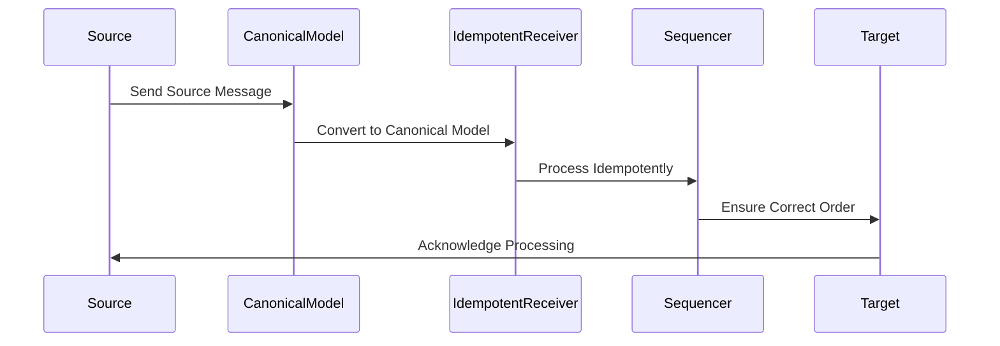

## 10.5 Message Design Patterns

In the realm of enterprise integration, message design patterns play a crucial role in ensuring that systems communicate effectively and efficiently. Haskell, with its strong typing and functional programming paradigms, offers unique advantages in implementing these patterns. In this section, we will delve into three key message design patterns: the Canonical Data Model, Idempotent Receiver, and Message Sequencing. We will explore how these patterns can be implemented in Haskell, leveraging its powerful type system to prevent errors and ensure robust message processing.

### Canonical Data Model

#### Intent

The Canonical Data Model pattern aims to reduce the complexity of integrating multiple systems by defining a common data format for messages. This model acts as an intermediary, allowing different systems to communicate without needing to understand each other's data formats.

#### Key Participants

- **Source System**: The system that generates the original message.
- **Target System**: The system that receives and processes the message.
- **Canonical Model**: The standardized data format used for message exchange.

#### Applicability

- Use the Canonical Data Model when integrating multiple systems with different data formats.
- It is particularly useful in environments where systems are frequently added or removed.

#### Implementation in Haskell

In Haskell, we can leverage algebraic data types to define a canonical data model. This ensures that all messages conform to a single, well-defined structure.

```haskell
-- Define a canonical data model using algebraic data types
data CanonicalMessage = CanonicalMessage
  { messageId   :: String
  , payload     :: String
  , timestamp   :: UTCTime
  } deriving (Show, Eq)

-- Function to convert a source-specific message to the canonical model
convertToCanonical :: SourceMessage -> CanonicalMessage
convertToCanonical sourceMsg = CanonicalMessage
  { messageId = sourceId sourceMsg
  , payload = sourcePayload sourceMsg
  , timestamp = sourceTimestamp sourceMsg
  }

-- Function to convert a canonical message to a target-specific format
convertFromCanonical :: CanonicalMessage -> TargetMessage
convertFromCanonical canonicalMsg = TargetMessage
  { targetId = messageId canonicalMsg
  , targetPayload = payload canonicalMsg
  , targetTimestamp = timestamp canonicalMsg
  }
```

#### Design Considerations

- **Consistency**: Ensure that all systems adhere to the canonical model to avoid discrepancies.
- **Versioning**: Consider how changes to the canonical model will be managed and communicated to all systems.

#### Haskell Unique Features

Haskell's type system ensures that conversions between different message formats are type-safe, reducing the risk of runtime errors.

### Idempotent Receiver

#### Intent

The Idempotent Receiver pattern ensures that a message is processed only once, even if it is delivered multiple times. This is crucial in distributed systems where duplicate messages can occur due to network issues or retries.

#### Key Participants

- **Message Producer**: The entity that sends messages.
- **Idempotent Receiver**: The entity that processes messages in an idempotent manner.

#### Applicability

- Use the Idempotent Receiver pattern when message duplication is possible and should not lead to duplicate processing.
- It is essential in systems where operations must be performed exactly once.

#### Implementation in Haskell

In Haskell, we can use the `State` monad to track processed messages and ensure idempotency.

```haskell
import Control.Monad.State
import qualified Data.Set as Set

type ProcessedMessages = Set.Set String

-- Function to process a message idempotently
processMessage :: CanonicalMessage -> State ProcessedMessages ()
processMessage msg = do
  processed <- get
  if Set.member (messageId msg) processed
    then return () -- Message already processed, do nothing
    else do
      -- Process the message
      liftIO $ putStrLn $ "Processing message: " ++ show msg
      -- Mark the message as processed
      modify (Set.insert (messageId msg))

-- Example usage
main :: IO ()
main = do
  let messages = [msg1, msg2, msg1] -- msg1 is duplicated
  let initialState = Set.empty
  let finalState = execState (mapM_ processMessage messages) initialState
  print finalState
```

#### Design Considerations

- **State Management**: Ensure that the state of processed messages is persisted across system restarts.
- **Performance**: Consider the performance implications of maintaining a large set of processed message IDs.

#### Haskell Unique Features

Haskell's `State` monad provides a clean and functional way to manage state, making it easier to implement idempotent processing.

### Message Sequencing

#### Intent

The Message Sequencing pattern ensures that messages are processed in the correct order. This is important in scenarios where the order of operations affects the outcome.

#### Key Participants

- **Message Producer**: The entity that sends messages in a specific order.
- **Message Consumer**: The entity that processes messages in the order they are received.

#### Applicability

- Use Message Sequencing when the order of message processing is critical to the application's correctness.
- It is particularly useful in financial transactions and event sourcing.

#### Implementation in Haskell

In Haskell, we can use a priority queue to manage message sequencing.

```haskell
import Data.PriorityQueue.FingerTree (PQueue)
import qualified Data.PriorityQueue.FingerTree as PQ

-- Define a priority queue for messages
type MessageQueue = PQueue Int CanonicalMessage

-- Function to enqueue a message with a sequence number
enqueueMessage :: CanonicalMessage -> MessageQueue -> MessageQueue
enqueueMessage msg queue = PQ.insert (sequenceNumber msg) msg queue

-- Function to process messages in sequence
processMessages :: MessageQueue -> IO ()
processMessages queue = case PQ.minView queue of
  Nothing -> return () -- No more messages to process
  Just (msg, restQueue) -> do
    putStrLn $ "Processing message: " ++ show msg
    processMessages restQueue

-- Example usage
main :: IO ()
main = do
  let queue = enqueueMessage msg1 $ enqueueMessage msg2 $ enqueueMessage msg3 PQ.empty
  processMessages queue
```

#### Design Considerations

- **Concurrency**: Ensure that message sequencing is maintained even in concurrent environments.
- **Error Handling**: Consider how errors in message processing will affect sequencing.

#### Haskell Unique Features

Haskell's immutable data structures and functional paradigms make it easier to implement reliable message sequencing without side effects.

### Visualizing Message Design Patterns

To better understand how these patterns interact, let's visualize the flow of messages in a system using these patterns.



**Diagram Description**: This sequence diagram illustrates the flow of messages from a source system to a target system using the Canonical Data Model, Idempotent Receiver, and Message Sequencing patterns.

### Try It Yourself

Encourage experimentation by modifying the code examples provided. Try adding new fields to the `CanonicalMessage` data type or implementing additional logic in the `processMessage` function. Experiment with different data structures for message sequencing to see how they affect performance.

### Knowledge Check

- **Question**: What is the primary purpose of the Canonical Data Model pattern?
- **Question**: How does the Idempotent Receiver pattern ensure that messages are processed only once?
- **Question**: Why is message sequencing important in certain applications?

### Embrace the Journey

Remember, mastering message design patterns in Haskell is just the beginning. As you progress, you'll be able to build more complex and reliable systems. Keep experimenting, stay curious, and enjoy the journey!

### Quiz: Message Design Patterns



### What is the primary purpose of the Canonical Data Model pattern?

- [x] To reduce complexity by standardizing data formats
- [ ] To ensure messages are processed only once
- [ ] To maintain message order
- [ ] To handle message duplication

> **Explanation:** The Canonical Data Model pattern standardizes data formats to reduce complexity in system integration.

### How does the Idempotent Receiver pattern ensure messages are processed only once?

- [x] By tracking processed messages
- [ ] By using a priority queue
- [ ] By converting messages to a canonical model
- [ ] By maintaining message order

> **Explanation:** The Idempotent Receiver pattern tracks processed messages to ensure each is processed only once.

### Why is message sequencing important?

- [x] To maintain the correct order of operations
- [ ] To standardize data formats
- [ ] To prevent message duplication
- [ ] To track processed messages

> **Explanation:** Message sequencing ensures that operations are performed in the correct order, which is crucial for application correctness.

### What Haskell feature is leveraged for type-safe message conversion?

- [x] Algebraic data types
- [ ] Monads
- [ ] Priority queues
- [ ] State monad

> **Explanation:** Algebraic data types in Haskell provide type-safe message conversion.

### Which pattern is essential in systems where operations must be performed exactly once?

- [x] Idempotent Receiver
- [ ] Canonical Data Model
- [ ] Message Sequencing
- [ ] State Management

> **Explanation:** The Idempotent Receiver pattern ensures operations are performed exactly once.

### What is a key consideration when implementing the Canonical Data Model?

- [x] Consistency across systems
- [ ] Maintaining message order
- [ ] Tracking processed messages
- [ ] Handling message duplication

> **Explanation:** Consistency across systems is crucial when implementing the Canonical Data Model.

### How can message sequencing be implemented in Haskell?

- [x] Using a priority queue
- [ ] Using algebraic data types
- [ ] Using the State monad
- [ ] Using monads

> **Explanation:** A priority queue can be used to implement message sequencing in Haskell.

### What is a potential performance concern with the Idempotent Receiver pattern?

- [x] Maintaining a large set of processed message IDs
- [ ] Converting messages to a canonical model
- [ ] Ensuring message order
- [ ] Standardizing data formats

> **Explanation:** Maintaining a large set of processed message IDs can impact performance.

### Which Haskell feature provides a clean way to manage state?

- [x] State monad
- [ ] Algebraic data types
- [ ] Priority queues
- [ ] Canonical models

> **Explanation:** The State monad in Haskell provides a clean way to manage state.

### True or False: The Canonical Data Model pattern is useful in environments where systems are frequently added or removed.

- [x] True
- [ ] False

> **Explanation:** The Canonical Data Model pattern is indeed useful in environments with frequent system changes.



By understanding and implementing these message design patterns in Haskell, you can create robust and efficient systems that handle communication seamlessly. Keep exploring and applying these patterns to enhance your software architecture skills.
