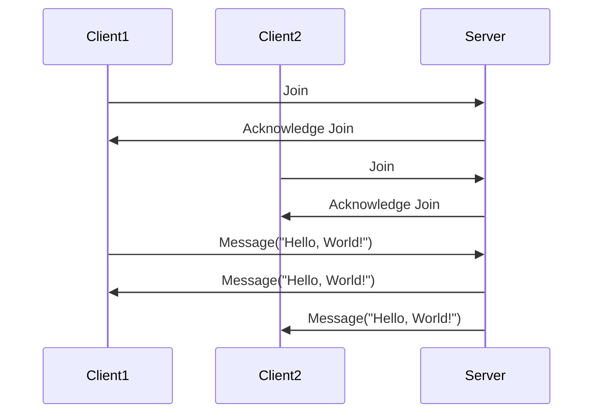

## 10.6 Messaging Infrastructure with Cloud Haskell

In the realm of distributed systems, messaging infrastructure plays a pivotal role in enabling communication between disparate nodes. As systems scale, the need for efficient, reliable, and scalable messaging solutions becomes paramount. Cloud Haskell emerges as a powerful tool in this domain, leveraging Haskell's strengths to facilitate distributed messaging. This section delves into the intricacies of messaging infrastructure using Cloud Haskell, providing expert developers with the knowledge to build robust distributed systems.

### Messaging in Distributed Systems

Distributed systems consist of multiple nodes that work together to achieve a common goal. These nodes often need to communicate with each other, and messaging is a fundamental mechanism for this communication. Messaging in distributed systems can be synchronous or asynchronous, and it can involve various patterns such as point-to-point, publish-subscribe, and request-reply.

#### Key Concepts

- **Message Passing**: The process of sending and receiving messages between nodes. It abstracts the complexities of network communication, allowing nodes to interact seamlessly.
- **Asynchronous Communication**: Nodes communicate without waiting for a response, enabling higher concurrency and fault tolerance.
- **Synchronous Communication**: Nodes wait for a response before proceeding, which can simplify certain interactions but may introduce latency.

### Cloud Haskell: Facilitating Distributed Messaging

Cloud Haskell is a distributed computing framework that brings Erlang-style concurrency and distribution to Haskell. It provides a set of libraries and tools that enable developers to build distributed applications using Haskell's functional programming paradigm.

#### Features of Cloud Haskell

- **Lightweight Processes**: Cloud Haskell allows the creation of lightweight processes that can communicate with each other using message passing.
- **Location Transparency**: Processes can communicate without knowing the physical location of other processes, simplifying the development of distributed systems.
- **Fault Tolerance**: Cloud Haskell supports fault-tolerant design patterns, enabling systems to recover from failures gracefully.
- **Scalability**: The framework is designed to scale across multiple nodes, making it suitable for large-scale distributed applications.

### Implementation: Remote Procedure Calls and Message Patterns

Implementing messaging infrastructure with Cloud Haskell involves defining remote procedure calls (RPCs) and message patterns that suit the application's needs. Let's explore how to set up a basic messaging infrastructure using Cloud Haskell.

#### Setting Up Cloud Haskell

To get started with Cloud Haskell, you'll need to install the necessary libraries. You can add the following dependencies to your project's Cabal file:

```haskell
build-depends: base >=4.7 && <5,
               distributed-process,
               network-transport-tcp
```

#### Defining Remote Procedure Calls

Remote Procedure Calls (RPCs) allow processes to invoke functions on remote nodes. In Cloud Haskell, you can define RPCs using the `distributed-process` library.

```haskell
{-# LANGUAGE DeriveGeneric #-}
{-# LANGUAGE DeriveDataTypeable #-}

import Control.Distributed.Process
import Control.Distributed.Process.Node
import Network.Transport.TCP (createTransport, defaultTCPParameters)
import Control.Monad (forever)
import Data.Binary
import GHC.Generics (Generic)
import Data.Typeable

-- Define a message type
data Ping = Ping deriving (Typeable, Generic)
instance Binary Ping

-- Define a process that handles Ping messages
pingServer :: Process ()
pingServer = forever $ do
    Ping <- expect
    say "Received Ping"

main :: IO ()
main = do
    -- Create a transport
    Right transport <- createTransport "127.0.0.1" "10501" defaultTCPParameters
    -- Create a local node
    node <- newLocalNode transport initRemoteTable
    -- Run the ping server
    runProcess node pingServer
```

In this example, we define a simple `Ping` message and a `pingServer` process that listens for `Ping` messages. The `main` function sets up the transport and runs the `pingServer` process on a local node.

#### Message Patterns

Cloud Haskell supports various message patterns, including:

- **Point-to-Point**: Direct communication between two processes.
- **Publish-Subscribe**: A process publishes messages that multiple subscribers can receive.
- **Request-Reply**: A process sends a request and waits for a reply.

Let's implement a simple point-to-point communication example:

```haskell
pingClient :: ProcessId -> Process ()
pingClient serverPid = do
    send serverPid Ping
    say "Sent Ping"

main :: IO ()
main = do
    Right transport <- createTransport "127.0.0.1" "10501" defaultTCPParameters
    node <- newLocalNode transport initRemoteTable
    runProcess node $ do
        serverPid <- spawnLocal pingServer
        pingClient serverPid
```

In this example, the `pingClient` process sends a `Ping` message to the `pingServer` process. The `main` function spawns both processes and establishes communication between them.

### Example: Building a Scalable Chat Application

To illustrate the power of Cloud Haskell, let's build a scalable chat application. This application will allow multiple clients to join a chat room and exchange messages.

#### Architecture Overview

The chat application consists of the following components:

- **Chat Server**: Manages connected clients and broadcasts messages.
- **Chat Client**: Connects to the server and sends/receives messages.

#### Implementing the Chat Server

```haskell
{-# LANGUAGE DeriveGeneric #-}
{-# LANGUAGE DeriveDataTypeable #-}

import Control.Distributed.Process
import Control.Distributed.Process.Node
import Network.Transport.TCP (createTransport, defaultTCPParameters)
import Control.Monad (forever)
import Data.Binary
import GHC.Generics (Generic)
import Data.Typeable

-- Define message types
data Join = Join ProcessId deriving (Typeable, Generic)
data Message = Message String deriving (Typeable, Generic)
instance Binary Join
instance Binary Message

-- Chat server process
chatServer :: [ProcessId] -> Process ()
chatServer clients = do
    receiveWait
        [ match $ \\(Join pid) -> do
            say $ "Client joined: " ++ show pid
            chatServer (pid : clients)
        , match $ \\(Message msg) -> do
            say $ "Broadcasting message: " ++ msg
            mapM_ (\pid -> send pid (Message msg)) clients
            chatServer clients
        ]

main :: IO ()
main = do
    Right transport <- createTransport "127.0.0.1" "10501" defaultTCPParameters
    node <- newLocalNode transport initRemoteTable
    runProcess node $ chatServer []
```

The `chatServer` process maintains a list of connected clients and handles `Join` and `Message` messages. When a client joins, it is added to the list, and messages are broadcasted to all clients.

#### Implementing the Chat Client

```haskell
chatClient :: ProcessId -> Process ()
chatClient serverPid = do
    self <- getSelfPid
    send serverPid (Join self)
    say "Joined chat server"
    forever $ do
        Message msg <- expect
        say $ "Received message: " ++ msg

main :: IO ()
main = do
    Right transport <- createTransport "127.0.0.1" "10501" defaultTCPParameters
    node <- newLocalNode transport initRemoteTable
    runProcess node $ do
        serverPid <- spawnLocal (chatServer [])
        chatClient serverPid
```

The `chatClient` process joins the chat server and listens for incoming messages. It sends a `Join` message to the server upon connection.

### Visualizing Messaging Infrastructure

To better understand the messaging infrastructure, let's visualize the architecture using a sequence diagram.



**Diagram Description**: This sequence diagram illustrates the interaction between clients and the server in the chat application. Clients join the server, and messages are broadcasted to all connected clients.

### Design Considerations

When building messaging infrastructure with Cloud Haskell, consider the following:

- **Fault Tolerance**: Implement mechanisms to handle node failures and ensure message delivery.
- **Scalability**: Design the system to scale horizontally by adding more nodes.
- **Security**: Secure communication channels to prevent unauthorized access and data breaches.
- **Performance**: Optimize message processing to handle high loads efficiently.

### Haskell Unique Features

Cloud Haskell leverages Haskell's unique features, such as:

- **Strong Static Typing**: Ensures type safety and reduces runtime errors.
- **Immutability**: Simplifies reasoning about state changes and concurrency.
- **Lazy Evaluation**: Allows efficient handling of large data structures and computations.

### Differences and Similarities

Cloud Haskell shares similarities with other distributed computing frameworks, such as Erlang's OTP. However, it differs in its use of Haskell's functional programming paradigm, which offers unique advantages in terms of type safety and expressiveness.

### Try It Yourself

To deepen your understanding, try modifying the chat application:

- **Add a Private Messaging Feature**: Allow clients to send private messages to specific users.
- **Implement a Message History**: Store and retrieve past messages for new clients joining the chat.
- **Enhance Fault Tolerance**: Introduce mechanisms to handle server or client failures gracefully.

### Knowledge Check

- **What are the key components of a messaging infrastructure in distributed systems?**
- **How does Cloud Haskell facilitate distributed messaging?**
- **What are the benefits of using Cloud Haskell for building distributed systems?**

### Embrace the Journey

Building messaging infrastructure with Cloud Haskell is an exciting journey that combines the power of functional programming with the challenges of distributed systems. Remember, this is just the beginning. As you progress, you'll build more complex and resilient systems. Keep experimenting, stay curious, and enjoy the journey!

## Quiz: Messaging Infrastructure with Cloud Haskell



### What is the primary role of messaging in distributed systems?

- [x] Enabling communication between nodes
- [ ] Storing data persistently
- [ ] Providing user interfaces
- [ ] Managing databases

> **Explanation:** Messaging is crucial for enabling communication between nodes in distributed systems, allowing them to exchange information and coordinate actions.

### Which feature of Cloud Haskell allows processes to communicate without knowing their physical location?

- [x] Location Transparency
- [ ] Fault Tolerance
- [ ] Scalability
- [ ] Strong Static Typing

> **Explanation:** Location Transparency in Cloud Haskell allows processes to communicate without needing to know the physical location of other processes, simplifying distributed system development.

### What is the purpose of Remote Procedure Calls (RPCs) in Cloud Haskell?

- [x] To invoke functions on remote nodes
- [ ] To store data locally
- [ ] To manage user sessions
- [ ] To provide graphical interfaces

> **Explanation:** RPCs in Cloud Haskell enable processes to invoke functions on remote nodes, facilitating distributed computation.

### Which message pattern involves direct communication between two processes?

- [x] Point-to-Point
- [ ] Publish-Subscribe
- [ ] Request-Reply
- [ ] Broadcast

> **Explanation:** The Point-to-Point pattern involves direct communication between two processes, where one sends a message and the other receives it.

### What is a key benefit of using Cloud Haskell for distributed systems?

- [x] Fault Tolerance
- [ ] High Memory Usage
- [ ] Complex Syntax
- [ ] Limited Scalability

> **Explanation:** Cloud Haskell provides fault tolerance, allowing systems to recover gracefully from failures, which is crucial for distributed systems.

### What does the `distributed-process` library in Cloud Haskell provide?

- [x] Tools for building distributed applications
- [ ] A graphical user interface framework
- [ ] A database management system
- [ ] A web server

> **Explanation:** The `distributed-process` library provides tools for building distributed applications in Haskell, enabling message passing and process management.

### How does Cloud Haskell handle node failures?

- [x] By supporting fault-tolerant design patterns
- [ ] By ignoring failures
- [ ] By restarting the entire system
- [ ] By storing logs

> **Explanation:** Cloud Haskell supports fault-tolerant design patterns, allowing systems to handle node failures gracefully and continue operating.

### What is a common use case for the Publish-Subscribe pattern?

- [x] Broadcasting messages to multiple subscribers
- [ ] Direct communication between two processes
- [ ] Storing data in a database
- [ ] Managing user sessions

> **Explanation:** The Publish-Subscribe pattern is commonly used for broadcasting messages to multiple subscribers, where a publisher sends messages that multiple subscribers can receive.

### Which Haskell feature simplifies reasoning about state changes and concurrency?

- [x] Immutability
- [ ] Dynamic Typing
- [ ] Complex Syntax
- [ ] High Memory Usage

> **Explanation:** Immutability in Haskell simplifies reasoning about state changes and concurrency, as data cannot be modified once created.

### True or False: Cloud Haskell is designed to scale across multiple nodes.

- [x] True
- [ ] False

> **Explanation:** True. Cloud Haskell is designed to scale across multiple nodes, making it suitable for building large-scale distributed applications.




