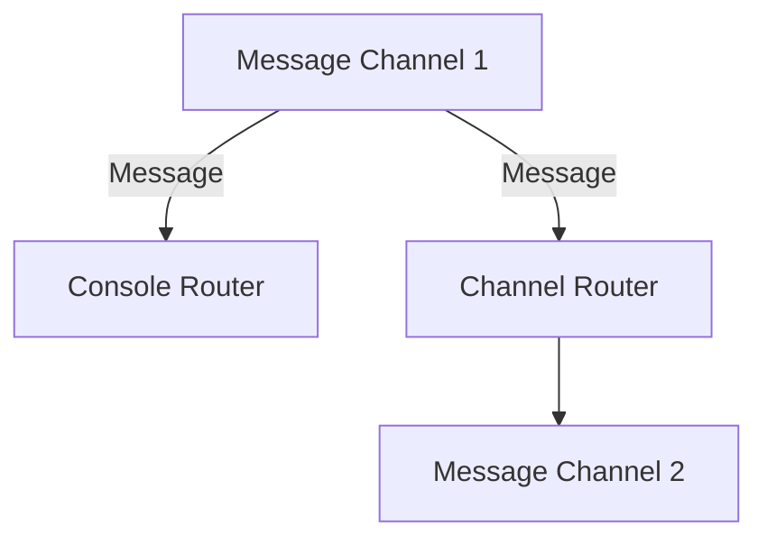

## 10.7 Implementing Integration Patterns in Haskell

In the realm of enterprise software development, integration patterns play a crucial role in ensuring that disparate systems can communicate and work together effectively. Haskell, with its strong emphasis on type safety, pure functions, and concurrency abstractions, offers unique advantages for implementing these patterns. In this section, we will explore how to leverage Haskell's features to implement enterprise integration patterns efficiently, culminating in the creation of an enterprise service bus.

### Understanding Integration Patterns

Integration patterns are design patterns that provide solutions for integrating different systems and applications. These patterns address common challenges such as data transformation, message routing, and protocol bridging. Some of the key integration patterns include:

- **Message Channel**: A conduit for messages to travel between systems.
- **Message Router**: Directs messages to different destinations based on specific criteria.
- **Message Translator**: Converts messages from one format to another.
- **Enterprise Service Bus (ESB)**: A central hub that facilitates communication between services.

### Leveraging Haskell's Features

Haskell's functional programming paradigm offers several features that make it well-suited for implementing integration patterns:

- **Type-Safe APIs**: Haskell's strong static typing ensures that data transformations and message routing are type-safe, reducing runtime errors.
- **Pure Functions**: Pure functions facilitate reasoning about code behavior, making it easier to implement and test integration logic.
- **Concurrency Abstractions**: Haskell provides powerful concurrency abstractions, such as Software Transactional Memory (STM) and the `async` library, which are essential for building scalable integration solutions.

### Implementing Integration Patterns

Let's delve into how we can implement some of these integration patterns in Haskell.

#### Message Channel

A message channel is a fundamental building block for integration patterns. It acts as a conduit for messages to travel between systems. In Haskell, we can implement a message channel using channels from the `Control.Concurrent.Chan` module.

```haskell
import Control.Concurrent
import Control.Concurrent.Chan

-- Define a message type
data Message = Message { content :: String }

-- Function to create a new message channel
createMessageChannel :: IO (Chan Message)
createMessageChannel = newChan

-- Function to send a message
sendMessage :: Chan Message -> Message -> IO ()
sendMessage chan msg = writeChan chan msg

-- Function to receive a message
receiveMessage :: Chan Message -> IO Message
receiveMessage chan = readChan chan
```

In this example, we define a `Message` type and functions to create a message channel, send messages, and receive messages. The `Chan` type provides a simple and efficient way to implement message channels in Haskell.

#### Message Router

A message router directs messages to different destinations based on specific criteria. We can implement a message router in Haskell using pattern matching and type classes.

```haskell
-- Define a type class for routing messages
class MessageRouter a where
    routeMessage :: a -> Message -> IO ()

-- Implement a simple router that prints messages to the console
data ConsoleRouter = ConsoleRouter

instance MessageRouter ConsoleRouter where
    routeMessage _ msg = putStrLn $ "Routing message: " ++ content msg

-- Implement a router that sends messages to a specific channel
data ChannelRouter = ChannelRouter (Chan Message)

instance MessageRouter ChannelRouter where
    routeMessage (ChannelRouter chan) msg = writeChan chan msg
```

Here, we define a `MessageRouter` type class with a `routeMessage` function. We implement two routers: `ConsoleRouter`, which prints messages to the console, and `ChannelRouter`, which sends messages to a specific channel.

#### Message Translator

A message translator converts messages from one format to another. In Haskell, we can implement a message translator using pure functions.

```haskell
-- Define a function to translate messages
translateMessage :: Message -> Message
translateMessage msg = msg { content = map toUpper (content msg) }
```

This simple translator converts the content of a message to uppercase. Because the function is pure, it is easy to test and reason about.

### Creating an Enterprise Service Bus

An Enterprise Service Bus (ESB) is a central hub that facilitates communication between services. It combines various integration patterns to provide a robust integration solution. Let's build a simple ESB in Haskell.

```haskell
import Control.Concurrent.Async

-- Define a type for the ESB
data ESB = ESB { channels :: [Chan Message], routers :: [MessageRouter] }

-- Function to create a new ESB
createESB :: IO ESB
createESB = do
    chan1 <- newChan
    chan2 <- newChan
    let router1 = ConsoleRouter
    let router2 = ChannelRouter chan2
    return $ ESB [chan1, chan2] [router1, router2]

-- Function to start the ESB
startESB :: ESB -> IO ()
startESB (ESB chans routers) = do
    -- Start a thread to process messages from each channel
    mapM_ (\chan -> async $ processChannel chan routers) chans
    return ()

-- Function to process messages from a channel
processChannel :: Chan Message -> [MessageRouter] -> IO ()
processChannel chan routers = do
    msg <- readChan chan
    mapM_ (\router -> routeMessage router msg) routers
    processChannel chan routers
```

In this example, we define an `ESB` type that contains a list of channels and routers. The `createESB` function initializes the ESB with channels and routers. The `startESB` function starts a thread for each channel to process messages and route them using the configured routers.

### Visualizing the ESB Architecture

To better understand the architecture of our ESB, let's visualize it using a Mermaid.js diagram.



**Diagram Description**: This diagram illustrates the flow of messages in our ESB. Messages from `Message Channel 1` are routed to both the `Console Router` and the `Channel Router`. The `Channel Router` forwards messages to `Message Channel 2`.

### Techniques for Efficient Integration

To implement integration patterns efficiently in Haskell, consider the following techniques:

- **Type-Safe APIs**: Use Haskell's type system to define type-safe APIs for message channels, routers, and translators. This ensures that only valid messages are processed, reducing runtime errors.

- **Pure Functions**: Implement message translators and routers as pure functions whenever possible. Pure functions are easier to test and reason about, leading to more reliable integration solutions.

- **Concurrency Abstractions**: Leverage Haskell's concurrency abstractions, such as STM and `async`, to build scalable and responsive integration solutions. These abstractions simplify the management of concurrent processes and ensure data consistency.

### Haskell Unique Features

Haskell's unique features, such as its strong static typing and lazy evaluation, provide significant advantages when implementing integration patterns:

- **Strong Static Typing**: Haskell's type system catches many errors at compile time, reducing the likelihood of runtime errors. This is particularly beneficial for integration solutions, where data consistency and correctness are critical.

- **Lazy Evaluation**: Haskell's lazy evaluation allows for efficient processing of large data streams, making it well-suited for integration scenarios that involve large volumes of data.

### Differences and Similarities

When implementing integration patterns in Haskell, it's important to understand the differences and similarities with other programming languages:

- **Differences**: Unlike imperative languages, Haskell emphasizes immutability and pure functions, which can lead to different design approaches for integration patterns. For example, message translators are often implemented as pure functions rather than stateful objects.

- **Similarities**: Despite these differences, the core concepts of integration patterns remain the same. Haskell provides equivalent abstractions for channels, routers, and translators, allowing developers to implement familiar patterns in a functional style.

### Try It Yourself

To deepen your understanding of integration patterns in Haskell, try modifying the code examples provided in this section. Here are a few suggestions:

- **Add a New Router**: Implement a new router that logs messages to a file.
- **Enhance the Translator**: Modify the `translateMessage` function to perform more complex transformations, such as JSON parsing.
- **Extend the ESB**: Add additional channels and routers to the ESB and observe how messages are routed.

### Conclusion

Implementing integration patterns in Haskell offers a unique opportunity to leverage the language's strengths in type safety, pure functions, and concurrency. By understanding and applying these patterns, you can build robust and scalable integration solutions that meet the demands of modern enterprise systems. Remember, this is just the beginning. As you progress, you'll discover more advanced techniques and patterns that can further enhance your integration solutions. Keep experimenting, stay curious, and enjoy the journey!

## Quiz: Implementing Integration Patterns in Haskell



### Which Haskell feature is particularly beneficial for ensuring data consistency in integration solutions?

- [x] Strong static typing
- [ ] Dynamic typing
- [ ] Weak typing
- [ ] No typing

> **Explanation:** Haskell's strong static typing catches many errors at compile time, ensuring data consistency and reducing runtime errors.

### What is the primary role of a message channel in integration patterns?

- [x] To act as a conduit for messages between systems
- [ ] To transform messages from one format to another
- [ ] To route messages to different destinations
- [ ] To log messages to a file

> **Explanation:** A message channel serves as a conduit for messages to travel between systems.

### How can message translators be implemented in Haskell?

- [x] Using pure functions
- [ ] Using stateful objects
- [ ] Using global variables
- [ ] Using mutable arrays

> **Explanation:** In Haskell, message translators are often implemented as pure functions, which are easier to test and reason about.

### What concurrency abstraction does Haskell provide for building scalable integration solutions?

- [x] Software Transactional Memory (STM)
- [ ] Threads
- [ ] Locks
- [ ] Semaphores

> **Explanation:** Haskell provides Software Transactional Memory (STM) as a powerful concurrency abstraction for building scalable solutions.

### Which of the following is a key advantage of using pure functions in integration patterns?

- [x] Easier to test and reason about
- [ ] Requires more memory
- [ ] Slower execution
- [ ] Increases code complexity

> **Explanation:** Pure functions are easier to test and reason about, leading to more reliable integration solutions.

### What is the purpose of an Enterprise Service Bus (ESB)?

- [x] To facilitate communication between services
- [ ] To store large volumes of data
- [ ] To encrypt messages
- [ ] To provide user authentication

> **Explanation:** An Enterprise Service Bus (ESB) acts as a central hub that facilitates communication between services.

### How does Haskell's lazy evaluation benefit integration scenarios?

- [x] Efficient processing of large data streams
- [ ] Immediate execution of all expressions
- [ ] Increased memory usage
- [ ] Slower data processing

> **Explanation:** Haskell's lazy evaluation allows for efficient processing of large data streams, which is beneficial in integration scenarios.

### What is a key difference between implementing integration patterns in Haskell and imperative languages?

- [x] Emphasis on immutability and pure functions
- [ ] Use of global variables
- [ ] Reliance on mutable state
- [ ] Focus on object-oriented design

> **Explanation:** Haskell emphasizes immutability and pure functions, leading to different design approaches compared to imperative languages.

### Which type class is used in the example to define routing behavior?

- [x] MessageRouter
- [ ] MessageChannel
- [ ] MessageTranslator
- [ ] MessageLogger

> **Explanation:** The `MessageRouter` type class is used to define routing behavior in the example.

### True or False: Haskell's type system can reduce runtime errors in integration solutions.

- [x] True
- [ ] False

> **Explanation:** True. Haskell's strong static typing reduces runtime errors by catching many errors at compile time.


