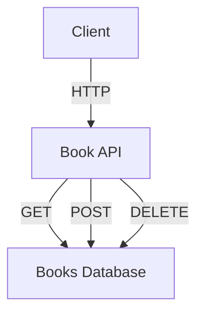

## 10.8 Service-Oriented Architecture (SOA) in Haskell

Service-Oriented Architecture (SOA) is a design paradigm that structures applications as a collection of loosely coupled services. Each service is a discrete unit of functionality that can be independently deployed and managed. In Haskell, SOA can be effectively implemented using libraries like Servant, which facilitates the creation of web services with type-safe APIs.

### SOA Principles

Before diving into the implementation details, let's explore the core principles of SOA:

1. **Modularity**: Services are designed as independent modules that encapsulate specific business functionalities.
2. **Interoperability**: Services communicate over standard protocols, such as HTTP, ensuring compatibility across different platforms and languages.
3. **Reusability**: Services are designed to be reused across different applications and contexts.
4. **Scalability**: Services can be scaled independently to accommodate varying loads.
5. **Loose Coupling**: Services interact with each other through well-defined interfaces, minimizing dependencies.

### Implementing SOA in Haskell

Haskell's strong type system and functional programming paradigm make it an excellent choice for implementing SOA. The Servant library is particularly useful for defining and implementing services with precise interfaces.

#### Defining Services with Servant

Servant is a Haskell library that allows developers to define web services using type-level programming. It provides a way to describe APIs at the type level, ensuring that the implementation matches the specification.

**Key Features of Servant**:
- **Type-Safe APIs**: Define APIs using Haskell's type system, ensuring compile-time safety.
- **Automatic Documentation**: Generate API documentation directly from the type definitions.
- **Client and Server Code Generation**: Automatically generate client and server code from API specifications.

#### Example: Developing a Modular System with Servant

Let's walk through an example of building a simple modular system using Servant. We'll create a service that manages a list of books, allowing clients to add, retrieve, and delete books.

**Step 1: Define the API**

First, we define the API using Servant's type-level DSL.

```haskell
{-# LANGUAGE DataKinds #-}
{-# LANGUAGE TypeOperators #-}

module BookAPI where

import Servant

type BookAPI = "books" :> Get '[JSON] [Book]
          :<|> "books" :> ReqBody '[JSON] Book :> Post '[JSON] Book
          :<|> "books" :> Capture "bookId" Int :> Delete '[JSON] NoContent

data Book = Book
  { bookId :: Int
  , title :: String
  , author :: String
  } deriving (Eq, Show, Generic)

instance ToJSON Book
instance FromJSON Book
```

**Explanation**:
- The `BookAPI` type defines three endpoints: one for retrieving all books, one for adding a new book, and one for deleting a book by its ID.
- The `Book` data type represents a book with an ID, title, and author.

**Step 2: Implement the Server**

Next, we implement the server logic for handling requests.

```haskell
{-# LANGUAGE OverloadedStrings #-}

module BookServer where

import BookAPI
import Servant
import Network.Wai
import Network.Wai.Handler.Warp

books :: IORef [Book]
books = unsafePerformIO $ newIORef []

server :: Server BookAPI
server = getBooks :<|> addBook :<|> deleteBook

  where
    getBooks :: Handler [Book]
    getBooks = liftIO $ readIORef books

    addBook :: Book -> Handler Book
    addBook book = liftIO $ do
      modifyIORef books (book :)
      return book

    deleteBook :: Int -> Handler NoContent
    deleteBook bookId = liftIO $ do
      modifyIORef books (filter ((/= bookId) . bookId))
      return NoContent

app :: Application
app = serve (Proxy :: Proxy BookAPI) server

main :: IO ()
main = run 8080 app
```

**Explanation**:
- We use an `IORef` to store the list of books in memory.
- The `server` function defines the logic for each endpoint.
- The `app` function creates a WAI application from the Servant server, which is then run on port 8080.

**Step 3: Testing the Service**

You can test the service using tools like `curl` or Postman. For example, to add a new book, you can use the following `curl` command:

```bash
curl -X POST http://localhost:8080/books -H "Content-Type: application/json" -d '{"bookId": 1, "title": "Learn Haskell", "author": "John Doe"}'
```

### Visualizing SOA in Haskell

To better understand the architecture of our service, let's visualize the components and their interactions using a Mermaid.js diagram.



**Diagram Explanation**:
- The client interacts with the `Book API` over HTTP.
- The `Book API` communicates with the `Books Database` to perform CRUD operations.

### Design Considerations

When implementing SOA in Haskell, consider the following:

- **Concurrency**: Use Haskell's concurrency primitives, such as `STM` and `Async`, to handle concurrent requests efficiently.
- **Error Handling**: Leverage Haskell's type system to handle errors gracefully using types like `Either` and `Maybe`.
- **Security**: Implement authentication and authorization mechanisms to secure your services.
- **Scalability**: Design services to be stateless and horizontally scalable.

### Haskell Unique Features

Haskell offers several unique features that enhance the implementation of SOA:

- **Type Safety**: Haskell's strong type system ensures that APIs are implemented correctly, reducing runtime errors.
- **Immutability**: Immutable data structures simplify reasoning about state and concurrency.
- **Lazy Evaluation**: Haskell's lazy evaluation model can improve performance by avoiding unnecessary computations.

### Differences and Similarities with Other Patterns

SOA shares similarities with microservices architecture, but there are key differences:

- **Granularity**: Microservices are typically more granular than SOA services.
- **Communication**: SOA often uses enterprise service buses (ESBs) for communication, while microservices favor lightweight protocols like HTTP/REST.
- **Deployment**: Microservices are independently deployable, whereas SOA services may be part of a larger monolithic application.

### Try It Yourself

To deepen your understanding, try modifying the example code:

- Add a new endpoint to update a book's details.
- Implement pagination for the list of books.
- Secure the API using basic authentication.

### References and Links

- [Servant Library Documentation](https://haskell-servant.readthedocs.io/)
- [Haskell Wiki: Service-Oriented Architecture](https://wiki.haskell.org/Service-oriented_architecture)

### Knowledge Check

- What are the core principles of SOA?
- How does Servant facilitate the implementation of SOA in Haskell?
- What are the key differences between SOA and microservices?

### Embrace the Journey

Remember, mastering SOA in Haskell is a journey. As you progress, you'll build more complex and scalable systems. Keep experimenting, stay curious, and enjoy the journey!

## Quiz: Service-Oriented Architecture (SOA) in Haskell



### What is a key principle of Service-Oriented Architecture (SOA)?

- [x] Loose coupling
- [ ] Tight integration
- [ ] Centralized control
- [ ] Monolithic design

> **Explanation:** SOA emphasizes loose coupling between services to ensure flexibility and scalability.

### Which Haskell library is commonly used for implementing SOA?

- [x] Servant
- [ ] Warp
- [ ] Aeson
- [ ] Conduit

> **Explanation:** Servant is a Haskell library that facilitates the creation of type-safe web services, making it ideal for SOA.

### What does the `:>` operator in Servant signify?

- [x] Endpoint composition
- [ ] Type conversion
- [ ] Function application
- [ ] Data serialization

> **Explanation:** The `:>` operator is used in Servant to compose API endpoints.

### How does Haskell's type system benefit SOA implementation?

- [x] Ensures type-safe APIs
- [ ] Increases runtime errors
- [ ] Reduces code readability
- [ ] Complicates error handling

> **Explanation:** Haskell's strong type system ensures that APIs are implemented correctly, reducing runtime errors.

### What is a common communication protocol used in SOA?

- [x] HTTP
- [ ] FTP
- [ ] SMTP
- [ ] POP3

> **Explanation:** HTTP is a standard protocol used for communication between services in SOA.

### What is a key difference between SOA and microservices?

- [x] Granularity of services
- [ ] Use of HTTP
- [ ] Type safety
- [ ] Functional programming

> **Explanation:** Microservices are typically more granular than SOA services.

### Which Haskell feature aids in handling concurrent requests in SOA?

- [x] STM (Software Transactional Memory)
- [ ] Lazy evaluation
- [ ] Pattern matching
- [ ] Type classes

> **Explanation:** STM is a concurrency primitive in Haskell that helps manage concurrent requests efficiently.

### What is the role of the `Proxy` type in Servant?

- [x] Represents API types
- [ ] Handles HTTP requests
- [ ] Manages state
- [ ] Serializes data

> **Explanation:** The `Proxy` type is used in Servant to represent API types at the type level.

### How can you secure a Servant API?

- [x] Implement authentication and authorization
- [ ] Use lazy evaluation
- [ ] Avoid type classes
- [ ] Disable concurrency

> **Explanation:** Securing a Servant API involves implementing authentication and authorization mechanisms.

### True or False: SOA services are always independently deployable.

- [ ] True
- [x] False

> **Explanation:** Unlike microservices, SOA services may be part of a larger monolithic application and are not always independently deployable.


