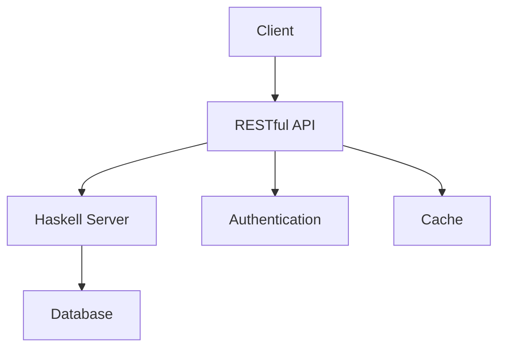

## 10.9 RESTful API Design and Implementation

In today's interconnected world, RESTful APIs have become a cornerstone of web development, enabling seamless communication between clients and servers. In this section, we will explore the principles of REST, delve into the specifics of implementing RESTful APIs in Haskell using powerful libraries like Servant and Yesod, and provide practical examples to solidify your understanding.

### Understanding REST Principles

REST, or Representational State Transfer, is an architectural style that leverages standard HTTP methods to facilitate stateless, client-server communication. Let's break down the core principles of REST:

- **Statelessness**: Each request from a client contains all the information needed to process the request, ensuring that the server does not store any client context between requests.
- **Client-Server Architecture**: This separation of concerns allows clients and servers to evolve independently, enhancing scalability and flexibility.
- **Uniform Interface**: RESTful APIs use standard HTTP methods (GET, POST, PUT, DELETE) to perform operations, ensuring a consistent and predictable interface.
- **Resource-Based**: Resources are identified by URIs, and interactions with these resources are performed using representations (e.g., JSON, XML).
- **Cacheability**: Responses can be cached to improve performance and reduce server load.
- **Layered System**: A client cannot ordinarily tell whether it is connected directly to the end server or to an intermediary along the way.

### Implementing RESTful APIs in Haskell

Haskell, with its strong type system and functional programming paradigm, offers unique advantages for building robust and maintainable RESTful APIs. Two popular libraries for this purpose are **Servant** and **Yesod**.

#### Servant: Type-Safe RESTful APIs

Servant is a Haskell library that allows you to define your API at the type level, ensuring that your implementation and documentation are always in sync. Let's explore how to use Servant to build a simple RESTful API.

##### Setting Up a Servant Project

To get started with Servant, you'll need to set up a Haskell project. Here's a step-by-step guide:

1. **Initialize a New Project**: Use Stack to create a new Haskell project.

   ```bash
   stack new my-servant-api
   cd my-servant-api
   ```

2. **Add Dependencies**: Update your `package.yaml` or `*.cabal` file to include Servant and related libraries.

   ```yaml
   dependencies:
     - base >= 4.7 && < 5
     - servant
     - servant-server
     - warp
   ```

3. **Define Your API**: Create a new module to define your API using Servant's type-level DSL.

   ```haskell
   -- src/Api.hs
   {-# LANGUAGE DataKinds #-}
   {-# LANGUAGE TypeOperators #-}

   module Api where

   import Servant

   type API = "hello" :> Get '[PlainText] String
   ```

   In this example, we define a simple API with a single endpoint `/hello` that returns a plain text string.

4. **Implement the Server**: Create a server that implements the API.

   ```haskell
   -- src/Server.hs
   {-# LANGUAGE OverloadedStrings #-}

   module Server where

   import Network.Wai
   import Network.Wai.Handler.Warp
   import Servant
   import Api

   server :: Server API
   server = return "Hello, world!"

   app :: Application
   app = serve (Proxy :: Proxy API) server

   main :: IO ()
   main = run 8080 app
   ```

   This server listens on port 8080 and responds with "Hello, world!" when the `/hello` endpoint is accessed.

5. **Run Your Server**: Build and run your project.

   ```bash
   stack build
   stack exec my-servant-api-exe
   ```

   You can now access your API at `http://localhost:8080/hello`.

##### Expanding the API

Let's expand our API to include CRUD operations for a simple resource, such as a list of items.

```haskell
-- src/Api.hs
{-# LANGUAGE DataKinds #-}
{-# LANGUAGE TypeOperators #-}

module Api where

import Servant

type ItemAPI = "items" :> Get '[JSON] [String]
          :<|> "items" :> ReqBody '[JSON] String :> Post '[JSON] String
          :<|> "items" :> Capture "id" Int :> Get '[JSON] String
          :<|> "items" :> Capture "id" Int :> DeleteNoContent '[JSON] NoContent

type API = ItemAPI
```

In this expanded API, we have:

- `GET /items`: Retrieve a list of items.
- `POST /items`: Add a new item.
- `GET /items/{id}`: Retrieve a specific item by ID.
- `DELETE /items/{id}`: Delete a specific item by ID.

##### Implementing the Expanded Server

```haskell
-- src/Server.hs
{-# LANGUAGE OverloadedStrings #-}

module Server where

import Network.Wai
import Network.Wai.Handler.Warp
import Servant
import Api
import Control.Concurrent.STM
import Control.Monad.IO.Class

type Item = String
type ItemDB = TVar [Item]

server :: ItemDB -> Server API
server db = getItems :<|> postItem :<|> getItem :<|> deleteItem
  where
    getItems :: Handler [Item]
    getItems = liftIO $ readTVarIO db

    postItem :: Item -> Handler Item
    postItem item = liftIO $ atomically $ do
      items <- readTVar db
      writeTVar db (item : items)
      return item

    getItem :: Int -> Handler Item
    getItem idx = do
      items <- liftIO $ readTVarIO db
      if idx < length items
        then return (items !! idx)
        else throwError err404

    deleteItem :: Int -> Handler NoContent
    deleteItem idx = liftIO $ atomically $ do
      items <- readTVar db
      if idx < length items
        then writeTVar db (take idx items ++ drop (idx + 1) items)
        else return ()
      return NoContent

app :: ItemDB -> Application
app db = serve (Proxy :: Proxy API) (server db)

main :: IO ()
main = do
  db <- newTVarIO []
  run 8080 (app db)
```

In this implementation:

- We use `TVar` from the `stm` package to manage a simple in-memory database of items.
- Each endpoint handler interacts with this database to perform the required CRUD operations.

#### Yesod: A Web Framework for Haskell

Yesod is another powerful library for building RESTful APIs in Haskell. It provides a more traditional web framework experience, with routing, templating, and more.

##### Setting Up a Yesod Project

1. **Initialize a New Project**: Use Stack to create a new Yesod project.

   ```bash
   stack new my-yesod-api yesod-simple
   cd my-yesod-api
   ```

2. **Define Your Routes**: Yesod uses a `routes` file to define your API endpoints.

   ```haskell
   -- config/routes
   /items ItemsR GET POST
   /items/#Int ItemR GET DELETE
   ```

3. **Implement Handlers**: Create handlers for each route in your application.

   ```haskell
   -- src/Handler/Items.hs
   module Handler.Items where

   import Import

   getItemsR :: Handler Value
   getItemsR = do
     items <- getItemsFromDB
     returnJson items

   postItemsR :: Handler Value
   postItemsR = do
     item <- requireJsonBody :: Handler String
     addItemToDB item
     sendResponseStatus status201 ("CREATED" :: Text)

   getItemR :: Int -> Handler Value
   getItemR itemId = do
     item <- getItemFromDB itemId
     maybe notFound returnJson item

   deleteItemR :: Int -> Handler Value
   deleteItemR itemId = do
     deleteItemFromDB itemId
     sendResponseStatus status204 ("DELETED" :: Text)
   ```

4. **Run Your Server**: Build and run your Yesod application.

   ```bash
   stack build
   stack exec -- yesod devel
   ```

##### Key Features of Yesod

- **Type Safety**: Yesod leverages Haskell's type system to ensure that your routes and handlers are consistent.
- **Templates**: Yesod provides a templating system for rendering HTML, making it suitable for full-stack web applications.
- **Authentication**: Built-in support for authentication and authorization.

### Design Considerations for RESTful APIs

When designing RESTful APIs, consider the following:

- **Versioning**: Plan for API versioning to accommodate future changes without breaking existing clients.
- **Error Handling**: Use appropriate HTTP status codes and provide meaningful error messages.
- **Security**: Implement authentication and authorization mechanisms to protect your API.
- **Documentation**: Use tools like Swagger or OpenAPI to document your API, making it easier for clients to understand and use.

### Haskell Unique Features

Haskell's strong type system and functional paradigm offer unique advantages for RESTful API development:

- **Type Safety**: Ensure that your API definitions and implementations are always in sync.
- **Concurrency**: Leverage Haskell's concurrency primitives to build scalable APIs.
- **Immutability**: Reduce bugs and improve maintainability by using immutable data structures.

### Differences and Similarities

While Servant and Yesod both facilitate RESTful API development in Haskell, they offer different approaches:

- **Servant**: Focuses on type-safe API definitions, making it ideal for projects where type safety is paramount.
- **Yesod**: Provides a full-stack web framework experience, suitable for applications that require templating and additional web features.

### Try It Yourself

Experiment with the code examples provided in this section. Try adding new endpoints, modifying existing ones, or integrating additional libraries to extend the functionality of your API.

### Visualizing RESTful API Architecture

Below is a diagram illustrating the architecture of a typical RESTful API built with Haskell:



**Diagram Description**: This diagram represents the flow of a RESTful API request from a client to a Haskell server, which interacts with a database, authentication service, and cache.

### Knowledge Check

- What are the core principles of REST?
- How does Servant leverage Haskell's type system for API development?
- What are the advantages of using Yesod for building RESTful APIs?
- How can you implement error handling in a RESTful API?
- What are some design considerations for building scalable APIs?

### Embrace the Journey

Remember, building RESTful APIs in Haskell is just the beginning. As you progress, you'll discover more advanced techniques and patterns that will enable you to build even more powerful and scalable applications. Keep experimenting, stay curious, and enjoy the journey!

## Quiz: RESTful API Design and Implementation



### What is a core principle of REST?

- [x] Statelessness
- [ ] Stateful communication
- [ ] Client-side storage
- [ ] Server-side sessions

> **Explanation:** REST is based on stateless communication, meaning each request from a client must contain all the information needed to process it.

### Which library is used for type-safe RESTful API development in Haskell?

- [x] Servant
- [ ] Yesod
- [ ] Warp
- [ ] Aeson

> **Explanation:** Servant is a Haskell library that allows for type-safe RESTful API development.

### What HTTP method is typically used to retrieve a resource?

- [x] GET
- [ ] POST
- [ ] PUT
- [ ] DELETE

> **Explanation:** The GET method is used to retrieve resources in RESTful APIs.

### How does Yesod differ from Servant?

- [x] Yesod is a full-stack web framework, while Servant focuses on type-safe API definitions.
- [ ] Yesod is only for templating, while Servant is for APIs.
- [ ] Yesod does not support RESTful APIs.
- [ ] Servant is used for database interactions.

> **Explanation:** Yesod provides a full-stack web framework experience, while Servant focuses on type-safe API definitions.

### What is a benefit of using Haskell for RESTful APIs?

- [x] Strong type system
- [ ] Weak typing
- [ ] Dynamic typing
- [ ] Lack of concurrency support

> **Explanation:** Haskell's strong type system ensures that API definitions and implementations are consistent.

### What is the purpose of the `Proxy` type in Servant?

- [x] To represent the API type at runtime
- [ ] To handle HTTP requests
- [ ] To manage database connections
- [ ] To perform authentication

> **Explanation:** The `Proxy` type is used in Servant to represent the API type at runtime.

### Which HTTP status code indicates a successful POST request?

- [x] 201 Created
- [ ] 200 OK
- [ ] 404 Not Found
- [ ] 500 Internal Server Error

> **Explanation:** The 201 Created status code indicates that a POST request was successful and a resource was created.

### What is a common use of the DELETE HTTP method?

- [x] To remove a resource
- [ ] To update a resource
- [ ] To create a resource
- [ ] To retrieve a resource

> **Explanation:** The DELETE method is used to remove resources in RESTful APIs.

### Which concept is crucial for improving RESTful API performance?

- [x] Caching
- [ ] Stateful sessions
- [ ] Client-side storage
- [ ] Server-side rendering

> **Explanation:** Caching is crucial for improving performance by reducing server load and response times.

### True or False: RESTful APIs should always use JSON as the data format.

- [ ] True
- [x] False

> **Explanation:** While JSON is commonly used, RESTful APIs can use various data formats, such as XML or plain text.


