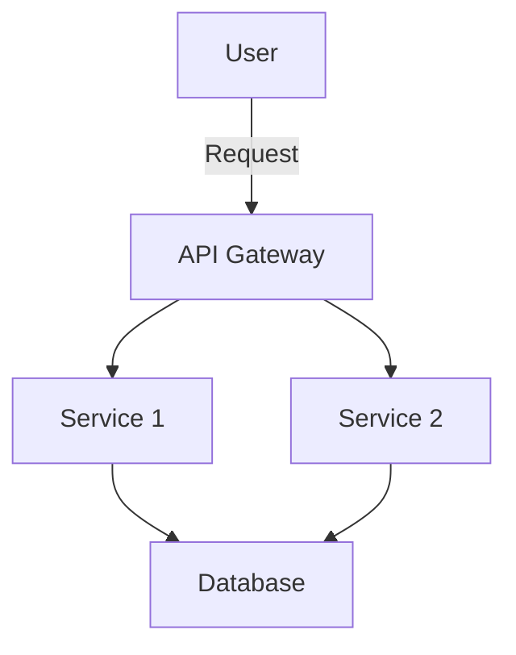

## 11.1 Introduction to Microservices in Haskell

Microservices architecture has become a popular choice for building scalable and maintainable systems. In this section, we will explore how Haskell, with its strong functional programming paradigm, can be leveraged to implement microservices. We will delve into the benefits and challenges of using microservices in Haskell and provide insights into effectively managing these challenges.

### Understanding Microservices Architecture

Microservices architecture is a design approach where a system is composed of small, independent services that communicate over a network. Each service is responsible for a specific business capability and can be developed, deployed, and scaled independently.

#### Key Characteristics of Microservices

- **Decentralization**: Microservices promote decentralized governance and data management, allowing teams to choose the best tools and technologies for their specific service.
- **Independence**: Services can be developed and deployed independently, enabling continuous delivery and deployment.
- **Resilience**: The architecture supports fault isolation, meaning a failure in one service does not necessarily affect the entire system.
- **Scalability**: Each service can be scaled independently based on its specific load and performance requirements.

### Applicability of Microservices in Haskell

Haskell's strong type system, immutability, and emphasis on pure functions make it a suitable candidate for building microservices. These features contribute to creating reliable and maintainable services that are easier to reason about.

#### Why Choose Haskell for Microservices?

- **Type Safety**: Haskell's type system helps catch errors at compile time, reducing runtime failures.
- **Concurrency**: Haskell provides powerful abstractions for concurrent and parallel programming, such as Software Transactional Memory (STM) and lightweight threads.
- **Immutability**: Immutable data structures lead to fewer side effects and easier reasoning about code.
- **Expressiveness**: Haskell's concise syntax and powerful abstractions allow for clear and maintainable code.

### Benefits of Microservices in Haskell

#### Scalability

Microservices allow individual services to be scaled independently. Haskell's lightweight concurrency model and efficient runtime make it well-suited for handling high loads.

#### Maintainability

With microservices, each service is a separate codebase, allowing teams to focus on specific functionalities. Haskell's emphasis on pure functions and immutability leads to code that is easier to test and maintain.

#### Independent Deployment

Microservices can be deployed independently, reducing the risk of deployment failures. Haskell's strong type system ensures that changes are less likely to introduce bugs.

### Challenges of Microservices in Haskell

#### Communication Complexity

Microservices require efficient communication between services. This can be achieved using protocols like HTTP/REST, gRPC, or message queues. Haskell libraries such as Servant and Conduit can facilitate these communications.

#### Data Consistency

Maintaining data consistency across services is challenging. Event sourcing and CQRS (Command Query Responsibility Segregation) are patterns that can help manage data consistency in a distributed system.

#### Deployment and Monitoring

Deploying and monitoring a microservices architecture can be complex. Tools like Docker and Kubernetes can be used for containerization and orchestration, while Haskell's logging and monitoring libraries can help track service health.

### Implementing Microservices in Haskell

#### Service Communication

Haskell provides several libraries for building APIs and handling service communication. Servant is a popular choice for defining type-safe REST APIs.

```haskell
{-# LANGUAGE DataKinds #-}
{-# LANGUAGE TypeOperators #-}

import Servant

type API = "hello" :> Get '[PlainText] String

server :: Server API
server = return "Hello, world!"

app :: Application
app = serve (Proxy :: Proxy API) server
```

In this example, we define a simple API with a single endpoint that returns a "Hello, world!" message. The `Servant` library ensures that our API is type-safe and easy to extend.

#### Handling Concurrency

Haskell's lightweight threads and STM (Software Transactional Memory) provide powerful tools for handling concurrency.

```haskell
import Control.Concurrent
import Control.Concurrent.STM

main :: IO ()
main = do
  counter <- atomically $ newTVar 0
  forkIO $ incrementCounter counter
  forkIO $ incrementCounter counter
  threadDelay 1000000
  finalCount <- atomically $ readTVar counter
  putStrLn $ "Final count: " ++ show finalCount

incrementCounter :: TVar Int -> IO ()
incrementCounter counter = atomically $ modifyTVar' counter (+1)
```

This example demonstrates how to use STM to safely increment a counter from multiple threads.

#### Managing State

The State Monad can be used to manage state within a service, providing a clean and functional way to handle stateful computations.

```haskell
import Control.Monad.State

type Counter = State Int

increment :: Counter ()
increment = modify (+1)

main :: IO ()
main = do
  let initialState = 0
  let ((), finalState) = runState (replicateM_ 10 increment) initialState
  putStrLn $ "Final state: " ++ show finalState
```

Here, we use the State Monad to increment a counter ten times, demonstrating how state can be managed functionally.

### Visualizing Microservices Architecture

Below is a simple diagram illustrating the interaction between microservices in a Haskell-based system.



**Diagram Description**: This diagram shows a user interacting with an API Gateway, which routes requests to different services. Each service can interact with a shared database or other services as needed.

### Best Practices for Microservices in Haskell

- **Use Type-Safe APIs**: Leverage Haskell's type system to define clear and safe APIs.
- **Embrace Immutability**: Design services with immutability in mind to reduce side effects.
- **Monitor and Log**: Implement comprehensive logging and monitoring to track service health and performance.
- **Automate Deployment**: Use tools like Docker and Kubernetes to automate deployment and scaling.
- **Handle Failures Gracefully**: Implement retry mechanisms and circuit breakers to handle service failures.

### Conclusion

Microservices in Haskell offer a powerful way to build scalable and maintainable systems. By leveraging Haskell's unique features, such as its strong type system and concurrency model, we can effectively manage the complexities of microservices architecture. As you continue your journey with Haskell and microservices, remember to embrace the functional paradigm and explore the rich ecosystem of libraries and tools available.

### Try It Yourself

Experiment with the provided code examples by modifying them to add new endpoints or change the concurrency model. Try implementing a simple microservice that interacts with a database or another service.

### Knowledge Check

Reflect on the following questions to reinforce your understanding:

- What are the key benefits of using microservices in Haskell?
- How does Haskell's type system contribute to building reliable microservices?
- What challenges might you face when implementing microservices in Haskell?

### Further Reading

For more information on microservices and Haskell, consider exploring the following resources:

- [Servant Documentation](https://haskell-servant.readthedocs.io/en/stable/)
- [Haskell Concurrency and Parallelism](https://wiki.haskell.org/Concurrency)
- [Docker and Kubernetes for Microservices](https://kubernetes.io/docs/concepts/overview/what-is-kubernetes/)

## Quiz: Introduction to Microservices in Haskell



### What is a key characteristic of microservices architecture?

- [x] Decentralization
- [ ] Monolithic design
- [ ] Single point of failure
- [ ] Tight coupling

> **Explanation:** Microservices architecture promotes decentralization, allowing teams to choose the best tools and technologies for their specific service.

### Why is Haskell suitable for building microservices?

- [x] Strong type system
- [ ] Lack of concurrency support
- [ ] Weak type system
- [ ] High runtime errors

> **Explanation:** Haskell's strong type system helps catch errors at compile time, reducing runtime failures.

### Which Haskell library is commonly used for building type-safe REST APIs?

- [x] Servant
- [ ] Conduit
- [ ] Warp
- [ ] Aeson

> **Explanation:** Servant is a popular Haskell library for defining type-safe REST APIs.

### What is a challenge of microservices architecture?

- [x] Communication complexity
- [ ] Easy deployment
- [ ] Simple data consistency
- [ ] No need for monitoring

> **Explanation:** Microservices require efficient communication between services, which can be complex.

### How can data consistency be managed in microservices?

- [x] Event sourcing
- [ ] Ignoring data consistency
- [ ] Using a single database
- [ ] Monolithic architecture

> **Explanation:** Event sourcing is a pattern that can help manage data consistency in a distributed system.

### What tool can be used for containerization and orchestration in microservices?

- [x] Docker
- [ ] Servant
- [ ] STM
- [ ] Aeson

> **Explanation:** Docker is commonly used for containerization and orchestration in microservices.

### Which Haskell feature aids in handling concurrency?

- [x] Software Transactional Memory (STM)
- [ ] Lack of concurrency support
- [ ] Weak type system
- [ ] High runtime errors

> **Explanation:** Haskell's STM provides powerful tools for handling concurrency.

### What is a benefit of using microservices?

- [x] Independent deployment
- [ ] Single point of failure
- [ ] Tight coupling
- [ ] Monolithic design

> **Explanation:** Microservices can be deployed independently, reducing the risk of deployment failures.

### What is the role of an API Gateway in microservices?

- [x] Routing requests to different services
- [ ] Storing data
- [ ] Handling concurrency
- [ ] Managing state

> **Explanation:** An API Gateway routes requests to different services in a microservices architecture.

### True or False: Haskell's immutability leads to more side effects in microservices.

- [ ] True
- [x] False

> **Explanation:** Haskell's immutability leads to fewer side effects, making it easier to reason about code.



Remember, this is just the beginning. As you progress, you'll build more complex and interactive systems. Keep experimenting, stay curious, and enjoy the journey!
