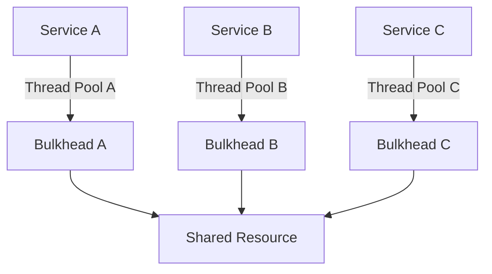

## 11.10 Bulkhead Pattern for Fault Isolation

In the realm of microservices architecture, ensuring system resilience and reliability is paramount. The Bulkhead Pattern is a critical design pattern that enhances fault tolerance by isolating failures within a system. This section delves into the Bulkhead Pattern, its implementation in Haskell, and how it contributes to building robust microservices.

### Bulkhead Concept

The Bulkhead Pattern draws inspiration from the bulkheads used in ships, which are partitions that divide the ship into watertight compartments. If one compartment is breached, the bulkheads prevent water from flooding the entire ship, thus isolating the failure. Similarly, in software architecture, the Bulkhead Pattern isolates components to prevent failures from spreading across the system.

#### Key Benefits

- **Fault Isolation**: By isolating components, the Bulkhead Pattern ensures that a failure in one part of the system does not cascade to other parts.
- **Resource Management**: It allows for better management of resources by allocating specific resources to different components.
- **Increased Resilience**: Enhances the overall resilience of the system by containing failures and maintaining functionality in unaffected areas.

### Implementation in Haskell

Implementing the Bulkhead Pattern in Haskell involves limiting resource usage per component, such as using separate thread pools or processes for different services. Haskell's strong type system and concurrency primitives make it well-suited for implementing this pattern.

#### Using Thread Pools

One common approach to implementing the Bulkhead Pattern is by using thread pools. Each service or component can have its own dedicated thread pool, ensuring that a failure in one service does not affect the others.

```haskell
import Control.Concurrent
import Control.Concurrent.STM
import Control.Monad

-- Define a bulkhead with a limited number of threads
data Bulkhead = Bulkhead { threadPool :: TVar [ThreadId] }

-- Create a new bulkhead with a specified number of threads
createBulkhead :: Int -> IO Bulkhead
createBulkhead n = do
    pool <- atomically $ newTVar []
    replicateM_ n $ forkIO $ atomically $ modifyTVar' pool . (:)
    return $ Bulkhead pool

-- Execute a task within the bulkhead
executeInBulkhead :: Bulkhead -> IO () -> IO ()
executeInBulkhead bulkhead task = do
    pool <- atomically $ readTVar (threadPool bulkhead)
    case pool of
        [] -> putStrLn "No available threads in bulkhead"
        (tid:rest) -> do
            atomically $ writeTVar (threadPool bulkhead) rest
            forkFinally task (\_ -> atomically $ modifyTVar' (threadPool bulkhead) (tid:))
```

In this example, we define a `Bulkhead` data type that manages a pool of threads. The `createBulkhead` function initializes a bulkhead with a specified number of threads, and `executeInBulkhead` runs a task within the bulkhead, ensuring that only available threads are used.

#### Using Processes

Another approach is to use separate processes for different components. This can be achieved using Haskell's `System.Process` module, which allows for the creation and management of system processes.

```haskell
import System.Process

-- Launch a separate process for a service
launchService :: String -> IO ProcessHandle
launchService command = do
    (_, _, _, ph) <- createProcess (shell command)
    return ph

-- Example usage
main :: IO ()
main = do
    ph1 <- launchService "service1"
    ph2 <- launchService "service2"
    -- Monitor and manage processes as needed
```

In this example, `launchService` starts a new process for a given command, allowing services to run in isolation from each other.

### Diagrams and Visualizations

To better understand the Bulkhead Pattern, let's visualize the architecture using Mermaid.js diagrams.



**Diagram Description**: This diagram illustrates three services (A, B, and C), each with its own thread pool managed by a bulkhead. The bulkheads ensure that each service operates independently, preventing failures from affecting shared resources.

### Key Participants

- **Services**: Individual components or microservices that require isolation.
- **Bulkheads**: Mechanisms that manage resources and isolate failures.
- **Shared Resources**: Common resources accessed by multiple services, protected by bulkheads.

### Applicability

The Bulkhead Pattern is applicable in scenarios where:

- **High Availability**: Systems require high availability and cannot afford cascading failures.
- **Resource Constraints**: Resources need to be managed efficiently to prevent overloading.
- **Service Independence**: Services need to operate independently without affecting each other.

### Design Considerations

When implementing the Bulkhead Pattern, consider the following:

- **Resource Allocation**: Determine the appropriate number of resources (e.g., threads, processes) for each bulkhead.
- **Monitoring and Management**: Implement monitoring to track resource usage and detect failures.
- **Fallback Mechanisms**: Design fallback mechanisms to handle failures gracefully.

### Haskell Unique Features

Haskell's unique features, such as its strong type system and concurrency primitives, make it an excellent choice for implementing the Bulkhead Pattern. The use of Software Transactional Memory (STM) allows for safe and efficient management of shared resources.

### Differences and Similarities

The Bulkhead Pattern is often compared to the Circuit Breaker Pattern. While both patterns aim to enhance system resilience, the Bulkhead Pattern focuses on isolating failures, whereas the Circuit Breaker Pattern prevents repeated failures by temporarily halting operations.

### Try It Yourself

Experiment with the provided code examples by modifying the number of threads in the bulkhead or launching additional services. Observe how the system behaves under different configurations and failure scenarios.

### Knowledge Check

- **Question**: What is the primary purpose of the Bulkhead Pattern?
- **Question**: How does the Bulkhead Pattern enhance system resilience?
- **Question**: What are the key differences between the Bulkhead and Circuit Breaker Patterns?

### Summary

The Bulkhead Pattern is a powerful design pattern for fault isolation in microservices architecture. By isolating components and managing resources effectively, it enhances system resilience and reliability. Haskell's concurrency features make it well-suited for implementing this pattern, providing a robust foundation for building fault-tolerant systems.

### References and Links

- [Microservices Patterns](https://microservices.io/patterns/index.html)
- [Haskell Concurrency and Parallelism](https://wiki.haskell.org/Concurrency_and_parallelism)
- [System.Process Documentation](https://hackage.haskell.org/package/process)

## Quiz: Bulkhead Pattern for Fault Isolation



### What is the primary purpose of the Bulkhead Pattern?

- [x] To isolate failures within a system
- [ ] To enhance data consistency
- [ ] To improve user interface design
- [ ] To reduce code complexity

> **Explanation:** The Bulkhead Pattern is designed to isolate failures within a system, preventing them from cascading to other parts.

### How does the Bulkhead Pattern enhance system resilience?

- [x] By isolating components and managing resources
- [ ] By increasing the number of servers
- [ ] By simplifying the codebase
- [ ] By reducing network latency

> **Explanation:** The Bulkhead Pattern enhances system resilience by isolating components and managing resources effectively, ensuring that failures do not spread.

### Which Haskell feature is particularly useful for implementing the Bulkhead Pattern?

- [x] Software Transactional Memory (STM)
- [ ] Lazy Evaluation
- [ ] Type Classes
- [ ] Pattern Matching

> **Explanation:** Software Transactional Memory (STM) in Haskell is useful for managing shared resources safely and efficiently, making it ideal for implementing the Bulkhead Pattern.

### What is a key difference between the Bulkhead and Circuit Breaker Patterns?

- [x] Bulkhead isolates failures; Circuit Breaker prevents repeated failures
- [ ] Bulkhead enhances performance; Circuit Breaker improves security
- [ ] Bulkhead reduces latency; Circuit Breaker increases throughput
- [ ] Bulkhead simplifies code; Circuit Breaker adds complexity

> **Explanation:** The Bulkhead Pattern isolates failures, while the Circuit Breaker Pattern prevents repeated failures by temporarily halting operations.

### In which scenarios is the Bulkhead Pattern particularly applicable?

- [x] High availability and resource constraints
- [ ] Low latency and high throughput
- [ ] User interface design and aesthetics
- [ ] Data consistency and integrity

> **Explanation:** The Bulkhead Pattern is applicable in scenarios requiring high availability and efficient resource management to prevent cascading failures.

### What is a common approach to implementing the Bulkhead Pattern in Haskell?

- [x] Using separate thread pools for different services
- [ ] Using global variables for shared state
- [ ] Using monads for all computations
- [ ] Using lazy evaluation for performance

> **Explanation:** A common approach to implementing the Bulkhead Pattern in Haskell is using separate thread pools for different services to isolate failures.

### How can you experiment with the Bulkhead Pattern in Haskell?

- [x] By modifying the number of threads in the bulkhead
- [ ] By changing the data types used in the code
- [ ] By optimizing the algorithm for speed
- [ ] By reducing the number of services

> **Explanation:** You can experiment with the Bulkhead Pattern by modifying the number of threads in the bulkhead and observing the system's behavior.

### What is a key benefit of using the Bulkhead Pattern?

- [x] Improved system resilience
- [ ] Faster code execution
- [ ] Simplified user interface
- [ ] Enhanced data consistency

> **Explanation:** A key benefit of the Bulkhead Pattern is improved system resilience by isolating failures and managing resources effectively.

### Which diagramming tool is used to visualize the Bulkhead Pattern in this guide?

- [x] Mermaid.js
- [ ] UML
- [ ] Graphviz
- [ ] PlantUML

> **Explanation:** Mermaid.js is used to create diagrams for visualizing the Bulkhead Pattern in this guide.

### True or False: The Bulkhead Pattern is only applicable to microservices architecture.

- [ ] True
- [x] False

> **Explanation:** False. While the Bulkhead Pattern is commonly used in microservices architecture, it can be applied to any system requiring fault isolation and resource management.



Remember, this is just the beginning. As you progress, you'll build more complex and resilient systems. Keep experimenting, stay curious, and enjoy the journey!
