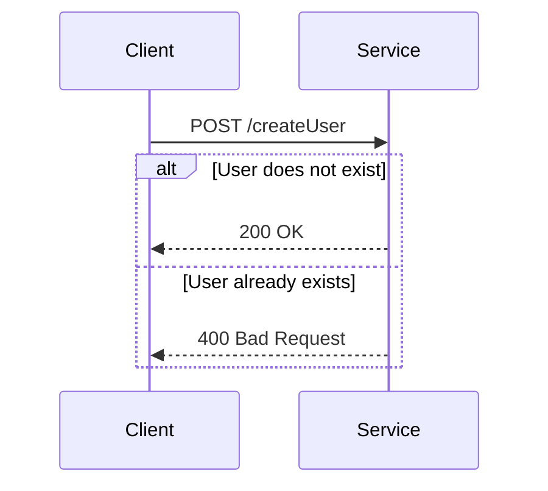

## 11.11 Idempotency in Functional Microservices

In the world of microservices, ensuring that operations are idempotent is crucial for maintaining consistency and reliability. Idempotency is a property of certain operations that ensures that performing the same operation multiple times has the same effect as performing it once. This concept is particularly important in distributed systems where network failures, retries, and duplicate requests are common.

### Understanding Idempotency

**Idempotency** is a fundamental concept in computer science and is especially relevant in the context of microservices. An operation is idempotent if executing it multiple times produces the same result as executing it once. This property is essential for building robust and fault-tolerant systems.

#### Key Characteristics of Idempotency

- **Consistency**: Idempotent operations ensure that the system remains in a consistent state, even in the face of retries or duplicate requests.
- **Reliability**: By handling duplicate requests gracefully, idempotent operations contribute to the overall reliability of the system.
- **Simplicity**: Idempotency simplifies error handling and retry logic, as repeated operations do not lead to unintended side effects.

### Importance of Idempotency in Microservices

In a microservices architecture, services often communicate over a network, which can introduce various challenges such as network latency, failures, and retries. Idempotency helps mitigate these challenges by ensuring that repeated requests do not lead to inconsistent states or unintended side effects.

#### Common Scenarios Requiring Idempotency

- **Network Retries**: When a network request fails, the client may retry the request. If the operation is not idempotent, this can lead to duplicate actions.
- **Duplicate Requests**: In distributed systems, it is possible for the same request to be sent multiple times due to network issues or client-side bugs.
- **Eventual Consistency**: In systems that use eventual consistency, idempotency ensures that repeated operations converge to the same state.

### Implementing Idempotency in Haskell

Haskell, with its strong emphasis on functional programming and immutability, provides a solid foundation for implementing idempotent operations. Let's explore how to design idempotent APIs and operations in Haskell.

#### Designing Idempotent APIs

When designing APIs, it is important to ensure that operations are idempotent. This can be achieved by:

- **Using HTTP Methods Appropriately**: HTTP methods such as GET, PUT, and DELETE are inherently idempotent, while POST is not. Design your APIs to use these methods appropriately.
- **Assigning Unique Identifiers**: Use unique request identifiers to detect and handle duplicate requests. This can be done by generating a unique ID for each request and storing it in a database or cache.

#### Example: Idempotent API Design

Consider a simple API for creating user accounts. The API should ensure that creating the same user multiple times does not result in duplicate accounts.

```haskell
{-# LANGUAGE OverloadedStrings #-}

import Data.Text (Text)
import Data.UUID (UUID, toText)
import Data.UUID.V4 (nextRandom)
import Control.Monad.IO.Class (liftIO)
import Control.Monad.Trans.Reader (ReaderT, ask)
import Database.PostgreSQL.Simple (Connection, execute, query)
import Network.HTTP.Types (status200, status400)
import Network.Wai (Application, Request, Response, responseLBS)
import Network.Wai.Handler.Warp (run)

data User = User { userId :: UUID, userName :: Text }

createUser :: Connection -> User -> IO Bool
createUser conn user = do
  let sql = "INSERT INTO users (id, name) VALUES (?, ?) ON CONFLICT DO NOTHING"
  result <- execute conn sql (userId user, userName user)
  return (result > 0)

app :: ReaderT Connection IO Application
app = do
  conn <- ask
  return $ \req respond -> do
    case requestMethod req of
      "POST" -> do
        userId <- liftIO nextRandom
        let user = User userId "exampleUser"
        success <- liftIO $ createUser conn user
        if success
          then respond $ responseLBS status200 [] "User created"
          else respond $ responseLBS status400 [] "User already exists"
      _ -> respond $ responseLBS status400 [] "Invalid request method"

main :: IO ()
main = do
  conn <- connectPostgreSQL "dbname=mydb"
  run 8080 (runReaderT app conn)
```

In this example, we use a unique identifier (`UUID`) for each user. The `ON CONFLICT DO NOTHING` clause in the SQL query ensures that duplicate requests do not create multiple user accounts.

### Handling Idempotency in Functional Code

In functional programming, idempotency can be achieved by designing functions that are pure and have no side effects. This means that given the same input, a function will always produce the same output.

#### Pure Functions and Idempotency

Pure functions are inherently idempotent because they do not rely on external state or side effects. This makes them ideal for implementing idempotent operations.

```haskell
-- A pure function that is idempotent
increment :: Int -> Int
increment x = x + 1

-- Applying the function multiple times has the same effect
main :: IO ()
main = do
  print (increment 1) -- Output: 2
  print (increment 1) -- Output: 2
```

In this example, the `increment` function is idempotent because applying it multiple times with the same input produces the same result.

### Visualizing Idempotency in Microservices

To better understand how idempotency works in a microservices architecture, let's visualize the flow of requests and responses.



In this sequence diagram, the client sends a `POST` request to create a user. If the user does not exist, the service responds with `200 OK`. If the user already exists, the service responds with `400 Bad Request`. This ensures that duplicate requests do not create multiple user accounts.

### Key Participants in Idempotency

- **Client**: Initiates requests and may retry them in case of failures.
- **Service**: Processes requests and ensures idempotency by handling duplicates gracefully.
- **Database**: Stores unique identifiers and ensures that operations are idempotent.

### Applicability of Idempotency

Idempotency is applicable in any system where operations may be repeated due to retries, network failures, or duplicate requests. It is particularly important in distributed systems and microservices architectures.

### Design Considerations

When implementing idempotency, consider the following:

- **Idempotency Keys**: Use unique identifiers to detect and handle duplicate requests.
- **Database Constraints**: Use database constraints to enforce idempotency at the data layer.
- **Error Handling**: Design error handling logic to gracefully handle retries and duplicate requests.

### Haskell Unique Features

Haskell's strong type system and emphasis on immutability make it well-suited for implementing idempotent operations. The use of pure functions and monads allows for clear separation of side effects and business logic.

### Differences and Similarities

Idempotency is often confused with other concepts such as immutability and statelessness. While these concepts are related, they are distinct:

- **Idempotency**: Ensures that repeated operations have the same effect.
- **Immutability**: Ensures that data cannot be changed once created.
- **Statelessness**: Ensures that operations do not rely on external state.

### Try It Yourself

To better understand idempotency, try modifying the code example to handle additional scenarios, such as updating user information or deleting users. Experiment with different HTTP methods and database constraints to see how they affect idempotency.

### Knowledge Check

- What is idempotency, and why is it important in microservices?
- How can you design an idempotent API in Haskell?
- What are the key characteristics of idempotent operations?
- How does Haskell's type system support idempotency?

### Embrace the Journey

Remember, idempotency is a powerful tool for building reliable and consistent systems. As you continue to explore functional programming and microservices, keep experimenting with different patterns and techniques. Stay curious, and enjoy the journey!

## Quiz: Idempotency in Functional Microservices



### What is idempotency in the context of microservices?

- [x] Ensuring that multiple identical requests have the same effect.
- [ ] Ensuring that requests are processed in parallel.
- [ ] Ensuring that requests are processed in sequence.
- [ ] Ensuring that requests are always successful.

> **Explanation:** Idempotency ensures that multiple identical requests have the same effect, which is crucial for maintaining consistency in microservices.

### Which HTTP methods are inherently idempotent?

- [x] GET
- [x] PUT
- [x] DELETE
- [ ] POST

> **Explanation:** GET, PUT, and DELETE are inherently idempotent HTTP methods, while POST is not.

### How can you ensure idempotency in a Haskell API?

- [x] Use unique request identifiers.
- [x] Use database constraints.
- [ ] Use global variables.
- [ ] Use mutable state.

> **Explanation:** Idempotency can be ensured by using unique request identifiers and database constraints, avoiding global variables and mutable state.

### What is a key characteristic of idempotent operations?

- [x] Consistency
- [ ] Complexity
- [ ] Randomness
- [ ] Volatility

> **Explanation:** Consistency is a key characteristic of idempotent operations, ensuring that repeated requests do not lead to inconsistent states.

### How does Haskell's type system support idempotency?

- [x] By enforcing immutability
- [x] By using pure functions
- [ ] By allowing side effects
- [ ] By using global variables

> **Explanation:** Haskell's type system supports idempotency by enforcing immutability and using pure functions, avoiding side effects and global variables.

### What is the role of the client in ensuring idempotency?

- [x] Initiating requests
- [x] Retrying requests
- [ ] Processing requests
- [ ] Storing data

> **Explanation:** The client initiates and may retry requests, but does not process requests or store data.

### Which of the following is not a benefit of idempotency?

- [ ] Consistency
- [ ] Reliability
- [ ] Simplicity
- [x] Complexity

> **Explanation:** Idempotency provides consistency, reliability, and simplicity, not complexity.

### What is the role of the service in ensuring idempotency?

- [x] Processing requests
- [x] Handling duplicates
- [ ] Initiating requests
- [ ] Retrying requests

> **Explanation:** The service processes requests and handles duplicates, but does not initiate or retry requests.

### How can you visualize idempotency in a microservices architecture?

- [x] Using sequence diagrams
- [ ] Using bar charts
- [ ] Using pie charts
- [ ] Using histograms

> **Explanation:** Sequence diagrams are effective for visualizing idempotency in a microservices architecture.

### True or False: Idempotency is the same as immutability.

- [ ] True
- [x] False

> **Explanation:** Idempotency and immutability are related but distinct concepts. Idempotency ensures repeated operations have the same effect, while immutability ensures data cannot be changed once created.




