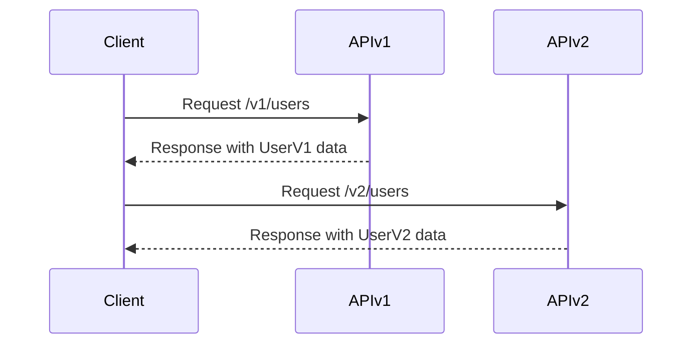

## 11.12 API Versioning and Evolution

In the rapidly evolving landscape of software development, maintaining and evolving APIs without disrupting existing clients is a critical challenge. This section delves into the intricacies of API versioning and evolution within Haskell microservices, offering strategies and practical implementations to ensure seamless updates and backward compatibility.

### Understanding the Challenges

APIs are the backbone of microservices architecture, enabling communication between different services and clients. As systems grow and requirements change, APIs must evolve. However, updating APIs can lead to breaking changes that disrupt client applications. The key challenges include:

- **Backward Compatibility**: Ensuring new API versions do not break existing clients.
- **Seamless Evolution**: Allowing APIs to evolve without requiring immediate client updates.
- **Version Management**: Handling multiple API versions within the same codebase efficiently.

### Strategies for API Versioning

To address these challenges, several versioning strategies can be employed. Each strategy has its pros and cons, and the choice depends on the specific requirements and constraints of your system.

#### 1. URI Versioning

URI versioning involves embedding the version number directly in the API endpoint's URI. This is one of the most straightforward and widely used methods.

**Example:**

```
GET /v1/users
GET /v2/users
```

**Pros:**

- Simple to implement and understand.
- Clear indication of the API version being used.

**Cons:**

- Can lead to URI bloat if not managed properly.
- May require significant changes in client code to switch versions.

#### 2. Header-Based Versioning

In header-based versioning, the API version is specified in the HTTP headers rather than the URI.

**Example:**

```
GET /users
Headers: 
  Accept-Version: v1
```

**Pros:**

- Keeps URIs clean and consistent.
- Allows for more flexible version negotiation.

**Cons:**

- Less visible than URI versioning.
- Requires clients to manage headers properly.

#### 3. Query Parameter Versioning

This method involves specifying the version as a query parameter in the API request.

**Example:**

```
GET /users?version=1
```

**Pros:**

- Easy to implement.
- Allows for dynamic version selection.

**Cons:**

- Can clutter query strings.
- May not be as intuitive as URI versioning.

#### 4. Content Negotiation

Content negotiation uses the `Accept` header to specify the desired version, often in combination with media types.

**Example:**

```
GET /users
Headers: 
  Accept: application/vnd.example.v1+json
```

**Pros:**

- Supports fine-grained version control.
- Integrates well with RESTful principles.

**Cons:**

- More complex to implement.
- Requires careful management of media types.

### Implementation in Haskell

Haskell's strong type system and functional paradigms provide unique advantages in managing API versions. Let's explore how Haskell can be leveraged to implement these strategies effectively.

#### Using Haskell's Type System

Haskell's type system can be used to define different versions of an API, ensuring type safety and reducing runtime errors.

```haskell
{-# LANGUAGE DataKinds #-}
{-# LANGUAGE TypeOperators #-}

import Servant

-- Define API versions
type UserAPIv1 = "users" :> Get '[JSON] [UserV1]
type UserAPIv2 = "users" :> Get '[JSON] [UserV2]

-- Combine versions
type UserAPI = "v1" :> UserAPIv1
           :<|> "v2" :> UserAPIv2

-- Define server
server :: Server UserAPI
server = getUsersV1 :<|> getUsersV2

getUsersV1 :: Handler [UserV1]
getUsersV1 = ...

getUsersV2 :: Handler [UserV2]
getUsersV2 = ...
```

In this example, we define two versions of the `UserAPI`, each with its own data type (`UserV1` and `UserV2`). The `Server` type ensures that each version is handled correctly, leveraging Haskell's type safety.

#### Maintaining Multiple API Versions

Maintaining multiple API versions within the same codebase can be challenging. Haskell's modularity and type classes can help manage this complexity.

```haskell
-- Define a type class for common functionality
class UserAPICommon a where
  getUsers :: Handler [a]

-- Implement for each version
instance UserAPICommon UserV1 where
  getUsers = ...

instance UserAPICommon UserV2 where
  getUsers = ...
```

By defining a type class `UserAPICommon`, we can abstract common functionality across different versions, reducing code duplication and improving maintainability.

### Design Considerations

When implementing API versioning in Haskell, consider the following:

- **Consistency**: Ensure consistent versioning across all services.
- **Documentation**: Clearly document versioning policies and changes.
- **Deprecation**: Plan for deprecating old versions gracefully, providing clients with ample notice and migration paths.

### Haskell Unique Features

Haskell's unique features, such as its type system, immutability, and functional paradigms, offer distinct advantages in API versioning:

- **Type Safety**: Reduces runtime errors by catching version mismatches at compile time.
- **Immutability**: Ensures data consistency across versions.
- **Functional Abstractions**: Simplifies managing complex versioning logic.

### Differences and Similarities

API versioning strategies can be confused with other design patterns, such as feature toggles or A/B testing. While these patterns also manage changes, they focus on enabling or disabling features rather than managing API versions.

### Try It Yourself

Experiment with the provided code examples by:

- Adding a new version of the `UserAPI` with additional fields.
- Implementing header-based versioning using Servant's `Header` combinator.
- Exploring how type classes can be used to manage shared functionality across versions.

### Visualizing API Versioning

To better understand the flow of API versioning, let's visualize the process using a sequence diagram.



This diagram illustrates how a client interacts with different API versions, receiving responses tailored to each version's data structure.

### Knowledge Check

- What are the pros and cons of URI versioning?
- How can Haskell's type system aid in managing API versions?
- What are the key considerations when deprecating an API version?

### Embrace the Journey

Remember, mastering API versioning is a journey. As you progress, you'll build more robust and flexible systems. Keep experimenting, stay curious, and enjoy the process!

## Quiz: API Versioning and Evolution



### What is a primary challenge of API versioning?

- [x] Ensuring backward compatibility
- [ ] Reducing server load
- [ ] Increasing API response time
- [ ] Simplifying client code

> **Explanation:** Ensuring backward compatibility is crucial to prevent breaking existing clients when updating APIs.

### Which versioning strategy involves using HTTP headers?

- [ ] URI versioning
- [x] Header-based versioning
- [ ] Query parameter versioning
- [ ] Content negotiation

> **Explanation:** Header-based versioning uses HTTP headers to specify the API version.

### How does Haskell's type system benefit API versioning?

- [x] Provides type safety
- [ ] Increases runtime errors
- [ ] Reduces code readability
- [ ] Complicates version management

> **Explanation:** Haskell's type system provides type safety, catching version mismatches at compile time.

### What is a disadvantage of URI versioning?

- [x] URI bloat
- [ ] Requires header management
- [ ] Increases query string length
- [ ] Complicates media type management

> **Explanation:** URI versioning can lead to URI bloat if not managed properly.

### Which strategy uses the `Accept` header for versioning?

- [ ] URI versioning
- [ ] Header-based versioning
- [ ] Query parameter versioning
- [x] Content negotiation

> **Explanation:** Content negotiation uses the `Accept` header to specify the desired API version.

### What is a benefit of using type classes in Haskell for API versioning?

- [x] Reduces code duplication
- [ ] Increases runtime errors
- [ ] Complicates code maintenance
- [ ] Limits functionality

> **Explanation:** Type classes reduce code duplication by abstracting common functionality across versions.

### What should be considered when deprecating an API version?

- [x] Providing migration paths
- [ ] Increasing server load
- [ ] Reducing client notifications
- [ ] Simplifying documentation

> **Explanation:** Providing migration paths ensures clients can transition smoothly to new versions.

### How can Haskell's immutability benefit API versioning?

- [x] Ensures data consistency
- [ ] Increases runtime errors
- [ ] Complicates version management
- [ ] Reduces type safety

> **Explanation:** Immutability ensures data consistency across different API versions.

### What is a key advantage of header-based versioning?

- [x] Keeps URIs clean
- [ ] Increases query string length
- [ ] Requires complex URI management
- [ ] Complicates client code

> **Explanation:** Header-based versioning keeps URIs clean by specifying the version in headers.

### True or False: API versioning is only necessary for public APIs.

- [ ] True
- [x] False

> **Explanation:** API versioning is necessary for both public and internal APIs to manage changes and maintain compatibility.


