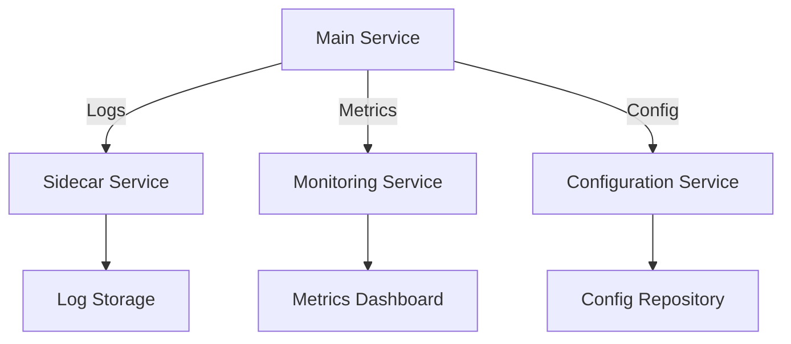
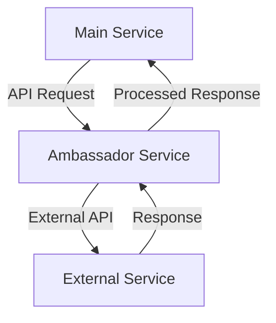

## 11.13 Sidecar and Ambassador Patterns

In the realm of microservices architecture, the Sidecar and Ambassador patterns are pivotal for enhancing service modularity, scalability, and maintainability. These patterns are particularly beneficial in Haskell applications, where functional programming principles can be leveraged to create robust and efficient microservices. This section delves into the intricacies of these patterns, their implementation in Haskell, and provides practical examples to solidify understanding.

### Understanding the Sidecar Pattern

#### Intent
The Sidecar pattern involves running helper services alongside the main application service. This pattern is akin to a sidekick that assists the main service by handling auxiliary tasks such as logging, monitoring, configuration, and networking. The sidecar is deployed as a separate process or container, sharing the same lifecycle as the main service.

#### Key Participants
- **Main Service**: The primary application service that performs the core business logic.
- **Sidecar Service**: A helper service that provides auxiliary functionalities to the main service.

#### Applicability
- When you need to separate concerns by offloading non-core functionalities.
- To enhance modularity and reusability of services.
- When implementing cross-cutting concerns like logging, monitoring, or configuration management.

#### Implementation in Haskell

In Haskell, the Sidecar pattern can be implemented using lightweight processes or containers. The sidecar service can be a Haskell application or a service written in another language, depending on the task it performs.

**Example: Logging Agent as a Sidecar**

Let's consider a scenario where we deploy a logging agent as a sidecar to capture logs from a Haskell service.

```haskell
-- MainService.hs
module Main where

import System.IO (hPutStrLn, stderr)
import Control.Concurrent (forkIO, threadDelay)
import Network.HTTP.Client (newManager, defaultManagerSettings)

main :: IO ()
main = do
    manager <- newManager defaultManagerSettings
    _ <- forkIO $ logService manager
    runMainService

runMainService :: IO ()
runMainService = do
    putStrLn "Main service is running..."
    -- Simulate service work
    threadDelay 1000000
    putStrLn "Main service completed work."

logService :: Manager -> IO ()
logService manager = do
    -- Simulate logging
    hPutStrLn stderr "Logging service is capturing logs..."
    threadDelay 500000
    hPutStrLn stderr "Logs captured."
```

In this example, the `logService` function acts as a sidecar, capturing logs from the main service. The sidecar runs concurrently with the main service, demonstrating the separation of concerns.

#### Design Considerations
- **Lifecycle Management**: Ensure that the sidecar shares the same lifecycle as the main service.
- **Communication**: Use inter-process communication (IPC) or shared volumes for data exchange between the main service and the sidecar.
- **Resource Management**: Monitor resource usage to prevent the sidecar from consuming excessive resources.

### Visualizing the Sidecar Pattern



*Diagram: The main service interacts with various sidecar services, each handling a specific auxiliary task.*

### Exploring the Ambassador Pattern

#### Intent
The Ambassador pattern involves offloading networking tasks to an ambassador service. This pattern is particularly useful for managing external communication, such as handling retries, circuit breaking, and authentication.

#### Key Participants
- **Main Service**: The core application service that requires external communication.
- **Ambassador Service**: A proxy service that manages networking tasks on behalf of the main service.

#### Applicability
- When you need to manage complex networking tasks separately from the main service.
- To implement network-related cross-cutting concerns like retries and circuit breaking.
- When integrating with external services that require specific networking configurations.

#### Implementation in Haskell

The Ambassador pattern can be implemented using Haskell libraries like `warp` for HTTP servers or `conduit` for streaming data. The ambassador service acts as a proxy, handling networking tasks for the main service.

**Example: Ambassador Service for External API Calls**

```haskell
-- AmbassadorService.hs
module AmbassadorService where

import Network.HTTP.Client (newManager, defaultManagerSettings, httpLbs, parseRequest)
import Control.Exception (try, SomeException)

ambassadorService :: IO ()
ambassadorService = do
    manager <- newManager defaultManagerSettings
    request <- parseRequest "http://external-service/api"
    response <- try $ httpLbs request manager :: IO (Either SomeException ())
    case response of
        Left err -> putStrLn $ "Error: " ++ show err
        Right _ -> putStrLn "Request successful."

main :: IO ()
main = do
    putStrLn "Ambassador service is running..."
    ambassadorService
```

In this example, the `ambassadorService` function acts as a proxy, managing external API calls for the main service. It handles errors and retries, demonstrating the separation of networking concerns.

#### Design Considerations
- **Error Handling**: Implement robust error handling and retry mechanisms.
- **Security**: Ensure secure communication between the main service and the ambassador.
- **Performance**: Optimize the ambassador service to minimize latency.

### Visualizing the Ambassador Pattern



*Diagram: The main service delegates external API calls to the ambassador service, which handles networking tasks.*

### Haskell Unique Features

Haskell's strong type system and concurrency model make it well-suited for implementing the Sidecar and Ambassador patterns. The use of monads and type classes allows for clean separation of concerns and modularity.

- **Concurrency**: Haskell's lightweight threads and STM (Software Transactional Memory) facilitate concurrent execution of sidecar and ambassador services.
- **Type Safety**: The type system ensures that communication between services is type-safe, reducing runtime errors.
- **Functional Composition**: Haskell's functional nature allows for easy composition of services and separation of concerns.

### Differences and Similarities

While both the Sidecar and Ambassador patterns aim to separate concerns, they differ in their focus:

- **Sidecar Pattern**: Focuses on auxiliary tasks like logging and monitoring.
- **Ambassador Pattern**: Focuses on networking tasks and external communication.

Both patterns can be combined to create a robust microservices architecture, where sidecars handle internal concerns and ambassadors manage external interactions.

### Try It Yourself

Experiment with the provided code examples by modifying the sidecar and ambassador services. Try adding new functionalities, such as monitoring or authentication, to see how these patterns enhance modularity and maintainability.

### Knowledge Check

- What are the main differences between the Sidecar and Ambassador patterns?
- How can Haskell's concurrency model benefit the implementation of these patterns?
- What are some potential pitfalls when implementing the Sidecar pattern?

### Embrace the Journey

Remember, mastering these patterns is just the beginning. As you progress, you'll build more complex and scalable microservices architectures. Keep experimenting, stay curious, and enjoy the journey!

## Quiz: Sidecar and Ambassador Patterns



### What is the primary role of a sidecar service in microservices architecture?

- [x] To handle auxiliary tasks such as logging and monitoring
- [ ] To manage external API calls
- [ ] To serve as the main application service
- [ ] To handle user authentication

> **Explanation:** The sidecar service handles auxiliary tasks, allowing the main service to focus on core business logic.

### Which pattern is best suited for managing external communication in microservices?

- [ ] Sidecar Pattern
- [x] Ambassador Pattern
- [ ] Singleton Pattern
- [ ] Factory Pattern

> **Explanation:** The Ambassador Pattern is designed to manage external communication, handling tasks like retries and circuit breaking.

### How does the Sidecar pattern enhance modularity in microservices?

- [x] By separating auxiliary tasks from the main service
- [ ] By combining all services into a single process
- [ ] By increasing the complexity of the main service
- [ ] By reducing the number of services

> **Explanation:** The Sidecar pattern enhances modularity by offloading non-core functionalities to separate services.

### What is a key benefit of using Haskell for implementing the Sidecar pattern?

- [x] Strong type safety and concurrency support
- [ ] Lack of support for functional programming
- [ ] High runtime errors
- [ ] Limited library support

> **Explanation:** Haskell's strong type system and concurrency model make it ideal for implementing the Sidecar pattern.

### In the Ambassador pattern, what is the role of the ambassador service?

- [x] To manage networking tasks on behalf of the main service
- [ ] To serve as the main application service
- [ ] To handle user authentication
- [ ] To perform data storage

> **Explanation:** The ambassador service manages networking tasks, allowing the main service to focus on core logic.

### Can the Sidecar and Ambassador patterns be combined in a microservices architecture?

- [x] Yes
- [ ] No

> **Explanation:** Both patterns can be combined to handle different concerns, enhancing the overall architecture.

### What is a potential pitfall of the Sidecar pattern?

- [x] Resource consumption by the sidecar service
- [ ] Simplified service architecture
- [ ] Reduced modularity
- [ ] Increased core logic complexity

> **Explanation:** Sidecar services can consume resources, so it's important to monitor their usage.

### Which Haskell feature is particularly useful for implementing the Ambassador pattern?

- [x] Concurrency and type safety
- [ ] Lack of support for networking
- [ ] High runtime errors
- [ ] Limited library support

> **Explanation:** Haskell's concurrency and type safety features are beneficial for implementing the Ambassador pattern.

### What is the main focus of the Ambassador pattern?

- [x] Networking tasks and external communication
- [ ] Auxiliary tasks like logging
- [ ] Core business logic
- [ ] Data storage

> **Explanation:** The Ambassador pattern focuses on managing networking tasks and external communication.

### True or False: The Sidecar pattern is only applicable in containerized environments.

- [ ] True
- [x] False

> **Explanation:** While commonly used in containerized environments, the Sidecar pattern can be implemented in non-containerized setups as well.


