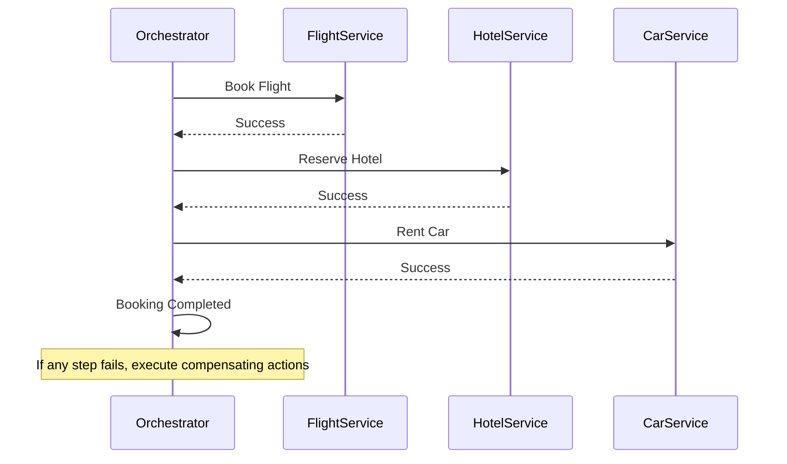

## 11.14 Saga Pattern for Distributed Transactions

In the world of microservices, managing distributed transactions is a complex challenge. The Saga Pattern offers a solution by breaking down long-lived transactions into smaller, manageable steps, each with its own compensating action. This approach ensures that systems remain consistent even when individual steps fail. In this section, we'll explore the Saga Pattern in detail, focusing on its implementation in Haskell.

### Saga Concept

The Saga Pattern is a design pattern used to manage distributed transactions in microservices. It divides a transaction into a series of smaller, isolated steps, each with its own compensating action. If a step fails, the compensating actions are executed to undo the changes made by previous steps, ensuring the system remains consistent.

#### Key Characteristics

- **Long-Lived Transactions**: Sagas are designed to handle transactions that span multiple services and may take a long time to complete.
- **Compensating Actions**: Each step in a saga has a corresponding compensating action to undo its effects if necessary.
- **Decentralized Coordination**: Sagas can be coordinated using either a centralized orchestrator or a decentralized choreography approach.

### Implementation

Implementing the Saga Pattern involves orchestrating the sequence of steps and their compensating actions. There are two primary approaches to implementing sagas: orchestration and choreography.

#### Orchestration

In the orchestration approach, a central orchestrator service coordinates the execution of the saga steps. The orchestrator sends commands to the participating services and listens for responses to determine the next step.

**Advantages**:
- Centralized control simplifies the coordination logic.
- Easier to manage and monitor the saga's progress.

**Disadvantages**:
- Single point of failure if the orchestrator goes down.
- Can become a bottleneck if not designed for scalability.

#### Choreography

In the choreography approach, each service involved in the saga is responsible for executing its own step and publishing events to notify other services. The services listen for events and decide when to execute their steps.

**Advantages**:
- No single point of failure, as there is no central orchestrator.
- More scalable, as each service operates independently.

**Disadvantages**:
- More complex coordination logic, as each service must handle its own state transitions.
- Harder to monitor and debug, as the saga's state is distributed across services.

### Example: Multi-Step Booking Process

Let's consider a multi-step booking process as an example of implementing the Saga Pattern. The process involves booking a flight, reserving a hotel, and renting a car. Each step is a separate transaction, and compensating actions are defined to undo each step if necessary.

#### Step 1: Book Flight

```haskell
-- Define the data types for the booking process
data BookingStatus = Success | Failure deriving (Show, Eq)

-- Function to book a flight
bookFlight :: IO BookingStatus
bookFlight = do
    putStrLn "Booking flight..."
    -- Simulate booking logic
    return Success

-- Compensating action to cancel flight booking
cancelFlight :: IO ()
cancelFlight = putStrLn "Canceling flight booking..."
```

#### Step 2: Reserve Hotel

```haskell
-- Function to reserve a hotel
reserveHotel :: IO BookingStatus
reserveHotel = do
    putStrLn "Reserving hotel..."
    -- Simulate reservation logic
    return Success

-- Compensating action to cancel hotel reservation
cancelHotel :: IO ()
cancelHotel = putStrLn "Canceling hotel reservation..."
```

#### Step 3: Rent Car

```haskell
-- Function to rent a car
rentCar :: IO BookingStatus
rentCar = do
    putStrLn "Renting car..."
    -- Simulate rental logic
    return Success

-- Compensating action to cancel car rental
cancelCar :: IO ()
cancelCar = putStrLn "Canceling car rental..."
```

#### Orchestrating the Saga

```haskell
-- Function to orchestrate the booking process
orchestrateBooking :: IO ()
orchestrateBooking = do
    flightStatus <- bookFlight
    case flightStatus of
        Success -> do
            hotelStatus <- reserveHotel
            case hotelStatus of
                Success -> do
                    carStatus <- rentCar
                    case carStatus of
                        Success -> putStrLn "Booking process completed successfully."
                        Failure -> do
                            cancelHotel
                            cancelFlight
                            putStrLn "Booking process failed. Compensating actions executed."
                Failure -> do
                    cancelFlight
                    putStrLn "Booking process failed. Compensating actions executed."
        Failure -> putStrLn "Booking process failed. No compensating actions needed."
```

### Design Considerations

When implementing the Saga Pattern, consider the following:

- **Idempotency**: Ensure that each step and its compensating action are idempotent, meaning they can be executed multiple times without adverse effects.
- **Timeouts and Retries**: Implement timeouts and retry mechanisms to handle transient failures and ensure the saga completes successfully.
- **Monitoring and Logging**: Use monitoring and logging to track the progress of the saga and diagnose issues.

### Haskell Unique Features

Haskell's strong type system and functional programming paradigm offer unique advantages when implementing the Saga Pattern:

- **Type Safety**: Haskell's type system ensures that only valid operations are performed, reducing the risk of runtime errors.
- **Pure Functions**: Pure functions make it easier to reason about the behavior of each step and its compensating action.
- **Concurrency**: Haskell's concurrency primitives, such as Software Transactional Memory (STM), can be used to manage state transitions and ensure consistency.

### Differences and Similarities

The Saga Pattern is often compared to traditional ACID transactions. While both aim to ensure consistency, they differ in their approach:

- **ACID Transactions**: Ensure atomicity, consistency, isolation, and durability within a single database.
- **Saga Pattern**: Provides eventual consistency across multiple services by using compensating actions.

### Try It Yourself

Experiment with the code examples provided by modifying the booking process. For instance, introduce a failure in one of the steps and observe how the compensating actions are executed. This hands-on approach will deepen your understanding of the Saga Pattern.

### Visualizing the Saga Pattern

To better understand the flow of the Saga Pattern, let's visualize the orchestration process using a sequence diagram.



### References and Links

For further reading on the Saga Pattern and distributed transactions, consider the following resources:

- [Microservices Patterns: With examples in Java](https://www.amazon.com/Microservices-Patterns-examples-Chris-Richardson/dp/1617294543) by Chris Richardson
- [Saga Pattern](https://microservices.io/patterns/data/saga.html) on Microservices.io
- [Haskell Concurrency and Parallelism](https://www.schoolofhaskell.com/user/edwardk/concurrency-and-parallelism) on School of Haskell

### Knowledge Check

- What are the key characteristics of the Saga Pattern?
- How does the orchestration approach differ from choreography?
- Why is idempotency important in the Saga Pattern?
- How can Haskell's concurrency primitives be used in implementing the Saga Pattern?

### Embrace the Journey

Remember, mastering the Saga Pattern is just one step in building robust distributed systems. As you continue to explore Haskell and its design patterns, you'll gain the skills needed to tackle even more complex challenges. Keep experimenting, stay curious, and enjoy the journey!

## Quiz: Saga Pattern for Distributed Transactions



### What is the primary purpose of the Saga Pattern in distributed systems?

- [x] To manage long-lived transactions by breaking them into smaller steps with compensating actions.
- [ ] To ensure atomicity, consistency, isolation, and durability within a single database.
- [ ] To provide a centralized control mechanism for all microservices.
- [ ] To replace traditional ACID transactions entirely.

> **Explanation:** The Saga Pattern is designed to manage distributed transactions by breaking them into smaller steps, each with compensating actions to maintain consistency.

### Which approach involves a central orchestrator coordinating the saga steps?

- [x] Orchestration
- [ ] Choreography
- [ ] Decentralization
- [ ] Synchronization

> **Explanation:** In the orchestration approach, a central orchestrator coordinates the execution of the saga steps.

### What is a key advantage of the choreography approach in the Saga Pattern?

- [x] No single point of failure
- [ ] Centralized control
- [ ] Simplified coordination logic
- [ ] Easier monitoring

> **Explanation:** The choreography approach has no single point of failure, as each service operates independently.

### Why is idempotency important in the Saga Pattern?

- [x] To ensure that each step and its compensating action can be executed multiple times without adverse effects.
- [ ] To centralize control of the transaction.
- [ ] To simplify the coordination logic.
- [ ] To ensure atomicity within a single database.

> **Explanation:** Idempotency ensures that operations can be repeated without causing unintended side effects, which is crucial for compensating actions.

### How can Haskell's type system benefit the implementation of the Saga Pattern?

- [x] By ensuring only valid operations are performed, reducing runtime errors.
- [ ] By providing a centralized control mechanism.
- [ ] By simplifying the coordination logic.
- [ ] By ensuring atomicity within a single database.

> **Explanation:** Haskell's strong type system ensures that only valid operations are performed, reducing the risk of runtime errors.

### What is a disadvantage of the orchestration approach?

- [x] Single point of failure
- [ ] Complex coordination logic
- [ ] Harder to monitor
- [ ] Lack of scalability

> **Explanation:** The orchestration approach can have a single point of failure if the orchestrator goes down.

### What is the role of compensating actions in the Saga Pattern?

- [x] To undo the effects of a step if it fails.
- [ ] To ensure atomicity within a single database.
- [ ] To centralize control of the transaction.
- [ ] To simplify the coordination logic.

> **Explanation:** Compensating actions are used to undo the effects of a step if it fails, maintaining consistency.

### Which Haskell feature can be used to manage state transitions in the Saga Pattern?

- [x] Software Transactional Memory (STM)
- [ ] Centralized control
- [ ] Simplified coordination logic
- [ ] Atomicity within a single database

> **Explanation:** Haskell's Software Transactional Memory (STM) can be used to manage state transitions and ensure consistency.

### What is the primary difference between the Saga Pattern and traditional ACID transactions?

- [x] The Saga Pattern provides eventual consistency across multiple services, while ACID transactions ensure atomicity within a single database.
- [ ] The Saga Pattern ensures atomicity within a single database, while ACID transactions provide eventual consistency.
- [ ] The Saga Pattern centralizes control, while ACID transactions decentralize it.
- [ ] The Saga Pattern simplifies coordination logic, while ACID transactions complicate it.

> **Explanation:** The Saga Pattern provides eventual consistency across multiple services, whereas ACID transactions ensure atomicity within a single database.

### True or False: The Saga Pattern can replace traditional ACID transactions entirely.

- [ ] True
- [x] False

> **Explanation:** The Saga Pattern is not a replacement for traditional ACID transactions; it is a complementary approach for managing distributed transactions.


