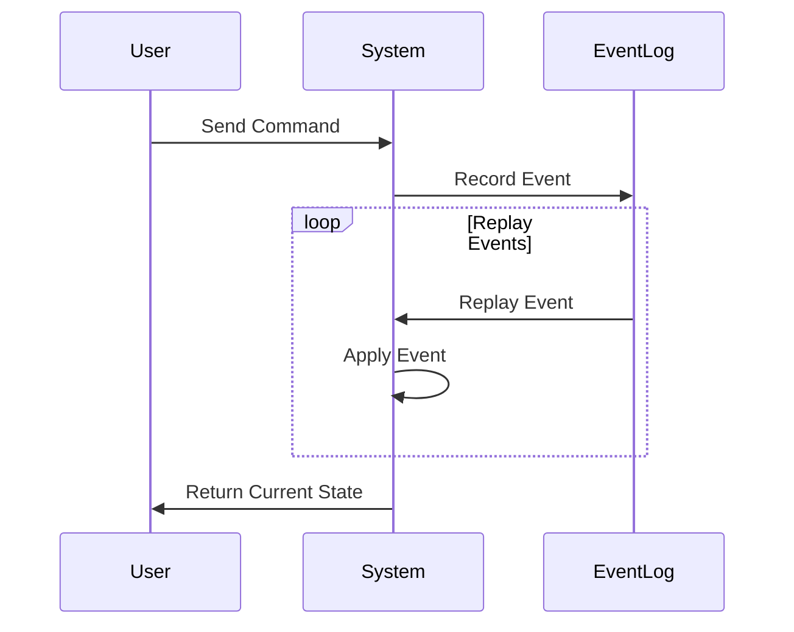

## 11.15 Event Sourcing in Microservices

Event Sourcing is a powerful design pattern that is particularly well-suited for microservices architectures. It involves storing the state of a system as a sequence of events, rather than as a single snapshot of the current state. This approach provides numerous benefits, including improved auditability, scalability, and the ability to achieve eventual consistency across distributed systems. In this section, we will explore the concept of Event Sourcing, its benefits, and how to implement it in Haskell for microservices.

### Concept of Event Sourcing

Event Sourcing is a design pattern where state changes are stored as a sequence of events. Each event represents a change to the state of the system, and the current state can be reconstructed by replaying these events. This approach contrasts with traditional systems that store the current state directly.

#### Key Concepts

- **Event Log**: An append-only log where all events are recorded. This log serves as the single source of truth for the system's state.
- **Event Replay**: The process of reconstructing the current state by replaying all events from the log.
- **Command**: An action that triggers a state change, resulting in one or more events.
- **Event**: A record of a state change that has occurred in the system.

### Benefits of Event Sourcing

Event Sourcing offers several advantages, particularly in the context of microservices:

- **Auditability**: Since all state changes are recorded as events, it is easy to audit the history of changes.
- **Scalability**: Event logs can be partitioned and distributed across multiple nodes, enabling horizontal scaling.
- **Eventual Consistency**: By replaying events, different parts of the system can achieve eventual consistency.
- **Flexibility**: New views or projections of the data can be created by replaying events in different ways.
- **Debugging and Testing**: The ability to replay events makes it easier to debug and test the system.

### Implementation of Event Sourcing in Haskell

Implementing Event Sourcing in Haskell involves several steps, including defining events, recording them in an event log, and replaying them to reconstruct state. Let's explore these steps in detail.

#### Defining Events

In Haskell, events can be represented using algebraic data types. Each event type corresponds to a specific kind of state change.

```haskell
-- Define a data type for user actions in an e-commerce application
data UserEvent
  = UserRegistered { userId :: Int, userName :: String }
  | ProductAddedToCart { userId :: Int, productId :: Int, quantity :: Int }
  | OrderPlaced { userId :: Int, orderId :: Int }
  deriving (Show, Eq)
```

#### Recording Events

Events are recorded in an append-only log. In a real-world application, this log might be stored in a database or a distributed log system like Apache Kafka. For simplicity, we'll use an in-memory list to represent the event log.

```haskell
type EventLog = [UserEvent]

-- Function to append an event to the log
recordEvent :: UserEvent -> EventLog -> EventLog
recordEvent event log = log ++ [event]
```

#### Replaying Events

To reconstruct the current state, we replay the events from the log. This involves applying each event to an initial state to produce the final state.

```haskell
-- Define a data type for user state
data UserState = UserState
  { registeredUsers :: [(Int, String)]
  , cartContents :: [(Int, [(Int, Int)])] -- (userId, [(productId, quantity)])
  , placedOrders :: [(Int, [Int])] -- (userId, [orderId])
  } deriving (Show)

-- Initial state
initialState :: UserState
initialState = UserState [] [] []

-- Function to apply an event to the state
applyEvent :: UserState -> UserEvent -> UserState
applyEvent state (UserRegistered uid name) =
  state { registeredUsers = (uid, name) : registeredUsers state }
applyEvent state (ProductAddedToCart uid pid qty) =
  let updatedCart = case lookup uid (cartContents state) of
        Just items -> (uid, (pid, qty) : items) : filter ((/= uid) . fst) (cartContents state)
        Nothing -> (uid, [(pid, qty)]) : cartContents state
  in state { cartContents = updatedCart }
applyEvent state (OrderPlaced uid oid) =
  let updatedOrders = case lookup uid (placedOrders state) of
        Just orders -> (uid, oid : orders) : filter ((/= uid) . fst) (placedOrders state)
        Nothing -> (uid, [oid]) : placedOrders state
  in state { placedOrders = updatedOrders }

-- Function to replay events and reconstruct the state
replayEvents :: EventLog -> UserState
replayEvents = foldl applyEvent initialState
```

### Example: Tracking User Actions in an E-commerce Application

Let's consider an example where we track user actions in an e-commerce application using Event Sourcing. We'll simulate a series of user actions and demonstrate how to record and replay these events.

```haskell
-- Simulate a series of user actions
simulateUserActions :: EventLog
simulateUserActions =
  [ UserRegistered 1 "Alice"
  , ProductAddedToCart 1 101 2
  , OrderPlaced 1 1001
  , UserRegistered 2 "Bob"
  , ProductAddedToCart 2 102 1
  ]

-- Record events and replay them to reconstruct the state
main :: IO ()
main = do
  let eventLog = simulateUserActions
  let finalState = replayEvents eventLog
  putStrLn "Final User State:"
  print finalState
```

### Design Considerations

When implementing Event Sourcing, there are several important considerations to keep in mind:

- **Event Schema Evolution**: As the system evolves, the structure of events may change. It's important to design for backward compatibility and handle schema evolution gracefully.
- **Performance**: Replaying a large number of events can be time-consuming. Consider using snapshots to store intermediate states and reduce replay time.
- **Consistency**: Ensure that events are recorded in a consistent order to avoid inconsistencies during replay.
- **Error Handling**: Implement robust error handling to deal with failures during event recording or replay.

### Haskell Unique Features

Haskell's strong type system and functional programming paradigm make it well-suited for implementing Event Sourcing. Key features include:

- **Algebraic Data Types**: Provide a clear and concise way to define events and state.
- **Pure Functions**: Ensure that event replay is deterministic and side-effect-free.
- **Lazy Evaluation**: Allows for efficient handling of large event logs by only evaluating necessary parts of the log.

### Differences and Similarities with Other Patterns

Event Sourcing is often used in conjunction with other patterns, such as Command Query Responsibility Segregation (CQRS). While CQRS separates read and write operations, Event Sourcing focuses on storing state changes as events. Together, they provide a powerful approach to building scalable and maintainable systems.

### Try It Yourself

Experiment with the code examples provided by modifying the events and observing how the state changes. Consider adding new event types or implementing snapshots to optimize replay performance.

### Visualizing Event Sourcing

To better understand the flow of Event Sourcing, let's visualize the process using a sequence diagram.



This diagram illustrates how a command from a user results in an event being recorded in the event log. The system can then replay these events to reconstruct the current state.

### References and Links

For further reading on Event Sourcing and related patterns, consider the following resources:

- [Martin Fowler's article on Event Sourcing](https://martinfowler.com/eaaDev/EventSourcing.html)
- [CQRS and Event Sourcing](https://docs.microsoft.com/en-us/azure/architecture/patterns/cqrs)
- [Haskell Documentation](https://www.haskell.org/documentation/)

### Knowledge Check

- What are the key benefits of using Event Sourcing in microservices?
- How does Event Sourcing achieve eventual consistency?
- What are some challenges associated with implementing Event Sourcing?

### Embrace the Journey

Remember, mastering Event Sourcing is just one step in building robust microservices. As you continue to explore and experiment, you'll discover new ways to leverage Haskell's features to create scalable and maintainable systems. Keep learning, stay curious, and enjoy the journey!

## Quiz: Event Sourcing in Microservices



### What is the primary purpose of Event Sourcing?

- [x] To store state changes as a sequence of events
- [ ] To store the current state directly
- [ ] To improve user interface design
- [ ] To enhance security features

> **Explanation:** Event Sourcing focuses on storing state changes as events, rather than storing the current state directly.

### Which of the following is a key benefit of Event Sourcing?

- [x] Auditability
- [ ] Increased latency
- [ ] Reduced scalability
- [ ] Simplified user interfaces

> **Explanation:** Event Sourcing provides auditability by recording all state changes as events.

### How is the current state reconstructed in Event Sourcing?

- [x] By replaying events from the event log
- [ ] By querying the database directly
- [ ] By using machine learning algorithms
- [ ] By polling external services

> **Explanation:** The current state is reconstructed by replaying events from the event log.

### What is a potential challenge of Event Sourcing?

- [x] Event schema evolution
- [ ] Improved performance
- [ ] Simplified error handling
- [ ] Reduced storage requirements

> **Explanation:** Event schema evolution can be challenging as the system evolves and event structures change.

### Which Haskell feature is particularly useful for defining events?

- [x] Algebraic Data Types
- [ ] Dynamic Typing
- [ ] Object-Oriented Programming
- [ ] Imperative Loops

> **Explanation:** Algebraic Data Types in Haskell provide a clear way to define events and state.

### What is the role of the event log in Event Sourcing?

- [x] It serves as the single source of truth for the system's state
- [ ] It stores user interface components
- [ ] It manages network connections
- [ ] It handles authentication

> **Explanation:** The event log is the single source of truth, recording all events that represent state changes.

### How does Event Sourcing achieve eventual consistency?

- [x] By replaying events to synchronize state across services
- [ ] By using synchronous communication
- [ ] By locking resources
- [ ] By using a single database

> **Explanation:** Eventual consistency is achieved by replaying events to synchronize state across distributed services.

### What is a common pattern used alongside Event Sourcing?

- [x] Command Query Responsibility Segregation (CQRS)
- [ ] Model-View-Controller (MVC)
- [ ] Singleton Pattern
- [ ] Factory Pattern

> **Explanation:** CQRS is often used alongside Event Sourcing to separate read and write operations.

### True or False: Event Sourcing can improve debugging and testing.

- [x] True
- [ ] False

> **Explanation:** Event Sourcing allows for replaying events, which aids in debugging and testing.

### Which of the following is NOT a benefit of Event Sourcing?

- [ ] Auditability
- [ ] Scalability
- [ ] Flexibility
- [x] Increased complexity

> **Explanation:** While Event Sourcing offers many benefits, it can also introduce increased complexity.


