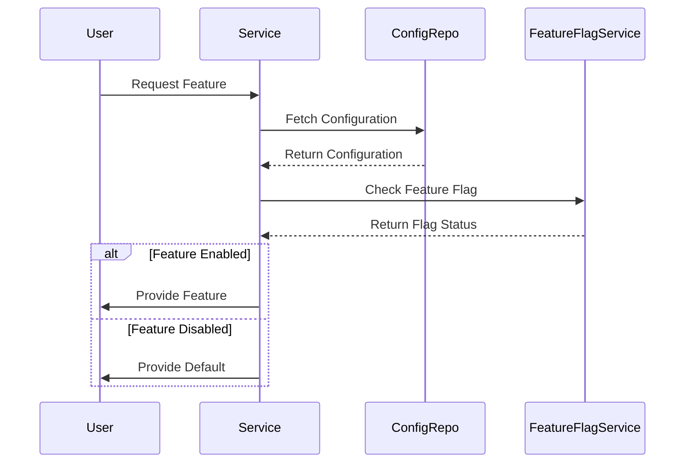

## 11.16 Configuration Management and Feature Flags

In the world of microservices, managing configurations and controlling feature availability are crucial for maintaining flexibility and adaptability. This section delves into the intricacies of configuration management and feature flags within Haskell microservices, providing expert insights and practical examples.

### Configuration Management

Configuration management involves handling dynamic configurations for services, allowing them to adapt to changing environments without requiring redeployment. This is especially important in microservices architectures, where services need to be independently configurable.

#### Key Concepts

- **Dynamic Configuration**: The ability to change configuration settings at runtime without restarting the service.
- **Centralized Configuration**: Storing configuration data in a central repository to ensure consistency across services.
- **Environment-Specific Configuration**: Tailoring configurations for different environments (e.g., development, testing, production).

#### Implementation Strategies

1. **Environment Variables**: Use environment variables to manage configuration settings. This is a simple and effective method for injecting configuration data into your application.

2. **Configuration Files**: Store configuration data in files (e.g., YAML, JSON) that can be read at runtime. This approach allows for more complex configurations and is easily version-controlled.

3. **Configuration Management Tools**: Utilize tools like Consul, etcd, or Zookeeper to manage configurations centrally. These tools provide APIs for accessing configuration data and can handle dynamic updates.

4. **Haskell Libraries**: Leverage Haskell libraries such as `configurator` or `aeson` for parsing and managing configuration data.

#### Code Example: Reading Configuration from a File

```haskell
{-# LANGUAGE OverloadedStrings #-}

import Data.Aeson (decode, Value)
import qualified Data.ByteString.Lazy as B

-- Function to read configuration from a JSON file
readConfig :: FilePath -> IO (Maybe Value)
readConfig filePath = do
    content <- B.readFile filePath
    return $ decode content

main :: IO ()
main = do
    config <- readConfig "config.json"
    case config of
        Just cfg -> putStrLn $ "Configuration loaded: " ++ show cfg
        Nothing  -> putStrLn "Failed to load configuration."
```

In this example, we use the `aeson` library to decode a JSON configuration file. This approach allows for flexible and structured configuration management.

### Feature Flags

Feature flags (also known as feature toggles) enable you to control the availability of features without redeploying your application. This is particularly useful for A/B testing, gradual rollouts, and canary releases.

#### Key Concepts

- **Toggle Points**: Specific locations in the code where feature flags are checked to determine feature availability.
- **Flag Types**: Different types of flags, such as release toggles, experiment toggles, and operational toggles.
- **Flag Management**: Tools and libraries for managing feature flags, including remote configuration and dynamic updates.

#### Implementation Strategies

1. **Boolean Flags**: Use simple boolean flags to enable or disable features. This is the most straightforward approach but can become cumbersome with many flags.

2. **Configuration-Driven Flags**: Store feature flags in configuration files or environment variables, allowing for easy updates without code changes.

3. **Feature Flag Services**: Use external services like LaunchDarkly or Unleash to manage feature flags. These services provide dashboards and APIs for controlling flags dynamically.

4. **Haskell Libraries**: Utilize Haskell libraries such as `toggle` or `feature-flags` to implement feature flags in your application.

#### Code Example: Implementing Feature Flags

```haskell
{-# LANGUAGE OverloadedStrings #-}

import Data.Aeson (decode, Value)
import qualified Data.ByteString.Lazy as B
import Data.Maybe (fromMaybe)

-- Function to read feature flags from a JSON file
readFeatureFlags :: FilePath -> IO (Maybe Value)
readFeatureFlags filePath = do
    content <- B.readFile filePath
    return $ decode content

-- Function to check if a feature is enabled
isFeatureEnabled :: String -> Value -> Bool
isFeatureEnabled featureName flags =
    fromMaybe False (lookup featureName flags)

main :: IO ()
main = do
    flags <- readFeatureFlags "feature_flags.json"
    case flags of
        Just f -> do
            let newFeatureEnabled = isFeatureEnabled "newFeature" f
            if newFeatureEnabled
                then putStrLn "New feature is enabled!"
                else putStrLn "New feature is disabled."
        Nothing -> putStrLn "Failed to load feature flags."
```

This example demonstrates how to read feature flags from a JSON file and check their status at runtime. This approach allows for flexible feature management without code changes.

### Visualizing Configuration Management and Feature Flags

To better understand the flow of configuration management and feature flags, let's visualize the process using a sequence diagram.



This diagram illustrates how a service fetches configuration data and checks feature flags before responding to a user request.

### Design Considerations

When implementing configuration management and feature flags, consider the following:

- **Consistency**: Ensure that configuration and feature flag data are consistent across all instances of a service.
- **Security**: Protect sensitive configuration data and feature flags from unauthorized access.
- **Performance**: Minimize the performance impact of fetching configuration and feature flag data.
- **Scalability**: Design your configuration and feature flag systems to scale with your application.

### Haskell Unique Features

Haskell's strong type system and functional programming paradigm offer unique advantages for configuration management and feature flags:

- **Type Safety**: Use Haskell's type system to ensure that configuration data is correctly structured and validated.
- **Immutability**: Leverage Haskell's immutable data structures to prevent accidental modification of configuration data.
- **Higher-Order Functions**: Utilize higher-order functions to create flexible and reusable feature flag checks.

### Differences and Similarities

Configuration management and feature flags are often confused with each other, but they serve distinct purposes:

- **Configuration Management**: Focuses on managing settings and parameters that affect the behavior of a service.
- **Feature Flags**: Focuses on controlling the availability of features within a service.

Both concepts can be implemented using similar tools and techniques, but they address different aspects of service management.

### Try It Yourself

To deepen your understanding, try modifying the code examples to:

- Add new configuration parameters and feature flags.
- Implement a feature flag that toggles between different implementations of a function.
- Experiment with different configuration formats (e.g., YAML, TOML).

### Knowledge Check

- What are the benefits of using centralized configuration management in microservices?
- How can feature flags be used to perform A/B testing?
- What are some common tools and libraries for managing configuration and feature flags in Haskell?

### Embrace the Journey

Remember, mastering configuration management and feature flags is just the beginning. As you progress, you'll build more resilient and adaptable microservices. Keep experimenting, stay curious, and enjoy the journey!

## Quiz: Configuration Management and Feature Flags



### What is the primary purpose of configuration management in microservices?

- [x] To handle dynamic configuration for services
- [ ] To control feature availability
- [ ] To manage user authentication
- [ ] To optimize database queries

> **Explanation:** Configuration management focuses on handling dynamic configurations for services, allowing them to adapt to changing environments without redeployment.

### Which of the following is a benefit of using feature flags?

- [x] Controlling the availability of features without redeploying
- [ ] Improving database performance
- [ ] Enhancing user interface design
- [ ] Reducing code complexity

> **Explanation:** Feature flags allow developers to control the availability of features without redeploying the application, enabling A/B testing and gradual rollouts.

### What is a common tool for centralized configuration management?

- [x] Consul
- [ ] Docker
- [ ] Kubernetes
- [ ] Git

> **Explanation:** Consul is a popular tool for centralized configuration management, providing APIs for accessing configuration data and handling dynamic updates.

### How can Haskell's type system benefit configuration management?

- [x] By ensuring configuration data is correctly structured and validated
- [ ] By improving runtime performance
- [ ] By simplifying user interface design
- [ ] By reducing memory usage

> **Explanation:** Haskell's strong type system ensures that configuration data is correctly structured and validated, reducing the risk of errors.

### What is the role of a feature flag service?

- [x] To manage feature flags and provide APIs for controlling them
- [ ] To optimize database queries
- [ ] To enhance user authentication
- [ ] To improve network security

> **Explanation:** A feature flag service manages feature flags and provides APIs for controlling them, allowing for dynamic updates and centralized management.

### Which Haskell library can be used for parsing JSON configuration files?

- [x] Aeson
- [ ] Conduit
- [ ] Warp
- [ ] Hspec

> **Explanation:** The `aeson` library is commonly used in Haskell for parsing JSON data, making it suitable for reading JSON configuration files.

### What is a toggle point in the context of feature flags?

- [x] A location in the code where feature flags are checked
- [ ] A point where database queries are optimized
- [ ] A point where user authentication is verified
- [ ] A point where network security is enhanced

> **Explanation:** A toggle point is a specific location in the code where feature flags are checked to determine feature availability.

### What is the advantage of using environment variables for configuration management?

- [x] They allow for easy injection of configuration data into the application
- [ ] They improve database performance
- [ ] They enhance user interface design
- [ ] They reduce code complexity

> **Explanation:** Environment variables allow for easy injection of configuration data into the application, making them a simple and effective method for managing configurations.

### How do feature flags support A/B testing?

- [x] By allowing different features to be enabled for different user groups
- [ ] By optimizing database queries
- [ ] By enhancing user authentication
- [ ] By improving network security

> **Explanation:** Feature flags support A/B testing by allowing different features to be enabled for different user groups, enabling experimentation and analysis.

### True or False: Configuration management and feature flags serve the same purpose.

- [ ] True
- [x] False

> **Explanation:** Configuration management and feature flags serve different purposes. Configuration management focuses on handling settings and parameters, while feature flags control feature availability.


