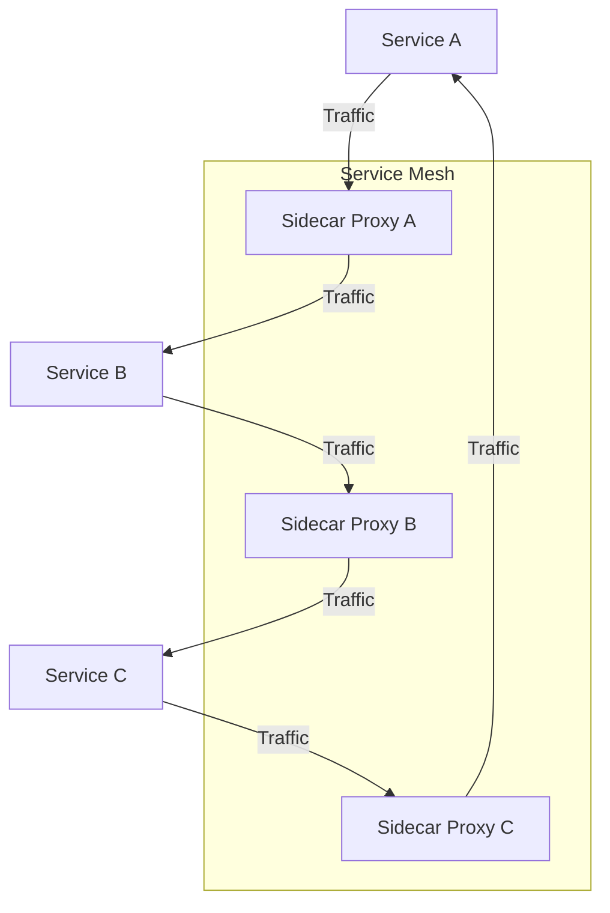

## 11.17 Service Mesh and Networking Patterns

As we delve into the world of microservices, one of the most critical aspects to consider is the communication between services. In a microservices architecture, services need to communicate with each other efficiently and securely. This is where a **Service Mesh** comes into play. In this section, we will explore what a service mesh is, how it can be implemented using tools like **Istio** or **Linkerd**, and how Haskell services can be integrated into a service mesh to enhance observability and security.

### What is a Service Mesh?

A **Service Mesh** is an infrastructure layer that manages service-to-service communication within a microservices architecture. It provides a way to control how different parts of an application share data with one another. The service mesh is responsible for the reliable delivery of requests through the complex topology of services that comprise a modern, cloud-native application.

#### Key Features of a Service Mesh

- **Traffic Management**: Control the flow of traffic and API calls between services, making it easier to manage complex deployments.
- **Security**: Implement security policies, such as mutual TLS, to secure service-to-service communication.
- **Observability**: Gain insights into the performance of services through metrics, logs, and traces.
- **Resilience**: Implement patterns like retries, timeouts, and circuit breakers to make services more resilient.

### Implementing a Service Mesh

To implement a service mesh, we typically use tools like **Istio** or **Linkerd**. These tools provide the necessary components to manage service communication effectively.

#### Istio

**Istio** is an open-source service mesh that provides a uniform way to secure, connect, and observe microservices. It is designed to work with Kubernetes but can be adapted to other environments.

- **Architecture**: Istio's architecture consists of a data plane and a control plane. The data plane is implemented by Envoy proxies deployed as sidecars alongside each service. The control plane manages and configures the proxies to route traffic.
- **Features**: Istio offers features like traffic management, security, observability, and policy enforcement.

#### Linkerd

**Linkerd** is another popular service mesh that focuses on simplicity and performance. It is lightweight and easy to deploy, making it a good choice for smaller applications or teams.

- **Architecture**: Linkerd also uses a sidecar proxy model but is designed to be more lightweight than Istio.
- **Features**: Linkerd provides automatic service discovery, load balancing, failure handling, and observability.

### Haskell Integration with Service Mesh

Integrating Haskell services into a service mesh involves configuring the Haskell applications to communicate through the mesh's proxies. This typically involves setting up the necessary sidecar containers and configuring the Haskell applications to use the service mesh's features.

#### Configuring Haskell Services

1. **Sidecar Proxy**: Deploy a sidecar proxy (such as Envoy or Linkerd's proxy) alongside each Haskell service. This proxy will handle all incoming and outgoing traffic for the service.
2. **Service Discovery**: Configure the Haskell service to register with the service mesh's service discovery mechanism. This allows the service mesh to route traffic to the correct service instances.
3. **Security**: Implement mutual TLS between services to ensure secure communication. This can be configured through the service mesh's control plane.
4. **Observability**: Use the service mesh's observability features to collect metrics, logs, and traces from the Haskell services.

#### Example: Enhancing Observability and Security

Let's consider an example where we have a Haskell microservice architecture with multiple services. We want to enhance observability and security using a service mesh.

```haskell
{-# LANGUAGE OverloadedStrings #-}

module Main where

import Network.HTTP.Client (newManager, defaultManagerSettings)
import Servant
import Servant.Client

-- Define a simple API
type API = "hello" :> Get '[PlainText] String

-- Implement the server
server :: Server API
server = return "Hello, World!"

-- Create a WAI application
app :: Application
app = serve (Proxy :: Proxy API) server

main :: IO ()
main = do
    -- Set up the HTTP manager
    manager <- newManager defaultManagerSettings

    -- Run the application
    run 8080 app
```

In this example, we have a simple Haskell service using the Servant library. To integrate this service into a service mesh, we would deploy it alongside a sidecar proxy and configure the proxy to handle traffic for the service.

### Visualizing Service Mesh Architecture

To better understand how a service mesh works, let's visualize the architecture using a diagram.



**Diagram Description**: This diagram illustrates a simple service mesh architecture with three services (A, B, and C). Each service is paired with a sidecar proxy that handles traffic routing and management.

### Design Considerations

When implementing a service mesh, there are several design considerations to keep in mind:

- **Performance Overhead**: The addition of sidecar proxies can introduce latency and resource overhead. It's important to monitor and optimize the performance of the service mesh.
- **Complexity**: A service mesh adds complexity to the architecture. Ensure that your team is familiar with the tools and concepts involved.
- **Security**: While a service mesh can enhance security, it also introduces new attack vectors. Regularly audit and update your security policies.

### Haskell Unique Features

Haskell's strong type system and functional programming paradigm make it well-suited for building reliable and maintainable microservices. When integrating with a service mesh, Haskell's features can be leveraged to ensure type-safe communication and robust error handling.

### Differences and Similarities

Service meshes are often compared to API gateways. While both manage service communication, a service mesh operates at the network layer and provides more granular control over service-to-service communication. An API gateway, on the other hand, typically handles external client requests and provides a single entry point to the system.

### Try It Yourself

To experiment with service meshes in Haskell, try deploying a simple Haskell service with a service mesh like Istio or Linkerd. Modify the service to use the service mesh's features, such as traffic management or observability, and observe the impact on the service's performance and security.

### Knowledge Check

- What is a service mesh, and what are its key features?
- How does Istio differ from Linkerd in terms of architecture and features?
- What are the steps involved in integrating a Haskell service into a service mesh?
- How can a service mesh enhance the observability and security of a microservices architecture?

### Embrace the Journey

Remember, integrating a service mesh into your architecture is just the beginning. As you progress, you'll discover new ways to optimize and secure your microservices. Keep experimenting, stay curious, and enjoy the journey!

## Quiz: Service Mesh and Networking Patterns



### What is a primary function of a service mesh?

- [x] Manage service-to-service communication
- [ ] Provide a single entry point for external requests
- [ ] Store service configurations
- [ ] Handle database connections

> **Explanation:** A service mesh primarily manages service-to-service communication within a microservices architecture.

### Which tool is commonly used to implement a service mesh?

- [x] Istio
- [ ] Docker
- [ ] Kubernetes
- [ ] Terraform

> **Explanation:** Istio is a popular tool used to implement a service mesh.

### What is a sidecar proxy in the context of a service mesh?

- [x] A proxy deployed alongside each service to handle traffic
- [ ] A central server managing all service communications
- [ ] A database for storing service logs
- [ ] A tool for deploying services

> **Explanation:** A sidecar proxy is deployed alongside each service to handle incoming and outgoing traffic.

### How does a service mesh enhance security?

- [x] By implementing mutual TLS between services
- [ ] By encrypting database connections
- [ ] By providing a firewall for external threats
- [ ] By storing passwords securely

> **Explanation:** A service mesh enhances security by implementing mutual TLS between services for secure communication.

### What is a key difference between a service mesh and an API gateway?

- [x] A service mesh operates at the network layer, while an API gateway handles external requests
- [ ] A service mesh stores service configurations, while an API gateway manages databases
- [ ] A service mesh is used for deployment, while an API gateway is used for monitoring
- [ ] A service mesh is a type of database, while an API gateway is a type of server

> **Explanation:** A service mesh operates at the network layer to manage service-to-service communication, while an API gateway handles external client requests.

### What is the role of observability in a service mesh?

- [x] To gain insights into the performance of services
- [ ] To store service configurations
- [ ] To manage service deployments
- [ ] To encrypt service data

> **Explanation:** Observability in a service mesh provides insights into the performance of services through metrics, logs, and traces.

### Which feature is NOT typically provided by a service mesh?

- [ ] Traffic management
- [ ] Security
- [ ] Observability
- [x] Database management

> **Explanation:** A service mesh does not typically manage databases; it focuses on service-to-service communication.

### What is mutual TLS?

- [x] A security protocol for encrypting communication between services
- [ ] A method for storing service logs
- [ ] A tool for deploying services
- [ ] A database encryption technique

> **Explanation:** Mutual TLS is a security protocol used to encrypt communication between services in a service mesh.

### How can Haskell's type system benefit a service mesh integration?

- [x] By ensuring type-safe communication and robust error handling
- [ ] By storing service configurations
- [ ] By managing service deployments
- [ ] By encrypting service data

> **Explanation:** Haskell's strong type system ensures type-safe communication and robust error handling, which benefits service mesh integration.

### True or False: A service mesh can introduce performance overhead.

- [x] True
- [ ] False

> **Explanation:** The addition of sidecar proxies in a service mesh can introduce latency and resource overhead.




