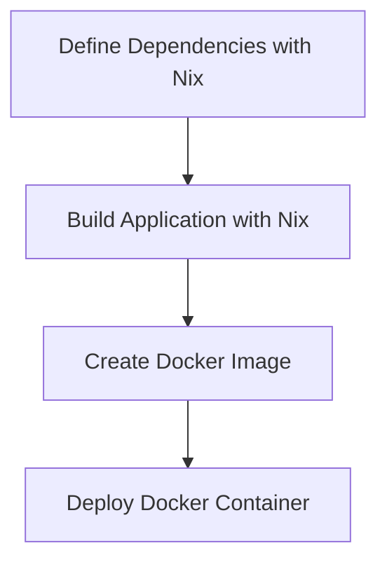

## 11.18 Containerization and Deployment with Nix and Docker

In the modern software development landscape, containerization has become a cornerstone for deploying applications consistently across various environments. This section delves into the integration of Nix and Docker for containerizing and deploying Haskell microservices. We will explore how these tools complement each other to provide a robust solution for managing dependencies and ensuring reproducibility.

### Understanding Containerization

Containerization is the process of packaging an application and its dependencies into a standardized unit, known as a container. This approach ensures that the application runs consistently regardless of the environment in which it is deployed. Containers are lightweight, portable, and provide isolation, making them ideal for microservices architectures.

### Nix: A Purely Functional Package Manager

Nix is a powerful package manager that uses a purely functional approach to build and manage software. It ensures that builds are reproducible and isolated, meaning that the same build process will always produce the same result, regardless of the environment. This is achieved by describing the build process in a declarative manner using Nix expressions.

#### Key Features of Nix

- **Reproducibility**: Guarantees that builds are consistent across different environments.
- **Isolation**: Each package is built in a sandbox, preventing interference from other packages.
- **Rollbacks**: Allows easy rollback to previous versions of packages.
- **Declarative Configuration**: Uses Nix expressions to define the build process.

### Docker: Platform for Containerization

Docker is a platform that enables developers to build, ship, and run applications in containers. It abstracts the underlying infrastructure, allowing applications to be deployed consistently across different environments. Docker containers are lightweight and can be easily orchestrated using tools like Kubernetes.

#### Key Features of Docker

- **Portability**: Containers can run on any system that supports Docker.
- **Isolation**: Each container runs in its own isolated environment.
- **Scalability**: Easily scale applications by running multiple containers.
- **Efficient Resource Utilization**: Containers share the host OS kernel, reducing overhead.

### Combining Nix and Docker

By combining Nix and Docker, we can leverage the strengths of both tools to create a powerful solution for deploying Haskell microservices. Nix ensures that our builds are reproducible and isolated, while Docker provides a consistent runtime environment for our applications.

#### Workflow Overview

1. **Define Dependencies with Nix**: Use Nix to manage and build the dependencies for your Haskell application.
2. **Build the Application**: Use Nix to build the application in a reproducible manner.
3. **Create a Docker Image**: Use Docker to package the built application into a container.
4. **Deploy the Container**: Deploy the Docker container to your desired environment.

### Implementation: Building and Deploying Haskell Microservices

Let's walk through the process of building and deploying a Haskell microservice using Nix and Docker. We'll use a simple Haskell web application as an example.

#### Step 1: Define Dependencies with Nix

First, we need to define the dependencies for our Haskell application using a Nix expression. Create a file named `default.nix`:

```nix
{ pkgs ? import <nixpkgs> {} }:

pkgs.haskellPackages.callCabal2nix "my-haskell-app" ./. {}
```

This Nix expression specifies that we want to build a Haskell application using the `callCabal2nix` function, which generates a Nix expression from a Cabal file.

#### Step 2: Build the Application

Next, we build the application using Nix. Run the following command:

```bash
nix-build
```

This command will build the application and its dependencies in an isolated environment, ensuring that the build is reproducible.

#### Step 3: Create a Docker Image

Once the application is built, we can create a Docker image. Create a `Dockerfile`:

```dockerfile
FROM ubuntu:20.04

# Install Nix
RUN apt-get update && \
    apt-get install -y curl && \
    curl -L https://nixos.org/nix/install | sh

# Copy the built application
COPY result/bin/my-haskell-app /usr/local/bin/my-haskell-app

# Set the entrypoint
ENTRYPOINT ["/usr/local/bin/my-haskell-app"]
```

Build the Docker image:

```bash
docker build -t my-haskell-app .
```

#### Step 4: Deploy the Container

Finally, deploy the Docker container:

```bash
docker run -p 8080:8080 my-haskell-app
```

This command runs the container and maps port 8080 on the host to port 8080 in the container, allowing us to access the application.

### Visualizing the Workflow

To better understand the workflow, let's visualize the process using a Mermaid.js diagram:



This diagram illustrates the steps involved in building and deploying a Haskell microservice using Nix and Docker.

### Design Considerations

When using Nix and Docker together, consider the following:

- **Reproducibility**: Ensure that your Nix expressions are well-defined to guarantee reproducible builds.
- **Security**: Use Docker's security features to isolate containers and limit their access to the host system.
- **Performance**: Optimize your Docker images by minimizing their size and using multi-stage builds if necessary.
- **Scalability**: Consider using orchestration tools like Kubernetes to manage and scale your containers.

### Haskell Unique Features

Haskell's strong type system and functional programming paradigm make it well-suited for building reliable and maintainable microservices. When combined with Nix and Docker, Haskell applications can be deployed consistently and efficiently.

### Differences and Similarities

While both Nix and Docker provide isolation, they do so at different levels. Nix focuses on build-time isolation, ensuring that builds are reproducible and independent of the host environment. Docker, on the other hand, provides runtime isolation, allowing applications to run consistently across different environments.

### Try It Yourself

To deepen your understanding, try modifying the example to include additional dependencies or change the application logic. Experiment with different Docker configurations, such as using multi-stage builds to optimize the image size.

### References and Further Reading

- [Nix Package Manager](https://nixos.org/)
- [Docker](https://www.docker.com/)
- [Haskell](https://www.haskell.org/)
- [Kubernetes](https://kubernetes.io/)

### Knowledge Check

- What are the benefits of using Nix for managing dependencies?
- How does Docker ensure consistent deployment across environments?
- What are some design considerations when using Nix and Docker together?

### Embrace the Journey

Remember, mastering containerization and deployment is a journey. As you gain experience, you'll discover more advanced techniques and optimizations. Keep experimenting, stay curious, and enjoy the process of building and deploying robust Haskell microservices.

## Quiz: Containerization and Deployment with Nix and Docker



### What is the primary benefit of using Nix for managing dependencies in Haskell applications?

- [x] Reproducibility of builds
- [ ] Faster build times
- [ ] Larger package ecosystem
- [ ] Easier syntax

> **Explanation:** Nix ensures that builds are reproducible, meaning the same build process will always produce the same result, regardless of the environment.

### How does Docker provide isolation for applications?

- [x] By running each application in its own container
- [ ] By using virtual machines
- [ ] By using a separate operating system for each application
- [ ] By using a different programming language

> **Explanation:** Docker containers provide isolation by running each application in its own container, which shares the host OS kernel but is otherwise isolated.

### What is the purpose of a Dockerfile?

- [x] To define the steps to build a Docker image
- [ ] To manage dependencies
- [ ] To configure the host system
- [ ] To deploy applications

> **Explanation:** A Dockerfile contains instructions on how to build a Docker image, including installing dependencies and copying application files.

### Which tool can be used to orchestrate Docker containers?

- [x] Kubernetes
- [ ] Nix
- [ ] Cabal
- [ ] Stack

> **Explanation:** Kubernetes is a popular tool for orchestrating Docker containers, allowing for scaling and managing containerized applications.

### What is a key difference between Nix and Docker?

- [x] Nix focuses on build-time isolation, Docker on runtime isolation
- [ ] Nix is faster than Docker
- [ ] Docker is only for Haskell applications
- [ ] Nix is a containerization platform

> **Explanation:** Nix provides build-time isolation to ensure reproducible builds, while Docker provides runtime isolation for consistent application deployment.

### What is the role of the `ENTRYPOINT` instruction in a Dockerfile?

- [x] To specify the command that runs when the container starts
- [ ] To install dependencies
- [ ] To build the application
- [ ] To define environment variables

> **Explanation:** The `ENTRYPOINT` instruction in a Dockerfile specifies the command that should be executed when the container starts.

### How can you optimize Docker images for better performance?

- [x] By minimizing image size and using multi-stage builds
- [ ] By using larger base images
- [ ] By including all dependencies in a single layer
- [ ] By avoiding the use of `ENTRYPOINT`

> **Explanation:** Optimizing Docker images involves minimizing their size and using multi-stage builds to reduce unnecessary layers.

### What is a benefit of using containers for microservices?

- [x] Portability across different environments
- [ ] Increased memory usage
- [ ] Slower startup times
- [ ] Dependency on specific hardware

> **Explanation:** Containers provide portability, allowing microservices to run consistently across different environments without modification.

### What does the `nix-build` command do?

- [x] Builds the application and its dependencies in an isolated environment
- [ ] Deploys the application to production
- [ ] Creates a Docker image
- [ ] Installs system updates

> **Explanation:** The `nix-build` command builds the application and its dependencies in an isolated environment, ensuring reproducibility.

### True or False: Docker containers can only run on Linux systems.

- [ ] True
- [x] False

> **Explanation:** Docker containers can run on any system that supports Docker, including Windows and macOS, through the use of a compatible runtime.




