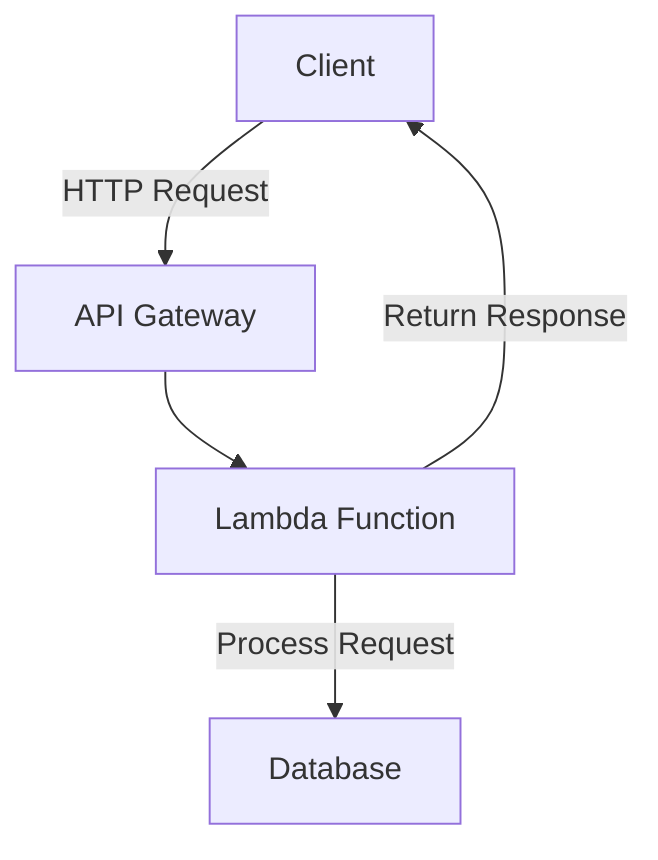

## 11.19 Cloud-Native and Serverless Patterns

In this section, we delve into the world of cloud-native and serverless patterns, focusing on how Haskell can be leveraged to build scalable, efficient, and resilient applications. As expert software engineers and architects, understanding these patterns is crucial for designing systems that can effectively utilize modern cloud services.

### Cloud-Native Architecture

Cloud-native architecture is about designing applications that fully exploit the capabilities of cloud computing. This involves creating systems that are scalable, resilient, and manageable. Let's explore the key principles and patterns that define cloud-native architecture.

#### Key Principles of Cloud-Native Architecture

1. **Microservices**: Break down applications into small, independent services that can be developed, deployed, and scaled independently.
2. **Containerization**: Use containers to package microservices, ensuring consistency across different environments.
3. **Continuous Integration/Continuous Deployment (CI/CD)**: Automate the build, test, and deployment processes to enable rapid iteration and delivery.
4. **DevOps Culture**: Foster collaboration between development and operations teams to streamline processes and improve efficiency.
5. **Scalability and Resilience**: Design systems to automatically scale and recover from failures.

#### Cloud-Native Patterns

- **Service Discovery**: Automatically detect and connect services within a cloud environment.
- **API Gateway**: Manage and route requests to various microservices.
- **Circuit Breaker**: Prevent cascading failures by stopping requests to a failing service.
- **Sidecar Pattern**: Extend and enhance the capabilities of a service without modifying its code.

### Serverless Computing

Serverless computing allows developers to build applications without managing server infrastructure. This paradigm shifts the focus from infrastructure management to code execution, enabling faster development and deployment.

#### Key Concepts of Serverless Computing

1. **Function as a Service (FaaS)**: Deploy individual functions that execute in response to events.
2. **Event-Driven Architecture**: Trigger functions based on events such as HTTP requests, database changes, or message queue updates.
3. **Automatic Scaling**: Functions automatically scale based on demand, ensuring efficient resource utilization.
4. **Pay-per-Use**: Only pay for the compute time consumed by the functions, reducing costs.

#### Serverless Patterns

- **Event-Driven Functions**: Write functions that respond to specific events, such as file uploads or database updates.
- **Backend for Frontend (BFF)**: Create serverless functions tailored to the needs of specific client applications.
- **Function Composition**: Chain multiple functions together to create complex workflows.

### Implementation with Haskell

Haskell, with its strong type system and functional programming paradigm, is well-suited for building cloud-native and serverless applications. Let's explore how to implement these patterns using Haskell on platforms like AWS Lambda and Google Cloud Functions.

#### Setting Up Haskell for Serverless

To deploy Haskell functions on serverless platforms, we need to package and deploy our code in a way that the platform can execute it. Here's a step-by-step guide to setting up Haskell for serverless deployment:

1. **Install Haskell Toolchain**: Ensure you have GHC (Glasgow Haskell Compiler) and Cabal or Stack installed.
2. **Create a Haskell Project**: Use Cabal or Stack to initialize a new Haskell project.
3. **Write Your Function**: Implement the logic of your serverless function in Haskell.
4. **Package the Function**: Use tools like `zip` or `docker` to package your Haskell code and its dependencies.
5. **Deploy to Serverless Platform**: Use AWS CLI or Google Cloud SDK to deploy your packaged function to the cloud.

#### Example: Writing a Haskell Function for AWS Lambda

Let's write a simple Haskell function that responds to an HTTP request on AWS Lambda.

```haskell
{-# LANGUAGE OverloadedStrings #-}

module Main where

import qualified Data.ByteString.Lazy.Char8 as BL
import Network.AWS.Lambda

-- Define the handler function
handler :: BL.ByteString -> IO (Either String BL.ByteString)
handler input = do
    let response = "Hello, Haskell on AWS Lambda!"
    return $ Right (BL.pack response)

main :: IO ()
main = runLambda handler
```

**Explanation**:
- We define a `handler` function that takes a `ByteString` as input and returns a response wrapped in an `Either` type.
- The `runLambda` function from the `Network.AWS.Lambda` library is used to execute the handler on AWS Lambda.

#### Deploying the Function

1. **Build the Function**: Compile the Haskell code into an executable.
2. **Package the Executable**: Create a ZIP file containing the executable and any necessary libraries.
3. **Upload to AWS Lambda**: Use the AWS CLI to create a new Lambda function and upload the ZIP file.

```bash
aws lambda create-function --function-name HelloHaskell \
--zip-file fileb://function.zip --handler function.handler \
--runtime provided --role arn:aws:iam::123456789012:role/execution_role
```

### Visualizing Cloud-Native and Serverless Architecture

To better understand the architecture of cloud-native and serverless applications, let's visualize the components and their interactions.



**Diagram Explanation**:
- The client sends an HTTP request to the API Gateway.
- The API Gateway routes the request to the appropriate Lambda function.
- The Lambda function processes the request, interacts with a database if necessary, and returns a response to the client.

### Haskell Unique Features

Haskell's unique features, such as its strong type system, immutability, and lazy evaluation, make it an excellent choice for cloud-native and serverless applications. These features help ensure that applications are reliable, maintainable, and efficient.

- **Strong Typing**: Catch errors at compile time, reducing runtime failures.
- **Immutability**: Ensure data consistency and thread safety without locks.
- **Lazy Evaluation**: Optimize resource usage by evaluating expressions only when needed.

### Differences and Similarities with Other Patterns

Cloud-native and serverless patterns share similarities with traditional design patterns but also have distinct differences:

- **Similarities**: Both focus on modularity, scalability, and reusability.
- **Differences**: Cloud-native and serverless patterns emphasize event-driven architectures and infrastructure abstraction.

### Design Considerations

When implementing cloud-native and serverless patterns, consider the following:

- **Latency**: Minimize latency by optimizing function execution and data access.
- **Security**: Implement robust authentication and authorization mechanisms.
- **Cost Management**: Monitor and optimize resource usage to control costs.

### Try It Yourself

Experiment with the provided Haskell function by modifying the response message or adding additional logic. Deploy the modified function to AWS Lambda and observe the changes in behavior.

### Knowledge Check

- What are the key principles of cloud-native architecture?
- How does serverless computing differ from traditional server-based architectures?
- What are the benefits of using Haskell for cloud-native and serverless applications?

### Embrace the Journey

Remember, this is just the beginning of your journey into cloud-native and serverless patterns with Haskell. As you progress, you'll build more complex and efficient applications. Keep experimenting, stay curious, and enjoy the journey!

## Quiz: Cloud-Native and Serverless Patterns



### What is a key principle of cloud-native architecture?

- [x] Microservices
- [ ] Monolithic design
- [ ] Manual scaling
- [ ] Fixed infrastructure

> **Explanation:** Microservices are a fundamental principle of cloud-native architecture, allowing for independent development and scaling of services.

### How does serverless computing differ from traditional server-based architectures?

- [x] It abstracts server management.
- [ ] It requires manual server provisioning.
- [ ] It is more expensive.
- [ ] It does not support event-driven architectures.

> **Explanation:** Serverless computing abstracts server management, allowing developers to focus on code rather than infrastructure.

### Which Haskell feature is beneficial for cloud-native applications?

- [x] Strong typing
- [ ] Weak typing
- [ ] Mutable state
- [ ] Manual memory management

> **Explanation:** Haskell's strong typing helps catch errors at compile time, making applications more reliable.

### What is the role of an API Gateway in cloud-native architecture?

- [x] Manage and route requests to microservices
- [ ] Store application data
- [ ] Execute serverless functions
- [ ] Monitor application performance

> **Explanation:** An API Gateway manages and routes requests to various microservices in a cloud-native architecture.

### What is a benefit of using Haskell for serverless applications?

- [x] Immutability ensures data consistency.
- [ ] Requires more memory.
- [ ] Increases latency.
- [ ] Complicates deployment.

> **Explanation:** Haskell's immutability ensures data consistency and thread safety, which is beneficial for serverless applications.

### What is a common pattern in serverless computing?

- [x] Event-Driven Functions
- [ ] Monolithic Functions
- [ ] Manual Scaling
- [ ] Fixed Pricing

> **Explanation:** Event-Driven Functions are a common pattern in serverless computing, allowing functions to respond to specific events.

### Which tool is used to deploy Haskell functions to AWS Lambda?

- [x] AWS CLI
- [ ] Docker
- [ ] Kubernetes
- [ ] Terraform

> **Explanation:** The AWS CLI is used to deploy Haskell functions to AWS Lambda.

### What is a design consideration for serverless applications?

- [x] Minimize latency
- [ ] Increase server count
- [ ] Use fixed IP addresses
- [ ] Avoid event-driven architecture

> **Explanation:** Minimizing latency is a key design consideration for serverless applications to ensure fast response times.

### What is a benefit of serverless computing?

- [x] Automatic scaling
- [ ] Fixed resource allocation
- [ ] Manual server management
- [ ] Increased infrastructure costs

> **Explanation:** Serverless computing automatically scales functions based on demand, optimizing resource usage.

### True or False: Haskell's lazy evaluation can optimize resource usage in cloud-native applications.

- [x] True
- [ ] False

> **Explanation:** Haskell's lazy evaluation optimizes resource usage by evaluating expressions only when needed.


