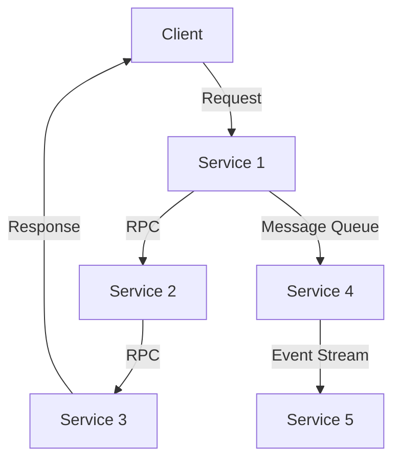
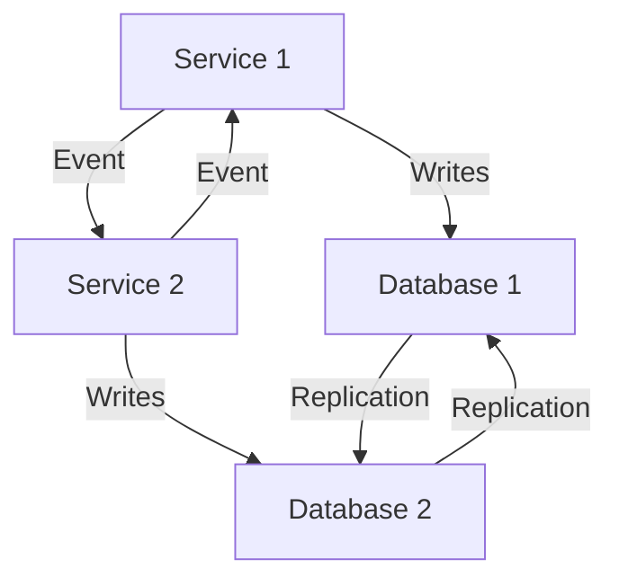
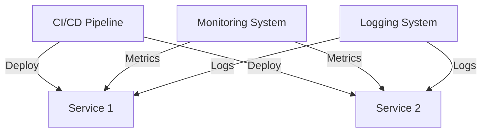

## 11.2 Challenges in Microservices Development

Microservices architecture has revolutionized the way we design and build software systems, offering unparalleled flexibility, scalability, and resilience. However, this architectural style also introduces a set of unique challenges that developers and architects must navigate. In this section, we will delve into the complexities of microservices development, focusing on three primary challenges: distributed systems complexity, data management, and operational overhead. We will also explore how Haskell, with its robust type system and functional programming paradigms, can help address these challenges.

### Distributed Systems Complexity

One of the most significant challenges in microservices development is managing the complexity inherent in distributed systems. Unlike monolithic architectures, where components are tightly coupled and run within a single process, microservices are distributed across multiple nodes and communicate over a network. This distribution introduces several complexities:

#### Handling Network Latency, Partial Failures, and Asynchrony

In a distributed system, network latency can significantly impact performance. Unlike local function calls, remote procedure calls (RPCs) involve network communication, which can be slow and unreliable. Moreover, microservices must handle partial failures gracefully, as one service's failure should not cascade and bring down the entire system.

**Asynchronous Communication**: To mitigate latency and improve resilience, microservices often rely on asynchronous communication patterns, such as message queues or event streams. However, this introduces additional complexity in ensuring message delivery, ordering, and handling retries.

**Code Example: Asynchronous Communication with Haskell**

```haskell
import Control.Concurrent.Async
import Control.Concurrent.STM
import Control.Monad

-- Simulate a microservice that processes messages asynchronously
processMessages :: TQueue String -> IO ()
processMessages queue = forever $ do
    message <- atomically $ readTQueue queue
    putStrLn $ "Processing message: " ++ message

main :: IO ()
main = do
    queue <- atomically newTQueue
    -- Start the message processing service
    async $ processMessages queue
    -- Simulate sending messages to the queue
    forM_ ["msg1", "msg2", "msg3"] $ \msg -> atomically $ writeTQueue queue msg
```

In this example, we use Haskell's `STM` (Software Transactional Memory) to manage a queue of messages processed asynchronously. The `async` library helps manage concurrent tasks, allowing us to simulate a microservice processing messages from a queue.

**Visualizing Distributed Systems Complexity**



*Caption: A typical microservices architecture with multiple services communicating via RPC and asynchronous messaging.*

### Data Management

Data management in microservices is another critical challenge. Unlike monolithic systems, where a single database can be used to maintain consistency, microservices often require decentralized data management strategies.

#### Ensuring Consistency Across Services

In a microservices architecture, each service typically owns its data, leading to potential consistency issues. Ensuring data consistency across services requires careful design and implementation of distributed transactions or eventual consistency models.

**Eventual Consistency**: Many microservices architectures embrace eventual consistency, where updates propagate asynchronously, and systems converge to a consistent state over time. This approach can be challenging to implement correctly, especially when dealing with complex business logic.

**Code Example: Eventual Consistency with Haskell**

```haskell
import Control.Concurrent.STM
import Control.Monad

-- Simulate a service that updates its state based on events
type State = TVar Int

updateState :: State -> Int -> STM ()
updateState state delta = modifyTVar' state (+ delta)

main :: IO ()
main = do
    state <- atomically $ newTVar 0
    -- Simulate receiving events and updating state
    forM_ [1, 2, 3] $ \event -> atomically $ updateState state event
    finalState <- atomically $ readTVar state
    putStrLn $ "Final state: " ++ show finalState
```

In this example, we use Haskell's `STM` to manage state updates in a concurrent environment, simulating eventual consistency by applying updates asynchronously.

**Visualizing Data Management in Microservices**



*Caption: Services managing their own databases and synchronizing state through events and replication.*

### Operational Overhead

Microservices introduce significant operational overhead compared to monolithic architectures. Managing, deploying, and monitoring a large number of services can be daunting.

#### Deployment, Monitoring, and Logging of Multiple Services

**Deployment Complexity**: Each microservice must be independently deployable, which requires sophisticated CI/CD pipelines and container orchestration tools like Kubernetes.

**Monitoring and Logging**: With many services running in production, monitoring and logging become critical for maintaining system health and diagnosing issues. Centralized logging and distributed tracing are essential for gaining insights into system behavior.

**Code Example: Logging in Haskell Microservices**

```haskell
import System.Log.Logger

-- Set up logging for a microservice
setupLogging :: IO ()
setupLogging = do
    updateGlobalLogger "Microservice" (setLevel INFO)

logInfo :: String -> IO ()
logInfo msg = infoM "Microservice" msg

main :: IO ()
main = do
    setupLogging
    logInfo "Microservice started"
    -- Simulate service operations
    logInfo "Processing request"
    logInfo "Request processed successfully"
```

In this example, we use Haskell's `System.Log.Logger` to set up logging for a microservice, demonstrating how to log informational messages.

**Visualizing Operational Overhead**



*Caption: A CI/CD pipeline deploying services and centralized systems for monitoring and logging.*

### Haskell's Role in Addressing Microservices Challenges

Haskell offers several features that can help address the challenges of microservices development:

- **Strong Static Typing**: Haskell's type system can catch many errors at compile time, reducing runtime failures and improving reliability.
- **Immutability**: By default, Haskell promotes immutability, which simplifies reasoning about state changes and reduces the likelihood of bugs.
- **Concurrency and Parallelism**: Haskell's lightweight concurrency primitives, such as `STM` and `async`, make it easier to build scalable and responsive microservices.
- **Functional Paradigms**: Haskell's emphasis on pure functions and referential transparency facilitates the development of predictable and maintainable code.

### Conclusion

Microservices development presents a unique set of challenges, from managing distributed systems complexity to ensuring data consistency and handling operational overhead. By leveraging Haskell's strengths, developers can build robust and scalable microservices architectures. As you continue your journey in mastering microservices with Haskell, remember to embrace the functional paradigms and explore the rich ecosystem of libraries and tools available.

## Quiz: Challenges in Microservices Development



### Which of the following is a common challenge in microservices development?

- [x] Distributed systems complexity
- [ ] Centralized database management
- [ ] Single-threaded execution
- [ ] Lack of scalability

> **Explanation:** Distributed systems complexity is a common challenge due to network latency, partial failures, and asynchrony.


### What is a key benefit of using asynchronous communication in microservices?

- [x] Improved resilience
- [ ] Increased latency
- [ ] Simplified debugging
- [ ] Reduced code complexity

> **Explanation:** Asynchronous communication improves resilience by decoupling services and allowing them to operate independently.


### How does Haskell's type system help in microservices development?

- [x] Catches errors at compile time
- [ ] Increases runtime errors
- [ ] Simplifies dynamic typing
- [ ] Reduces code readability

> **Explanation:** Haskell's strong static typing catches many errors at compile time, reducing runtime failures.


### What is eventual consistency in microservices?

- [x] Updates propagate asynchronously, and systems converge to a consistent state over time
- [ ] Immediate consistency across all services
- [ ] Consistency only during system startup
- [ ] Consistency without any delays

> **Explanation:** Eventual consistency means updates propagate asynchronously, and systems eventually converge to a consistent state.


### Which Haskell feature simplifies reasoning about state changes?

- [x] Immutability
- [ ] Dynamic typing
- [ ] Mutable state
- [ ] Global variables

> **Explanation:** Immutability simplifies reasoning about state changes by ensuring that data cannot be modified once created.


### What is a common tool for managing microservices deployment?

- [x] Kubernetes
- [ ] FTP
- [ ] Telnet
- [ ] SSH

> **Explanation:** Kubernetes is a popular container orchestration tool used for managing microservices deployment.


### How does Haskell's `STM` help in microservices?

- [x] Manages concurrent state updates
- [ ] Increases network latency
- [ ] Simplifies synchronous communication
- [ ] Reduces code readability

> **Explanation:** Haskell's `STM` (Software Transactional Memory) helps manage concurrent state updates safely.


### What is a benefit of centralized logging in microservices?

- [x] Easier diagnosis of issues
- [ ] Increased storage costs
- [ ] Reduced system performance
- [ ] Simplified codebase

> **Explanation:** Centralized logging makes it easier to diagnose issues by aggregating logs from multiple services.


### Which of the following is NOT a challenge in microservices development?

- [x] Single-threaded execution
- [ ] Distributed systems complexity
- [ ] Data management
- [ ] Operational overhead

> **Explanation:** Single-threaded execution is not a challenge specific to microservices development.


### True or False: Haskell's functional paradigms facilitate the development of predictable and maintainable code.

- [x] True
- [ ] False

> **Explanation:** Haskell's functional paradigms, such as pure functions and referential transparency, facilitate the development of predictable and maintainable code.


