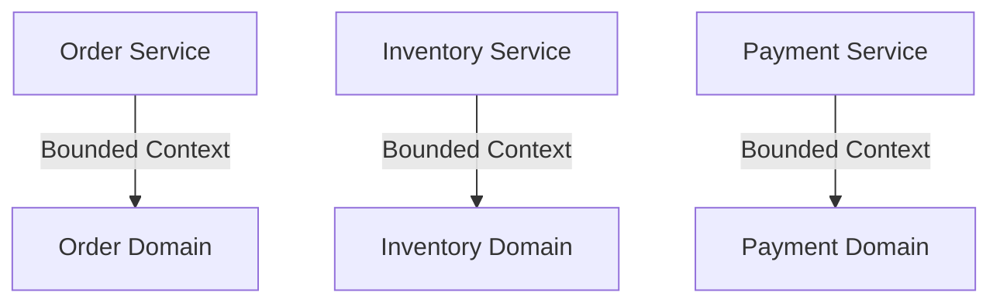

## 11.20 Best Practices for Microservices in Haskell

In the realm of modern software architecture, microservices have emerged as a powerful paradigm for building scalable, maintainable, and resilient systems. Haskell, with its strong type system, functional programming paradigm, and emphasis on immutability, offers unique advantages for implementing microservices. In this section, we will explore best practices for developing microservices in Haskell, focusing on service design, testing, monitoring, and practical implementation.

### 1. Service Design: Keeping Services Small and Focused

#### 1.1 Single Responsibility Principle

One of the core tenets of microservices architecture is the Single Responsibility Principle (SRP). Each microservice should be responsible for a single business capability. This ensures that services remain small, focused, and easier to maintain.

**Example:**

Consider a simple e-commerce application. Instead of having a monolithic service handling all operations, you can split it into distinct microservices such as:

- **Order Service**: Manages order creation and updates.
- **Inventory Service**: Tracks product stock levels.
- **Payment Service**: Handles payment processing.

#### 1.2 Bounded Contexts

Incorporate Domain-Driven Design (DDD) principles by defining bounded contexts. Each microservice should operate within its own bounded context, ensuring that it has a clear and well-defined domain model.

**Diagram: Bounded Contexts in Microservices**



#### 1.3 Communication Patterns

Microservices need to communicate efficiently. Choose appropriate communication patterns based on the use case:

- **Synchronous Communication**: Use HTTP/REST or gRPC for request-response interactions.
- **Asynchronous Communication**: Use message brokers like Kafka or RabbitMQ for event-driven architectures.

**Code Example: HTTP Communication with Servant**

```haskell
{-# LANGUAGE DataKinds #-}
{-# LANGUAGE TypeOperators #-}

import Servant

type API = "orders" :> Get '[JSON] [Order]

server :: Server API
server = return []

main :: IO ()
main = run 8080 (serve (Proxy :: Proxy API) server)
```

### 2. Testing: Writing Comprehensive Tests

#### 2.1 Unit Testing

Unit tests are essential for verifying the correctness of individual components. Use Haskell's testing libraries like Hspec or QuickCheck to write effective unit tests.

**Code Example: Unit Testing with Hspec**

```haskell
import Test.Hspec

main :: IO ()
main = hspec $ do
  describe "addition" $ do
    it "adds two numbers" $ do
      (1 + 1) `shouldBe` 2
```

#### 2.2 Integration Testing

Integration tests ensure that different services work together as expected. Use tools like Docker to spin up test environments with multiple services.

#### 2.3 Contract Testing

Contract tests verify that services adhere to agreed-upon interfaces. This is crucial in microservices to prevent breaking changes.

### 3. Monitoring: Implementing Logging, Metrics, and Health Checks

#### 3.1 Logging

Implement structured logging to capture important events and errors. Use libraries like `katip` for structured logging in Haskell.

**Code Example: Structured Logging with Katip**

```haskell
import Katip

main :: IO ()
main = do
  handleScribe <- mkHandleScribe ColorIfTerminal stdout (permitItem InfoS) V2
  let makeLogEnv = registerScribe "stdout" handleScribe defaultScribeSettings =<< initLogEnv "myapp" "production"
  bracket makeLogEnv closeScribes $ \le -> runKatipContextT le () mempty $ do
    logLocM InfoS "Application started"
```

#### 3.2 Metrics

Collect metrics to monitor the performance and health of your services. Use libraries like `ekg` for real-time metrics collection.

#### 3.3 Health Checks

Implement health checks to ensure that your services are running smoothly. Use HTTP endpoints to expose health status.

**Code Example: Health Check Endpoint**

```haskell
type HealthAPI = "health" :> Get '[JSON] HealthStatus

data HealthStatus = Healthy | Unhealthy deriving (Generic, ToJSON)

healthServer :: Server HealthAPI
healthServer = return Healthy
```

### 4. Example: Applying Best Practices in a Sample Microservices Application

Let's apply these best practices in a sample microservices application. We'll build a simple e-commerce system with order, inventory, and payment services.

#### 4.1 Order Service

The Order Service handles order creation and updates. It communicates with the Inventory Service to check stock levels.

**Code Example: Order Service**

```haskell
type OrderAPI = "orders" :> ReqBody '[JSON] Order :> Post '[JSON] OrderResponse

orderServer :: Server OrderAPI
orderServer = createOrder

createOrder :: Order -> Handler OrderResponse
createOrder order = do
  -- Check inventory
  stock <- checkInventory (orderProductId order)
  if stock > 0
    then return $ OrderResponse "Order created"
    else throwError err400 { errBody = "Out of stock" }
```

#### 4.2 Inventory Service

The Inventory Service tracks product stock levels and updates them when orders are placed.

**Code Example: Inventory Service**

```haskell
type InventoryAPI = "inventory" :> Capture "productId" Int :> Get '[JSON] Int

inventoryServer :: Server InventoryAPI
inventoryServer productId = return 10 -- Mocked stock level
```

#### 4.3 Payment Service

The Payment Service processes payments and updates order status.

**Code Example: Payment Service**

```haskell
type PaymentAPI = "payments" :> ReqBody '[JSON] Payment :> Post '[JSON] PaymentResponse

paymentServer :: Server PaymentAPI
paymentServer = processPayment

processPayment :: Payment -> Handler PaymentResponse
processPayment payment = return $ PaymentResponse "Payment successful"
```

### 5. Conclusion

By following these best practices, you can build robust, scalable, and maintainable microservices in Haskell. Remember to keep services small and focused, write comprehensive tests, and implement effective monitoring. As you continue your journey in microservices development, keep experimenting and refining your approach.

### Quiz: Best Practices for Microservices in Haskell



### What is the primary benefit of keeping microservices small and focused?

- [x] Easier maintenance and scalability
- [ ] Increased complexity
- [ ] Higher resource consumption
- [ ] Slower development

> **Explanation:** Keeping microservices small and focused ensures they are easier to maintain and scale.

### Which communication pattern is suitable for event-driven architectures?

- [ ] Synchronous communication
- [x] Asynchronous communication
- [ ] Direct communication
- [ ] Batch processing

> **Explanation:** Asynchronous communication, often using message brokers, is suitable for event-driven architectures.

### What is the purpose of contract testing in microservices?

- [x] To verify service interfaces
- [ ] To test individual components
- [ ] To measure performance
- [ ] To check code quality

> **Explanation:** Contract testing ensures that services adhere to agreed-upon interfaces, preventing breaking changes.

### Which Haskell library is used for structured logging?

- [ ] QuickCheck
- [ ] Hspec
- [x] Katip
- [ ] EKG

> **Explanation:** Katip is a Haskell library used for structured logging.

### What is the role of health checks in microservices?

- [x] To monitor service health
- [ ] To log errors
- [ ] To collect metrics
- [ ] To test performance

> **Explanation:** Health checks are used to monitor the health and status of services.

### How can you ensure that different microservices work together as expected?

- [ ] Unit testing
- [x] Integration testing
- [ ] Static analysis
- [ ] Code reviews

> **Explanation:** Integration testing ensures that different services work together as expected.

### Which library can be used for real-time metrics collection in Haskell?

- [ ] Servant
- [x] EKG
- [ ] Katip
- [ ] Hspec

> **Explanation:** EKG is a library used for real-time metrics collection in Haskell.

### What is the main advantage of using bounded contexts in microservices?

- [x] Clear domain boundaries
- [ ] Increased complexity
- [ ] Faster development
- [ ] Reduced testing

> **Explanation:** Bounded contexts provide clear domain boundaries, making services easier to manage.

### Which pattern is used for request-response interactions in microservices?

- [x] Synchronous communication
- [ ] Asynchronous communication
- [ ] Event sourcing
- [ ] CQRS

> **Explanation:** Synchronous communication is used for request-response interactions.

### True or False: Microservices should be designed to handle failures gracefully.

- [x] True
- [ ] False

> **Explanation:** Microservices should be designed to handle failures gracefully to ensure system resilience.



Remember, this is just the beginning. As you progress, you'll build more complex and interactive microservices. Keep experimenting, stay curious, and enjoy the journey!
