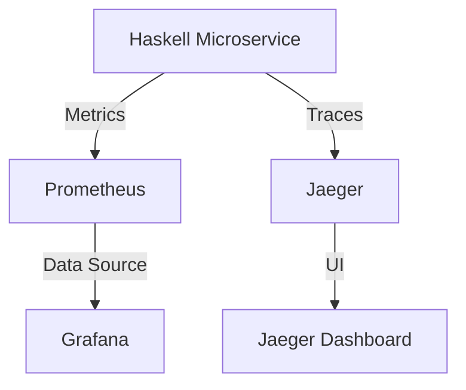

## 11.21 Monitoring and Observability in Microservices

In the realm of microservices, monitoring and observability are crucial for maintaining system health, diagnosing issues, and ensuring seamless operation. As systems grow in complexity, the need for robust observability tools becomes paramount. In this section, we will delve into the concepts of monitoring and observability, explore the tools available for Haskell applications, and provide practical examples to illustrate their implementation.

### Understanding Monitoring and Observability

**Monitoring** refers to the process of collecting, analyzing, and using data to track the performance and health of a system. It involves setting up alerts and dashboards to notify operators of potential issues.

**Observability**, on the other hand, is a broader concept that encompasses monitoring. It refers to the ability to infer the internal state of a system based on the data it produces, such as logs, metrics, and traces. Observability allows developers to understand how a system behaves and diagnose issues effectively.

#### Key Components of Observability

1. **Logs**: Textual records of events that occur within a system. Logs provide detailed insights into the operations and can be used for debugging and auditing.

2. **Metrics**: Quantitative measures that represent the state of a system over time. Metrics are used to monitor performance, resource usage, and other critical parameters.

3. **Traces**: Records of the execution path of requests through a system. Traces help in understanding the flow of requests and identifying bottlenecks or failures.

### Observability Tools

To achieve effective monitoring and observability, several tools can be integrated into Haskell microservices. Some of the most popular tools include:

- **Prometheus**: An open-source monitoring and alerting toolkit that collects and stores metrics as time series data.

- **Grafana**: A visualization tool that allows you to create dashboards and graphs for your metrics data.

- **Jaeger**: An open-source, end-to-end distributed tracing tool that helps in monitoring and troubleshooting complex microservices architectures.

### Implementing Observability in Haskell

Implementing observability in Haskell involves integrating these tools into your microservices architecture. Let's explore how to set up and use these tools effectively.

#### Setting Up Prometheus for Metrics Collection

Prometheus is a powerful tool for collecting and querying metrics. It uses a pull-based model to scrape metrics from instrumented applications.

**Steps to Integrate Prometheus:**

1. **Instrument Your Application**: Use Haskell libraries like `prometheus-client` to expose metrics from your application. Here's a simple example:

    ```haskell
    import Prometheus

    main :: IO ()
    main = do
        -- Create a counter metric
        let counter = counter (Info "example_counter" "An example counter")
        -- Increment the counter
        incCounter counter
        -- Serve metrics on a specific port
        runHttpServer 8080
    ```

2. **Configure Prometheus**: Set up a `prometheus.yml` configuration file to define the targets (endpoints) to scrape metrics from.

    ```yaml
    scrape_configs:
      - job_name: 'haskell_app'
        static_configs:
          - targets: ['localhost:8080']
    ```

3. **Run Prometheus**: Start the Prometheus server with the configuration file.

    ```bash
    prometheus --config.file=prometheus.yml
    ```

#### Visualizing Metrics with Grafana

Grafana is used to create dashboards that visualize the metrics collected by Prometheus.

**Steps to Set Up Grafana:**

1. **Install Grafana**: Follow the installation instructions for your operating system from the [Grafana website](https://grafana.com/docs/grafana/latest/installation/).

2. **Add Prometheus as a Data Source**: In the Grafana UI, navigate to Configuration > Data Sources and add Prometheus as a data source.

3. **Create Dashboards**: Use the Grafana UI to create dashboards and panels to visualize your metrics. You can use pre-built templates or create custom visualizations.

#### Distributed Tracing with Jaeger

Jaeger provides distributed tracing capabilities, allowing you to track requests across multiple services.

**Steps to Implement Jaeger:**

1. **Instrument Your Application**: Use the `opentracing` library to add tracing to your Haskell application.

    ```haskell
    import OpenTracing

    main :: IO ()
    main = do
        tracer <- initTracer "haskell_service"
        let span = startSpan tracer "example_operation"
        -- Perform operations
        finishSpan span
    ```

2. **Deploy Jaeger**: Run Jaeger components (agent, collector, query, and UI) using Docker or Kubernetes.

3. **Visualize Traces**: Access the Jaeger UI to view traces and analyze request flows.

### Haskell Libraries for Observability

Several Haskell libraries facilitate integration with observability tools:

- **prometheus-client**: A library for exposing Prometheus metrics in Haskell applications.

- **opentracing**: A library for adding distributed tracing capabilities to Haskell applications.

- **ekg**: A library for monitoring Haskell applications, providing metrics like memory usage and garbage collection statistics.

### Example: Setting Up a Monitoring Dashboard

Let's walk through an example of setting up a monitoring dashboard for a Haskell microservice.

**Step 1: Instrument the Application**

Use the `prometheus-client` library to expose metrics from your application.

```haskell
import Prometheus

main :: IO ()
main = do
    let requestCounter = counter (Info "http_requests_total" "Total number of HTTP requests")
    incCounter requestCounter
    runHttpServer 8080
```

**Step 2: Configure Prometheus**

Create a `prometheus.yml` file to scrape metrics from your application.

```yaml
scrape_configs:
  - job_name: 'haskell_service'
    static_configs:
      - targets: ['localhost:8080']
```

**Step 3: Set Up Grafana**

Add Prometheus as a data source in Grafana and create a dashboard to visualize the `http_requests_total` metric.

**Step 4: Implement Tracing with Jaeger**

Add tracing to your application using the `opentracing` library.

```haskell
import OpenTracing

main :: IO ()
main = do
    tracer <- initTracer "haskell_service"
    let span = startSpan tracer "http_request"
    -- Perform operations
    finishSpan span
```

**Step 5: Deploy Jaeger**

Run Jaeger components and visualize traces in the Jaeger UI.

### Visualizing the Architecture

To better understand the flow of data and interactions between components, let's visualize the architecture using a Mermaid.js diagram.



**Diagram Description**: This diagram illustrates the flow of metrics and traces from a Haskell microservice to Prometheus and Jaeger, with Grafana visualizing the metrics and the Jaeger Dashboard displaying traces.

### Best Practices for Monitoring and Observability

1. **Define Clear Metrics**: Identify key performance indicators (KPIs) and define metrics that provide meaningful insights into system health.

2. **Automate Alerts**: Set up automated alerts for critical metrics to proactively address issues.

3. **Use Distributed Tracing**: Implement tracing to gain visibility into request flows and identify bottlenecks.

4. **Regularly Review Dashboards**: Continuously review and update dashboards to ensure they reflect the current state of the system.

5. **Integrate with CI/CD**: Incorporate observability into your CI/CD pipeline to catch issues early in the development process.

### Conclusion

Monitoring and observability are essential components of a robust microservices architecture. By leveraging tools like Prometheus, Grafana, and Jaeger, and integrating them with Haskell applications, you can gain valuable insights into system performance and ensure the reliability of your services. Remember, this is just the beginning. As you progress, you'll build more complex and interactive monitoring solutions. Keep experimenting, stay curious, and enjoy the journey!

## Quiz: Monitoring and Observability in Microservices



### What is the primary purpose of monitoring in microservices?

- [x] To track the performance and health of a system
- [ ] To deploy new features
- [ ] To write application code
- [ ] To manage user authentication

> **Explanation:** Monitoring is used to track the performance and health of a system, ensuring it operates smoothly.

### Which tool is used for distributed tracing in microservices?

- [ ] Prometheus
- [ ] Grafana
- [x] Jaeger
- [ ] Docker

> **Explanation:** Jaeger is used for distributed tracing, allowing you to track requests across multiple services.

### What is the role of Grafana in monitoring?

- [x] To visualize metrics data
- [ ] To collect logs
- [ ] To deploy applications
- [ ] To manage databases

> **Explanation:** Grafana is a visualization tool that creates dashboards and graphs for metrics data.

### Which Haskell library is used for exposing Prometheus metrics?

- [x] prometheus-client
- [ ] opentracing
- [ ] ekg
- [ ] warp

> **Explanation:** The `prometheus-client` library is used to expose Prometheus metrics in Haskell applications.

### What are the three key components of observability?

- [x] Logs, Metrics, Traces
- [ ] Code, Tests, Deployments
- [ ] Users, Sessions, Requests
- [ ] Servers, Databases, Networks

> **Explanation:** Logs, metrics, and traces are the three key components of observability, providing insights into system behavior.

### How does Prometheus collect metrics?

- [x] Using a pull-based model
- [ ] Using a push-based model
- [ ] By scanning logs
- [ ] By querying databases

> **Explanation:** Prometheus uses a pull-based model to scrape metrics from instrumented applications.

### What is the purpose of distributed tracing?

- [x] To track the execution path of requests
- [ ] To store application logs
- [ ] To visualize metrics
- [ ] To manage user sessions

> **Explanation:** Distributed tracing tracks the execution path of requests, helping to identify bottlenecks and failures.

### Which tool is used to visualize traces in microservices?

- [ ] Prometheus
- [x] Jaeger
- [ ] Grafana
- [ ] Kubernetes

> **Explanation:** Jaeger provides a UI to visualize traces and analyze request flows in microservices.

### What is the benefit of using automated alerts in monitoring?

- [x] To proactively address issues
- [ ] To deploy new features
- [ ] To write application code
- [ ] To manage user authentication

> **Explanation:** Automated alerts help in proactively addressing issues by notifying operators of potential problems.

### True or False: Observability is a subset of monitoring.

- [ ] True
- [x] False

> **Explanation:** Observability is a broader concept that encompasses monitoring, allowing for a deeper understanding of system behavior.


