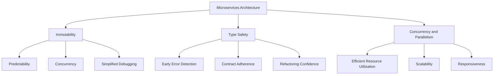

## 11.3 Functional Programming Benefits for Microservices

In the ever-evolving landscape of software architecture, microservices have emerged as a powerful paradigm for building scalable, maintainable, and resilient systems. As we delve into the world of microservices, it's crucial to explore how functional programming, particularly in Haskell, can enhance the development and operation of these systems. In this section, we'll examine the key benefits of functional programming for microservices, focusing on immutability, type safety, and concurrency.

### Immutability: Reducing Side Effects and Improving Predictability

Immutability is a cornerstone of functional programming and plays a pivotal role in microservices architecture. By ensuring that data structures are immutable, we can significantly reduce side effects and enhance the predictability of our systems.

#### Understanding Immutability

In functional programming, immutability refers to the concept that once a data structure is created, it cannot be modified. Instead of altering existing data, new data structures are created with the desired changes. This approach contrasts with imperative programming, where data is often modified in place.

#### Benefits of Immutability in Microservices

1. **Predictability**: Immutability eliminates the possibility of unexpected changes to data, making it easier to reason about the behavior of microservices. This predictability is crucial in distributed systems where services interact with each other.

2. **Concurrency**: Immutable data structures are inherently thread-safe, allowing multiple threads to access them without the risk of data races. This property is particularly beneficial in microservices, where concurrency is often a requirement.

3. **Simplified Debugging**: With immutable data, the state of a system at any point in time can be easily reconstructed, simplifying debugging and troubleshooting.

4. **Ease of Testing**: Testing becomes more straightforward with immutability, as functions can be tested in isolation without worrying about shared mutable state.

#### Implementing Immutability in Haskell

Haskell, as a purely functional language, enforces immutability by default. Let's explore a simple example to illustrate this concept:

```haskell
-- Define an immutable data structure for a user
data User = User { userId :: Int, userName :: String } deriving (Show)

-- Function to update the user's name
updateUserName :: User -> String -> User
updateUserName user newName = user { userName = newName }

main :: IO ()
main = do
    let user1 = User 1 "Alice"
    let user2 = updateUserName user1 "Bob"
    print user1 -- Output: User {userId = 1, userName = "Alice"}
    print user2 -- Output: User {userId = 1, userName = "Bob"}
```

In this example, the `User` data structure is immutable. The `updateUserName` function creates a new `User` instance with the updated name, leaving the original `user1` unchanged.

### Type Safety: Catching Errors at Compile Time

Type safety is another significant advantage of functional programming in microservices. Haskell's strong static type system allows developers to catch errors at compile time, ensuring that services adhere to their contracts.

#### Understanding Type Safety

Type safety refers to the ability of a programming language to prevent type errors, such as applying an operation to incompatible types. In Haskell, the type system is designed to enforce correctness by checking types at compile time.

#### Benefits of Type Safety in Microservices

1. **Early Error Detection**: Type errors are caught during compilation, reducing the likelihood of runtime errors and increasing system reliability.

2. **Contract Adherence**: Types serve as contracts between services, ensuring that data exchanged between services conforms to expected formats.

3. **Refactoring Confidence**: With a strong type system, developers can refactor code with confidence, knowing that the compiler will catch any type-related issues.

4. **Documentation**: Types provide self-documenting code, making it easier for developers to understand the interfaces and data structures used in microservices.

#### Implementing Type Safety in Haskell

Haskell's type system is one of its most powerful features. Let's explore an example that demonstrates type safety in a microservices context:

```haskell
-- Define a type for a service request
data Request = Request { requestId :: Int, requestData :: String } deriving (Show)

-- Define a type for a service response
data Response = Response { responseId :: Int, responseData :: String } deriving (Show)

-- Function to process a request and return a response
processRequest :: Request -> Response
processRequest req = Response (requestId req) ("Processed: " ++ requestData req)

main :: IO ()
main = do
    let req = Request 1 "Hello"
    let res = processRequest req
    print res -- Output: Response {responseId = 1, responseData = "Processed: Hello"}
```

In this example, the `processRequest` function takes a `Request` and returns a `Response`. The type system ensures that only valid requests are processed, catching any type mismatches at compile time.

### Concurrency and Parallelism: Leveraging Haskell's Strengths

Concurrency and parallelism are essential for building efficient microservices that can handle high loads and scale effectively. Haskell's functional nature and advanced concurrency primitives make it well-suited for these tasks.

#### Understanding Concurrency and Parallelism

- **Concurrency** refers to the ability of a system to handle multiple tasks simultaneously, potentially interleaving their execution.
- **Parallelism** involves executing multiple tasks at the same time, typically on different processors or cores.

#### Benefits of Concurrency and Parallelism in Microservices

1. **Efficient Resource Utilization**: By leveraging concurrency and parallelism, microservices can make better use of available resources, improving performance and responsiveness.

2. **Scalability**: Concurrency allows microservices to scale horizontally, handling increased loads by distributing tasks across multiple instances.

3. **Responsiveness**: Concurrent systems can remain responsive even under heavy load, as tasks can be processed independently.

4. **Fault Tolerance**: By isolating tasks, concurrency can improve fault tolerance, allowing a system to continue operating even if some tasks fail.

#### Implementing Concurrency in Haskell

Haskell provides several concurrency primitives, including lightweight threads and software transactional memory (STM). Let's explore an example using Haskell's `async` library:

```haskell
import Control.Concurrent.Async

-- Function to simulate a long-running task
longRunningTask :: Int -> IO Int
longRunningTask n = do
    putStrLn $ "Starting task " ++ show n
    threadDelay (n * 1000000) -- Simulate delay
    putStrLn $ "Finished task " ++ show n
    return n

main :: IO ()
main = do
    -- Run tasks concurrently
    results <- mapConcurrently longRunningTask [1, 2, 3]
    print results -- Output: [1, 2, 3]
```

In this example, we use `mapConcurrently` to run multiple tasks concurrently. Each task simulates a long-running operation, and the results are collected once all tasks are complete.

### Visualizing Functional Programming Benefits in Microservices

To better understand how functional programming benefits microservices, let's visualize the key concepts using a Mermaid.js diagram:



This diagram illustrates how immutability, type safety, and concurrency contribute to the overall benefits of functional programming in microservices.

### Try It Yourself

Now that we've explored the benefits of functional programming for microservices, it's time to try it yourself. Experiment with the code examples provided, and consider the following modifications:

- Modify the `updateUserName` function to update other fields in the `User` data structure.
- Extend the `processRequest` function to handle different types of requests and responses.
- Experiment with different concurrency primitives in Haskell, such as `STM` or `MVar`.

### References and Further Reading

- [Haskell Language Documentation](https://www.haskell.org/documentation/)
- [Functional Programming in Haskell](https://www.fpcomplete.com/haskell/)
- [Microservices Architecture](https://microservices.io/)
- [Concurrency in Haskell](https://wiki.haskell.org/Concurrency)

### Knowledge Check

Before we conclude, let's reinforce what we've learned with a few questions:

- How does immutability improve predictability in microservices?
- What role does type safety play in ensuring contract adherence between services?
- How can concurrency and parallelism enhance the performance of microservices?

### Embrace the Journey

Remember, this is just the beginning. As you continue to explore functional programming and microservices, you'll discover new patterns and techniques that can further enhance your systems. Keep experimenting, stay curious, and enjoy the journey!

## Quiz: Functional Programming Benefits for Microservices



### How does immutability improve predictability in microservices?

- [x] By eliminating unexpected data changes
- [ ] By allowing data to be modified in place
- [ ] By increasing the complexity of data structures
- [ ] By reducing the need for testing

> **Explanation:** Immutability ensures that data cannot be changed once created, eliminating unexpected changes and improving predictability.

### What is a key benefit of type safety in microservices?

- [x] Early error detection
- [ ] Increased runtime errors
- [ ] Reduced documentation
- [ ] Decreased refactoring confidence

> **Explanation:** Type safety allows errors to be caught at compile time, reducing the likelihood of runtime errors.

### How does concurrency improve resource utilization in microservices?

- [x] By allowing multiple tasks to be handled simultaneously
- [ ] By reducing the number of tasks that can be processed
- [ ] By increasing the need for manual synchronization
- [ ] By limiting the number of concurrent tasks

> **Explanation:** Concurrency allows multiple tasks to be handled simultaneously, making better use of available resources.

### Which Haskell feature enforces immutability by default?

- [x] Pure functions
- [ ] Mutable variables
- [ ] Imperative loops
- [ ] Dynamic typing

> **Explanation:** Haskell's pure functions enforce immutability by default, ensuring that data cannot be modified in place.

### What is a benefit of using immutable data structures in concurrent systems?

- [x] Thread safety
- [ ] Increased data races
- [ ] Complex synchronization
- [ ] Reduced performance

> **Explanation:** Immutable data structures are inherently thread-safe, allowing concurrent access without data races.

### How does type safety contribute to contract adherence between services?

- [x] By ensuring data conforms to expected formats
- [ ] By allowing type mismatches
- [ ] By increasing runtime errors
- [ ] By reducing the need for documentation

> **Explanation:** Type safety ensures that data exchanged between services conforms to expected formats, adhering to contracts.

### What is a key advantage of using Haskell for concurrency in microservices?

- [x] Lightweight threads and STM
- [ ] Heavyweight processes
- [ ] Manual memory management
- [ ] Lack of concurrency primitives

> **Explanation:** Haskell provides lightweight threads and software transactional memory (STM), making it well-suited for concurrency.

### How does immutability simplify debugging in microservices?

- [x] By allowing the system state to be easily reconstructed
- [ ] By increasing the complexity of data structures
- [ ] By reducing the need for testing
- [ ] By allowing data to be modified in place

> **Explanation:** Immutability allows the system state to be easily reconstructed, simplifying debugging and troubleshooting.

### What is a benefit of using Haskell's type system for refactoring?

- [x] Increased confidence in code changes
- [ ] Increased runtime errors
- [ ] Reduced documentation
- [ ] Decreased refactoring confidence

> **Explanation:** Haskell's type system allows developers to refactor code with confidence, knowing that type-related issues will be caught.

### True or False: Concurrency in microservices can improve fault tolerance.

- [x] True
- [ ] False

> **Explanation:** Concurrency can improve fault tolerance by isolating tasks, allowing the system to continue operating even if some tasks fail.


