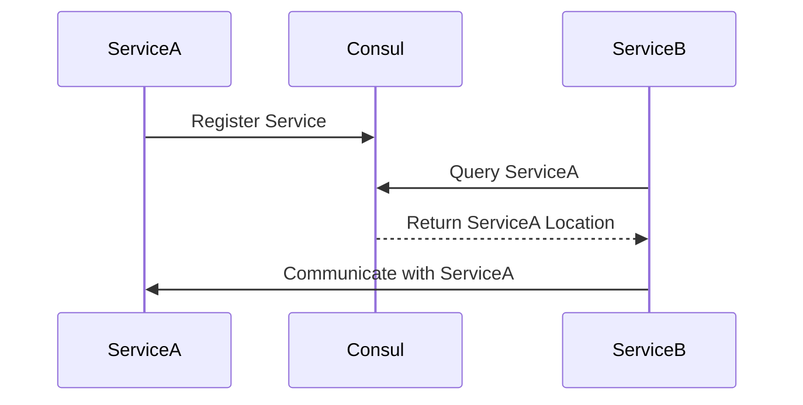

## 11.4 Service Discovery and Coordination

In the realm of microservices, service discovery and coordination are crucial components that enable services to interact seamlessly. As systems scale, the static configuration of service endpoints becomes impractical. Instead, services need to discover each other dynamically, adapting to changes in the environment. This section delves into the mechanisms and patterns for service discovery and coordination in Haskell, leveraging tools like Consul, etcd, and Zookeeper.

### Understanding Service Discovery

**Service Discovery** is the process by which services locate each other on a network. In a microservices architecture, services are often distributed across multiple hosts and may scale dynamically. Service discovery mechanisms automate the detection of service instances, allowing services to communicate without hard-coded endpoints.

#### Key Concepts

- **Service Registry**: A central database where service instances register themselves, providing their network locations.
- **Service Resolution**: The process of querying the service registry to find the network location of a service.
- **Health Checks**: Mechanisms to ensure that only healthy service instances are discoverable.

### Service Discovery Mechanisms

Service discovery can be implemented using various tools and libraries. Popular choices include **Consul**, **etcd**, and **Zookeeper**. These tools provide robust service discovery capabilities, including health checks and dynamic configuration.

#### Consul

Consul is a widely-used service discovery and configuration tool. It provides a distributed, highly available service registry and supports health checks, key/value storage, and multi-datacenter deployments.

#### etcd

etcd is a distributed key-value store that provides a reliable way to store data across a cluster of machines. It is often used for service discovery, configuration management, and leader election.

#### Zookeeper

Zookeeper is a centralized service for maintaining configuration information, naming, providing distributed synchronization, and providing group services. It is often used in large-scale distributed systems.

### Implementing Service Discovery in Haskell

Haskell can integrate with service discovery tools via HTTP APIs or client libraries. While Haskell may not have native libraries for all service discovery tools, it can leverage existing HTTP libraries to interact with these systems.

#### Integrating with Consul

To integrate Haskell with Consul, we can use HTTP requests to register services and query the service registry. Here's a simple example of how to register a service with Consul:

```haskell
{-# LANGUAGE OverloadedStrings #-}

import Network.HTTP.Client
import Network.HTTP.Client.TLS
import Data.Aeson
import Data.ByteString.Lazy.Char8 as L8

-- Define the service registration data
data ServiceRegistration = ServiceRegistration
  { name :: String
  , id :: String
  , address :: String
  , port :: Int
  }

instance ToJSON ServiceRegistration where
  toJSON (ServiceRegistration name id address port) =
    object ["Name" .= name, "ID" .= id, "Address" .= address, "Port" .= port]

-- Register a service with Consul
registerService :: IO ()
registerService = do
  manager <- newManager tlsManagerSettings
  let service = ServiceRegistration "my-service" "my-service-id" "127.0.0.1" 8080
  let request = "http://localhost:8500/v1/agent/service/register"
  initialRequest <- parseRequest request
  let request' = initialRequest
        { method = "PUT"
        , requestBody = RequestBodyLBS (encode service)
        , requestHeaders = [("Content-Type", "application/json")]
        }
  response <- httpLbs request' manager
  L8.putStrLn $ responseBody response
```

In this example, we define a `ServiceRegistration` data type and use the `aeson` library to encode it as JSON. We then send an HTTP PUT request to Consul to register the service.

#### Querying Services

Once services are registered, we can query Consul to discover service instances:

```haskell
queryService :: IO ()
queryService = do
  manager <- newManager tlsManagerSettings
  request <- parseRequest "http://localhost:8500/v1/catalog/service/my-service"
  response <- httpLbs request manager
  L8.putStrLn $ responseBody response
```

This function sends an HTTP GET request to Consul to retrieve the list of instances for a given service.

### Coordination in Microservices

**Coordination** involves managing the interactions between services to ensure they work together effectively. This includes handling distributed transactions, leader election, and configuration management.

#### Distributed Transactions

In a microservices architecture, transactions often span multiple services. Coordinating these transactions requires careful management to ensure consistency and reliability.

#### Leader Election

Leader election is a coordination pattern where one instance of a service is designated as the leader, responsible for specific tasks. Tools like Zookeeper and etcd provide primitives for implementing leader election.

### Haskell Libraries for Coordination

Haskell can leverage libraries like `distributed-process` and `cloud-haskell` for building distributed systems with coordination capabilities.

#### Using `distributed-process`

The `distributed-process` library provides a framework for building distributed applications in Haskell. It supports message passing, process management, and fault tolerance.

```haskell
import Control.Distributed.Process
import Control.Distributed.Process.Node
import Network.Transport.TCP (createTransport, defaultTCPParameters)

main :: IO ()
main = do
  Right transport <- createTransport "127.0.0.1" "10501" defaultTCPParameters
  node <- newLocalNode transport initRemoteTable
  runProcess node $ do
    self <- getSelfPid
    send self "Hello, world!"
    msg <- expect :: Process String
    liftIO $ putStrLn msg
```

This example demonstrates a simple distributed application that sends a message to itself.

### Visualizing Service Discovery and Coordination

To better understand the flow of service discovery and coordination, let's visualize the process using a sequence diagram.



**Diagram Description**: This sequence diagram illustrates how `ServiceA` registers itself with Consul, `ServiceB` queries Consul to find `ServiceA`, and then communicates with it.

### Design Considerations

When implementing service discovery and coordination, consider the following:

- **Scalability**: Ensure the service discovery mechanism can handle the scale of your system.
- **Fault Tolerance**: Implement health checks and failover mechanisms to maintain system reliability.
- **Consistency**: Choose the right consistency model for your service discovery tool (e.g., eventual consistency vs. strong consistency).

### Haskell Unique Features

Haskell's strong type system and functional paradigm offer unique advantages in building reliable and maintainable service discovery and coordination systems. The use of pure functions and immutability can reduce side effects and improve system predictability.

### Differences and Similarities

Service discovery and coordination patterns in Haskell share similarities with other languages but leverage Haskell's functional strengths. Unlike imperative languages, Haskell's approach often involves more declarative and compositional techniques.

### Try It Yourself

Experiment with the provided code examples by modifying service names, ports, and addresses. Try integrating with different service discovery tools and observe how they handle service registration and querying.

### Knowledge Check

- What are the key components of service discovery?
- How does Consul facilitate service discovery?
- What role does leader election play in coordination?
- How can Haskell's type system benefit service discovery?

### Embrace the Journey

Remember, mastering service discovery and coordination is a journey. As you explore these patterns, you'll gain insights into building scalable and resilient microservices. Keep experimenting, stay curious, and enjoy the process!

## Quiz: Service Discovery and Coordination



### What is the primary purpose of service discovery in microservices?

- [x] To enable services to find each other dynamically
- [ ] To store configuration data
- [ ] To manage distributed transactions
- [ ] To perform health checks

> **Explanation:** Service discovery allows services to locate each other dynamically, which is crucial in a microservices architecture.

### Which tool is commonly used for service discovery and configuration management?

- [x] Consul
- [ ] Docker
- [ ] Kubernetes
- [ ] Redis

> **Explanation:** Consul is a popular tool for service discovery and configuration management.

### How does Consul register a service?

- [x] By sending an HTTP PUT request with service details
- [ ] By creating a Docker container
- [ ] By writing to a database
- [ ] By executing a shell script

> **Explanation:** Services are registered in Consul by sending an HTTP PUT request with the service details.

### What is the role of health checks in service discovery?

- [x] To ensure only healthy services are discoverable
- [ ] To store service configuration
- [ ] To manage service dependencies
- [ ] To perform load balancing

> **Explanation:** Health checks ensure that only healthy services are discoverable, maintaining system reliability.

### Which Haskell library can be used for building distributed applications?

- [x] distributed-process
- [ ] aeson
- [ ] warp
- [ ] lens

> **Explanation:** The `distributed-process` library is used for building distributed applications in Haskell.

### What is leader election in the context of coordination?

- [x] Designating one instance as the leader for specific tasks
- [ ] Registering a service with Consul
- [ ] Performing health checks
- [ ] Querying service locations

> **Explanation:** Leader election designates one instance as the leader, responsible for specific tasks in a distributed system.

### How can Haskell's type system benefit service discovery?

- [x] By reducing side effects and improving predictability
- [ ] By increasing runtime performance
- [ ] By simplifying network communication
- [ ] By enhancing user interfaces

> **Explanation:** Haskell's type system reduces side effects and improves predictability, which is beneficial for service discovery.

### What is a service registry?

- [x] A central database where services register themselves
- [ ] A tool for managing distributed transactions
- [ ] A library for HTTP requests
- [ ] A framework for building web applications

> **Explanation:** A service registry is a central database where services register themselves, providing their network locations.

### Which of the following is NOT a service discovery tool?

- [x] Redis
- [ ] Consul
- [ ] etcd
- [ ] Zookeeper

> **Explanation:** Redis is not typically used as a service discovery tool.

### True or False: Service discovery is only necessary in large-scale systems.

- [ ] True
- [x] False

> **Explanation:** Service discovery is beneficial in any system where services need to locate each other dynamically, regardless of scale.


