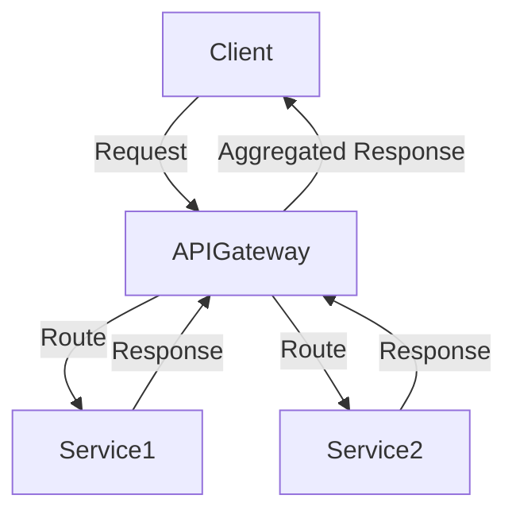

## 11.5 API Gateway Pattern

In the realm of microservices architecture, the API Gateway Pattern plays a pivotal role in managing client interactions with multiple backend services. This pattern provides a single entry point for clients, simplifying communication, enhancing security, and enabling efficient load balancing and caching. In this section, we will delve into the API Gateway Pattern, explore its benefits, and demonstrate its implementation in Haskell using popular web frameworks like **Servant** and **Scotty**.

### Concept

The API Gateway Pattern is designed to address the complexities that arise when clients need to interact with multiple microservices. By providing a unified interface, the API Gateway acts as an intermediary that routes requests to the appropriate services, aggregates responses, and handles cross-cutting concerns such as authentication, authorization, and rate limiting.

#### Key Features of the API Gateway Pattern

- **Single Entry Point**: Clients interact with a single endpoint, reducing the complexity of managing multiple service endpoints.
- **Request Routing**: The gateway routes incoming requests to the appropriate microservices based on the request path, headers, or other criteria.
- **Response Aggregation**: It can aggregate responses from multiple services into a single response for the client.
- **Cross-Cutting Concerns**: The gateway can handle concerns like authentication, logging, monitoring, and rate limiting centrally.
- **Protocol Translation**: It can translate between different protocols, such as HTTP to gRPC, if needed.

### Benefits

Implementing an API Gateway in a microservices architecture offers several advantages:

- **Simplified Client Interactions**: Clients only need to interact with one endpoint, reducing the complexity of managing multiple service endpoints.
- **Load Balancing**: The gateway can distribute incoming requests across multiple instances of a service, improving performance and reliability.
- **Caching**: Frequently requested data can be cached at the gateway, reducing the load on backend services and improving response times.
- **Security**: The gateway can enforce security policies, such as authentication and authorization, before requests reach the backend services.
- **Flexibility**: It allows for independent evolution of backend services without affecting client interactions.

### Implementation in Haskell

Haskell, with its strong type system and functional programming paradigms, offers robust tools for implementing an API Gateway. Two popular web frameworks for building such gateways in Haskell are **Servant** and **Scotty**.

#### Using Servant

**Servant** is a powerful Haskell library for defining web APIs at the type level. It allows you to specify the structure of your API using Haskell types, ensuring type safety and consistency.

```haskell
{-# LANGUAGE DataKinds #-}
{-# LANGUAGE TypeOperators #-}
{-# LANGUAGE OverloadedStrings #-}

import Network.Wai
import Network.Wai.Handler.Warp
import Servant

type API = "service1" :> Get '[JSON] String
      :<|> "service2" :> Get '[JSON] String

server :: Server API
server = service1Handler :<|> service2Handler

service1Handler :: Handler String
service1Handler = return "Response from Service 1"

service2Handler :: Handler String
service2Handler = return "Response from Service 2"

api :: Proxy API
api = Proxy

app :: Application
app = serve api server

main :: IO ()
main = run 8080 app
```

In this example, we define a simple API Gateway using Servant. The gateway exposes two endpoints, `/service1` and `/service2`, each routing to a different handler function. This setup can be extended to include more complex routing logic, authentication, and response aggregation.

#### Using Scotty

**Scotty** is another Haskell web framework that provides a more lightweight and flexible approach to building web applications. It is particularly well-suited for smaller projects or when you need more control over request handling.

```haskell
{-# LANGUAGE OverloadedStrings #-}

import Web.Scotty

main :: IO ()
main = scotty 8080 $ do
    get "/service1" $ do
        text "Response from Service 1"
    get "/service2" $ do
        text "Response from Service 2"
```

In this Scotty example, we define an API Gateway with two endpoints. Scotty's DSL allows for concise and expressive route definitions, making it easy to extend with additional middleware for authentication, logging, or other cross-cutting concerns.

### Example: Creating an API Gateway

Let's build a more comprehensive example of an API Gateway using Servant. We will create a gateway that routes requests to two microservices, aggregates their responses, and returns a combined result to the client.

#### Microservice Definitions

First, let's define two simple microservices that our gateway will interact with:

**Service 1:**

```haskell
{-# LANGUAGE OverloadedStrings #-}

import Network.Wai
import Network.Wai.Handler.Warp
import Network.HTTP.Types (status200)
import Network.Wai.Middleware.RequestLogger (logStdoutDev)

service1App :: Application
service1App req respond = do
    respond $ responseLBS status200 [("Content-Type", "text/plain")] "Hello from Service 1"

main :: IO ()
main = run 8081 $ logStdoutDev service1App
```

**Service 2:**

```haskell
{-# LANGUAGE OverloadedStrings #-}

import Network.Wai
import Network.Wai.Handler.Warp
import Network.HTTP.Types (status200)
import Network.Wai.Middleware.RequestLogger (logStdoutDev)

service2App :: Application
service2App req respond = do
    respond $ responseLBS status200 [("Content-Type", "text/plain")] "Hello from Service 2"

main :: IO ()
main = run 8082 $ logStdoutDev service2App
```

These microservices run on different ports and return simple text responses.

#### API Gateway Implementation

Now, let's implement the API Gateway using Servant:

```haskell
{-# LANGUAGE DataKinds #-}
{-# LANGUAGE TypeOperators #-}
{-# LANGUAGE OverloadedStrings #-}

import Network.Wai
import Network.Wai.Handler.Warp
import Servant
import Servant.Client
import Network.HTTP.Client (newManager, defaultManagerSettings)

type API = "aggregate" :> Get '[JSON] String

server :: Server API
server = aggregateHandler

aggregateHandler :: Handler String
aggregateHandler = do
    manager <- liftIO $ newManager defaultManagerSettings
    let service1 = BaseUrl Http "localhost" 8081 ""
    let service2 = BaseUrl Http "localhost" 8082 ""
    response1 <- liftIO $ runClientM (client (Proxy :: Proxy (Get '[PlainText] String))) (mkClientEnv manager service1)
    response2 <- liftIO $ runClientM (client (Proxy :: Proxy (Get '[PlainText] String))) (mkClientEnv manager service2)
    return $ "Aggregated Response: " ++ show response1 ++ " & " ++ show response2

api :: Proxy API
api = Proxy

app :: Application
app = serve api server

main :: IO ()
main = run 8080 app
```

In this example, the API Gateway exposes an `/aggregate` endpoint that fetches data from both microservices, combines their responses, and returns the result to the client. We use Servant's client capabilities to make HTTP requests to the microservices.

### Design Considerations

When implementing an API Gateway, consider the following design aspects:

- **Scalability**: Ensure the gateway can handle high traffic volumes by implementing load balancing and horizontal scaling.
- **Security**: Implement robust authentication and authorization mechanisms to protect backend services.
- **Resilience**: Use circuit breakers and retries to handle failures gracefully and maintain service availability.
- **Monitoring**: Integrate logging and monitoring to track performance and diagnose issues.

### Haskell Unique Features

Haskell's strong type system and functional programming paradigms offer unique advantages when implementing an API Gateway:

- **Type Safety**: Define APIs at the type level, ensuring consistency and reducing runtime errors.
- **Concurrency**: Leverage Haskell's lightweight concurrency model to handle multiple requests efficiently.
- **Immutability**: Benefit from immutable data structures, reducing side effects and improving reliability.

### Differences and Similarities

The API Gateway Pattern is often compared to the **Backend for Frontend (BFF)** pattern. While both patterns provide a single entry point for clients, the BFF pattern is tailored to specific client needs, whereas the API Gateway serves as a general-purpose entry point for all clients.

### Visualizing the API Gateway Pattern

To better understand the API Gateway Pattern, let's visualize its architecture:



**Diagram Description**: The diagram illustrates the flow of requests and responses in the API Gateway Pattern. The client sends a request to the API Gateway, which routes it to the appropriate services. The gateway aggregates the responses and returns a single response to the client.

### Try It Yourself

To gain hands-on experience with the API Gateway Pattern, try modifying the example code:

- **Add Authentication**: Implement basic authentication for the gateway.
- **Enhance Aggregation**: Modify the aggregation logic to handle JSON responses.
- **Introduce Caching**: Implement caching at the gateway to improve performance.

### Knowledge Check

- **What are the key benefits of using an API Gateway in a microservices architecture?**
- **How does Haskell's type system enhance the implementation of an API Gateway?**
- **What are some design considerations to keep in mind when building an API Gateway?**

### Embrace the Journey

Remember, mastering the API Gateway Pattern is just one step in your journey to becoming an expert in microservices architecture. As you continue to explore and experiment, you'll discover new ways to leverage Haskell's unique features to build robust and scalable systems. Keep pushing the boundaries, stay curious, and enjoy the journey!

## Quiz: API Gateway Pattern



### What is the primary role of an API Gateway in a microservices architecture?

- [x] To provide a single entry point for clients to access multiple services
- [ ] To directly connect clients to each microservice
- [ ] To replace all microservices with a monolithic application
- [ ] To store all client data

> **Explanation:** The API Gateway acts as a single entry point, simplifying client interactions with multiple services.

### Which Haskell library allows you to define web APIs at the type level?

- [x] Servant
- [ ] Scotty
- [ ] Warp
- [ ] Snap

> **Explanation:** Servant is a Haskell library that enables type-level API definitions, ensuring type safety.

### What is one benefit of using an API Gateway?

- [x] Simplified client interactions
- [ ] Increased complexity for clients
- [ ] Direct access to databases
- [ ] Eliminating the need for microservices

> **Explanation:** An API Gateway simplifies client interactions by providing a unified interface to multiple services.

### How does the API Gateway handle cross-cutting concerns?

- [x] Centrally, before requests reach backend services
- [ ] Individually, within each microservice
- [ ] By ignoring them
- [ ] By delegating them to the client

> **Explanation:** The API Gateway can handle cross-cutting concerns like authentication and logging centrally.

### Which Haskell feature is beneficial for handling multiple requests efficiently?

- [x] Lightweight concurrency model
- [ ] Mutable state
- [ ] Dynamic typing
- [ ] Manual memory management

> **Explanation:** Haskell's lightweight concurrency model allows efficient handling of multiple requests.

### What is a common design consideration for an API Gateway?

- [x] Scalability
- [ ] Direct database access
- [ ] Client-side caching
- [ ] Ignoring security

> **Explanation:** Scalability is crucial to ensure the gateway can handle high traffic volumes.

### How can an API Gateway enhance security?

- [x] By implementing authentication and authorization
- [ ] By exposing all services directly to clients
- [ ] By storing sensitive data in plain text
- [ ] By disabling encryption

> **Explanation:** The gateway can enforce security policies like authentication and authorization.

### What is the difference between an API Gateway and a Backend for Frontend (BFF)?

- [x] BFF is tailored to specific client needs, while API Gateway serves all clients
- [ ] API Gateway is tailored to specific client needs, while BFF serves all clients
- [ ] BFF replaces the need for an API Gateway
- [ ] API Gateway is used only for mobile applications

> **Explanation:** BFF is designed for specific client needs, whereas the API Gateway is a general-purpose entry point.

### Which diagram best represents the API Gateway Pattern?

- [x] A single entry point routing requests to multiple services
- [ ] A direct connection between clients and databases
- [ ] A monolithic application with no microservices
- [ ] A client-side application with no server interaction

> **Explanation:** The API Gateway Pattern involves a single entry point routing requests to multiple services.

### True or False: An API Gateway can translate between different protocols.

- [x] True
- [ ] False

> **Explanation:** The API Gateway can handle protocol translation, such as HTTP to gRPC.


