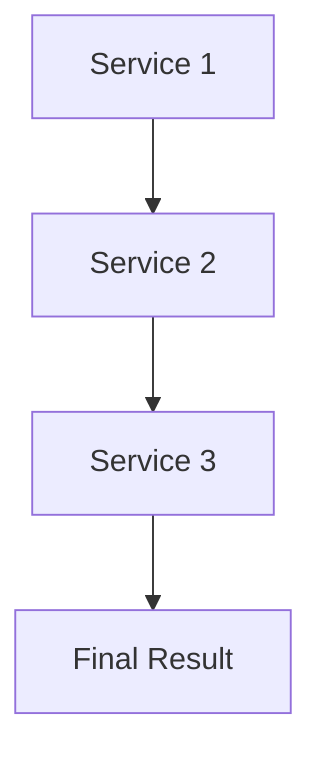
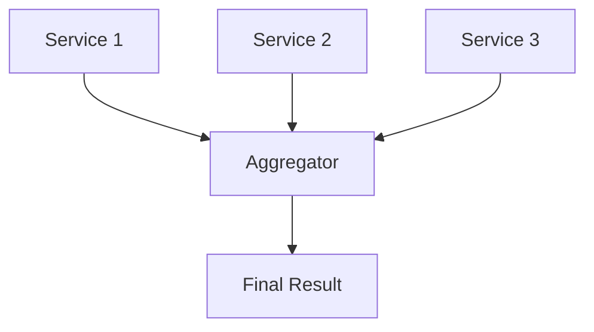

## 11.6 Composition Patterns in Microservices

In the realm of microservices architecture, composition patterns play a crucial role in orchestrating and managing interactions between services. These patterns help in structuring service calls, handling data flow, and ensuring that the system remains scalable and maintainable. In this section, we will delve into two primary composition patterns: **Chained Composition** and **Branching Composition**. We will explore how these patterns can be effectively implemented in Haskell, leveraging its powerful concurrency primitives and functional programming paradigms.

### Understanding Composition Patterns

Composition patterns in microservices refer to the strategies used to combine multiple services to achieve a specific business functionality. These patterns are essential for building complex systems where services need to interact with each other in a coordinated manner.

#### Chained Composition

**Chained Composition** involves sequentially calling multiple services, where the output of one service becomes the input for the next. This pattern is akin to a pipeline where data flows through a series of transformations.

**Key Characteristics:**
- **Sequential Execution**: Services are called one after the other.
- **Data Dependency**: Each service depends on the output of the previous one.
- **Error Propagation**: Errors in any service can affect the entire chain.

**Use Cases:**
- Data transformation pipelines.
- Multi-step workflows where each step depends on the previous one.

#### Branching Composition

**Branching Composition** involves making parallel calls to multiple services and aggregating their results. This pattern is useful when services can operate independently and their results need to be combined.

**Key Characteristics:**
- **Parallel Execution**: Services are called concurrently.
- **Independent Services**: Each service operates independently.
- **Result Aggregation**: Results from all services are combined to form a final output.

**Use Cases:**
- Aggregating data from multiple sources.
- Performing independent computations that contribute to a single result.

### Implementing Composition Patterns in Haskell

Haskell, with its strong support for functional programming and concurrency, provides an excellent platform for implementing composition patterns in microservices. Let's explore how we can implement these patterns using Haskell's features.

#### Chained Composition in Haskell

To implement chained composition in Haskell, we can use monads to handle the sequential execution of service calls. The `Maybe` and `Either` monads are particularly useful for managing errors and propagating them through the chain.

```haskell
import Control.Monad (when)
import Data.Maybe (fromMaybe)

-- Define a type for service results
type ServiceResult a = Either String a

-- Service 1: Fetch user data
fetchUserData :: Int -> ServiceResult String
fetchUserData userId = Right ("User data for user " ++ show userId)

-- Service 2: Process user data
processUserData :: String -> ServiceResult String
processUserData userData = Right ("Processed " ++ userData)

-- Service 3: Save processed data
saveProcessedData :: String -> ServiceResult String
saveProcessedData processedData = Right ("Saved " ++ processedData)

-- Chained composition of services
composeServices :: Int -> ServiceResult String
composeServices userId = do
    userData <- fetchUserData userId
    processedData <- processUserData userData
    saveProcessedData processedData

main :: IO ()
main = do
    let result = composeServices 42
    putStrLn $ fromMaybe "Error in processing" (either (const Nothing) Just result)
```

**Explanation:**
- We define a type alias `ServiceResult` to represent the result of a service call, which can either be a success (`Right`) or an error (`Left`).
- Each service function returns a `ServiceResult`, allowing us to chain them using the `do` notation.
- The `composeServices` function demonstrates the chained composition of three services.

#### Branching Composition in Haskell

For branching composition, we can use Haskell's concurrency primitives, such as `async` and `wait`, to perform parallel service calls and aggregate their results.

```haskell
import Control.Concurrent.Async (async, wait)
import Control.Monad (forM)

-- Simulate a service call
serviceCall :: Int -> IO String
serviceCall n = return ("Result from service " ++ show n)

-- Branching composition of services
composeBranchingServices :: [Int] -> IO [String]
composeBranchingServices serviceIds = do
    asyncResults <- forM serviceIds $ \serviceId -> async (serviceCall serviceId)
    mapM wait asyncResults

main :: IO ()
main = do
    results <- composeBranchingServices [1, 2, 3]
    mapM_ putStrLn results
```

**Explanation:**
- We use the `async` function to initiate parallel service calls.
- The `wait` function is used to collect the results of these calls.
- The `composeBranchingServices` function demonstrates how to perform branching composition by calling multiple services concurrently and aggregating their results.

### Visualizing Composition Patterns

To better understand these patterns, let's visualize them using Mermaid.js diagrams.

#### Chained Composition Diagram



**Description:** This diagram illustrates the sequential flow of data through a series of services in a chained composition pattern.

#### Branching Composition Diagram



**Description:** This diagram shows how multiple services can be called in parallel and their results aggregated in a branching composition pattern.

### Design Considerations

When implementing composition patterns in microservices, consider the following:

- **Error Handling**: Ensure that errors are properly managed and propagated through the system.
- **Performance**: Use concurrency to improve performance, especially in branching compositions.
- **Scalability**: Design services to be stateless and scalable.
- **Resilience**: Implement retry mechanisms and circuit breakers to handle failures gracefully.

### Haskell Unique Features

Haskell's strong type system and support for functional programming make it uniquely suited for implementing composition patterns:

- **Type Safety**: Use Haskell's type system to enforce contracts between services.
- **Monads**: Leverage monads for managing side effects and error propagation.
- **Concurrency**: Utilize Haskell's lightweight concurrency primitives for efficient parallel execution.

### Differences and Similarities

Chained and branching compositions are often confused due to their similar goals of combining services. However, they differ in execution strategy:

- **Chained Composition**: Sequential, dependent execution.
- **Branching Composition**: Parallel, independent execution.

### Try It Yourself

Experiment with the provided code examples by modifying the service functions to simulate different scenarios, such as introducing delays or errors. Observe how these changes affect the overall composition.

### References and Links

- [Haskell Concurrency and Parallelism](https://wiki.haskell.org/Concurrency_and_parallelism)
- [Functional Programming in Haskell](https://www.haskell.org/documentation/)
- [Microservices Patterns](https://microservices.io/patterns/index.html)

### Knowledge Check

- What are the key differences between chained and branching composition patterns?
- How does Haskell's type system aid in implementing composition patterns?
- Why is error handling crucial in microservices composition?

### Embrace the Journey

Remember, mastering composition patterns in microservices is a journey. As you continue to explore and experiment with these patterns, you'll gain deeper insights into building robust and scalable systems. Keep pushing the boundaries, stay curious, and enjoy the process!

## Quiz: Composition Patterns in Microservices



### What is a key characteristic of chained composition?

- [x] Sequential execution
- [ ] Parallel execution
- [ ] Independent services
- [ ] Result aggregation

> **Explanation:** Chained composition involves sequential execution where each service depends on the output of the previous one.

### Which Haskell feature is particularly useful for managing errors in chained composition?

- [x] Monads
- [ ] Type classes
- [ ] Functors
- [ ] Lenses

> **Explanation:** Monads, such as `Maybe` and `Either`, are useful for managing errors and propagating them through the chain.

### What is the primary advantage of branching composition?

- [x] Parallel execution
- [ ] Sequential execution
- [ ] Data dependency
- [ ] Error propagation

> **Explanation:** Branching composition allows for parallel execution of services, which can improve performance.

### In Haskell, which function is used to initiate parallel service calls?

- [x] async
- [ ] wait
- [ ] fmap
- [ ] foldr

> **Explanation:** The `async` function is used to initiate parallel service calls in Haskell.

### What is a common use case for chained composition?

- [x] Data transformation pipelines
- [ ] Aggregating data from multiple sources
- [ ] Performing independent computations
- [ ] Result aggregation

> **Explanation:** Chained composition is commonly used in data transformation pipelines where each step depends on the previous one.

### Which diagram best represents a branching composition pattern?

- [x] A diagram with parallel arrows converging at an aggregator
- [ ] A linear sequence of arrows
- [ ] A single arrow with multiple branches
- [ ] A circular flow of arrows

> **Explanation:** A branching composition pattern is represented by a diagram with parallel arrows converging at an aggregator.

### How can Haskell's type system aid in implementing composition patterns?

- [x] By enforcing contracts between services
- [ ] By allowing dynamic typing
- [ ] By supporting object-oriented programming
- [ ] By enabling runtime type checking

> **Explanation:** Haskell's type system enforces contracts between services, ensuring type safety and correctness.

### What is a potential pitfall of chained composition?

- [x] Error propagation
- [ ] Independent execution
- [ ] Parallel execution
- [ ] Result aggregation

> **Explanation:** In chained composition, errors in any service can propagate through the entire chain, affecting the final result.

### Which Haskell feature can be used for efficient parallel execution in branching composition?

- [x] Concurrency primitives
- [ ] Type classes
- [ ] Functors
- [ ] Lenses

> **Explanation:** Haskell's concurrency primitives, such as `async` and `wait`, enable efficient parallel execution in branching composition.

### True or False: In branching composition, services are dependent on each other.

- [ ] True
- [x] False

> **Explanation:** In branching composition, services operate independently and their results are aggregated to form a final output.


