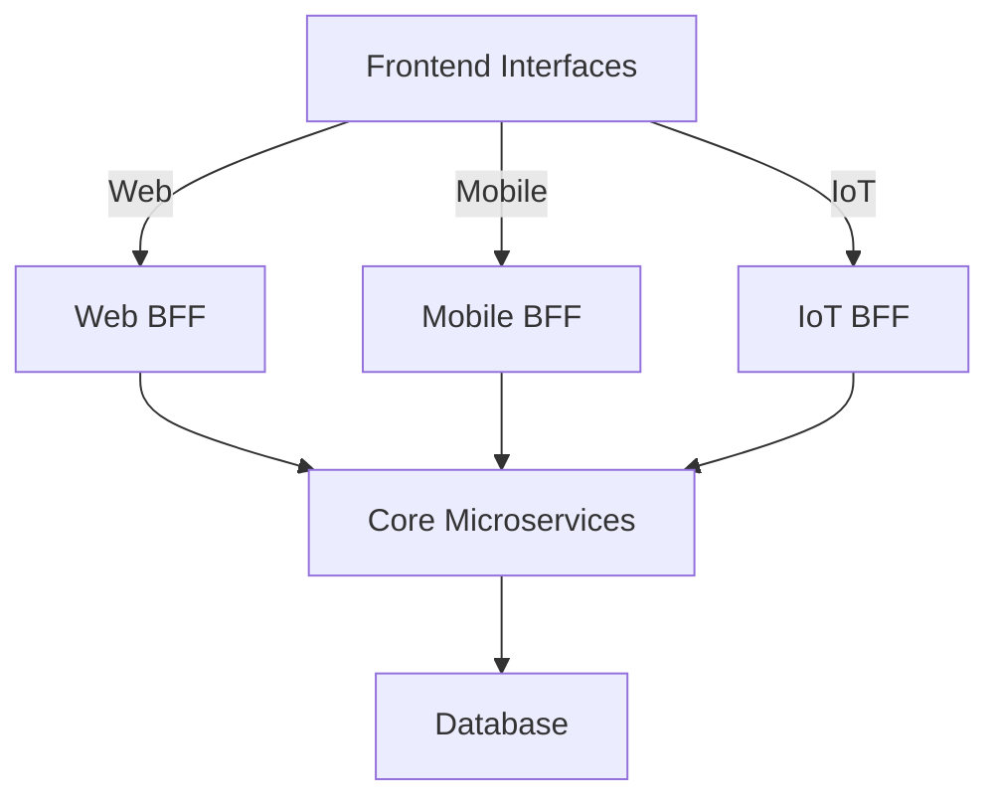

## 11.7 Backend for Frontend (BFF) Pattern

In the world of microservices, the Backend for Frontend (BFF) pattern is a powerful architectural approach that addresses the unique needs of different frontend interfaces. By creating separate backend services tailored to the specific requirements of each client, such as web, mobile, or IoT devices, the BFF pattern optimizes API interactions and enhances the overall user experience.

### Concept

The BFF pattern involves designing distinct backend services for each type of frontend interface. This approach allows developers to customize the data and functionality exposed by the backend to suit the specific needs of each client. For example, a mobile app might require a different data format or reduced data payload compared to a web application. By implementing a BFF, developers can ensure that each client receives the most efficient and relevant data, improving performance and user satisfaction.

### Benefits

The primary benefits of the BFF pattern include:

- **Optimized APIs**: Tailoring APIs to the specific needs of each client reduces unnecessary data transfer and processing, leading to faster response times and improved performance.
- **Decoupled Frontend and Backend**: By separating the backend logic for different clients, changes to one frontend do not impact others, allowing for independent development and deployment cycles.
- **Enhanced Security**: Each BFF can implement client-specific security measures, ensuring that sensitive data is protected according to the needs of each frontend.
- **Simplified Frontend Logic**: By offloading complex data processing and aggregation to the BFF, frontend applications can remain lightweight and focused on user interaction.

### Implementation

Implementing the BFF pattern in Haskell involves developing lightweight services that interface with core microservices. These services act as intermediaries, transforming and aggregating data from various sources to meet the specific needs of each frontend.

#### Key Steps in Implementation

1. **Identify Client Requirements**: Determine the unique data and functionality needs of each frontend interface. This involves understanding the user experience goals and technical constraints of each client.

2. **Design BFF Services**: Create separate Haskell services for each client, focusing on optimizing data retrieval and transformation. Use Haskell's strong type system and functional programming paradigms to ensure robust and maintainable code.

3. **Integrate with Core Microservices**: Connect the BFF services to existing microservices, ensuring seamless data flow and communication. Use Haskell libraries such as `servant` or `warp` to build efficient HTTP APIs.

4. **Implement Security Measures**: Apply client-specific security protocols, such as authentication and authorization, to protect sensitive data and ensure compliance with privacy regulations.

5. **Test and Optimize**: Continuously test the BFF services to ensure they meet performance and reliability standards. Use Haskell's testing frameworks, such as `Hspec` or `QuickCheck`, to automate testing and identify potential issues.

### Example

Let's consider a scenario where we have a mobile application that requires data in a format optimized for mobile consumption. We will develop a BFF service in Haskell that interfaces with core microservices to provide this data.

#### Haskell Code Example

```haskell
{-# LANGUAGE DataKinds #-}
{-# LANGUAGE TypeOperators #-}
{-# LANGUAGE OverloadedStrings #-}

module MobileBFF where

import Servant
import Network.Wai
import Network.Wai.Handler.Warp
import Data.Aeson
import Control.Monad.IO.Class (liftIO)

-- Define the API type
type MobileAPI = "mobile" :> Get '[JSON] MobileData

-- Define the data structure for mobile data
data MobileData = MobileData
  { userId :: Int
  , userName :: String
  , userPreferences :: [String]
  } deriving (Show, Eq, Generic)

instance ToJSON MobileData

-- Sample data for demonstration
sampleMobileData :: MobileData
sampleMobileData = MobileData
  { userId = 1
  , userName = "John Doe"
  , userPreferences = ["dark mode", "notifications"]
  }

-- Define the server handler
mobileServer :: Server MobileAPI
mobileServer = return sampleMobileData

-- Create the application
app :: Application
app = serve (Proxy :: Proxy MobileAPI) mobileServer

-- Main function to run the server
main :: IO ()
main = run 8080 app
```

In this example, we define a simple BFF service using the `servant` library. The service exposes a single endpoint `/mobile` that returns user data optimized for mobile consumption. The data is represented by the `MobileData` type, which includes fields such as `userId`, `userName`, and `userPreferences`.

#### Key Points in the Code

- **API Definition**: The `MobileAPI` type defines the structure of the API, specifying that it responds to GET requests with JSON data.
- **Data Structure**: The `MobileData` type represents the data format optimized for mobile clients. It is derived from `Generic` and `ToJSON` to enable automatic JSON serialization.
- **Server Implementation**: The `mobileServer` function handles incoming requests and returns the sample data. This function can be expanded to include logic for fetching and transforming data from core microservices.
- **Application Setup**: The `app` function creates the WAI application, and the `main` function runs the server on port 8080.

### Visualizing the BFF Architecture

To better understand the BFF pattern, let's visualize the architecture using a Mermaid.js diagram.



**Diagram Description**: This diagram illustrates the BFF architecture, where different frontend interfaces (Web, Mobile, IoT) interact with their respective BFF services. These BFF services, in turn, communicate with core microservices and databases to fetch and transform data.

### Design Considerations

When implementing the BFF pattern, consider the following:

- **Scalability**: Ensure that the BFF services can handle increased load as the number of frontend clients grows. Use Haskell's concurrency and parallelism features to optimize performance.
- **Maintainability**: Keep the BFF services modular and well-documented to facilitate future updates and maintenance. Use Haskell's type system to enforce data integrity and prevent runtime errors.
- **Security**: Implement robust security measures, such as encryption and access control, to protect sensitive data and comply with regulatory requirements.

### Haskell Unique Features

Haskell offers several unique features that make it well-suited for implementing the BFF pattern:

- **Strong Static Typing**: Haskell's type system ensures that data transformations are safe and consistent, reducing the risk of runtime errors.
- **Functional Programming Paradigms**: Haskell's emphasis on pure functions and immutability simplifies data processing and enhances code maintainability.
- **Concurrency and Parallelism**: Haskell's lightweight concurrency model allows for efficient handling of multiple client requests, improving scalability and performance.

### Differences and Similarities

The BFF pattern is often compared to other architectural patterns, such as the API Gateway pattern. While both patterns involve creating intermediaries between clients and backend services, the BFF pattern focuses on tailoring the backend for specific frontend needs, whereas the API Gateway pattern provides a unified entry point for all clients.

### Try It Yourself

To deepen your understanding of the BFF pattern, try modifying the code example to include additional endpoints or data transformations. Experiment with different data formats and security measures to see how they impact the performance and usability of the BFF service.

### Knowledge Check

- What are the primary benefits of using the BFF pattern?
- How does the BFF pattern differ from the API Gateway pattern?
- What are some key considerations when implementing the BFF pattern in Haskell?

### Embrace the Journey

Remember, implementing the BFF pattern is just one step in building scalable and efficient microservices architectures. As you continue to explore Haskell and design patterns, you'll discover new ways to optimize your applications and enhance user experiences. Keep experimenting, stay curious, and enjoy the journey!

## Quiz: Backend for Frontend (BFF) Pattern



### What is the primary goal of the BFF pattern?

- [x] To create separate backend services tailored to the needs of different frontend interfaces.
- [ ] To provide a single entry point for all client requests.
- [ ] To optimize database queries for faster response times.
- [ ] To implement caching mechanisms for improved performance.

> **Explanation:** The BFF pattern focuses on creating backend services that are specifically designed to meet the unique requirements of different frontend interfaces.

### Which of the following is a benefit of the BFF pattern?

- [x] Optimized APIs for specific clients.
- [ ] Reduced need for frontend development.
- [ ] Elimination of backend services.
- [ ] Increased complexity in frontend logic.

> **Explanation:** The BFF pattern optimizes APIs by tailoring them to the specific needs of each client, improving performance and user experience.

### How does the BFF pattern enhance security?

- [x] By implementing client-specific security measures.
- [ ] By eliminating the need for authentication.
- [ ] By storing all data in a single database.
- [ ] By using only public APIs.

> **Explanation:** The BFF pattern allows for the implementation of security measures that are tailored to the specific needs of each client, enhancing data protection.

### In Haskell, which library is commonly used to build HTTP APIs for BFF services?

- [x] Servant
- [ ] Aeson
- [ ] QuickCheck
- [ ] Warp

> **Explanation:** The `servant` library is commonly used in Haskell to build type-safe HTTP APIs, making it suitable for BFF services.

### What is a key consideration when implementing the BFF pattern?

- [x] Scalability
- [ ] Reducing the number of microservices
- [ ] Using only synchronous communication
- [ ] Avoiding the use of databases

> **Explanation:** Scalability is a key consideration to ensure that BFF services can handle increased load as the number of frontend clients grows.

### How does Haskell's strong static typing benefit the BFF pattern?

- [x] It ensures data transformations are safe and consistent.
- [ ] It eliminates the need for testing.
- [ ] It allows for dynamic type changes at runtime.
- [ ] It simplifies the use of global variables.

> **Explanation:** Haskell's strong static typing ensures that data transformations are safe and consistent, reducing the risk of runtime errors.

### What is a common challenge when using the BFF pattern?

- [x] Managing multiple backend services for different clients.
- [ ] Reducing the number of frontend interfaces.
- [ ] Eliminating the need for data transformation.
- [ ] Using only one programming language.

> **Explanation:** Managing multiple backend services tailored to different clients can be challenging, requiring careful coordination and maintenance.

### Which of the following is a unique feature of Haskell that aids in implementing the BFF pattern?

- [x] Functional programming paradigms
- [ ] Object-oriented inheritance
- [ ] Dynamic typing
- [ ] Global state management

> **Explanation:** Haskell's functional programming paradigms, such as pure functions and immutability, simplify data processing and enhance code maintainability.

### How does the BFF pattern differ from the API Gateway pattern?

- [x] BFF focuses on tailoring the backend for specific frontend needs.
- [ ] BFF provides a unified entry point for all clients.
- [ ] BFF eliminates the need for backend services.
- [ ] BFF is used only for mobile applications.

> **Explanation:** The BFF pattern focuses on creating backend services that are specifically designed to meet the unique requirements of different frontend interfaces, unlike the API Gateway pattern which provides a unified entry point.

### True or False: The BFF pattern can improve the performance of frontend applications.

- [x] True
- [ ] False

> **Explanation:** True. By optimizing APIs for specific clients, the BFF pattern can improve the performance and user experience of frontend applications.




