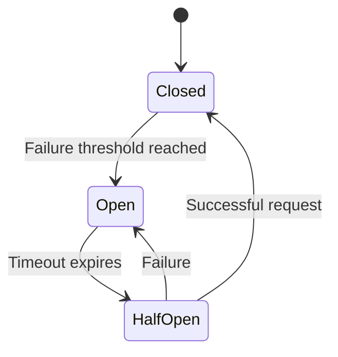

## 11.8 Circuit Breaker Pattern in Haskell

In the world of microservices, ensuring system resilience and preventing cascading failures is crucial. The Circuit Breaker Pattern is a design pattern used to detect failures and encapsulate the logic of preventing a failure from constantly recurring during maintenance, temporary external system failure, or unexpected system difficulties. In this section, we will delve into the Circuit Breaker Pattern, its implementation in Haskell, and how it can be used to enhance the resilience of microservices.

### Circuit Breaker Concept

The Circuit Breaker Pattern is inspired by electrical circuit breakers that prevent electrical overloads. In software, it acts as a proxy for operations that might fail, such as network calls or database queries. The circuit breaker monitors the number of failures and, once a threshold is reached, opens the circuit to prevent further attempts. This allows the system to recover and prevents cascading failures.

#### Key Concepts

- **Closed State**: The circuit is closed, and requests are allowed to pass through. If a failure occurs, it increments a failure counter.
- **Open State**: Once the failure threshold is reached, the circuit opens, and requests are immediately failed without attempting the operation.
- **Half-Open State**: After a timeout period, the circuit allows a limited number of test requests to determine if the issue has been resolved. If successful, the circuit closes; otherwise, it remains open.

### Implementation in Haskell

Haskell's strong type system and functional nature make it an excellent choice for implementing the Circuit Breaker Pattern. We can use existing libraries like `circuit-breaker` or implement custom logic to suit specific needs.

#### Using the `circuit-breaker` Library

The `circuit-breaker` library provides a straightforward way to implement this pattern in Haskell. It offers a configurable circuit breaker that can be used to wrap any IO operation.

```haskell
import Control.CircuitBreaker
import Network.HTTP.Client (newManager, defaultManagerSettings, httpLbs, parseRequest)

-- Define a circuit breaker configuration
circuitBreakerConfig :: CircuitBreakerConfig
circuitBreakerConfig = defaultCircuitBreakerConfig
  { failureThreshold = 5
  , resetTimeout = 30000  -- 30 seconds
  }

-- Initialize the circuit breaker
initializeCircuitBreaker :: IO (CircuitBreaker IO)
initializeCircuitBreaker = newCircuitBreaker circuitBreakerConfig

-- Function to perform an HTTP request with a circuit breaker
performRequest :: CircuitBreaker IO -> IO ()
performRequest breaker = do
  manager <- newManager defaultManagerSettings
  request <- parseRequest "http://example.com"
  result <- withCircuitBreaker breaker (httpLbs request manager)
  case result of
    Left CircuitOpen -> putStrLn "Circuit is open, request not attempted."
    Left (CircuitFailure err) -> putStrLn $ "Request failed: " ++ show err
    Right response -> putStrLn $ "Request succeeded: " ++ show response
```

In this example, we configure a circuit breaker with a failure threshold and a reset timeout. We then wrap an HTTP request with the circuit breaker, handling different outcomes based on the circuit's state.

#### Custom Implementation

For more control, you can implement a custom circuit breaker using Haskell's concurrency primitives and state management.

```haskell
import Control.Concurrent
import Control.Exception
import Data.IORef

data CircuitState = Closed | Open | HalfOpen deriving (Eq, Show)

data CircuitBreaker = CircuitBreaker
  { state :: IORef CircuitState
  , failureCount :: IORef Int
  , failureThreshold :: Int
  , resetTimeout :: Int
  }

newCircuitBreaker :: Int -> Int -> IO CircuitBreaker
newCircuitBreaker threshold timeout = do
  stateRef <- newIORef Closed
  failureRef <- newIORef 0
  return $ CircuitBreaker stateRef failureRef threshold timeout

attemptOperation :: CircuitBreaker -> IO a -> IO (Either SomeException a)
attemptOperation breaker operation = do
  currentState <- readIORef (state breaker)
  case currentState of
    Open -> return $ Left $ toException $ userError "Circuit is open"
    _ -> do
      result <- try operation
      case result of
        Left _ -> do
          modifyIORef' (failureCount breaker) (+1)
          failures <- readIORef (failureCount breaker)
          when (failures >= failureThreshold breaker) $ do
            writeIORef (state breaker) Open
            _ <- forkIO $ threadDelay (resetTimeout breaker * 1000) >> writeIORef (state breaker) HalfOpen
            return ()
          return result
        Right _ -> do
          writeIORef (failureCount breaker) 0
          writeIORef (state breaker) Closed
          return result
```

This custom implementation uses `IORef` to manage the circuit state and failure count. It attempts an operation and updates the circuit state based on the outcome.

### Visualizing the Circuit Breaker Pattern

To better understand the flow of the Circuit Breaker Pattern, let's visualize it using a state diagram.



**Diagram Description**: This state diagram illustrates the transitions between the different states of a circuit breaker: Closed, Open, and Half-Open. The transitions are triggered by failure thresholds and timeouts.

### Key Participants

- **Circuit Breaker**: Monitors the operation and transitions between states based on failures and timeouts.
- **Operation**: The action being monitored, such as a network call or database query.
- **Client**: The entity making requests through the circuit breaker.

### Applicability

The Circuit Breaker Pattern is applicable in scenarios where:

- You need to prevent cascading failures in distributed systems.
- You want to provide a fallback mechanism for failed operations.
- You aim to improve system resilience and fault tolerance.

### Design Considerations

- **Thresholds and Timeouts**: Carefully choose failure thresholds and reset timeouts based on your system's requirements.
- **Fallback Strategies**: Implement fallback mechanisms for when the circuit is open.
- **Monitoring and Logging**: Track circuit breaker state changes and failures for better observability.

### Haskell Unique Features

Haskell's strong type system and concurrency support make it well-suited for implementing the Circuit Breaker Pattern. The use of `IORef` for state management and `try` for exception handling are examples of leveraging Haskell's features.

### Differences and Similarities

The Circuit Breaker Pattern is often confused with the Retry Pattern. While both aim to handle failures, the Circuit Breaker Pattern prevents repeated attempts during failures, whereas the Retry Pattern focuses on retrying operations.

### Try It Yourself

Experiment with the provided code examples by modifying the failure threshold and reset timeout values. Observe how the circuit breaker behaves under different conditions. You can also try wrapping different types of operations, such as database queries or file I/O, with the circuit breaker.

### References

- [circuit-breaker Library](https://hackage.haskell.org/package/circuit-breaker)

### Knowledge Check

- What are the three states of a circuit breaker?
- How does the Circuit Breaker Pattern enhance system resilience?
- What are some considerations when implementing a circuit breaker?

### Embrace the Journey

Remember, mastering the Circuit Breaker Pattern is just one step towards building resilient microservices. As you continue your journey, explore other patterns and techniques to enhance your systems. Keep experimenting, stay curious, and enjoy the process!

## Quiz: Circuit Breaker Pattern in Haskell



### What is the primary purpose of the Circuit Breaker Pattern?

- [x] To prevent cascading failures in distributed systems
- [ ] To enhance data encryption
- [ ] To optimize database queries
- [ ] To improve user interface design

> **Explanation:** The Circuit Breaker Pattern is designed to prevent cascading failures by managing the state of operations and preventing repeated attempts during failures.

### Which state does a circuit breaker enter after the failure threshold is reached?

- [ ] Closed
- [x] Open
- [ ] Half-Open
- [ ] Reset

> **Explanation:** When the failure threshold is reached, the circuit breaker transitions to the Open state, preventing further attempts.

### What happens in the Half-Open state of a circuit breaker?

- [x] A limited number of test requests are allowed
- [ ] All requests are blocked
- [ ] The circuit breaker resets immediately
- [ ] The failure count is incremented

> **Explanation:** In the Half-Open state, the circuit breaker allows a limited number of test requests to determine if the issue has been resolved.

### Which Haskell feature is commonly used for state management in a custom circuit breaker implementation?

- [ ] Monad Transformers
- [ ] Type Classes
- [x] IORef
- [ ] Functors

> **Explanation:** `IORef` is commonly used for state management in Haskell, allowing mutable state within the IO monad.

### How can you monitor the state changes of a circuit breaker in Haskell?

- [x] By logging state transitions
- [ ] By using type-level programming
- [ ] By implementing a custom monad
- [ ] By using lazy evaluation

> **Explanation:** Monitoring state changes through logging provides observability into the circuit breaker's behavior.

### What is a key difference between the Circuit Breaker Pattern and the Retry Pattern?

- [x] Circuit Breaker prevents repeated attempts during failures
- [ ] Retry Pattern prevents cascading failures
- [ ] Circuit Breaker focuses on retrying operations
- [ ] Retry Pattern manages state transitions

> **Explanation:** The Circuit Breaker Pattern prevents repeated attempts during failures, while the Retry Pattern focuses on retrying operations.

### Which library can be used to implement the Circuit Breaker Pattern in Haskell?

- [x] circuit-breaker
- [ ] lens
- [ ] aeson
- [ ] warp

> **Explanation:** The `circuit-breaker` library provides a straightforward way to implement the Circuit Breaker Pattern in Haskell.

### What should be considered when choosing failure thresholds and reset timeouts?

- [x] System requirements and behavior
- [ ] Code readability
- [ ] Compilation speed
- [ ] User interface design

> **Explanation:** Failure thresholds and reset timeouts should be chosen based on the system's requirements and behavior to ensure effective circuit breaker operation.

### True or False: The Circuit Breaker Pattern can be used to wrap any IO operation in Haskell.

- [x] True
- [ ] False

> **Explanation:** The Circuit Breaker Pattern can be applied to any IO operation, such as network calls or database queries, to manage failures.

### What is the role of the client in the Circuit Breaker Pattern?

- [x] To make requests through the circuit breaker
- [ ] To manage state transitions
- [ ] To handle exceptions
- [ ] To log failures

> **Explanation:** The client is the entity that makes requests through the circuit breaker, relying on it to manage failures and state transitions.


