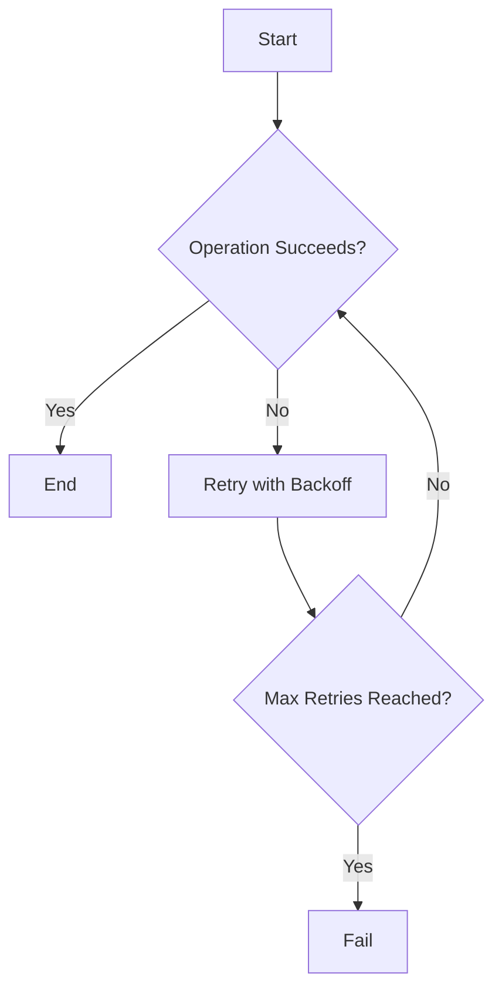

## 11.9 Retry and Backoff Strategies

In the world of microservices, transient failures are a common occurrence. These failures can arise from network issues, temporary unavailability of services, or resource constraints. To build resilient systems, it's crucial to implement retry mechanisms and backoff strategies. In this section, we will delve into these concepts, focusing on their implementation in Haskell using the `retry` library.

### Retry Mechanisms

Retry mechanisms are essential for handling transient failures. They involve reattempting a failed operation in the hope that it will succeed on subsequent tries. This approach is particularly useful in distributed systems where failures are often temporary.

#### Key Concepts

- **Transient Failures**: Temporary issues that can be resolved by retrying the operation.
- **Idempotency**: Ensuring that retrying an operation does not cause unintended side effects.
- **Retry Policies**: Defining how and when retries should occur.

#### Implementing Retry Mechanisms

In Haskell, the `retry` library provides a robust framework for implementing retry mechanisms. It allows you to define retry policies and apply them to actions that may fail.

```haskell
import Control.Retry

-- Define a retry policy with exponential backoff
retryPolicy :: RetryPolicy
retryPolicy = exponentialBackoff 1000000 <> limitRetries 5

-- A sample action that might fail
sampleAction :: IO ()
sampleAction = putStrLn "Attempting action..." >> error "Simulated failure"

-- Applying the retry policy to the action
main :: IO ()
main = recovering retryPolicy [const $ Handler (\\(_ :: SomeException) -> return True)] $ \_ -> sampleAction
```

In this example, we define a retry policy with exponential backoff and a limit of 5 retries. The `recovering` function applies this policy to `sampleAction`, retrying it upon failure.

### Backoff Strategies

Backoff strategies are techniques used to prevent overwhelming a failing service with repeated requests. They involve increasing the delay between retries, allowing the system time to recover.

#### Types of Backoff Strategies

- **Fixed Backoff**: A constant delay between retries.
- **Exponential Backoff**: Increasing delays, typically doubling each time.
- **Jitter**: Adding randomness to delays to prevent synchronized retries.

#### Exponential Backoff with Jitter

Exponential backoff with jitter is a popular strategy as it combines increasing delays with randomness, reducing the likelihood of synchronized retries.

```haskell
import System.Random (randomRIO)

-- Exponential backoff with jitter
exponentialBackoffWithJitter :: Int -> Int -> IO Int
exponentialBackoffWithJitter base maxDelay = do
    delay <- randomRIO (0, base)
    return $ min maxDelay (base + delay)

-- Example usage
main :: IO ()
main = do
    delay <- exponentialBackoffWithJitter 1000000 32000000
    putStrLn $ "Retrying after delay: " ++ show delay
```

In this code, `exponentialBackoffWithJitter` calculates a delay with added randomness, ensuring that retries are staggered.

### Implementation in Haskell

To implement retry and backoff strategies in Haskell, we can leverage the `retry` library, which provides a comprehensive set of tools for defining and applying retry policies.

#### Using the `retry` Library

The `retry` library offers a flexible way to define retry policies and apply them to actions. It supports various backoff strategies, including exponential backoff with jitter.

- **Retry Policies**: Define how retries should be conducted.
- **Handlers**: Specify conditions under which retries should occur.
- **Recovering**: Apply retry policies to actions.

#### Example: Resilient Service Client

Let's implement a resilient service client that retries requests with exponential backoff.

```haskell
import Control.Retry
import Network.HTTP.Client
import Network.HTTP.Types.Status (statusCode)

-- Define a retry policy with exponential backoff and jitter
retryPolicy :: RetryPolicy
retryPolicy = exponentialBackoff 1000000 <> limitRetries 5

-- A function to perform an HTTP request with retries
performRequest :: Manager -> Request -> IO (Response ByteString)
performRequest manager request = recovering retryPolicy [const $ Handler shouldRetry] $ \_ -> do
    response <- httpLbs request manager
    let code = statusCode $ responseStatus response
    if code >= 500
        then error "Server error, retrying..."
        else return response

-- Determine if a request should be retried
shouldRetry :: SomeException -> IO Bool
shouldRetry _ = return True

main :: IO ()
main = do
    manager <- newManager defaultManagerSettings
    request <- parseRequest "http://example.com"
    response <- performRequest manager request
    putStrLn $ "Response received: " ++ show (responseBody response)
```

In this example, `performRequest` performs an HTTP request with retries. It uses a retry policy with exponential backoff and retries on server errors.

### Design Considerations

When implementing retry and backoff strategies, consider the following:

- **Idempotency**: Ensure that operations can be safely retried without causing side effects.
- **Timeouts**: Set appropriate timeouts to prevent indefinite retries.
- **Monitoring**: Track retry attempts and failures to identify issues.
- **Circuit Breakers**: Use circuit breakers to stop retries when a service is consistently failing.

### Haskell Unique Features

Haskell's strong type system and functional nature make it well-suited for implementing retry and backoff strategies. The `retry` library leverages Haskell's capabilities to provide a concise and expressive API.

- **Type Safety**: Ensure that retry policies are applied correctly.
- **Composability**: Combine retry policies using monoidal operations.
- **Purity**: Maintain purity by handling side effects explicitly.

### Differences and Similarities

Retry and backoff strategies are common across programming languages, but Haskell's approach emphasizes type safety and composability. The `retry` library provides a declarative way to define and apply retry policies, making it distinct from imperative approaches in other languages.

### Visualizing Retry and Backoff Strategies

To better understand retry and backoff strategies, let's visualize the process using a flowchart.



This flowchart illustrates the retry process, where an operation is retried with backoff until it succeeds or the maximum retries are reached.

### Try It Yourself

Experiment with the code examples provided. Try modifying the retry policy, adjusting the backoff strategy, or simulating different failure scenarios. This hands-on approach will deepen your understanding of retry and backoff strategies in Haskell.

### References

- [retry Library](https://hackage.haskell.org/package/retry)

## Quiz: Retry and Backoff Strategies



### What is the primary purpose of retry mechanisms in microservices?

- [x] To handle transient failures by reattempting failed operations.
- [ ] To permanently fix all types of failures.
- [ ] To increase the complexity of the system.
- [ ] To reduce the need for error handling.

> **Explanation:** Retry mechanisms are designed to handle transient failures by reattempting operations that may succeed on subsequent tries.

### What is a key benefit of using exponential backoff in retry strategies?

- [x] It prevents overwhelming a failing service with repeated requests.
- [ ] It guarantees immediate success on the next retry.
- [ ] It simplifies the retry logic.
- [ ] It eliminates the need for monitoring.

> **Explanation:** Exponential backoff increases the delay between retries, preventing the service from being overwhelmed by repeated requests.

### Which Haskell library is commonly used for implementing retry strategies?

- [x] retry
- [ ] lens
- [ ] conduit
- [ ] aeson

> **Explanation:** The `retry` library is commonly used in Haskell for implementing retry strategies.

### What is the role of jitter in backoff strategies?

- [x] To add randomness to delays and prevent synchronized retries.
- [ ] To ensure retries occur at fixed intervals.
- [ ] To reduce the number of retries.
- [ ] To increase the complexity of the retry logic.

> **Explanation:** Jitter adds randomness to delays, preventing synchronized retries that could overwhelm a service.

### How can you ensure that retrying an operation does not cause unintended side effects?

- [x] By ensuring the operation is idempotent.
- [ ] By increasing the number of retries.
- [ ] By using fixed backoff.
- [ ] By ignoring failures.

> **Explanation:** Ensuring that an operation is idempotent means that retrying it will not cause unintended side effects.

### What is a common design consideration when implementing retry strategies?

- [x] Setting appropriate timeouts to prevent indefinite retries.
- [ ] Ignoring the number of retries.
- [ ] Using only fixed backoff strategies.
- [ ] Avoiding monitoring of retries.

> **Explanation:** Setting appropriate timeouts is important to prevent indefinite retries and ensure system stability.

### Which of the following is a type of backoff strategy?

- [x] Fixed Backoff
- [ ] Random Backoff
- [ ] Linear Backoff
- [ ] Circular Backoff

> **Explanation:** Fixed Backoff is a type of backoff strategy where retries occur at constant intervals.

### What is the benefit of using the `retry` library in Haskell?

- [x] It provides a flexible and declarative way to define retry policies.
- [ ] It eliminates the need for error handling.
- [ ] It simplifies all types of programming tasks.
- [ ] It guarantees success on the first retry.

> **Explanation:** The `retry` library provides a flexible and declarative way to define and apply retry policies in Haskell.

### What is the purpose of a retry policy in the `retry` library?

- [x] To define how and when retries should occur.
- [ ] To eliminate the need for retries.
- [ ] To increase the number of failures.
- [ ] To simplify error handling.

> **Explanation:** A retry policy defines how and when retries should occur, guiding the retry process.

### True or False: Exponential backoff with jitter is a strategy that combines increasing delays with randomness.

- [x] True
- [ ] False

> **Explanation:** Exponential backoff with jitter combines increasing delays with randomness to prevent synchronized retries.



Remember, mastering retry and backoff strategies is crucial for building resilient microservices. Keep experimenting, stay curious, and enjoy the journey!


