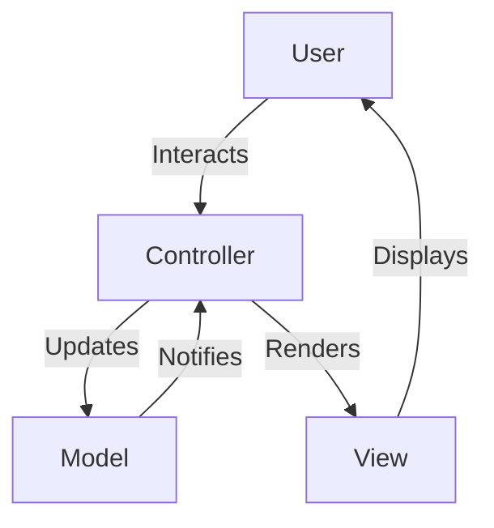

## 12.1 Model-View-Controller (MVC) in Haskell

The Model-View-Controller (MVC) pattern is a fundamental architectural pattern used to separate concerns in software applications. It divides an application into three interconnected components: the Model, the View, and the Controller. This separation helps manage complexity, improve code maintainability, and facilitate parallel development. In this section, we will explore how to implement the MVC pattern in Haskell, leveraging its unique features and powerful web frameworks like Yesod and Scotty.

### Understanding the MVC Pattern

#### Intent

The MVC pattern aims to separate the internal representations of information (Model) from the ways that information is presented to and accepted from the user (View), and the way that the user interacts with the application (Controller).

#### Key Participants

- **Model**: Represents the data and the business logic of the application. It directly manages the data, logic, and rules of the application.
- **View**: Displays the data to the user and sends user commands to the Controller. It represents the UI of the application.
- **Controller**: Acts as an interface between Model and View. It processes user input, interacts with the Model, and updates the View.

### Applicability

Use the MVC pattern when:

- You want to separate the user interface logic from business logic.
- You need to support multiple views for the same data.
- You aim to improve code reusability and testability.

### Implementing MVC in Haskell

Haskell, with its strong type system and functional programming paradigm, offers unique advantages for implementing the MVC pattern. Let's explore how to implement MVC using two popular Haskell web frameworks: Yesod and Scotty.

#### Yesod Framework

Yesod is a Haskell web framework that emphasizes type safety and compile-time guarantees. It is well-suited for building robust web applications with the MVC architecture.

##### Setting Up a Yesod Project

To start a Yesod project, ensure you have the Haskell Tool Stack installed. Then, create a new Yesod project:

```bash
stack new my-yesod-app yesod-simple
cd my-yesod-app
stack setup
stack build
stack exec -- yesod devel
```

##### Model

In Yesod, models are defined using Persistent, a type-safe database library. Here's an example of a simple model for a blog post:

```haskell
-- models/BlogPost.hs
{-# LANGUAGE GADTs #-}
{-# LANGUAGE TypeFamilies #-}
{-# LANGUAGE TemplateHaskell #-}
{-# LANGUAGE QuasiQuotes #-}
{-# LANGUAGE MultiParamTypeClasses #-}
{-# LANGUAGE GeneralizedNewtypeDeriving #-}
{-# LANGUAGE DeriveGeneric #-}

import Database.Persist.TH

share [mkPersist sqlSettings, mkMigrate "migrateAll"] [persistLowerCase|
BlogPost
    title String
    content Text
    deriving Show
|]
```

##### View

Views in Yesod are typically defined using Hamlet, a type-safe HTML templating language. Here's a simple view for displaying a blog post:

```haskell
-- templates/blogpost.hamlet
$doctype 5
<html>
    <head>
        <title>#{postTitle post}
    <body>
        <h1>#{postTitle post}
        <p>#{postContent post}
```

##### Controller

Controllers in Yesod are defined as handlers. Here's a simple handler to display a blog post:

```haskell
-- Handler/BlogPost.hs
getBlogPostR :: BlogPostId -> Handler Html
getBlogPostR postId = do
    post <- runDB $ get404 postId
    defaultLayout $ do
        setTitle . toHtml $ blogPostTitle post
        $(widgetFile "blogpost")
```

#### Scotty Framework

Scotty is a lightweight Haskell web framework inspired by Ruby's Sinatra. It is ideal for small to medium-sized applications and provides a simple way to implement the MVC pattern.

##### Setting Up a Scotty Project

To start a Scotty project, create a new Haskell project and add Scotty to your dependencies:

```bash
stack new my-scotty-app
cd my-scotty-app
echo 'scotty' >> package.yaml
stack setup
stack build
```

##### Model

In Scotty, you can define models using Haskell's data types. Here's an example of a simple model for a user:

```haskell
-- Model/User.hs
module Model.User where

data User = User
    { userId :: Int
    , userName :: String
    , userEmail :: String
    } deriving (Show, Eq)
```

##### View

Views in Scotty can be defined using BlazeHtml, a Haskell library for generating HTML. Here's a simple view for displaying a user:

```haskell
-- View/UserView.hs
module View.UserView where

import Text.Blaze.Html5 as H
import Text.Blaze.Html5.Attributes as A
import Model.User

userView :: User -> Html
userView user = H.docTypeHtml $ do
    H.head $ H.title $ H.toHtml (userName user)
    H.body $ do
        H.h1 $ H.toHtml (userName user)
        H.p $ H.toHtml (userEmail user)
```

##### Controller

Controllers in Scotty are defined using routes. Here's a simple controller to display a user:

```haskell
-- Controller/UserController.hs
module Controller.UserController where

import Web.Scotty
import Model.User
import View.UserView

getUser :: ActionM ()
getUser = do
    let user = User 1 "John Doe" "john@example.com"
    html $ renderHtml $ userView user
```

### Visualizing MVC in Haskell

Below is a diagram illustrating the MVC architecture in a Haskell web application using Yesod:



**Diagram Description**: This diagram shows the flow of interaction in the MVC pattern. The user interacts with the Controller, which updates the Model. The Model notifies the Controller of changes, and the Controller renders the View, which is then displayed to the user.

### Haskell Unique Features

Haskell's strong type system and functional programming paradigm offer unique advantages for implementing the MVC pattern:

- **Type Safety**: Haskell's type system helps catch errors at compile time, reducing runtime errors.
- **Immutability**: Immutable data structures prevent unintended side effects, making the code more predictable.
- **Higher-Order Functions**: These allow for more abstract and reusable code, facilitating the separation of concerns.
- **Monads**: Monads provide a way to handle side effects, such as I/O operations, in a pure functional way.

### Design Considerations

When implementing the MVC pattern in Haskell, consider the following:

- **Framework Choice**: Choose a framework that aligns with your application's complexity and requirements. Yesod is suitable for larger applications, while Scotty is ideal for smaller projects.
- **Separation of Concerns**: Ensure a clear separation between the Model, View, and Controller to maintain code modularity and testability.
- **Type Safety**: Leverage Haskell's type system to enforce contracts between components and catch errors early.

### Differences and Similarities

The MVC pattern in Haskell shares similarities with its implementation in other languages, such as:

- **Separation of Concerns**: The core principle of separating the Model, View, and Controller remains the same.
- **Framework Support**: Like other languages, Haskell offers frameworks that facilitate MVC implementation.

However, Haskell's functional nature introduces differences:

- **Functional Paradigm**: Haskell's functional paradigm influences how controllers handle state and side effects.
- **Type System**: Haskell's type system provides stronger guarantees compared to dynamically typed languages.

### Try It Yourself

To deepen your understanding of MVC in Haskell, try modifying the code examples provided:

- **Add a new model**: Extend the BlogPost model to include a timestamp and author.
- **Create a new view**: Design a view that lists all blog posts.
- **Implement a new controller**: Add a controller action to create a new blog post.

### Knowledge Check

- **What are the key components of the MVC pattern?**
- **How does Haskell's type system benefit MVC implementation?**
- **What are the differences between Yesod and Scotty in terms of MVC support?**

### Embrace the Journey

Remember, mastering MVC in Haskell is just the beginning. As you progress, you'll build more complex and interactive applications. Keep experimenting, stay curious, and enjoy the journey!

## Quiz: Model-View-Controller (MVC) in Haskell



### What are the three main components of the MVC pattern?

- [x] Model, View, Controller
- [ ] Model, View, Component
- [ ] Module, View, Controller
- [ ] Model, Viewer, Controller

> **Explanation:** The MVC pattern consists of the Model, View, and Controller components.

### Which Haskell framework is known for its type safety and compile-time guarantees?

- [x] Yesod
- [ ] Scotty
- [ ] Snap
- [ ] Warp

> **Explanation:** Yesod is a Haskell web framework that emphasizes type safety and compile-time guarantees.

### What is the primary role of the Controller in the MVC pattern?

- [x] To process user input and update the Model
- [ ] To display data to the user
- [ ] To manage the database
- [ ] To handle network requests

> **Explanation:** The Controller processes user input, interacts with the Model, and updates the View.

### How does Haskell's type system benefit MVC implementation?

- [x] By catching errors at compile time
- [ ] By allowing dynamic typing
- [ ] By simplifying syntax
- [ ] By reducing code size

> **Explanation:** Haskell's type system helps catch errors at compile time, reducing runtime errors.

### What is a key advantage of using immutable data structures in Haskell?

- [x] Preventing unintended side effects
- [ ] Allowing direct memory access
- [ ] Enabling dynamic typing
- [ ] Simplifying syntax

> **Explanation:** Immutable data structures prevent unintended side effects, making the code more predictable.

### Which library is commonly used for HTML templating in Yesod?

- [x] Hamlet
- [ ] BlazeHtml
- [ ] Lucid
- [ ] Hakyll

> **Explanation:** Hamlet is a type-safe HTML templating language used in Yesod.

### What is the primary use of monads in Haskell?

- [x] To handle side effects in a pure functional way
- [ ] To enable dynamic typing
- [ ] To simplify syntax
- [ ] To reduce code size

> **Explanation:** Monads provide a way to handle side effects, such as I/O operations, in a pure functional way.

### Which framework is inspired by Ruby's Sinatra?

- [x] Scotty
- [ ] Yesod
- [ ] Snap
- [ ] Warp

> **Explanation:** Scotty is a lightweight Haskell web framework inspired by Ruby's Sinatra.

### What is a common use case for the MVC pattern?

- [x] Separating user interface logic from business logic
- [ ] Managing database connections
- [ ] Handling network requests
- [ ] Simplifying syntax

> **Explanation:** The MVC pattern is used to separate user interface logic from business logic.

### True or False: Haskell's functional paradigm influences how controllers handle state and side effects.

- [x] True
- [ ] False

> **Explanation:** Haskell's functional paradigm influences how controllers handle state and side effects.


