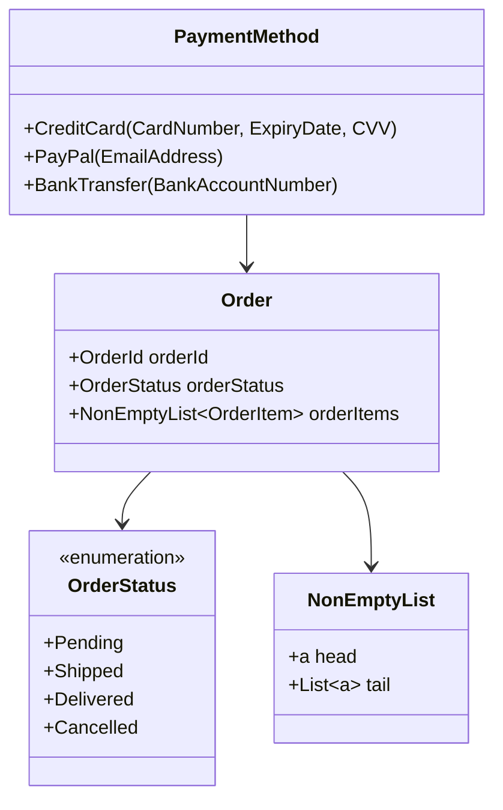

## 12.10 Domain Modeling with Types

In the realm of software engineering, domain modeling is a critical activity that involves representing the concepts and rules of a particular domain within a software system. Haskell, with its robust type system, offers a unique approach to domain modeling known as **Type-Driven Development (TDD)**. This approach leverages Haskell's type system to accurately model domain concepts, ensuring that invalid states are eliminated at compile time. In this section, we will explore the principles of type-driven development, the benefits it offers, and how to implement it effectively using Haskell's type system.

### Type-Driven Development

Type-driven development is a methodology that emphasizes the use of types to model domain concepts accurately. By encoding domain rules and constraints directly into the type system, developers can leverage the compiler to enforce these rules, reducing the likelihood of runtime errors and improving the overall reliability of the software.

#### Key Concepts

1. **Types as Contracts**: Types serve as contracts that define the expected behavior and constraints of data. By using types to represent domain concepts, we can ensure that only valid data is constructed and manipulated.

2. **Eliminating Invalid States**: One of the primary goals of type-driven development is to eliminate invalid states from the system. By designing types that only allow valid states, we can prevent many classes of errors at compile time.

3. **Expressive Type System**: Haskell's type system is highly expressive, allowing developers to define complex types that accurately represent domain concepts. Features such as algebraic data types, type classes, and phantom types provide powerful tools for modeling domains.

### Benefits of Type-Driven Development

Type-driven development offers several benefits that make it an attractive approach for domain modeling in Haskell:

- **Compile-Time Safety**: By encoding domain rules in types, many errors can be caught at compile time, reducing the need for extensive runtime checks.

- **Improved Documentation**: Types serve as documentation for the code, providing a clear and concise representation of domain concepts and constraints.

- **Enhanced Maintainability**: With types enforcing domain rules, the codebase becomes easier to maintain and refactor, as changes to domain logic are reflected in the type definitions.

- **Reduced Testing Overhead**: Since many errors are caught at compile time, the need for extensive testing is reduced, allowing developers to focus on testing more complex scenarios.

### Implementing Type-Driven Development in Haskell

To implement type-driven development in Haskell, we need to create custom data types that accurately represent domain concepts and leverage Haskell's type system to enforce domain rules. Let's explore some key techniques and patterns for achieving this.

#### Creating Custom Data Types

Custom data types are the foundation of type-driven development. By defining data types that encapsulate domain concepts, we can ensure that only valid data is constructed and manipulated.

```haskell
-- Define a data type for a non-empty list
data NonEmptyList a = NonEmpty a [a]

-- Define a data type for a positive integer
newtype PositiveInt = PositiveInt Int

-- Smart constructor for PositiveInt
mkPositiveInt :: Int -> Maybe PositiveInt
mkPositiveInt n
  | n > 0     = Just (PositiveInt n)
  | otherwise = Nothing
```

In the example above, we define a `NonEmptyList` data type that ensures a list is never empty, and a `PositiveInt` data type that represents positive integers. The `mkPositiveInt` function acts as a smart constructor, ensuring that only positive integers are constructed.

#### Leveraging Algebraic Data Types

Algebraic data types (ADTs) are a powerful feature of Haskell's type system that allow developers to define complex types by combining simpler types. ADTs are particularly useful for modeling domain concepts with multiple variants or states.

```haskell
-- Define an algebraic data type for a payment method
data PaymentMethod
  = CreditCard CardNumber ExpiryDate CVV
  | PayPal EmailAddress
  | BankTransfer BankAccountNumber

-- Define a data type for a card number
newtype CardNumber = CardNumber String

-- Define a data type for an expiry date
data ExpiryDate = ExpiryDate Month Year

-- Define a data type for a CVV
newtype CVV = CVV Int
```

In this example, we define a `PaymentMethod` ADT that represents different payment methods, each with its own set of required data. By using ADTs, we can model complex domain concepts with multiple variants in a type-safe manner.

#### Encoding Business Rules in Types

One of the key advantages of type-driven development is the ability to encode business rules directly in type definitions. This ensures that domain constraints are enforced by the compiler, reducing the likelihood of runtime errors.

```haskell
-- Define a data type for an order status
data OrderStatus
  = Pending
  | Shipped
  | Delivered
  | Cancelled

-- Define a data type for an order
data Order = Order
  { orderId     :: OrderId
  , orderStatus :: OrderStatus
  , orderItems  :: NonEmptyList OrderItem
  }

-- Define a function to update the order status
updateOrderStatus :: Order -> OrderStatus -> Maybe Order
updateOrderStatus order newStatus =
  case (orderStatus order, newStatus) of
    (Pending, Shipped)   -> Just order { orderStatus = Shipped }
    (Shipped, Delivered) -> Just order { orderStatus = Delivered }
    (Pending, Cancelled) -> Just order { orderStatus = Cancelled }
    _                    -> Nothing
```

In this example, we define an `Order` data type with an `OrderStatus` field that represents the status of an order. The `updateOrderStatus` function enforces business rules by only allowing valid status transitions, ensuring that invalid states are eliminated at compile time.

### Visualizing Domain Models

To better understand the structure and relationships of domain models, we can use diagrams to visualize the types and their interactions. Below is a class diagram representing the `PaymentMethod` and `Order` domain models.



This diagram illustrates the relationships between the `PaymentMethod`, `Order`, and `OrderStatus` types, providing a clear visual representation of the domain model.

### Haskell Unique Features for Domain Modeling

Haskell offers several unique features that make it particularly well-suited for domain modeling:

- **Type Classes**: Type classes allow for polymorphic functions that can operate on different types, providing a powerful mechanism for defining generic operations on domain concepts.

- **Phantom Types**: Phantom types are types that do not have any runtime representation but are used to enforce compile-time constraints, allowing for more expressive domain models.

- **GADTs (Generalized Algebraic Data Types)**: GADTs extend the capabilities of ADTs by allowing more precise type definitions, enabling developers to encode complex domain rules in types.

- **Type Families**: Type families provide a way to define type-level functions, allowing for more flexible and reusable domain models.

### Differences and Similarities with Other Patterns

Domain modeling with types shares similarities with other design patterns, such as the **Strategy Pattern** and **State Pattern**, in that it involves defining different behaviors or states. However, domain modeling with types focuses on using the type system to enforce domain rules and constraints, whereas other patterns may rely on runtime polymorphism or state management.

### Design Considerations

When implementing domain modeling with types, consider the following:

- **Balance Complexity**: While types can encode complex domain rules, avoid overcomplicating the type system, as this can lead to difficult-to-understand code.

- **Use Smart Constructors**: Smart constructors are functions that enforce constraints when creating instances of a type, ensuring that only valid data is constructed.

- **Leverage Type Inference**: Haskell's type inference can simplify code by reducing the need for explicit type annotations, making the codebase more concise and readable.

- **Consider Performance**: While type-driven development offers many benefits, be mindful of potential performance implications, especially when dealing with large or complex types.

### Try It Yourself

To deepen your understanding of domain modeling with types, try modifying the code examples provided in this section. Experiment with adding new domain concepts, encoding additional business rules, or using advanced Haskell features such as GADTs or type families to enhance the domain model.

### Knowledge Check

- What are the key benefits of type-driven development in Haskell?
- How can algebraic data types be used to model domain concepts with multiple variants?
- What is the role of smart constructors in type-driven development?
- How do phantom types enhance domain modeling in Haskell?
- What are some design considerations to keep in mind when implementing domain modeling with types?

### Embrace the Journey

Remember, mastering domain modeling with types is a journey. As you continue to explore Haskell's type system, you'll discover new ways to leverage its power to create robust and reliable software. Keep experimenting, stay curious, and enjoy the journey!

## Quiz: Domain Modeling with Types



### What is the primary goal of type-driven development in Haskell?

- [x] To eliminate invalid states at compile time
- [ ] To improve runtime performance
- [ ] To simplify code syntax
- [ ] To enhance user interface design

> **Explanation:** The primary goal of type-driven development is to eliminate invalid states at compile time by using types to enforce domain rules and constraints.

### Which Haskell feature allows for defining complex types by combining simpler types?

- [x] Algebraic Data Types (ADTs)
- [ ] Type Classes
- [ ] Phantom Types
- [ ] Type Families

> **Explanation:** Algebraic Data Types (ADTs) allow for defining complex types by combining simpler types, making them ideal for modeling domain concepts with multiple variants.

### What is the purpose of a smart constructor in type-driven development?

- [x] To enforce constraints when creating instances of a type
- [ ] To improve code readability
- [ ] To optimize runtime performance
- [ ] To simplify type definitions

> **Explanation:** Smart constructors are used to enforce constraints when creating instances of a type, ensuring that only valid data is constructed.

### How do phantom types enhance domain modeling in Haskell?

- [x] By enforcing compile-time constraints without runtime representation
- [ ] By improving runtime performance
- [ ] By simplifying code syntax
- [ ] By enhancing user interface design

> **Explanation:** Phantom types enhance domain modeling by enforcing compile-time constraints without having any runtime representation, allowing for more expressive domain models.

### What is a key benefit of using Haskell's type system for domain modeling?

- [x] Compile-time safety
- [ ] Improved runtime performance
- [ ] Simplified code syntax
- [ ] Enhanced user interface design

> **Explanation:** A key benefit of using Haskell's type system for domain modeling is compile-time safety, as it allows many errors to be caught at compile time.

### Which feature of Haskell allows for polymorphic functions that can operate on different types?

- [x] Type Classes
- [ ] Algebraic Data Types (ADTs)
- [ ] Phantom Types
- [ ] Type Families

> **Explanation:** Type classes allow for polymorphic functions that can operate on different types, providing a powerful mechanism for defining generic operations on domain concepts.

### What is the role of GADTs in domain modeling with types?

- [x] To allow more precise type definitions
- [ ] To improve runtime performance
- [ ] To simplify code syntax
- [ ] To enhance user interface design

> **Explanation:** GADTs (Generalized Algebraic Data Types) allow for more precise type definitions, enabling developers to encode complex domain rules in types.

### What should be considered when implementing domain modeling with types?

- [x] Balance complexity and avoid overcomplicating the type system
- [ ] Focus solely on runtime performance
- [ ] Simplify code syntax at all costs
- [ ] Prioritize user interface design

> **Explanation:** When implementing domain modeling with types, it's important to balance complexity and avoid overcomplicating the type system, as this can lead to difficult-to-understand code.

### What is a potential performance implication of type-driven development?

- [x] Dealing with large or complex types may impact performance
- [ ] Improved runtime performance
- [ ] Simplified code syntax
- [ ] Enhanced user interface design

> **Explanation:** While type-driven development offers many benefits, dealing with large or complex types may impact performance, so it's important to be mindful of potential performance implications.

### True or False: Type-driven development reduces the need for extensive runtime checks.

- [x] True
- [ ] False

> **Explanation:** True. Type-driven development reduces the need for extensive runtime checks by encoding domain rules in types, allowing many errors to be caught at compile time.


