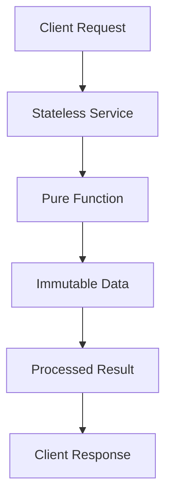

## 12.11 Functional Microservices Architecture

In the evolving landscape of software architecture, microservices have emerged as a powerful paradigm for building scalable and maintainable systems. When combined with the principles of functional programming, microservices can achieve new levels of reliability, testability, and performance. In this section, we will explore the concept of Functional Microservices Architecture using Haskell, a language renowned for its strong support for functional programming.

### Functional Approach

The functional approach to microservices architecture emphasizes the use of pure functions and immutable data structures. This approach aligns well with the core principles of functional programming, offering several advantages:

- **Pure Functions**: Functions that do not have side effects and return the same output for the same input. This predictability simplifies reasoning about code behavior.
- **Immutability**: Data structures that cannot be modified after creation. This ensures that data remains consistent and reduces the risk of unintended side effects.
- **Statelessness**: Services that do not maintain internal state between requests, allowing for easier scaling and parallelization.

#### Key Concepts

1. **Pure Functions and Immutability**: At the heart of functional microservices is the use of pure functions and immutable data. This ensures that each service is predictable and easy to test.

2. **Stateless Services**: By designing services to be stateless, we can achieve greater scalability and resilience. Stateless services can be easily replicated and distributed across multiple nodes.

3. **Functional Composition**: Leveraging higher-order functions and function composition allows for building complex behaviors from simple, reusable components.

4. **Concurrency and Parallelism**: Haskell's strong support for concurrency and parallelism enables efficient execution of microservices, especially in data-intensive applications.

5. **Type Safety**: Haskell's strong static type system helps catch errors at compile time, reducing runtime failures and increasing system reliability.

### Benefits

The functional approach to microservices architecture offers several benefits:

- **Easier Reasoning**: Pure functions and immutability make it easier to reason about code behavior, reducing cognitive load and improving maintainability.
- **Improved Testing**: Stateless services and pure functions are inherently easier to test, as they do not depend on external state.
- **Parallelization**: Stateless services can be easily parallelized, improving performance and scalability.
- **Fault Tolerance**: Immutable data structures and stateless services contribute to fault tolerance, as they reduce the risk of data corruption and state inconsistencies.

### Implementation

Implementing functional microservices in Haskell involves several key steps:

1. **Designing Stateless Services**: Identify the core functionality of each service and design it as a stateless component. Use pure functions to encapsulate business logic.

2. **Leveraging Haskell's Type System**: Use Haskell's type system to define clear and precise interfaces for each service. This helps ensure that services interact correctly and reduces the risk of errors.

3. **Utilizing Concurrency Primitives**: Take advantage of Haskell's concurrency primitives, such as Software Transactional Memory (STM) and the `async` library, to build responsive and efficient services.

4. **Building Composable Pipelines**: Use function composition and higher-order functions to build complex data processing pipelines from simple, reusable components.

5. **Ensuring Immutability**: Use Haskell's immutable data structures to ensure that data remains consistent and free from unintended side effects.

### Example: Stateless Computation Services

Let's consider an example of a stateless computation service in a data processing pipeline. This service receives data, processes it using pure functions, and returns the result without maintaining any internal state.

```haskell
-- Define a data type for input data
data InputData = InputData { value :: Int } deriving (Show)

-- Define a pure function to process the data
processData :: InputData -> Int
processData input = value input * 2

-- Define a function to handle requests
handleRequest :: InputData -> IO Int
handleRequest input = do
    let result = processData input
    return result

-- Main function to simulate a service request
main :: IO ()
main = do
    let input = InputData 10
    result <- handleRequest input
    putStrLn $ "Processed result: " ++ show result
```

In this example, the `processData` function is a pure function that doubles the input value. The `handleRequest` function simulates a service request by calling `processData` and returning the result. The service is stateless, as it does not maintain any internal state between requests.

### Visualizing Functional Microservices Architecture

To better understand the flow of data and interactions in a functional microservices architecture, let's visualize the architecture using a Mermaid.js diagram.



**Diagram Description**: This diagram illustrates the flow of a client request through a stateless service. The service processes the request using a pure function, operates on immutable data, and returns the processed result to the client.

### Design Considerations

When designing functional microservices, consider the following:

- **Service Boundaries**: Clearly define the boundaries of each service to ensure that they are cohesive and focused on a single responsibility.
- **Data Flow**: Design data flow between services to be efficient and minimize data duplication.
- **Error Handling**: Use Haskell's error handling mechanisms, such as the `Either` and `Maybe` monads, to handle errors gracefully.
- **Scalability**: Design services to be easily scalable by ensuring they are stateless and can be replicated across multiple nodes.
- **Security**: Implement security measures, such as authentication and authorization, to protect services from unauthorized access.

### Haskell Unique Features

Haskell offers several unique features that make it well-suited for building functional microservices:

- **Lazy Evaluation**: Haskell's lazy evaluation allows for efficient handling of large data sets and complex computations.
- **Strong Type System**: Haskell's type system helps ensure correctness and reliability by catching errors at compile time.
- **Concurrency Primitives**: Haskell provides powerful concurrency primitives, such as STM and `async`, for building responsive and efficient services.
- **Immutability**: Haskell's immutable data structures ensure data consistency and reduce the risk of unintended side effects.

### Differences and Similarities

Functional microservices architecture shares some similarities with traditional microservices architecture, such as the focus on small, independent services. However, it differs in its emphasis on pure functions, immutability, and statelessness. These differences lead to improved testability, scalability, and fault tolerance.

### Try It Yourself

To deepen your understanding of functional microservices architecture, try modifying the example code to implement additional features, such as error handling or logging. Experiment with different data processing functions and observe how the architecture handles various scenarios.

### Knowledge Check

- What are the key benefits of using pure functions and immutability in microservices architecture?
- How does statelessness contribute to the scalability and resilience of microservices?
- What role does Haskell's type system play in ensuring the reliability of microservices?
- How can concurrency primitives be used to build responsive and efficient services?

### Embrace the Journey

Remember, this is just the beginning. As you continue to explore functional microservices architecture, you'll discover new patterns and techniques for building scalable and maintainable systems. Keep experimenting, stay curious, and enjoy the journey!

## Quiz: Functional Microservices Architecture



### What is a key benefit of using pure functions in microservices architecture?

- [x] Easier reasoning and testing
- [ ] Increased complexity
- [ ] Slower performance
- [ ] Greater memory usage

> **Explanation:** Pure functions are easier to reason about and test because they do not have side effects and always produce the same output for the same input.

### How does immutability contribute to fault tolerance in microservices?

- [x] Reduces the risk of data corruption
- [ ] Increases the risk of data corruption
- [ ] Makes data harder to manage
- [ ] Slows down data processing

> **Explanation:** Immutability ensures that data cannot be modified after creation, reducing the risk of data corruption and improving fault tolerance.

### What is the role of statelessness in microservices architecture?

- [x] Facilitates scalability and parallelization
- [ ] Increases the complexity of services
- [ ] Requires more memory
- [ ] Slows down service response time

> **Explanation:** Statelessness allows services to be easily replicated and distributed, facilitating scalability and parallelization.

### Which Haskell feature helps catch errors at compile time?

- [x] Strong static type system
- [ ] Dynamic typing
- [ ] Lazy evaluation
- [ ] Concurrency primitives

> **Explanation:** Haskell's strong static type system helps catch errors at compile time, increasing reliability and reducing runtime failures.

### How can concurrency primitives be used in functional microservices?

- [x] To build responsive and efficient services
- [ ] To increase service complexity
- [ ] To slow down service response time
- [ ] To reduce service reliability

> **Explanation:** Concurrency primitives, such as STM and `async`, enable the building of responsive and efficient services by allowing concurrent execution.

### What is a key difference between functional and traditional microservices architecture?

- [x] Emphasis on pure functions and immutability
- [ ] Focus on stateful services
- [ ] Use of dynamic typing
- [ ] Reliance on mutable data

> **Explanation:** Functional microservices architecture emphasizes pure functions and immutability, unlike traditional microservices which may rely on stateful services and mutable data.

### How does lazy evaluation benefit functional microservices?

- [x] Efficient handling of large data sets
- [ ] Slower data processing
- [ ] Increased memory usage
- [ ] Reduced reliability

> **Explanation:** Lazy evaluation allows for efficient handling of large data sets by only evaluating data when needed, improving performance.

### What is a common pitfall to avoid in functional microservices architecture?

- [x] Overcomplicating with unnecessary state
- [ ] Using pure functions
- [ ] Ensuring immutability
- [ ] Leveraging concurrency

> **Explanation:** Overcomplicating services with unnecessary state can hinder scalability and maintainability, which is why statelessness is preferred.

### Why is it important to define clear service boundaries in microservices architecture?

- [x] To ensure services are cohesive and focused
- [ ] To increase service complexity
- [ ] To reduce service reliability
- [ ] To slow down service response time

> **Explanation:** Clear service boundaries ensure that services are cohesive and focused on a single responsibility, improving maintainability and scalability.

### True or False: Functional microservices architecture relies heavily on mutable data structures.

- [ ] True
- [x] False

> **Explanation:** Functional microservices architecture relies on immutable data structures to ensure data consistency and reduce the risk of unintended side effects.




