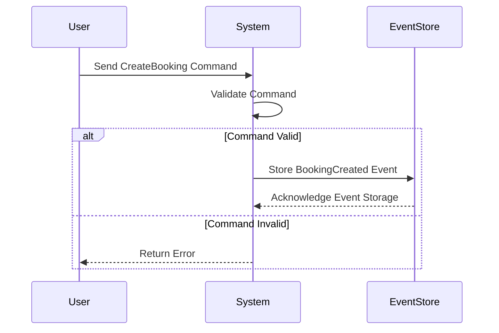

## 12.12 Event Modeling and Command Handling

In the realm of software architecture, **Event Modeling** and **Command Handling** are pivotal concepts that enable the design of systems that are both scalable and maintainable. These patterns are particularly well-suited to functional programming languages like Haskell, where immutability and type safety can be leveraged to create robust systems. In this section, we will delve into the intricacies of event modeling and command handling, exploring how these patterns can be implemented in Haskell using advanced techniques.

### Understanding Event Modeling

Event modeling is a design approach that focuses on capturing and processing events within a system. Events are significant changes in state that occur as a result of user actions or system processes. By modeling these events, we can create systems that are more intuitive and easier to reason about.

#### Key Concepts in Event Modeling

- **Events**: Represent state changes in the system. They are immutable and can be stored for auditing or replay purposes.
- **Commands**: Actions that are requested by users or other systems. Commands are processed to produce events.
- **Projections**: Views or representations of the current state of the system, derived from events.

#### Benefits of Event Modeling

- **Scalability**: Systems can be scaled horizontally by distributing event processing across multiple nodes.
- **Auditability**: Events provide a complete history of state changes, which can be used for auditing and debugging.
- **Flexibility**: New features can be added by introducing new event types without altering existing functionality.

### Implementing Event Modeling in Haskell

Haskell's strong type system and support for algebraic data types (ADTs) make it an ideal language for implementing event modeling. Let's explore how we can represent commands and events using ADTs and process them to update the system state.

#### Using Algebraic Data Types (ADTs)

ADTs in Haskell allow us to define complex data structures in a concise and expressive manner. We can use ADTs to represent commands and events in our system.

```haskell
-- Define a command type for a booking system
data BookingCommand
  = CreateBooking { customerId :: Int, roomId :: Int, date :: String }
  | CancelBooking { bookingId :: Int }
  deriving (Show, Eq)

-- Define an event type for a booking system
data BookingEvent
  = BookingCreated { bookingId :: Int, customerId :: Int, roomId :: Int, date :: String }
  | BookingCancelled { bookingId :: Int }
  deriving (Show, Eq)
```

In this example, we have defined two commands (`CreateBooking` and `CancelBooking`) and two corresponding events (`BookingCreated` and `BookingCancelled`). Each command and event carries the necessary data to perform its function.

#### Processing Commands to Generate Events

The core of event modeling is processing commands to generate events. This involves validating commands, applying business logic, and producing events that reflect the changes in the system.

```haskell
-- Function to process a command and generate an event
processCommand :: BookingCommand -> Either String BookingEvent
processCommand (CreateBooking cid rid date) =
  -- Validate the command and generate an event
  if isValidDate date
    then Right (BookingCreated 1 cid rid date) -- Assume booking ID is generated
    else Left "Invalid date format"
processCommand (CancelBooking bid) =
  -- Validate the command and generate an event
  if bookingExists bid
    then Right (BookingCancelled bid)
    else Left "Booking does not exist"

-- Helper functions for validation
isValidDate :: String -> Bool
isValidDate = not . null -- Simplified validation

bookingExists :: Int -> Bool
bookingExists = const True -- Assume all bookings exist for simplicity
```

In this code, we define a `processCommand` function that takes a `BookingCommand` and returns either an error message or a `BookingEvent`. The function validates the command and applies business logic to generate the appropriate event.

### Visualizing Event Flow

To better understand the flow of events and commands in a system, let's visualize the process using a sequence diagram.



This diagram illustrates the flow of a `CreateBooking` command from the user to the system, where it is validated and processed. If valid, a `BookingCreated` event is stored in the event store.

### Command Handling in Haskell

Command handling involves processing incoming commands and ensuring that they are executed correctly. In Haskell, we can leverage monads and other functional constructs to manage command execution and side effects.

#### Using the Reader Monad for Dependency Injection

The Reader Monad is a powerful tool for managing dependencies in Haskell. We can use it to inject dependencies such as databases or external services into our command handling logic.

```haskell
import Control.Monad.Reader

-- Define a type for the application environment
data AppEnv = AppEnv { dbConnection :: String }

-- Define a type for command handling with the Reader Monad
type CommandHandler a = ReaderT AppEnv IO a

-- Function to handle a booking command
handleBookingCommand :: BookingCommand -> CommandHandler (Either String BookingEvent)
handleBookingCommand cmd = do
  env <- ask -- Access the application environment
  liftIO $ putStrLn ("Handling command with DB: " ++ dbConnection env)
  return $ processCommand cmd
```

In this example, we define a `CommandHandler` type using the `ReaderT` monad transformer. The `handleBookingCommand` function accesses the application environment using `ask` and processes the command using `processCommand`.

### Event Sourcing and Projections

Event sourcing is a pattern where the state of a system is derived from a sequence of events. Projections are views of the current state, built by replaying events.

#### Implementing Event Sourcing

To implement event sourcing, we need to store events and replay them to reconstruct the system state. Haskell's immutable data structures and lazy evaluation make it well-suited for this pattern.

```haskell
-- Define a type for the event store
type EventStore = [BookingEvent]

-- Function to apply an event to the system state
applyEvent :: BookingEvent -> EventStore -> EventStore
applyEvent event store = event : store

-- Function to replay events and build a projection
replayEvents :: EventStore -> [(Int, String)] -- List of booking IDs and dates
replayEvents = foldr applyBooking []

-- Helper function to apply a booking event
applyBooking :: BookingEvent -> [(Int, String)] -> [(Int, String)]
applyBooking (BookingCreated bid _ _ date) acc = (bid, date) : acc
applyBooking (BookingCancelled bid) acc = filter ((/= bid) . fst) acc
```

In this code, we define an `EventStore` type as a list of `BookingEvent`s. The `applyEvent` function adds an event to the store, and `replayEvents` builds a projection of the current state by replaying events.

### Design Considerations

When implementing event modeling and command handling in Haskell, there are several design considerations to keep in mind:

- **Event Granularity**: Determine the appropriate level of detail for events. Too granular events can lead to performance issues, while too coarse events may lose important information.
- **Consistency**: Ensure that events are applied consistently to maintain system integrity.
- **Error Handling**: Implement robust error handling to manage invalid commands and failed event processing.
- **Scalability**: Design the system to handle large volumes of events and commands efficiently.

### Haskell Unique Features

Haskell offers several unique features that enhance event modeling and command handling:

- **Immutability**: Ensures that events and state changes are predictable and thread-safe.
- **Type Safety**: Provides compile-time guarantees that commands and events are processed correctly.
- **Lazy Evaluation**: Allows for efficient processing of large event streams without excessive memory usage.

### Differences and Similarities with Other Patterns

Event modeling and command handling share similarities with other patterns, such as CQRS (Command Query Responsibility Segregation) and event sourcing. However, they differ in their focus on modeling events as first-class citizens and using commands to drive state changes.

### Try It Yourself

To deepen your understanding of event modeling and command handling in Haskell, try modifying the code examples provided. Experiment with adding new command and event types, implementing additional validation logic, or creating more complex projections.

### Knowledge Check

- What are the key components of event modeling?
- How can ADTs be used to represent commands and events in Haskell?
- What role does the Reader Monad play in command handling?
- How does event sourcing differ from traditional state management?

### Embrace the Journey

Remember, mastering event modeling and command handling is a journey. As you continue to explore these patterns, you'll gain a deeper understanding of how to build scalable and maintainable systems in Haskell. Keep experimenting, stay curious, and enjoy the process!

## Quiz: Event Modeling and Command Handling



### What is the primary purpose of event modeling?

- [x] To capture and process significant changes in state
- [ ] To manage user interfaces
- [ ] To optimize database queries
- [ ] To handle network communication

> **Explanation:** Event modeling focuses on capturing and processing events, which are significant changes in state within a system.

### Which Haskell feature is particularly useful for representing commands and events?

- [x] Algebraic Data Types (ADTs)
- [ ] List Comprehensions
- [ ] Pattern Matching
- [ ] Lazy Evaluation

> **Explanation:** Algebraic Data Types (ADTs) allow for concise and expressive representation of commands and events in Haskell.

### What is the role of projections in event modeling?

- [x] To provide views of the current state derived from events
- [ ] To execute commands
- [ ] To store events
- [ ] To validate user input

> **Explanation:** Projections are views or representations of the current state of the system, derived from events.

### How does the Reader Monad assist in command handling?

- [x] By managing dependencies and providing access to the application environment
- [ ] By storing events
- [ ] By optimizing performance
- [ ] By handling user input

> **Explanation:** The Reader Monad is used for dependency injection, allowing access to the application environment in command handling.

### What is a key benefit of event sourcing?

- [x] It provides a complete history of state changes
- [ ] It simplifies user interface design
- [ ] It reduces memory usage
- [ ] It enhances network performance

> **Explanation:** Event sourcing provides a complete history of state changes, which is useful for auditing and debugging.

### Which of the following is a design consideration for event modeling?

- [x] Event Granularity
- [ ] User Interface Design
- [ ] Network Latency
- [ ] Database Indexing

> **Explanation:** Event granularity is a design consideration that affects performance and information detail in event modeling.

### How does Haskell's immutability benefit event modeling?

- [x] It ensures predictable and thread-safe state changes
- [ ] It reduces code complexity
- [ ] It enhances user interface responsiveness
- [ ] It optimizes database queries

> **Explanation:** Immutability ensures that events and state changes are predictable and thread-safe, which is beneficial for event modeling.

### What is a similarity between event modeling and CQRS?

- [x] Both focus on separating command processing from state queries
- [ ] Both are used for optimizing database performance
- [ ] Both are primarily concerned with user interface design
- [ ] Both rely on mutable state

> **Explanation:** Both event modeling and CQRS focus on separating command processing from state queries.

### Which Haskell feature allows for efficient processing of large event streams?

- [x] Lazy Evaluation
- [ ] Pattern Matching
- [ ] List Comprehensions
- [ ] Type Classes

> **Explanation:** Lazy evaluation allows for efficient processing of large event streams without excessive memory usage.

### True or False: Event modeling and command handling are only applicable to functional programming languages.

- [ ] True
- [x] False

> **Explanation:** While event modeling and command handling are well-suited to functional programming languages, they can be applied in other paradigms as well.


