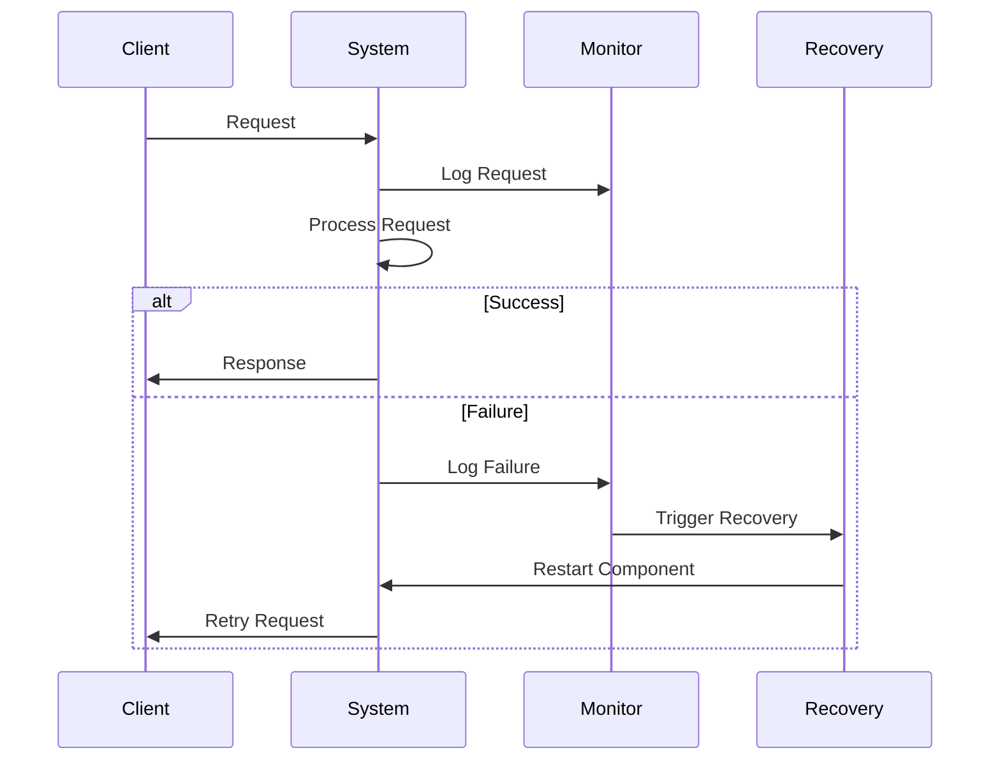

## 12.13 Design for Resilience and Self-Healing

In the world of software engineering, building systems that can withstand failures and recover gracefully is paramount. This section delves into the design patterns that enable resilience and self-healing in Haskell applications. We will explore techniques such as retries, circuit breakers, and bulkheads, and discuss how to implement self-healing systems that automatically recover from failures. By the end of this guide, you will have a comprehensive understanding of how to incorporate these patterns into your Haskell applications to enhance their robustness and reliability.

### Understanding Resilience in Software Systems

Resilience in software systems refers to the ability of a system to handle and recover from failures gracefully. This involves anticipating potential points of failure and designing the system to either prevent these failures or recover from them without significant disruption.

#### Key Concepts in Resilience

- **Fault Tolerance**: The ability of a system to continue operating properly in the event of the failure of some of its components.
- **Redundancy**: Incorporating extra components that can take over in case of a failure.
- **Graceful Degradation**: The system continues to operate with reduced functionality rather than failing completely.
- **Isolation**: Ensuring that failures in one part of the system do not cascade to other parts.

### Self-Healing Systems

Self-healing systems are designed to automatically detect and recover from failures. This involves monitoring the system for signs of failure and implementing strategies to restore normal operation without human intervention.

#### Characteristics of Self-Healing Systems

- **Autonomous Recovery**: The system can recover from failures without manual intervention.
- **Proactive Monitoring**: Continuous monitoring to detect potential issues before they lead to failures.
- **Adaptive Learning**: The system can learn from past failures to improve future resilience.

### Implementing Resilience Patterns in Haskell

Haskell, with its strong type system and functional programming paradigm, provides unique advantages for implementing resilience and self-healing patterns. Let's explore some common patterns and how they can be applied in Haskell.

#### Retry Pattern

The retry pattern involves attempting an operation multiple times before considering it a failure. This is useful for transient failures, such as network timeouts.

```haskell
import Control.Exception (SomeException, try)
import Control.Monad (when)
import Control.Concurrent (threadDelay)

retry :: Int -> IO a -> IO (Either SomeException a)
retry n action = go n
  where
    go 0 = try action
    go retries = do
      result <- try action
      case result of
        Left _ -> do
          threadDelay 1000000 -- Wait 1 second before retrying
          go (retries - 1)
        Right val -> return (Right val)

main :: IO ()
main = do
  result <- retry 3 (putStrLn "Attempting action" >> fail "Simulated failure")
  case result of
    Left err -> putStrLn $ "Failed with error: " ++ show err
    Right _  -> putStrLn "Action succeeded"
```

**Explanation**: This code defines a `retry` function that attempts an IO action up to `n` times. If the action fails, it waits for a second before retrying. This pattern is useful for handling transient errors.

#### Circuit Breaker Pattern

The circuit breaker pattern prevents a system from repeatedly trying to execute an operation that's likely to fail, thereby allowing it to recover from failures more gracefully.

```haskell
data CircuitState = Closed | Open | HalfOpen deriving (Show, Eq)

circuitBreaker :: Int -> IO a -> IO (Either SomeException a)
circuitBreaker maxFailures action = go Closed 0
  where
    go state failures
      | state == Open = return $ Left (toException $ userError "Circuit is open")
      | otherwise = do
          result <- try action
          case result of
            Left _ -> if failures + 1 >= maxFailures
                      then go Open (failures + 1)
                      else go Closed (failures + 1)
            Right val -> return (Right val)

main :: IO ()
main = do
  result <- circuitBreaker 3 (putStrLn "Attempting action" >> fail "Simulated failure")
  case result of
    Left err -> putStrLn $ "Failed with error: " ++ show err
    Right _  -> putStrLn "Action succeeded"
```

**Explanation**: This code implements a simple circuit breaker that opens after a specified number of failures. When the circuit is open, further attempts to execute the action are immediately failed.

#### Bulkhead Pattern

The bulkhead pattern involves isolating different parts of a system to prevent failures in one part from affecting others. In Haskell, this can be achieved using concurrency primitives like `Async`.

```haskell
import Control.Concurrent.Async (async, wait)

bulkhead :: [IO a] -> IO [a]
bulkhead actions = mapM async actions >>= mapM wait

main :: IO ()
main = do
  results <- bulkhead [action1, action2, action3]
  mapM_ print results
  where
    action1 = putStrLn "Action 1" >> return 1
    action2 = putStrLn "Action 2" >> return 2
    action3 = putStrLn "Action 3" >> return 3
```

**Explanation**: This code runs multiple actions concurrently, isolating them from each other. If one action fails, it doesn't affect the others.

### Self-Healing Implementation Strategies

Implementing self-healing systems involves incorporating monitoring and automated recovery strategies. Let's explore some techniques.

#### Monitoring and Alerting

Monitoring is crucial for detecting failures and triggering recovery actions. In Haskell, libraries like `ekg` can be used for monitoring.

```haskell
import System.Remote.Monitoring (forkServer, getCounter, inc)

main :: IO ()
main = do
  server <- forkServer "localhost" 8000
  counter <- getCounter "example.counter" server
  inc counter
  putStrLn "Monitoring started"
```

**Explanation**: This code sets up a simple monitoring server that tracks a counter. You can extend this to monitor various metrics and trigger alerts when anomalies are detected.

#### Automated Recovery

Automated recovery involves restarting failed components or switching to backup systems. This can be achieved using supervisor processes.

```haskell
import Control.Concurrent (forkIO, threadDelay)
import Control.Exception (SomeException, try)

supervisor :: IO () -> IO ()
supervisor action = do
  result <- try action
  case result of
    Left _ -> do
      putStrLn "Action failed, restarting..."
      threadDelay 1000000 -- Wait 1 second before restarting
      supervisor action
    Right _ -> return ()

main :: IO ()
main = do
  forkIO $ supervisor (putStrLn "Running action" >> fail "Simulated failure")
  threadDelay 10000000 -- Keep the main thread alive
```

**Explanation**: This code defines a `supervisor` function that restarts an action if it fails. This is a basic form of self-healing, where the system attempts to recover from failures automatically.

### Visualizing Resilience and Self-Healing

To better understand the flow of resilience and self-healing patterns, let's visualize the process using a sequence diagram.



**Diagram Explanation**: This sequence diagram illustrates the interaction between a client, the system, a monitoring component, and a recovery mechanism. It shows how failures are detected and handled through automated recovery.

### Haskell Unique Features for Resilience

Haskell's unique features, such as its strong type system and purity, provide advantages in building resilient systems:

- **Immutability**: Reduces the risk of state-related bugs, making systems more predictable.
- **Type Safety**: Helps catch errors at compile time, reducing runtime failures.
- **Concurrency Primitives**: Libraries like `Async` and `STM` provide powerful tools for managing concurrency and isolation.

### Design Considerations

When designing for resilience and self-healing, consider the following:

- **Failure Modes**: Identify potential failure points and design strategies to handle them.
- **Performance Impact**: Ensure that resilience mechanisms do not significantly degrade performance.
- **Complexity**: Balance the complexity of resilience mechanisms with the benefits they provide.

### Differences and Similarities with Other Patterns

Resilience and self-healing patterns share similarities with other fault-tolerance patterns but focus more on automated recovery and isolation. They differ from traditional error handling by emphasizing proactive monitoring and recovery.

### Try It Yourself

Experiment with the provided code examples by modifying the retry intervals, failure thresholds, and monitoring metrics. Observe how these changes affect the system's resilience and recovery behavior.

### Knowledge Check

- What are the key characteristics of a self-healing system?
- How does the circuit breaker pattern help in building resilient systems?
- Why is monitoring important in self-healing systems?

### Embrace the Journey

Remember, building resilient and self-healing systems is an ongoing journey. As you gain experience, you'll discover new techniques and strategies to enhance your systems' robustness. Keep experimenting, stay curious, and enjoy the process of creating fault-tolerant applications.

## Quiz: Design for Resilience and Self-Healing



### What is the primary goal of resilience in software systems?

- [x] To handle and recover from failures gracefully
- [ ] To increase system performance
- [ ] To reduce code complexity
- [ ] To enhance user interface design

> **Explanation:** Resilience aims to ensure that systems can handle and recover from failures without significant disruption.

### Which pattern involves attempting an operation multiple times before considering it a failure?

- [x] Retry Pattern
- [ ] Circuit Breaker Pattern
- [ ] Bulkhead Pattern
- [ ] Observer Pattern

> **Explanation:** The Retry Pattern involves retrying an operation multiple times to handle transient failures.

### What does the circuit breaker pattern prevent?

- [x] Repeated execution of an operation that's likely to fail
- [ ] Concurrent execution of multiple operations
- [ ] Unauthorized access to system resources
- [ ] Data redundancy

> **Explanation:** The Circuit Breaker Pattern prevents repeated execution of operations that are likely to fail, allowing the system to recover.

### How does the bulkhead pattern enhance system resilience?

- [x] By isolating different parts of a system to prevent cascading failures
- [ ] By increasing the number of retries for failed operations
- [ ] By reducing the system's response time
- [ ] By enhancing user authentication mechanisms

> **Explanation:** The Bulkhead Pattern isolates different parts of a system to prevent failures in one part from affecting others.

### What is a key characteristic of self-healing systems?

- [x] Autonomous Recovery
- [ ] Manual Intervention
- [ ] Increased Resource Usage
- [ ] Reduced System Security

> **Explanation:** Self-healing systems are characterized by their ability to recover from failures without manual intervention.

### Which Haskell feature helps in reducing state-related bugs?

- [x] Immutability
- [ ] Lazy Evaluation
- [ ] Type Classes
- [ ] Pattern Matching

> **Explanation:** Immutability in Haskell reduces the risk of state-related bugs, making systems more predictable.

### What is the role of monitoring in self-healing systems?

- [x] To detect failures and trigger recovery actions
- [ ] To increase system throughput
- [ ] To enhance user experience
- [ ] To reduce code complexity

> **Explanation:** Monitoring is crucial for detecting failures and triggering recovery actions in self-healing systems.

### Which library can be used for monitoring in Haskell?

- [x] `ekg`
- [ ] `async`
- [ ] `conduit`
- [ ] `lens`

> **Explanation:** The `ekg` library in Haskell is used for monitoring system metrics.

### What should be considered when designing for resilience?

- [x] Failure Modes
- [x] Performance Impact
- [ ] User Interface Design
- [ ] Code Readability

> **Explanation:** When designing for resilience, it's important to consider failure modes and performance impact.

### True or False: Resilience patterns focus solely on error handling.

- [ ] True
- [x] False

> **Explanation:** Resilience patterns focus on both error handling and proactive recovery strategies to enhance system robustness.


