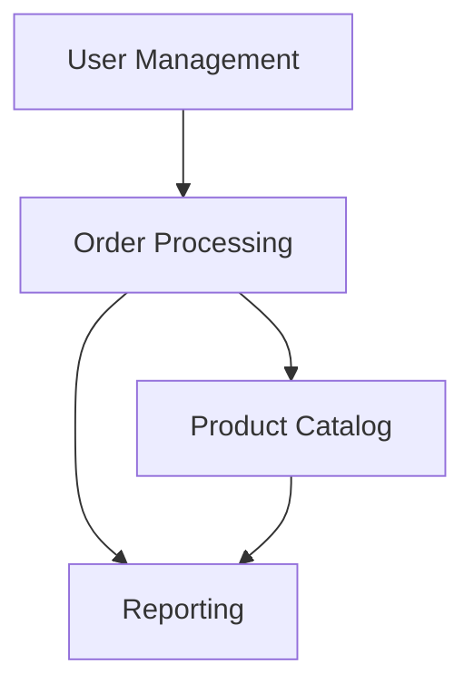

## 12.14 Modular Monoliths in Haskell

In the world of software architecture, the debate between monolithic and microservices architectures is ongoing. However, a middle ground known as the "modular monolith" offers a compelling alternative, especially when implemented in a functional programming language like Haskell. This section delves into the concept of modular monoliths, their benefits, and how to implement them effectively in Haskell.

### Modular Monolith Concept

A modular monolith is a software architecture pattern that combines the simplicity of a monolithic application with the modularity and decoupling typically associated with microservices. The core idea is to build a monolithic application that is internally structured into well-defined, independent modules. Each module encapsulates a specific domain or functionality and communicates with other modules through well-defined interfaces.

#### Key Characteristics

- **Single Deployment Unit**: Unlike microservices, a modular monolith is deployed as a single unit, simplifying deployment and operational overhead.
- **Internal Modularity**: The application is divided into modules, each responsible for a specific domain or functionality.
- **Clear Interfaces**: Modules communicate through well-defined interfaces, promoting loose coupling and high cohesion.
- **Ease of Maintenance**: The modular structure makes it easier to maintain and evolve the application over time.

### Benefits of Modular Monoliths

Modular monoliths offer several advantages, particularly when implemented in Haskell:

- **Simplified Deployment**: With a single deployment unit, the complexity of managing multiple services is reduced.
- **Performance**: Internal module communication is typically faster than inter-service communication in a microservices architecture.
- **Consistency**: A single codebase ensures consistency in language, libraries, and tooling.
- **Flexibility**: The modular structure allows for parts of the application to be extracted into microservices if needed in the future.
- **Reduced Complexity**: By avoiding the overhead of distributed systems, modular monoliths reduce the complexity associated with network latency, data consistency, and service orchestration.

### Implementing Modular Monoliths in Haskell

Haskell's strong type system, purity, and emphasis on immutability make it an excellent choice for implementing modular monoliths. Let's explore how to structure a Haskell application as a modular monolith.

#### Organizing Code into Modules

In Haskell, modules are the primary way to organize code. Each module can encapsulate a specific domain or functionality, exposing only the necessary interfaces to other modules.

```haskell
-- File: UserManagement.hs
module UserManagement (User, createUser, getUser) where

data User = User { userId :: Int, userName :: String }

createUser :: Int -> String -> User
createUser id name = User id name

getUser :: Int -> User
getUser id = -- Implementation to retrieve a user
```

In this example, the `UserManagement` module encapsulates user-related functionality. It exposes the `User` type and functions `createUser` and `getUser`, while hiding the internal implementation details.

#### Defining Clear Interfaces

Interfaces between modules should be well-defined and minimal. This promotes loose coupling and allows modules to evolve independently.

```haskell
-- File: OrderManagement.hs
module OrderManagement (Order, createOrder, getOrder) where

import UserManagement (User)

data Order = Order { orderId :: Int, orderUser :: User, orderAmount :: Double }

createOrder :: Int -> User -> Double -> Order
createOrder id user amount = Order id user amount

getOrder :: Int -> Order
getOrder id = -- Implementation to retrieve an order
```

Here, the `OrderManagement` module depends on the `UserManagement` module, but only through the `User` type. This keeps the interface between the modules minimal and focused.

#### Using Type Classes for Abstraction

Haskell's type classes provide a powerful mechanism for abstraction, allowing you to define generic interfaces that can be implemented by different modules.

```haskell
class Persistable a where
    save :: a -> IO ()
    load :: Int -> IO (Maybe a)

instance Persistable User where
    save user = -- Implementation to save a user
    load id = -- Implementation to load a user

instance Persistable Order where
    save order = -- Implementation to save an order
    load id = -- Implementation to load an order
```

In this example, the `Persistable` type class defines a generic interface for persistence operations. Both `User` and `Order` implement this interface, allowing them to be saved and loaded in a consistent manner.

#### Managing Dependencies with Cabal or Stack

Haskell's package management tools, Cabal and Stack, allow you to manage dependencies and build configurations effectively. Organize your project into multiple packages if needed, each representing a module or a set of related modules.

```cabal
-- Example Cabal file
name:                my-modular-monolith
version:             0.1.0.0
build-type:          Simple
cabal-version:       >=1.10

library
  exposed-modules:     UserManagement, OrderManagement
  build-depends:       base >=4.7 && <5
  hs-source-dirs:      src
  default-language:    Haskell2010
```

This Cabal file defines a library with two exposed modules, `UserManagement` and `OrderManagement`, and specifies dependencies and source directories.

### Example: A Modular Monolith Application

Let's consider a simple e-commerce application structured as a modular monolith. The application consists of several modules, each responsible for a specific domain:

- **User Management**: Handles user registration, authentication, and profile management.
- **Product Catalog**: Manages product listings, categories, and inventory.
- **Order Processing**: Handles order creation, payment processing, and shipping.
- **Reporting**: Generates sales reports and analytics.

#### Module Structure

```plaintext
src/
  UserManagement/
    User.hs
    Auth.hs
  ProductCatalog/
    Product.hs
    Inventory.hs
  OrderProcessing/
    Order.hs
    Payment.hs
  Reporting/
    SalesReport.hs
```

Each module is organized into its own directory, with related files grouped together. This structure promotes separation of concerns and makes it easier to navigate the codebase.

#### Communication Between Modules

Modules communicate through well-defined interfaces. For example, the `OrderProcessing` module might depend on the `UserManagement` and `ProductCatalog` modules to retrieve user and product information.

```haskell
-- File: OrderProcessing/Order.hs
module OrderProcessing.Order (createOrder, processPayment) where

import UserManagement.User (User, getUser)
import ProductCatalog.Product (Product, getProduct)

createOrder :: Int -> Int -> IO ()
createOrder userId productId = do
    user <- getUser userId
    product <- getProduct productId
    -- Implementation to create an order
```

In this example, the `createOrder` function retrieves user and product information from the respective modules before creating an order.

### Design Considerations

When designing a modular monolith, consider the following:

- **Bounded Contexts**: Define clear boundaries for each module, ensuring that each module encapsulates a specific domain or functionality.
- **Dependency Management**: Minimize dependencies between modules to promote loose coupling and high cohesion.
- **Scalability**: Design modules with scalability in mind, allowing them to be extracted into microservices if needed in the future.
- **Testing**: Write unit tests for each module to ensure correctness and facilitate refactoring.

### Haskell Unique Features

Haskell's unique features, such as its strong type system, purity, and emphasis on immutability, make it well-suited for building modular monoliths. These features promote code correctness, maintainability, and ease of reasoning about the system.

### Differences and Similarities with Microservices

While modular monoliths and microservices share some similarities, such as modularity and clear interfaces, they differ in deployment and operational complexity. Modular monoliths offer the simplicity of a single deployment unit, while microservices provide greater flexibility and scalability at the cost of increased complexity.

### Try It Yourself

To experiment with modular monoliths in Haskell, try the following:

- **Modify the Code**: Add a new module to the example application, such as a `Notification` module for sending emails or SMS notifications.
- **Refactor**: Extract a module into a separate package and manage it using Cabal or Stack.
- **Test**: Write unit tests for each module to ensure correctness and facilitate refactoring.

### Visualizing Modular Monolith Architecture



**Diagram Description**: This diagram illustrates the relationships between different modules in a modular monolith architecture. The `Order Processing` module depends on both the `User Management` and `Product Catalog` modules, while the `Reporting` module aggregates data from the `Order Processing` and `Product Catalog` modules.

### Knowledge Check

- **Question**: What are the key benefits of a modular monolith compared to a traditional monolithic architecture?
- **Exercise**: Implement a new feature in the example application, such as a discount system, and integrate it with the existing modules.

### Embrace the Journey

Remember, building a modular monolith is just the beginning. As you progress, you'll gain a deeper understanding of software architecture and design patterns. Keep experimenting, stay curious, and enjoy the journey!

## Quiz: Modular Monoliths in Haskell



### What is a modular monolith?

- [x] A monolithic application with a modular, decoupled design
- [ ] A microservices architecture with tightly coupled services
- [ ] A distributed system with independent deployment units
- [ ] A single module application with no dependencies

> **Explanation:** A modular monolith is a monolithic application structured into well-defined, independent modules.

### What is a key benefit of a modular monolith?

- [x] Simplified deployment
- [ ] Increased network latency
- [ ] Complex service orchestration
- [ ] Inconsistent codebase

> **Explanation:** Modular monoliths offer simplified deployment by being a single deployment unit.

### How do modules communicate in a modular monolith?

- [x] Through well-defined interfaces
- [ ] Directly accessing each other's internal data
- [ ] Using network protocols
- [ ] Through shared global variables

> **Explanation:** Modules communicate through well-defined interfaces, promoting loose coupling.

### What is a characteristic of a modular monolith?

- [x] Internal modularity
- [ ] Multiple deployment units
- [ ] High network latency
- [ ] Tight coupling between modules

> **Explanation:** A modular monolith features internal modularity with well-defined modules.

### What Haskell feature aids in implementing modular monoliths?

- [x] Strong type system
- [ ] Dynamic typing
- [ ] Global state management
- [ ] Weak typing

> **Explanation:** Haskell's strong type system aids in building modular and maintainable code.

### What is a potential future benefit of a modular monolith?

- [x] Extracting modules into microservices
- [ ] Increasing deployment complexity
- [ ] Reducing code consistency
- [ ] Tightening module coupling

> **Explanation:** The modular structure allows for parts of the application to be extracted into microservices if needed.

### What should be minimized between modules?

- [x] Dependencies
- [ ] Interfaces
- [ ] Communication
- [ ] Cohesion

> **Explanation:** Minimizing dependencies between modules promotes loose coupling and high cohesion.

### What is a common pitfall to avoid in modular monoliths?

- [x] Tight coupling between modules
- [ ] Using well-defined interfaces
- [ ] Maintaining a single codebase
- [ ] Ensuring code consistency

> **Explanation:** Tight coupling between modules should be avoided to maintain modularity.

### What is a key design consideration for modular monoliths?

- [x] Bounded contexts
- [ ] Global state management
- [ ] Tight coupling
- [ ] High network latency

> **Explanation:** Bounded contexts help define clear boundaries for each module.

### True or False: Modular monoliths and microservices have the same deployment complexity.

- [ ] True
- [x] False

> **Explanation:** Modular monoliths have simplified deployment compared to microservices, which involve managing multiple independent services.


