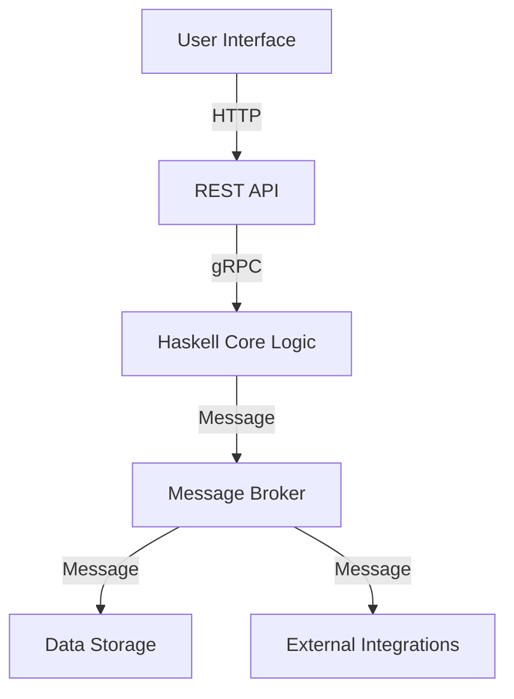

## 12.15 Polyglot Architectures with Haskell Components

In today's rapidly evolving software landscape, polyglot architectures have become a norm rather than an exception. These architectures leverage multiple programming languages within a single system to harness the unique strengths of each language. Haskell, with its strong emphasis on functional programming, immutability, and type safety, plays a crucial role in such environments. In this section, we will explore how Haskell components can be integrated into polyglot architectures, providing robust, scalable, and maintainable solutions.

### Understanding Polyglot Systems

**Polyglot Systems** are systems that utilize multiple programming languages to build different components or services. The choice of language for each component is often driven by the specific requirements of that component, such as performance, ease of development, or existing ecosystem support.

#### Benefits of Polyglot Systems

- **Flexibility**: Choose the best language for each task.
- **Leverage Existing Ecosystems**: Utilize libraries and frameworks specific to each language.
- **Optimize Performance**: Use languages that excel in specific domains (e.g., Haskell for concurrency, Python for data science).
- **Enhance Team Productivity**: Allow teams to work in languages they are most comfortable with.

#### Challenges of Polyglot Systems

- **Complexity**: Managing multiple languages increases system complexity.
- **Interoperability**: Ensuring seamless communication between components.
- **Deployment**: Coordinating deployments across different runtime environments.
- **Skill Requirements**: Teams need to be proficient in multiple languages.

### The Role of Haskell in Polyglot Architectures

Haskell's strengths make it an excellent choice for certain components within a polyglot architecture:

- **Functional Paradigm**: Encourages pure functions and immutability, reducing side effects and bugs.
- **Strong Typing**: Catches errors at compile time, increasing reliability.
- **Concurrency**: Efficiently handles concurrent operations with lightweight threads.
- **Expressiveness**: Allows concise and expressive code, making complex logic easier to implement and maintain.

#### Common Use Cases for Haskell

- **Core Logic**: Implementing complex algorithms or business logic.
- **Concurrency**: Handling high-concurrency tasks efficiently.
- **Data Processing**: Performing transformations and computations on large datasets.
- **Domain-Specific Languages (DSLs)**: Creating DSLs for specific problem domains.

### Implementing Haskell in a Polyglot Environment

Integrating Haskell into a polyglot architecture involves several key considerations:

#### Interoperability

To ensure seamless communication between Haskell and other components, standard protocols and interfaces are used:

- **RESTful APIs**: Expose Haskell services via HTTP endpoints.
- **Messaging Systems**: Use message brokers like RabbitMQ or Kafka for asynchronous communication.
- **Foreign Function Interface (FFI)**: Directly call functions written in other languages, such as C.
- **gRPC**: Use gRPC for efficient, language-agnostic remote procedure calls.

#### Example: Haskell Service in a Polyglot System

Consider a system where Haskell provides core logic for a financial application, while other components handle user interfaces, data storage, and external integrations.

```haskell
-- Haskell service providing core financial logic
module FinancialService where

import Data.Time.Clock (UTCTime, getCurrentTime)
import Control.Monad.IO.Class (liftIO)

-- Define a data type for financial transactions
data Transaction = Transaction
  { transactionId :: String
  , amount :: Double
  , timestamp :: UTCTime
  }

-- Function to process a transaction
processTransaction :: String -> Double -> IO Transaction
processTransaction tid amt = do
  currentTime <- getCurrentTime
  return $ Transaction tid amt currentTime

-- Example usage
main :: IO ()
main = do
  transaction <- processTransaction "TX123" 100.0
  print transaction
```

In this example, the `FinancialService` module provides a function to process transactions, encapsulating the core logic in Haskell. This service can be exposed via a REST API, allowing other components to interact with it.

#### Interfacing with Other Languages

To interface Haskell with other languages, consider the following approaches:

- **REST APIs**: Use frameworks like Servant or Yesod to create RESTful services.
- **gRPC**: Define service contracts using Protocol Buffers and implement them in Haskell.
- **FFI**: Use Haskell's FFI to call C libraries or expose Haskell functions to C.

### Visualizing Polyglot Architectures

Let's visualize a typical polyglot architecture with Haskell components using a Mermaid.js diagram:



**Diagram Explanation**: This diagram illustrates a polyglot architecture where the user interface communicates with a REST API. The API interacts with Haskell components using gRPC, and a message broker facilitates communication with data storage and external integrations.

### Design Considerations

When integrating Haskell into a polyglot architecture, consider the following:

- **Performance**: Ensure Haskell components are optimized for performance-critical tasks.
- **Scalability**: Design Haskell services to scale horizontally.
- **Maintainability**: Keep Haskell code modular and well-documented.
- **Security**: Implement security best practices, such as input validation and authentication.

### Haskell Unique Features

Haskell offers unique features that enhance its role in polyglot architectures:

- **Lazy Evaluation**: Allows efficient handling of large data structures.
- **Type Classes**: Enable polymorphism and code reuse.
- **Monads**: Manage side effects and asynchronous operations.

### Differences and Similarities with Other Patterns

Haskell's integration in polyglot architectures shares similarities with microservices patterns but focuses more on language interoperability. Unlike traditional microservices, polyglot architectures emphasize leveraging the strengths of multiple languages.

### Try It Yourself

Experiment with the provided Haskell code by modifying the transaction processing logic. Try adding new fields to the `Transaction` data type or implementing additional functions to handle different types of transactions.

### Knowledge Check

- What are the benefits and challenges of polyglot systems?
- How does Haskell's functional paradigm contribute to polyglot architectures?
- What are some common protocols for interfacing Haskell with other languages?

### Embrace the Journey

Remember, integrating Haskell into polyglot architectures is just the beginning. As you progress, you'll discover new ways to leverage Haskell's strengths in diverse environments. Keep experimenting, stay curious, and enjoy the journey!

## Quiz: Polyglot Architectures with Haskell Components



### What is a polyglot system?

- [x] A system that uses multiple programming languages.
- [ ] A system that uses only one programming language.
- [ ] A system that uses multiple databases.
- [ ] A system that uses multiple operating systems.

> **Explanation:** A polyglot system is characterized by the use of multiple programming languages within the same system.

### What is a common challenge of polyglot systems?

- [x] Interoperability between components.
- [ ] Lack of flexibility in language choice.
- [ ] Inability to leverage existing ecosystems.
- [ ] Reduced team productivity.

> **Explanation:** Interoperability between components written in different languages is a common challenge in polyglot systems.

### How can Haskell components be exposed in a polyglot architecture?

- [x] Via RESTful APIs.
- [x] Using gRPC.
- [ ] Through direct database access.
- [ ] By embedding in HTML.

> **Explanation:** Haskell components can be exposed via RESTful APIs and gRPC to interact with other components in a polyglot architecture.

### What is a benefit of using Haskell in a polyglot system?

- [x] Strong typing and compile-time error checking.
- [ ] Weak typing and runtime error checking.
- [ ] Lack of concurrency support.
- [ ] Limited expressiveness.

> **Explanation:** Haskell's strong typing and compile-time error checking are significant benefits in a polyglot system.

### Which protocol is commonly used for asynchronous communication in polyglot systems?

- [x] Messaging systems like RabbitMQ or Kafka.
- [ ] HTTP.
- [ ] FTP.
- [ ] SMTP.

> **Explanation:** Messaging systems like RabbitMQ or Kafka are commonly used for asynchronous communication in polyglot systems.

### What is a key feature of Haskell that aids in handling large data structures?

- [x] Lazy evaluation.
- [ ] Eager evaluation.
- [ ] Weak typing.
- [ ] Dynamic typing.

> **Explanation:** Haskell's lazy evaluation allows efficient handling of large data structures.

### What is a common use case for Haskell in polyglot architectures?

- [x] Implementing core logic and complex algorithms.
- [ ] Designing user interfaces.
- [ ] Managing databases.
- [ ] Handling network protocols.

> **Explanation:** Haskell is often used to implement core logic and complex algorithms in polyglot architectures.

### How does Haskell manage side effects in a polyglot system?

- [x] Using monads.
- [ ] Using global variables.
- [ ] Through direct state manipulation.
- [ ] By ignoring side effects.

> **Explanation:** Haskell uses monads to manage side effects, ensuring purity and referential transparency.

### What is a benefit of using RESTful APIs in polyglot architectures?

- [x] Language-agnostic communication.
- [ ] Language-specific communication.
- [ ] Direct database access.
- [ ] Reduced security.

> **Explanation:** RESTful APIs provide language-agnostic communication, facilitating interoperability in polyglot architectures.

### True or False: Polyglot architectures only use functional programming languages.

- [ ] True
- [x] False

> **Explanation:** Polyglot architectures use multiple programming languages, not limited to functional programming.


