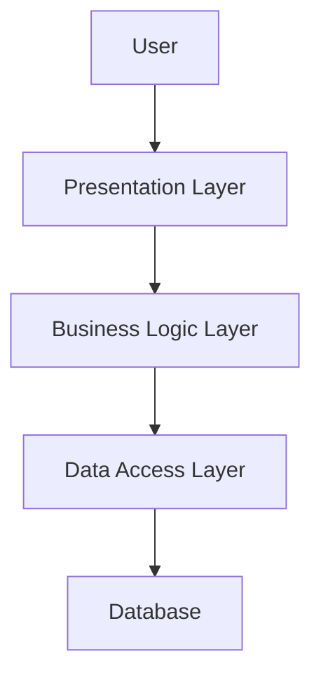

## 12.16 Layered Architecture in Functional Programming

Layered architecture is a well-established design pattern in software engineering that organizes code into distinct layers, each with a specific responsibility. This pattern is particularly beneficial in functional programming languages like Haskell, where immutability and pure functions are core principles. In this section, we will explore how to implement a layered architecture in Haskell, leveraging its unique features to build scalable and maintainable applications.

### Understanding Layered Architecture

Layered architecture divides an application into layers, each responsible for a specific aspect of the application. Common layers include:

- **Presentation Layer**: Handles user interaction and displays information.
- **Business Logic Layer**: Contains the core functionality and rules of the application.
- **Data Access Layer**: Manages data retrieval and storage.

This separation of concerns allows for easier maintenance, testing, and scalability. Each layer communicates with the others through well-defined interfaces, promoting modularity and reducing dependencies.

### Adapting Layered Architecture to Functional Programming

In functional programming, the principles of immutability and pure functions must be maintained across all layers. This adaptation involves:

- **Pure Functions**: Ensure that functions do not have side effects and return the same output for the same input.
- **Immutability**: Data structures should not be modified after creation, promoting safer and more predictable code.
- **Function Composition**: Use higher-order functions to build complex operations from simpler ones.

By adhering to these principles, we can create a layered architecture that is both robust and flexible.

### Implementing Layered Architecture in Haskell

To implement a layered architecture in Haskell, we need to define clear interfaces between layers and ensure that each layer adheres to functional programming principles. Let's explore how to achieve this with a practical example.

#### Example: A Web Application

Consider a simple web application with the following layers:

1. **Presentation Layer**: Handles HTTP requests and responses.
2. **Business Logic Layer**: Processes data and applies business rules.
3. **Data Access Layer**: Interacts with a database to store and retrieve data.

#### Presentation Layer

The presentation layer is responsible for handling HTTP requests and responses. In Haskell, we can use libraries like **Scotty** or **Yesod** to manage web interactions.

```haskell
{-# LANGUAGE OverloadedStrings #-}

import Web.Scotty
import Control.Monad.IO.Class (liftIO)

main :: IO ()
main = scotty 3000 $ do
    get "/hello" $ do
        text "Hello, World!"
    post "/data" $ do
        name <- param "name"
        liftIO $ putStrLn ("Received name: " ++ name)
        text ("Hello, " ++ name)
```

In this example, we define a simple web server using Scotty. The `get` and `post` routes handle incoming requests, demonstrating how the presentation layer interacts with users.

#### Business Logic Layer

The business logic layer processes data and applies business rules. This layer should consist of pure functions that transform input data into the desired output.

```haskell
module BusinessLogic where

processData :: String -> String
processData name = "Processed: " ++ name
```

Here, `processData` is a pure function that appends a prefix to the input string. This function can be easily tested and reused across the application.

#### Data Access Layer

The data access layer is responsible for interacting with a database. In Haskell, libraries like **Persistent** or **Beam** can be used to manage database operations.

```haskell
{-# LANGUAGE OverloadedStrings #-}
{-# LANGUAGE GADTs #-}
{-# LANGUAGE TypeFamilies #-}
{-# LANGUAGE TemplateHaskell #-}
{-# LANGUAGE QuasiQuotes #-}
{-# LANGUAGE MultiParamTypeClasses #-}
{-# LANGUAGE GeneralizedNewtypeDeriving #-}

import Database.Persist
import Database.Persist.Sqlite
import Database.Persist.TH

share [mkPersist sqlSettings, mkMigrate "migrateAll"] [persistLowerCase|
Person
    name String
    deriving Show
|]

addPerson :: String -> IO ()
addPerson name = runSqlite "test.db" $ do
    runMigration migrateAll
    insert_ $ Person name
```

In this example, we define a `Person` entity and a function `addPerson` to insert a new record into the database. The data access layer abstracts database operations, allowing the business logic layer to remain focused on processing data.

### Connecting the Layers

To connect the layers, we need to define interfaces that allow them to communicate without tightly coupling them. This can be achieved using Haskell's strong type system and higher-order functions.

```haskell
import Web.Scotty
import Control.Monad.IO.Class (liftIO)
import BusinessLogic (processData)
import DataAccess (addPerson)

main :: IO ()
main = scotty 3000 $ do
    post "/data" $ do
        name <- param "name"
        let processedName = processData name
        liftIO $ addPerson processedName
        text ("Data processed and stored: " ++ processedName)
```

In this code snippet, the presentation layer receives input from the user, passes it to the business logic layer for processing, and then stores the result using the data access layer. Each layer operates independently, promoting modularity and maintainability.

### Visualizing Layered Architecture

To better understand the flow of data and responsibilities within a layered architecture, let's visualize the structure using a Mermaid.js diagram.



**Diagram Description**: This diagram illustrates the flow of data in a layered architecture. The user interacts with the presentation layer, which communicates with the business logic layer to process data. The processed data is then stored in the database through the data access layer.

### Haskell's Unique Features in Layered Architecture

Haskell's unique features, such as its strong type system, immutability, and lazy evaluation, provide significant advantages when implementing a layered architecture:

- **Strong Typing**: Ensures that data passed between layers is consistent and type-safe.
- **Immutability**: Prevents unintended side effects, making the system more predictable.
- **Lazy Evaluation**: Allows for efficient data processing, especially in the business logic layer.

### Design Considerations

When implementing a layered architecture in Haskell, consider the following:

- **Separation of Concerns**: Clearly define the responsibilities of each layer to avoid overlap and maintain modularity.
- **Interface Design**: Use type classes and higher-order functions to define interfaces between layers, promoting flexibility and reusability.
- **Error Handling**: Use monads like `Either` or `Maybe` to handle errors gracefully across layers.

### Differences and Similarities with Other Patterns

Layered architecture is often compared to other architectural patterns, such as microservices or event-driven architectures. While these patterns share some similarities, they differ in their approach to modularity and communication:

- **Microservices**: Focus on decomposing an application into independent services, each responsible for a specific business capability.
- **Event-Driven Architecture**: Emphasizes asynchronous communication between components through events.

Layered architecture, on the other hand, organizes code within a single application into layers, promoting separation of concerns and modularity.

### Try It Yourself

To deepen your understanding of layered architecture in Haskell, try modifying the example code:

- **Add a new layer**: Introduce a caching layer between the business logic and data access layers to improve performance.
- **Implement error handling**: Use the `Either` monad to handle potential errors in the data access layer.
- **Enhance the business logic**: Add more complex data processing functions and test their integration with other layers.

### Knowledge Check

- **What are the main benefits of using a layered architecture in functional programming?**
- **How does Haskell's type system contribute to a layered architecture?**
- **What are some common challenges when implementing a layered architecture in Haskell?**

### Embrace the Journey

Remember, mastering layered architecture in functional programming is a journey. As you experiment with different patterns and techniques, you'll gain a deeper understanding of how to build scalable, maintainable applications. Keep exploring, stay curious, and enjoy the process!

## Quiz: Layered Architecture in Functional Programming



### What is the primary purpose of a layered architecture?

- [x] To separate concerns and organize code into distinct layers
- [ ] To increase the complexity of the codebase
- [ ] To eliminate the need for interfaces
- [ ] To enforce a strict order of execution

> **Explanation:** Layered architecture aims to separate concerns by organizing code into distinct layers, each with a specific responsibility.

### Which of the following is a common layer in a layered architecture?

- [x] Presentation Layer
- [ ] Network Layer
- [ ] Hardware Layer
- [ ] Operating System Layer

> **Explanation:** The presentation layer is a common layer in a layered architecture, responsible for handling user interactions.

### How does Haskell's strong type system benefit a layered architecture?

- [x] It ensures type safety and consistency between layers
- [ ] It increases the complexity of the code
- [ ] It eliminates the need for error handling
- [ ] It allows for dynamic typing

> **Explanation:** Haskell's strong type system ensures that data passed between layers is consistent and type-safe.

### What is a key principle of functional programming that should be maintained across all layers?

- [x] Immutability
- [ ] Global state
- [ ] Side effects
- [ ] Dynamic typing

> **Explanation:** Immutability is a key principle of functional programming that should be maintained across all layers to ensure predictability and safety.

### Which Haskell feature allows for efficient data processing in the business logic layer?

- [x] Lazy Evaluation
- [ ] Dynamic Typing
- [ ] Global State
- [ ] Side Effects

> **Explanation:** Lazy evaluation allows for efficient data processing by deferring computation until necessary.

### What is the role of the data access layer in a layered architecture?

- [x] To manage data retrieval and storage
- [ ] To handle user interactions
- [ ] To apply business rules
- [ ] To manage network communication

> **Explanation:** The data access layer is responsible for managing data retrieval and storage, abstracting database operations.

### How can interfaces between layers be defined in Haskell?

- [x] Using type classes and higher-order functions
- [ ] Using global variables
- [ ] Using dynamic typing
- [ ] Using side effects

> **Explanation:** Interfaces between layers can be defined using type classes and higher-order functions, promoting flexibility and reusability.

### What is a common challenge when implementing a layered architecture in Haskell?

- [x] Ensuring separation of concerns
- [ ] Managing global state
- [ ] Implementing dynamic typing
- [ ] Avoiding lazy evaluation

> **Explanation:** Ensuring separation of concerns is a common challenge, as each layer must have a clear responsibility.

### Which monad can be used for error handling across layers?

- [x] Either
- [ ] IO
- [ ] List
- [ ] State

> **Explanation:** The `Either` monad is commonly used for error handling, allowing for graceful error management across layers.

### True or False: Layered architecture is only applicable to functional programming languages.

- [ ] True
- [x] False

> **Explanation:** Layered architecture is a general design pattern applicable to various programming paradigms, not just functional programming.


