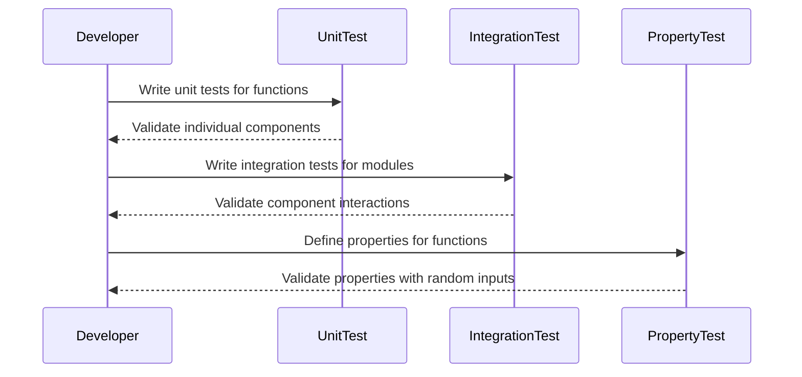

## 12.17 Testing Strategies for Architectural Patterns

In the realm of software architecture, testing is a critical component that ensures the reliability and robustness of a system. In Haskell, a language known for its strong type system and functional programming paradigm, testing strategies can be both unique and powerful. This section delves into the importance of testing architectural patterns in Haskell, exploring various techniques and implementations to validate that architectural components interact correctly.

### Importance of Testing

Testing is not just a phase in the software development lifecycle; it is an ongoing process that ensures the system behaves as expected. In architectural patterns, testing becomes crucial because:

- **Validation of Interactions**: Architectural components must interact seamlessly. Testing ensures that these interactions are correct and efficient.
- **Early Detection of Errors**: By testing architectural patterns, we can catch errors early in the development process, reducing the cost and effort required to fix them later.
- **Documentation of Behavior**: Tests serve as a form of documentation, providing insights into how the system is expected to behave under various conditions.
- **Facilitating Refactoring**: With a robust suite of tests, developers can refactor code with confidence, knowing that any deviations from expected behavior will be caught.

### Testing Techniques

In Haskell, several testing techniques can be employed to ensure that architectural patterns are implemented correctly:

#### Unit Testing

Unit testing focuses on testing individual components or functions in isolation. In Haskell, this often involves testing pure functions, which are deterministic and side-effect-free.

- **Tools**: Hspec and Tasty are popular testing frameworks in Haskell that facilitate unit testing.
- **Approach**: Write tests for each function, ensuring that it returns the expected output for given inputs.

#### Integration Testing

Integration testing involves testing the interaction between different components of the system. In Haskell, this can be challenging due to the language's emphasis on pure functions, but it is essential for verifying that components work together as intended.

- **Tools**: Hspec and Tasty can also be used for integration testing, often in conjunction with mock data or services.
- **Approach**: Test the interactions between modules, ensuring that data flows correctly and that side effects are managed appropriately.

#### Property-Based Testing

Property-based testing is a powerful technique in Haskell, leveraging the language's strong type system to test properties of functions rather than specific outputs.

- **Tools**: QuickCheck is a widely used library for property-based testing in Haskell.
- **Approach**: Define properties that functions should satisfy, and let QuickCheck generate random inputs to verify these properties.

### Implementation

Implementing testing strategies in Haskell involves using the right tools and techniques to verify each layer of the architecture. Let's explore how to implement these strategies effectively:

#### Unit Testing with Hspec

Hspec is a testing framework inspired by RSpec, designed for behavior-driven development (BDD) in Haskell.

```haskell
-- Example of a simple unit test using Hspec
import Test.Hspec

main :: IO ()
main = hspec $ do
  describe "add function" $ do
    it "adds two numbers correctly" $ do
      add 1 2 `shouldBe` 3

-- Function to be tested
add :: Int -> Int -> Int
add x y = x + y
```

In this example, we define a simple test for an `add` function, ensuring that it returns the correct sum of two numbers.

#### Integration Testing with Mocking

Integration testing in Haskell often involves mocking external dependencies to test the interaction between components.

```haskell
-- Example of integration testing with mocking
import Test.Hspec
import Control.Monad.Reader

-- Mock environment for testing
data Env = Env { getConfig :: String }

-- Function to be tested
fetchData :: Reader Env String
fetchData = do
  env <- ask
  return $ "Data from " ++ getConfig env

main :: IO ()
main = hspec $ do
  describe "fetchData function" $ do
    it "fetches data using the provided configuration" $ do
      let env = Env { getConfig = "TestConfig" }
      runReader fetchData env `shouldBe` "Data from TestConfig"
```

Here, we use the `Reader` monad to mock an environment and test the `fetchData` function's interaction with it.

#### Property-Based Testing with QuickCheck

QuickCheck allows us to define properties that our functions should satisfy and automatically generates test cases to verify these properties.

```haskell
-- Example of property-based testing with QuickCheck
import Test.QuickCheck

-- Property to test
prop_reverse :: [Int] -> Bool
prop_reverse xs = reverse (reverse xs) == xs

main :: IO ()
main = quickCheck prop_reverse
```

This example tests the property that reversing a list twice should yield the original list, using QuickCheck to generate random lists for testing.

### Example: Testing the Data Access Layer

Let's consider a more complex example: testing the data access layer independently from the business logic. This involves both unit and integration testing to ensure that data retrieval and manipulation are correct.

```haskell
-- Example of testing a data access layer
import Test.Hspec
import Database.HDBC
import Database.HDBC.Sqlite3

-- Function to be tested
getUserById :: IConnection conn => conn -> Int -> IO (Maybe String)
getUserById conn userId = do
  result <- quickQuery' conn "SELECT name FROM users WHERE id = ?" [toSql userId]
  return $ case result of
    [[sqlName]] -> Just (fromSql sqlName)
    _           -> Nothing

main :: IO ()
main = hspec $ do
  describe "getUserById function" $ do
    it "retrieves the correct user by ID" $ do
      conn <- connectSqlite3 ":memory:"
      run conn "CREATE TABLE users (id INTEGER PRIMARY KEY, name TEXT)" []
      run conn "INSERT INTO users (id, name) VALUES (1, 'Alice')" []
      commit conn
      user <- getUserById conn 1
      user `shouldBe` Just "Alice"
      disconnect conn
```

In this example, we test the `getUserById` function, which interacts with a SQLite database. We create an in-memory database, insert test data, and verify that the function retrieves the correct user.

### Visualizing Testing Strategies

To better understand the flow of testing strategies in architectural patterns, let's visualize the process using a sequence diagram.



This diagram illustrates the interaction between a developer and different testing strategies, highlighting the flow from writing unit tests to validating properties.

### Design Considerations

When implementing testing strategies for architectural patterns in Haskell, consider the following:

- **Isolation**: Ensure that tests are isolated and do not depend on external state or other tests.
- **Coverage**: Aim for high test coverage, but focus on critical paths and edge cases.
- **Performance**: Keep tests fast and efficient to encourage frequent execution.
- **Maintainability**: Write clear and maintainable tests that serve as documentation for the system.

### Haskell Unique Features

Haskell's unique features, such as its strong type system and pure functions, offer distinct advantages in testing:

- **Type Safety**: Leverage Haskell's type system to catch errors at compile time, reducing the need for certain runtime tests.
- **Pure Functions**: Test pure functions easily and deterministically, without worrying about side effects.
- **Lazy Evaluation**: Be mindful of lazy evaluation when writing tests, as it can lead to unexpected behavior if not handled correctly.

### Differences and Similarities

Testing strategies in Haskell share similarities with other languages but also have distinct differences:

- **Similarities**: The concepts of unit, integration, and property-based testing are common across languages.
- **Differences**: Haskell's emphasis on pure functions and type safety can simplify testing but also requires a different approach to handling side effects and state.

### Try It Yourself

To deepen your understanding, try modifying the code examples provided:

- **Experiment with Hspec**: Add more test cases to the `add` function example, testing edge cases and invalid inputs.
- **Mock Different Environments**: In the integration testing example, try mocking different configurations and observe how the `fetchData` function behaves.
- **Define New Properties**: Use QuickCheck to define new properties for other list operations, such as concatenation or sorting.

### Knowledge Check

- **Question**: Why is testing important in architectural patterns?
- **Challenge**: Implement a new function and write unit, integration, and property-based tests for it.

### Embrace the Journey

Remember, testing is an integral part of software development that ensures the reliability and robustness of your system. As you progress, you'll build more complex and interactive systems. Keep experimenting, stay curious, and enjoy the journey!

## Quiz: Testing Strategies for Architectural Patterns



### What is the primary purpose of unit testing in Haskell?

- [x] To test individual components or functions in isolation
- [ ] To test the interaction between different components
- [ ] To define properties that functions should satisfy
- [ ] To catch errors at compile time

> **Explanation:** Unit testing focuses on testing individual components or functions in isolation to ensure they work as expected.

### Which Haskell library is commonly used for property-based testing?

- [ ] Hspec
- [ ] Tasty
- [x] QuickCheck
- [ ] HUnit

> **Explanation:** QuickCheck is a widely used library for property-based testing in Haskell, allowing developers to define properties and automatically generate test cases.

### What is a key advantage of using Haskell's type system in testing?

- [x] It catches errors at compile time
- [ ] It simplifies integration testing
- [ ] It eliminates the need for unit tests
- [ ] It automatically generates test cases

> **Explanation:** Haskell's strong type system catches many errors at compile time, reducing the need for certain runtime tests.

### How does integration testing differ from unit testing?

- [ ] It tests individual functions
- [x] It tests the interaction between components
- [ ] It focuses on pure functions
- [ ] It uses QuickCheck for testing

> **Explanation:** Integration testing involves testing the interaction between different components of the system to ensure they work together as intended.

### What is the role of mocking in integration testing?

- [x] To simulate external dependencies
- [ ] To test pure functions
- [ ] To define properties for functions
- [ ] To catch compile-time errors

> **Explanation:** Mocking is used in integration testing to simulate external dependencies, allowing developers to test component interactions without relying on actual external systems.

### Which testing strategy is best suited for verifying properties of functions?

- [ ] Unit testing
- [ ] Integration testing
- [x] Property-based testing
- [ ] Manual testing

> **Explanation:** Property-based testing is best suited for verifying properties of functions, as it allows developers to define properties and automatically generate test cases.

### What is a common tool for unit testing in Haskell?

- [x] Hspec
- [ ] QuickCheck
- [ ] Tasty
- [ ] HUnit

> **Explanation:** Hspec is a popular testing framework in Haskell for unit testing, inspired by RSpec and designed for behavior-driven development.

### Why is it important to keep tests fast and efficient?

- [x] To encourage frequent execution
- [ ] To reduce test coverage
- [ ] To simplify test maintenance
- [ ] To eliminate the need for integration tests

> **Explanation:** Keeping tests fast and efficient encourages frequent execution, which helps catch errors early and facilitates continuous integration.

### What is a potential pitfall of lazy evaluation in testing?

- [x] It can lead to unexpected behavior if not handled correctly
- [ ] It simplifies testing of pure functions
- [ ] It eliminates the need for property-based testing
- [ ] It automatically generates test cases

> **Explanation:** Lazy evaluation can lead to unexpected behavior in tests if not handled correctly, as it may delay the evaluation of expressions until their results are needed.

### True or False: Haskell's emphasis on pure functions makes integration testing unnecessary.

- [ ] True
- [x] False

> **Explanation:** While Haskell's emphasis on pure functions simplifies unit testing, integration testing is still necessary to ensure that components interact correctly and manage side effects appropriately.


