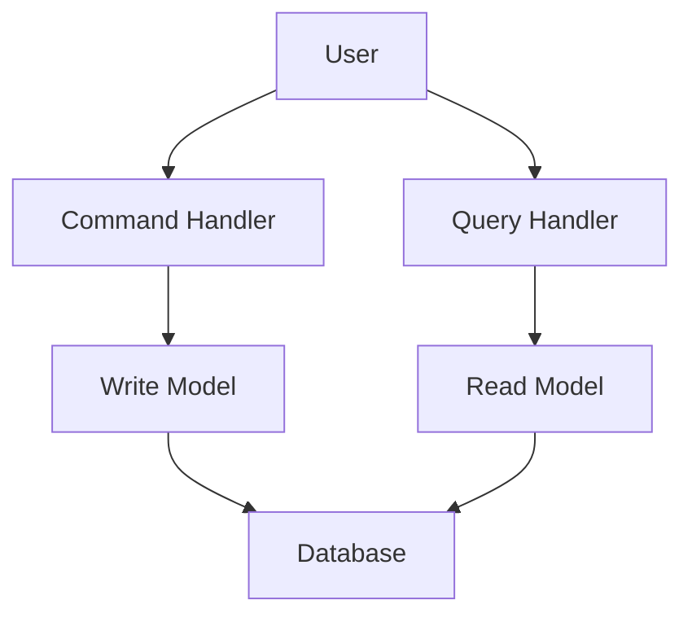
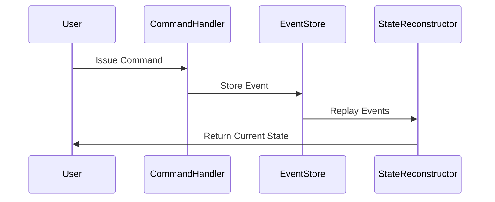

## 12.18 CQRS and Event Sourcing Architecture

In this section, we delve into the architectural patterns of Command Query Responsibility Segregation (CQRS) and Event Sourcing, particularly within the context of Haskell. These patterns are powerful tools for building scalable, maintainable, and robust systems. By leveraging Haskell's functional programming paradigms, we can implement these patterns effectively, ensuring high performance and reliability.

### Understanding CQRS

**Command Query Responsibility Segregation (CQRS)** is a pattern that separates the responsibility of handling commands (which change the state) from queries (which read the state). This separation allows for optimized handling of both operations, potentially leading to improved performance and scalability.

#### Key Concepts of CQRS

- **Commands**: These are operations that change the state of the system. In Haskell, commands can be represented as data types that encapsulate the necessary information to perform a state change.
- **Queries**: These are operations that retrieve data without modifying the state. Queries can be optimized separately from commands, allowing for more efficient data retrieval.
- **Segregation**: By separating commands and queries, we can scale and optimize each independently, leading to more efficient and maintainable systems.

### Implementing CQRS in Haskell

To implement CQRS in Haskell, we can leverage the language's strong type system and functional paradigms. Let's explore a basic implementation:

```haskell
-- Define a command data type
data Command = CreateAccount String | Deposit String Double | Withdraw String Double

-- Define a query data type
data Query = GetBalance String | GetTransactionHistory String

-- Command handler function
handleCommand :: Command -> State -> State
handleCommand (CreateAccount accountId) state = createAccount accountId state
handleCommand (Deposit accountId amount) state = deposit accountId amount state
handleCommand (Withdraw accountId amount) state = withdraw accountId amount state

-- Query handler function
handleQuery :: Query -> State -> Result
handleQuery (GetBalance accountId) state = getBalance accountId state
handleQuery (GetTransactionHistory accountId) state = getTransactionHistory accountId state
```

### Visualizing CQRS

Below is a diagram illustrating the CQRS pattern, showing the separation between command and query handling:



**Caption**: The diagram illustrates the separation of command and query responsibilities in the CQRS pattern.

### Exploring Event Sourcing

**Event Sourcing** is a pattern where state changes are recorded as a sequence of events. Instead of storing the current state, the system stores a log of all changes, which can be replayed to reconstruct the state at any point in time.

#### Key Concepts of Event Sourcing

- **Events**: These are immutable records of state changes. Each event represents a specific change in the system.
- **Event Store**: A database or storage system that holds all events. The event store is the source of truth for the system's state.
- **Replaying Events**: The process of reconstructing the current state by replaying all events from the event store.

### Implementing Event Sourcing in Haskell

In Haskell, we can implement event sourcing by defining events and an event store. Here's a basic example:

```haskell
-- Define an event data type
data Event = AccountCreated String | MoneyDeposited String Double | MoneyWithdrawn String Double

-- Event store as a list of events
type EventStore = [Event]

-- Apply an event to the state
applyEvent :: Event -> State -> State
applyEvent (AccountCreated accountId) state = createAccount accountId state
applyEvent (MoneyDeposited accountId amount) state = deposit accountId amount state
applyEvent (MoneyWithdrawn accountId amount) state = withdraw accountId amount state

-- Reconstruct state by replaying events
replayEvents :: EventStore -> State
replayEvents = foldl (flip applyEvent) initialState
```

### Visualizing Event Sourcing

The following diagram illustrates the event sourcing pattern, showing the flow of events and state reconstruction:



**Caption**: The sequence diagram illustrates the flow of events in the event sourcing pattern.

### Combining CQRS and Event Sourcing

Combining CQRS and Event Sourcing can lead to highly scalable and maintainable systems. In this architecture, commands generate events that are stored in the event store. Queries read from projections, which are views of the data reconstructed from events.

#### Implementation Strategy

1. **Define Commands and Events**: Clearly define the commands that change the state and the events that record these changes.
2. **Handle Commands**: Implement command handlers that generate events and store them in the event store.
3. **Replay Events**: Use event replay to reconstruct the current state or generate projections for queries.
4. **Optimize Queries**: Create projections that optimize data retrieval for queries.

### Example: Accounting System

Let's implement a simple accounting system using CQRS and Event Sourcing in Haskell:

```haskell
-- Define state
type AccountId = String
type Balance = Double
type State = Map AccountId Balance

-- Define commands
data Command = CreateAccount AccountId | Deposit AccountId Double | Withdraw AccountId Double

-- Define events
data Event = AccountCreated AccountId | MoneyDeposited AccountId Double | MoneyWithdrawn AccountId Double

-- Command handler
handleCommand :: Command -> State -> (State, [Event])
handleCommand (CreateAccount accountId) state =
    let event = AccountCreated accountId
    in (applyEvent event state, [event])
handleCommand (Deposit accountId amount) state =
    let event = MoneyDeposited accountId amount
    in (applyEvent event state, [event])
handleCommand (Withdraw accountId amount) state =
    let event = MoneyWithdrawn accountId amount
    in (applyEvent event state, [event])

-- Apply event to state
applyEvent :: Event -> State -> State
applyEvent (AccountCreated accountId) state = Map.insert accountId 0 state
applyEvent (MoneyDeposited accountId amount) state = Map.adjust (+ amount) accountId state
applyEvent (MoneyWithdrawn accountId amount) state = Map.adjust (subtract amount) accountId state

-- Event store
type EventStore = [Event]

-- Replay events to reconstruct state
replayEvents :: EventStore -> State
replayEvents = foldl (flip applyEvent) Map.empty
```

### Design Considerations

When implementing CQRS and Event Sourcing, consider the following:

- **Consistency**: Ensure eventual consistency between the write and read models.
- **Scalability**: Use projections to optimize query performance.
- **Complexity**: Be mindful of the added complexity in managing events and projections.
- **Fault Tolerance**: Implement mechanisms to handle failures and ensure data integrity.

### Haskell Unique Features

Haskell's strong type system and functional paradigms make it well-suited for implementing CQRS and Event Sourcing. Key features include:

- **Immutability**: Ensures that events are immutable, preventing accidental changes.
- **Type Safety**: Provides compile-time guarantees about the correctness of commands and events.
- **Lazy Evaluation**: Allows for efficient handling of large event streams.

### Differences and Similarities

CQRS and Event Sourcing are often used together but can be implemented independently. CQRS focuses on separating command and query responsibilities, while Event Sourcing focuses on recording state changes as events. Together, they provide a comprehensive approach to managing state and data flow in complex systems.

### Try It Yourself

Experiment with the provided code examples by modifying the commands and events. Try adding new command types or events, and observe how the system behaves. This hands-on approach will deepen your understanding of CQRS and Event Sourcing in Haskell.

### Knowledge Check

- What are the main benefits of separating commands and queries in a system?
- How does event sourcing ensure data integrity and consistency?
- What are some potential challenges when implementing CQRS and Event Sourcing?

### Embrace the Journey

Remember, mastering CQRS and Event Sourcing is a journey. As you explore these patterns, you'll gain insights into building scalable and maintainable systems. Keep experimenting, stay curious, and enjoy the journey!

## Quiz: CQRS and Event Sourcing Architecture



### What is the primary purpose of CQRS?

- [x] To separate command and query responsibilities
- [ ] To store state changes as events
- [ ] To optimize database performance
- [ ] To ensure data consistency

> **Explanation:** CQRS focuses on separating the responsibilities of commands and queries to optimize handling and scalability.

### How does Event Sourcing maintain state?

- [x] By recording state changes as a sequence of events
- [ ] By storing the current state in a database
- [ ] By using in-memory data structures
- [ ] By caching state changes

> **Explanation:** Event Sourcing maintains state by recording all changes as events, which can be replayed to reconstruct the state.

### What is a key advantage of combining CQRS and Event Sourcing?

- [x] Improved scalability and maintainability
- [ ] Simplified codebase
- [ ] Reduced need for testing
- [ ] Faster development time

> **Explanation:** Combining CQRS and Event Sourcing enhances scalability and maintainability by separating concerns and using events to manage state.

### In Haskell, how can commands be represented?

- [x] As data types encapsulating necessary information
- [ ] As functions with side effects
- [ ] As mutable variables
- [ ] As global constants

> **Explanation:** Commands in Haskell can be represented as data types that encapsulate the necessary information for state changes.

### What role does the event store play in Event Sourcing?

- [x] It acts as the source of truth for the system's state
- [ ] It caches frequently accessed data
- [ ] It stores the current state of the system
- [ ] It manages user sessions

> **Explanation:** The event store holds all events and acts as the source of truth for reconstructing the system's state.

### Which Haskell feature is particularly useful for implementing Event Sourcing?

- [x] Immutability
- [ ] Mutable state
- [ ] Dynamic typing
- [ ] Global variables

> **Explanation:** Haskell's immutability ensures that events remain unchanged, which is crucial for Event Sourcing.

### What is a potential challenge of using CQRS and Event Sourcing?

- [x] Increased complexity in managing events and projections
- [ ] Reduced system performance
- [ ] Limited scalability
- [ ] Lack of type safety

> **Explanation:** Managing events and projections can add complexity to the system, requiring careful design and implementation.

### How can Haskell's lazy evaluation benefit Event Sourcing?

- [x] By efficiently handling large event streams
- [ ] By reducing memory usage
- [ ] By simplifying code syntax
- [ ] By improving type inference

> **Explanation:** Lazy evaluation allows Haskell to efficiently process large event streams without unnecessary computations.

### What is a common use case for CQRS and Event Sourcing?

- [x] Building scalable and maintainable systems
- [ ] Developing simple CRUD applications
- [ ] Implementing real-time chat applications
- [ ] Creating static websites

> **Explanation:** CQRS and Event Sourcing are ideal for building complex, scalable, and maintainable systems.

### True or False: CQRS and Event Sourcing can be implemented independently.

- [x] True
- [ ] False

> **Explanation:** While often used together, CQRS and Event Sourcing can be implemented independently to address specific architectural needs.


