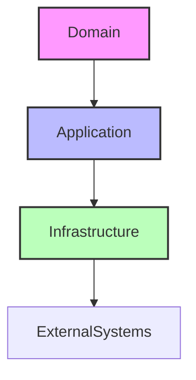

## 12.19 Onion Architecture in Haskell

In the world of software architecture, the Onion Architecture stands out as a powerful pattern for creating maintainable and scalable systems. It emphasizes a domain-centric design, where the core business logic is insulated from external concerns. This section delves into the intricacies of implementing the Onion Architecture in Haskell, leveraging its functional programming paradigms to enhance the robustness and clarity of your applications.

### Understanding Onion Architecture

**Onion Architecture** is a layered architectural style that aims to keep the core business logic of an application independent of external concerns such as databases, user interfaces, and other infrastructure. The architecture is visualized as a series of concentric circles, with the innermost circle representing the domain model.

#### Key Concepts

- **Domain-Centric Design**: The core of the application is the domain model, which contains the business logic and rules.
- **Layered Structure**: The architecture is divided into layers, each with a specific responsibility. These layers include:
  - **Domain Layer**: Contains the core business logic and domain entities.
  - **Application Layer**: Manages application-specific logic, orchestrating the use of domain entities.
  - **Infrastructure Layer**: Deals with external systems, such as databases and user interfaces.
- **Dependency Inversion**: Outer layers depend on inner layers, but not vice versa. This ensures that the core domain logic remains unaffected by changes in the infrastructure.

### Visualizing Onion Architecture

Below is a diagram illustrating the Onion Architecture:



**Diagram Description**: This diagram represents the Onion Architecture with three primary layers: Domain, Application, and Infrastructure. The arrows indicate the direction of dependencies, emphasizing that each layer depends on the one inside it.

### Implementing Onion Architecture in Haskell

Haskell's strong type system and functional programming paradigms make it an excellent choice for implementing the Onion Architecture. Let's explore how to structure a Haskell application using this architecture.

#### Domain Layer

The Domain Layer is the heart of the Onion Architecture. It contains the core business logic and domain entities. In Haskell, this layer is typically composed of pure functions and immutable data structures.

**Example: Domain Model**

```haskell
-- Domain/Model.hs
module Domain.Model where

data User = User
  { userId :: Int
  , userName :: String
  , userEmail :: String
  } deriving (Show, Eq)

validateEmail :: String -> Bool
validateEmail email = '@' `elem` email && '.' `elem` email
```

**Explanation**: Here, we define a simple `User` data type and a function `validateEmail` to validate email addresses. This layer is purely functional, with no side effects.

#### Application Layer

The Application Layer orchestrates the use of domain entities and implements application-specific logic. It acts as a mediator between the domain and the infrastructure.

**Example: Application Logic**

```haskell
-- Application/UserService.hs
module Application.UserService where

import Domain.Model

createUser :: Int -> String -> String -> Either String User
createUser id name email
  | not (validateEmail email) = Left "Invalid email address"
  | otherwise = Right (User id name email)
```

**Explanation**: The `createUser` function uses the domain logic to create a new user. It returns an `Either` type to handle potential errors, maintaining purity and composability.

#### Infrastructure Layer

The Infrastructure Layer handles interactions with external systems, such as databases and user interfaces. This layer is where side effects are managed.

**Example: Infrastructure Code**

```haskell
-- Infrastructure/Database.hs
module Infrastructure.Database where

import Domain.Model

saveUser :: User -> IO ()
saveUser user = putStrLn $ "Saving user: " ++ show user
```

**Explanation**: The `saveUser` function performs an IO operation to save a user. This function is impure, as it interacts with the outside world.

### Integrating the Layers

To integrate these layers, we need to ensure that dependencies flow inward, from the infrastructure to the domain. This is achieved by passing domain entities and functions as parameters to the infrastructure code.

**Example: Main Application**

```haskell
-- Main.hs
module Main where

import Application.UserService
import Infrastructure.Database

main :: IO ()
main = do
  let result = createUser 1 "Alice" "alice@example.com"
  case result of
    Left err -> putStrLn $ "Error: " ++ err
    Right user -> saveUser user
```

**Explanation**: The `main` function creates a user and saves it using the infrastructure code. The domain logic is reused, ensuring that the core business rules are consistently applied.

### Design Considerations

When implementing the Onion Architecture in Haskell, consider the following:

- **Purity and Immutability**: Leverage Haskell's strengths by keeping the domain logic pure and immutable.
- **Separation of Concerns**: Clearly separate the responsibilities of each layer to enhance maintainability.
- **Dependency Management**: Use Haskell's type system to enforce dependency inversion, ensuring that outer layers depend on inner layers.

### Haskell Unique Features

Haskell offers several unique features that enhance the implementation of the Onion Architecture:

- **Strong Static Typing**: Haskell's type system helps catch errors at compile time, ensuring that domain logic is correctly implemented.
- **Monads for Side Effects**: Use monads to manage side effects in the infrastructure layer, keeping the domain logic pure.
- **Higher-Order Functions**: Leverage higher-order functions to compose domain logic and application services.

### Differences and Similarities

The Onion Architecture is often compared to other architectural patterns, such as Hexagonal Architecture and Clean Architecture. While all these patterns emphasize separation of concerns and dependency inversion, the Onion Architecture uniquely centers the application around the domain model.

### Try It Yourself

Experiment with the code examples provided by:

- Modifying the `User` data type to include additional fields, such as `userAge`.
- Implementing additional domain logic, such as a function to update a user's email.
- Extending the infrastructure layer to interact with a real database or web service.

### Knowledge Check

- How does the Onion Architecture ensure separation of concerns?
- What role does the domain layer play in the Onion Architecture?
- How can Haskell's type system be leveraged in the Onion Architecture?

### Embrace the Journey

Remember, mastering the Onion Architecture in Haskell is a journey. As you progress, you'll build more robust and maintainable systems. Keep experimenting, stay curious, and enjoy the journey!

## Quiz: Onion Architecture in Haskell



### What is the primary focus of the Onion Architecture?

- [x] Domain-centric design
- [ ] User interface design
- [ ] Database optimization
- [ ] Network communication

> **Explanation:** The Onion Architecture centers around the domain model, ensuring that business logic is insulated from external concerns.

### Which layer in the Onion Architecture contains the core business logic?

- [x] Domain Layer
- [ ] Application Layer
- [ ] Infrastructure Layer
- [ ] User Interface Layer

> **Explanation:** The Domain Layer contains the core business logic and domain entities, forming the heart of the Onion Architecture.

### How does the Onion Architecture manage dependencies?

- [x] Dependencies flow inward towards the domain
- [ ] Dependencies flow outward towards the infrastructure
- [ ] Dependencies are bidirectional
- [ ] Dependencies are managed by the user interface

> **Explanation:** In the Onion Architecture, dependencies flow inward, ensuring that outer layers depend on inner layers.

### What is a key benefit of using Haskell for the Onion Architecture?

- [x] Strong static typing
- [ ] Dynamic typing
- [ ] Object-oriented design
- [ ] Weak typing

> **Explanation:** Haskell's strong static typing helps catch errors at compile time, enhancing the robustness of the Onion Architecture.

### Which Haskell feature is used to manage side effects in the infrastructure layer?

- [x] Monads
- [ ] Functors
- [ ] Type classes
- [ ] Pattern matching

> **Explanation:** Monads are used to manage side effects in Haskell, keeping the domain logic pure.

### What is the role of the Application Layer in the Onion Architecture?

- [x] Orchestrates the use of domain entities
- [ ] Manages database interactions
- [ ] Handles user interface design
- [ ] Implements network protocols

> **Explanation:** The Application Layer orchestrates the use of domain entities and implements application-specific logic.

### How can you ensure separation of concerns in the Onion Architecture?

- [x] Clearly separate the responsibilities of each layer
- [ ] Combine all logic into a single layer
- [ ] Use global variables for shared state
- [ ] Avoid using functions

> **Explanation:** Separation of concerns is achieved by clearly defining the responsibilities of each layer in the Onion Architecture.

### What is a common pitfall when implementing the Onion Architecture?

- [x] Overcomplicating the layer separation
- [ ] Using too few layers
- [ ] Ignoring the user interface
- [ ] Focusing too much on the database

> **Explanation:** Overcomplicating the layer separation can lead to unnecessary complexity, detracting from the benefits of the Onion Architecture.

### Which architectural pattern is often compared to the Onion Architecture?

- [x] Hexagonal Architecture
- [ ] Microservices Architecture
- [ ] Layered Architecture
- [ ] Client-Server Architecture

> **Explanation:** Hexagonal Architecture is often compared to the Onion Architecture due to their similar emphasis on separation of concerns and dependency inversion.

### True or False: The Onion Architecture is suitable for all types of applications.

- [ ] True
- [x] False

> **Explanation:** While the Onion Architecture is beneficial for many applications, it may not be suitable for all types, especially those with simple requirements or where performance is a critical concern.


