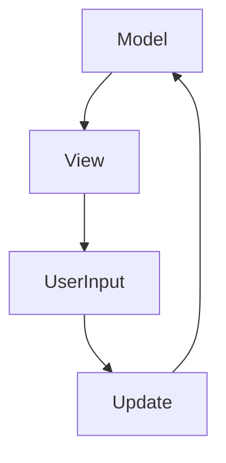

## 12.2 Model-View-Update (MVU) with Elm Architecture

The Model-View-Update (MVU) pattern, popularized by the Elm programming language, is a powerful architectural pattern for building user interfaces. It emphasizes a unidirectional data flow, making state management predictable and straightforward. In this section, we will explore how to implement the MVU pattern in Haskell, leveraging its strong type system and functional programming paradigms.

### Understanding the MVU Pattern

#### Intent

The MVU pattern aims to manage state changes in a predictable manner through a unidirectional data flow. This approach simplifies reasoning about state transitions and UI updates, reducing the likelihood of bugs and making the codebase easier to maintain.

#### Key Participants

- **Model**: Represents the application's state.
- **View**: A pure function that renders the UI based on the current state.
- **Update**: A function that takes the current state and a message, returning a new state.

#### Applicability

The MVU pattern is suitable for applications where state management and UI updates need to be predictable and easy to reason about. It is particularly beneficial in complex web applications where managing state changes can become challenging.

### The Elm Architecture

The Elm Architecture is a specific implementation of the MVU pattern, emphasizing simplicity and correctness. It consists of three main components:

1. **Model**: The data structure representing the state of the application.
2. **Update**: A function that describes how the state changes in response to messages.
3. **View**: A function that renders the UI based on the current state.

#### Diagram: Elm Architecture Flow



*Description*: This diagram illustrates the unidirectional flow of data in the Elm Architecture. The Model is rendered by the View, which generates User Input. This input is processed by the Update function, which modifies the Model.

### Implementing MVU in Haskell

To implement the MVU pattern in Haskell, we can use libraries like `reflex-dom`, which facilitate building reactive web applications. Let's walk through the process of creating a simple counter application using the MVU pattern.

#### Step 1: Define the Model

The Model represents the state of our application. For a counter application, the state is simply an integer representing the current count.

```haskell
-- Model.hs
module Model where

-- Define the Model
type Model = Int
```

#### Step 2: Define the Messages

Messages represent the different actions that can occur in the application. For our counter, we have two actions: increment and decrement.

```haskell
-- Messages.hs
module Messages where

-- Define Messages
data Msg = Increment | Decrement
```

#### Step 3: Implement the Update Function

The Update function takes the current state and a message, returning a new state. It describes how the state changes in response to each message.

```haskell
-- Update.hs
module Update where

import Model
import Messages

-- Update function
update :: Msg -> Model -> Model
update Increment count = count + 1
update Decrement count = count - 1
```

#### Step 4: Implement the View Function

The View function renders the UI based on the current state. It is a pure function that takes the Model and returns a representation of the UI.

```haskell
-- View.hs
module View where

import Model
import Messages

-- View function
view :: Model -> (Msg -> IO ()) -> IO ()
view count dispatch = do
    putStrLn $ "Count: " ++ show count
    putStrLn "Press '+' to increment, '-' to decrement, 'q' to quit."
    input <- getLine
    case input of
        "+" -> dispatch Increment
        "-" -> dispatch Decrement
        "q" -> return ()
        _   -> putStrLn "Invalid input" >> view count dispatch
```

#### Step 5: Wiring It All Together

Finally, we need to wire everything together in a main function that initializes the Model and starts the event loop.

```haskell
-- Main.hs
module Main where

import Model
import Messages
import Update
import View

-- Main function
main :: IO ()
main = loop 0

-- Event loop
loop :: Model -> IO ()
loop model = do
    view model dispatch
    where
        dispatch msg = loop (update msg model)
```

### Try It Yourself

Experiment with the code by adding new messages and updating the View function to handle additional user interactions. For example, you could add a reset button to set the count back to zero.

### Haskell Unique Features

Haskell's strong static typing and purity make it an excellent fit for the MVU pattern. The type system ensures that state transitions are well-defined, and the use of pure functions simplifies reasoning about the code.

### Design Considerations

- **State Management**: Ensure that the Model accurately represents the application's state and that the Update function handles all possible messages.
- **UI Rendering**: Keep the View function pure and focused on rendering the UI based on the current state.
- **Scalability**: As the application grows, consider breaking down the Model, View, and Update functions into smaller, more manageable components.

### Differences and Similarities

The MVU pattern is often compared to the Model-View-Controller (MVC) pattern. While both patterns separate concerns, MVU emphasizes a unidirectional data flow, making state management more predictable.

### References and Further Reading

- [Elm Architecture in Haskell](https://guide.elm-lang.org/architecture/)
- [Reflex-Dom Documentation](https://reflex-frp.org/)

### Knowledge Check

- What are the three main components of the MVU pattern?
- How does the Update function contribute to state management?
- Why is a unidirectional data flow beneficial in UI design?

### Summary

The MVU pattern, as implemented in the Elm Architecture, provides a robust framework for managing state changes in web applications. By leveraging Haskell's functional programming features, we can create applications that are both simple and correct. Remember, this is just the beginning. As you progress, you'll build more complex and interactive applications. Keep experimenting, stay curious, and enjoy the journey!

## Quiz: Model-View-Update (MVU) with Elm Architecture



### What is the primary benefit of using the MVU pattern?

- [x] Predictable state management
- [ ] Faster rendering
- [ ] Easier debugging
- [ ] More concise code

> **Explanation:** The MVU pattern provides predictable state management through a unidirectional data flow.

### Which component of the MVU pattern is responsible for rendering the UI?

- [ ] Model
- [ ] Update
- [x] View
- [ ] Controller

> **Explanation:** The View component renders the UI based on the current state.

### What does the Update function do in the MVU pattern?

- [x] It updates the state based on messages.
- [ ] It renders the UI.
- [ ] It handles user input.
- [ ] It initializes the application.

> **Explanation:** The Update function takes the current state and a message, returning a new state.

### How does Haskell's type system benefit the MVU pattern?

- [x] Ensures well-defined state transitions
- [ ] Increases performance
- [ ] Simplifies UI rendering
- [ ] Reduces code size

> **Explanation:** Haskell's type system ensures that state transitions are well-defined and type-safe.

### What library can be used in Haskell to implement the MVU pattern for web applications?

- [x] reflex-dom
- [ ] Yesod
- [ ] Servant
- [ ] Aeson

> **Explanation:** The `reflex-dom` library is used for building reactive web applications in Haskell.

### What is the role of the Model in the MVU pattern?

- [x] Represents the application's state
- [ ] Handles user input
- [ ] Updates the UI
- [ ] Processes messages

> **Explanation:** The Model represents the state of the application.

### What is a key difference between MVU and MVC patterns?

- [x] MVU emphasizes unidirectional data flow.
- [ ] MVC is more suitable for web applications.
- [ ] MVU has more components.
- [ ] MVC is easier to implement.

> **Explanation:** MVU emphasizes a unidirectional data flow, making state management more predictable.

### How can you extend the counter example to include a reset button?

- [x] Add a Reset message and update the View and Update functions.
- [ ] Modify the Model to include a reset function.
- [ ] Use a different library.
- [ ] Change the main function to handle resets.

> **Explanation:** Add a Reset message and update the View and Update functions to handle it.

### What is the purpose of the event loop in the MVU pattern?

- [x] To continuously update the state and UI
- [ ] To initialize the application
- [ ] To handle errors
- [ ] To manage user sessions

> **Explanation:** The event loop continuously updates the state and UI based on user interactions.

### True or False: The MVU pattern is only applicable to web applications.

- [ ] True
- [x] False

> **Explanation:** The MVU pattern can be applied to any application where predictable state management is beneficial.


