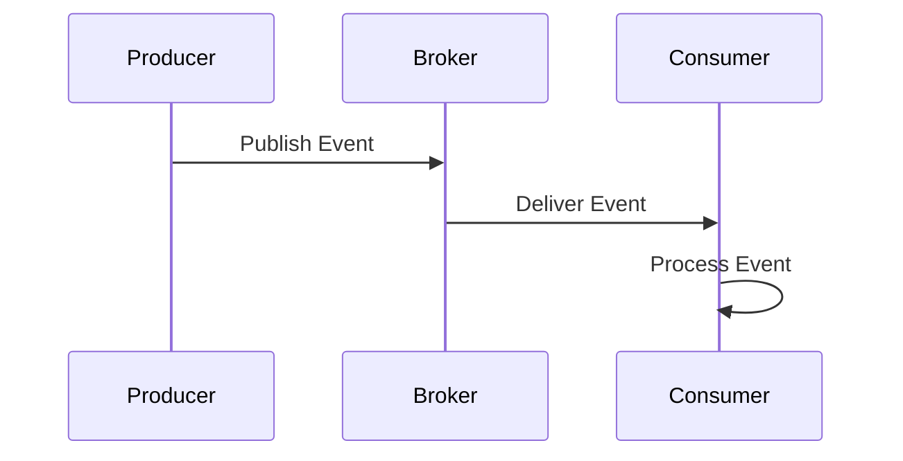

## 12.3 Event-Driven Architecture and Messaging

In the realm of software architecture, **Event-Driven Architecture (EDA)** stands out as a powerful paradigm that enables systems to respond to events or messages. This approach is particularly beneficial in creating scalable, decoupled systems where components can operate independently and react to changes in real-time. In this section, we will delve into the principles of EDA, explore its benefits, and demonstrate how to implement it using Haskell, a language renowned for its strong support for functional programming and concurrency.

### Understanding Event-Driven Architecture

**Event-Driven Architecture** is a design pattern where the flow of the program is determined by events. An event can be defined as a significant change in state. In EDA, components communicate with each other through events, which are typically messages sent between them. This architecture is particularly useful in systems that require high scalability and flexibility.

#### Key Concepts

- **Events**: These are the core elements of EDA. An event signifies a change in state or an occurrence of interest. Events can be anything from a user action, like clicking a button, to a system event, such as a file being uploaded.

- **Event Producers**: These are components that generate events. They detect changes in state and emit events to notify other components.

- **Event Consumers**: These components listen for events and react accordingly. They can perform actions such as updating a database, sending a notification, or triggering another event.

- **Event Channels**: These are pathways through which events are transmitted from producers to consumers. They can be implemented using message brokers or other communication mechanisms.

- **Event Processors**: These are components that process events, often transforming them or routing them to appropriate consumers.

### Benefits of Event-Driven Architecture

EDA offers several advantages, particularly in the context of modern, distributed systems:

- **Decoupling**: By separating event producers and consumers, EDA reduces dependencies between components, allowing them to evolve independently.

- **Scalability**: EDA facilitates horizontal scaling by enabling components to be distributed across multiple nodes.

- **Flexibility**: The architecture allows for easy addition or modification of components without affecting the overall system.

- **Real-Time Processing**: EDA supports real-time data processing, making it ideal for applications that require immediate responses to events.

### Implementing Event-Driven Architecture in Haskell

Haskell, with its strong emphasis on functional programming and concurrency, is well-suited for implementing EDA. Let's explore how to build an event-driven system in Haskell using message brokers and asynchronous communication.

#### Setting Up the Environment

Before we dive into the implementation, ensure you have the Haskell platform installed. You can use tools like Cabal or Stack for package management and building your Haskell projects.

#### Using Message Brokers

Message brokers play a crucial role in EDA by facilitating communication between event producers and consumers. Popular message brokers include RabbitMQ, Kafka, and Redis. In Haskell, libraries like `amqp` and `kafka-client` provide bindings to these brokers.

##### Example: RabbitMQ with Haskell

Let's consider a simple example where a Haskell application uses RabbitMQ to send and receive messages.

```haskell
{-# LANGUAGE OverloadedStrings #-}

import Network.AMQP

main :: IO ()
main = do
    conn <- openConnection "127.0.0.1" "/" "guest" "guest"
    chan <- openChannel conn

    -- Declare a queue
    declareQueue chan newQueue {queueName = "event_queue"}

    -- Publish a message
    publishMsg chan "" "event_queue" newMsg {msgBody = "Hello, Event-Driven World!"}

    -- Consume messages
    consumeMsgs chan "event_queue" Ack (\\(msg, env) -> do
        putStrLn $ "Received message: " ++ (msgBody msg)
        ackEnv env)

    -- Close the connection
    closeConnection conn
```

In this example, we establish a connection to RabbitMQ, declare a queue, publish a message, and set up a consumer to receive messages. The `consumeMsgs` function listens for messages and processes them using a callback function.

#### Asynchronous Communication

Asynchronous communication is a cornerstone of EDA, allowing components to operate independently without blocking each other. Haskell's concurrency model, based on lightweight threads and Software Transactional Memory (STM), makes it easy to implement asynchronous communication.

##### Example: Asynchronous Event Processing

Let's extend our RabbitMQ example to process events asynchronously using Haskell's `async` library.

```haskell
import Control.Concurrent.Async
import Network.AMQP

processEvent :: Message -> IO ()
processEvent msg = do
    putStrLn $ "Processing event: " ++ (msgBody msg)
    -- Simulate some processing time
    threadDelay 1000000

main :: IO ()
main = do
    conn <- openConnection "127.0.0.1" "/" "guest" "guest"
    chan <- openChannel conn

    declareQueue chan newQueue {queueName = "event_queue"}

    -- Asynchronously consume and process messages
    _ <- async $ consumeMsgs chan "event_queue" Ack (\\(msg, env) -> do
        async $ processEvent msg
        ackEnv env)

    -- Keep the main thread alive
    getLine
    closeConnection conn
```

In this example, we use the `async` function to process each event in a separate thread, allowing multiple events to be processed concurrently.

### Visualizing Event-Driven Architecture

To better understand the flow of events in an event-driven system, let's visualize the architecture using a sequence diagram.



This diagram illustrates the interaction between an event producer, a message broker, and an event consumer. The producer publishes an event to the broker, which then delivers it to the consumer for processing.

### Design Considerations

When implementing EDA in Haskell, consider the following:

- **Event Schema**: Define a clear schema for your events to ensure consistency and compatibility between producers and consumers.

- **Error Handling**: Implement robust error handling to manage failures in event processing. Consider using Haskell's `Either` or `Maybe` monads for error management.

- **Scalability**: Design your system to handle increased load by distributing components across multiple nodes and using load balancing techniques.

- **Monitoring and Logging**: Implement comprehensive logging and monitoring to track the flow of events and diagnose issues.

### Haskell Unique Features

Haskell offers several unique features that enhance the implementation of EDA:

- **Strong Typing**: Haskell's type system ensures that events and messages are well-defined and consistent, reducing runtime errors.

- **Concurrency**: Haskell's lightweight threads and STM provide efficient concurrency, enabling high-performance event processing.

- **Immutability**: Haskell's immutable data structures ensure that events are not accidentally modified, preserving their integrity.

### Differences and Similarities with Other Patterns

EDA shares similarities with other architectural patterns, such as:

- **Publish-Subscribe**: Both patterns involve decoupling components through message passing. However, EDA focuses more on the flow of events and their processing.

- **Microservices**: EDA can be used within a microservices architecture to facilitate communication between services. Both patterns emphasize decoupling and scalability.

### Try It Yourself

To deepen your understanding of EDA in Haskell, try modifying the code examples provided:

- **Experiment with Different Message Brokers**: Replace RabbitMQ with Kafka or Redis and observe how the implementation changes.

- **Implement Additional Event Consumers**: Add more consumers to process different types of events and see how they interact.

- **Simulate Real-World Scenarios**: Create a more complex event-driven system that mimics a real-world application, such as an e-commerce platform.

### Knowledge Check

To reinforce your understanding of Event-Driven Architecture and Messaging in Haskell, consider the following questions:

- What are the key components of an event-driven system?
- How does Haskell's concurrency model facilitate asynchronous communication?
- What are the benefits of using message brokers in EDA?
- How can you ensure consistency and compatibility between event producers and consumers?

### Embrace the Journey

Remember, mastering Event-Driven Architecture in Haskell is a journey. As you explore and experiment with different patterns and techniques, you'll gain a deeper understanding of how to build scalable, resilient systems. Keep experimenting, stay curious, and enjoy the journey!

## Quiz: Event-Driven Architecture and Messaging



### What is the primary benefit of using Event-Driven Architecture?

- [x] Decoupling components
- [ ] Increasing code complexity
- [ ] Reducing system performance
- [ ] Limiting scalability

> **Explanation:** Event-Driven Architecture primarily benefits systems by decoupling components, allowing them to operate independently and scale effectively.

### Which Haskell feature is particularly useful for implementing asynchronous communication?

- [x] Lightweight threads and STM
- [ ] Lazy evaluation
- [ ] Type classes
- [ ] Pattern matching

> **Explanation:** Haskell's lightweight threads and Software Transactional Memory (STM) are particularly useful for implementing asynchronous communication.

### What role does a message broker play in an event-driven system?

- [x] Facilitates communication between event producers and consumers
- [ ] Generates events
- [ ] Processes events
- [ ] Consumes events

> **Explanation:** A message broker facilitates communication between event producers and consumers by transmitting messages.

### How does Haskell's strong typing benefit Event-Driven Architecture?

- [x] Ensures well-defined and consistent events
- [ ] Increases runtime errors
- [ ] Complicates message passing
- [ ] Limits scalability

> **Explanation:** Haskell's strong typing ensures that events and messages are well-defined and consistent, reducing runtime errors.

### Which of the following is a key component of an event-driven system?

- [x] Event Producers
- [ ] Database
- [ ] User Interface
- [ ] File System

> **Explanation:** Event Producers are key components of an event-driven system, responsible for generating events.

### What is a common use case for Event-Driven Architecture?

- [x] Real-time data processing
- [ ] Batch processing
- [ ] Static website hosting
- [ ] Single-threaded applications

> **Explanation:** Event-Driven Architecture is commonly used for real-time data processing, where immediate responses to events are required.

### How can you handle errors in an event-driven system in Haskell?

- [x] Using Either or Maybe monads
- [ ] Ignoring them
- [ ] Using global variables
- [ ] Relying on exceptions

> **Explanation:** In Haskell, errors in an event-driven system can be handled using Either or Maybe monads for robust error management.

### What is the purpose of event channels in EDA?

- [x] Transmit events from producers to consumers
- [ ] Generate events
- [ ] Store events
- [ ] Delete events

> **Explanation:** Event channels are pathways that transmit events from producers to consumers in an event-driven system.

### How does immutability benefit Event-Driven Architecture in Haskell?

- [x] Preserves the integrity of events
- [ ] Increases the risk of data corruption
- [ ] Complicates event processing
- [ ] Limits event generation

> **Explanation:** Immutability in Haskell preserves the integrity of events by ensuring they are not accidentally modified.

### True or False: Event-Driven Architecture is only suitable for small-scale applications.

- [ ] True
- [x] False

> **Explanation:** False. Event-Driven Architecture is suitable for both small-scale and large-scale applications, offering scalability and flexibility.




