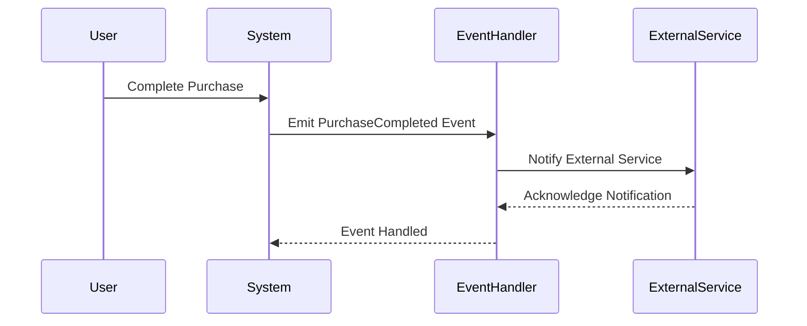

## 12.4 Domain Event Pattern

In the realm of software architecture, the Domain Event Pattern is a powerful tool for capturing and handling significant events within a domain. This pattern is particularly useful in systems where decoupling components and facilitating communication between them is essential. In this section, we will delve into the Domain Event Pattern, exploring its concepts, implementation in Haskell, and providing detailed examples to illustrate its application.

### Concept

The Domain Event Pattern revolves around the idea of capturing significant events within a domain and using these events to communicate between different components of a system. These events are often changes in state or important actions that occur within the domain, such as a user completing a purchase or a product being added to a catalog.

#### Key Concepts

1. **Domain Events**: These are immutable objects that represent something that has happened in the domain. They are typically named in the past tense, such as `UserRegistered` or `OrderShipped`.

2. **Event Handling**: Once a domain event is captured, it needs to be handled appropriately. This often involves notifying other parts of the system or triggering additional processes.

3. **Asynchronous Processing**: Domain events are often processed asynchronously to ensure that the main flow of the application is not blocked by event handling logic.

4. **Decoupling**: By using domain events, components of a system can be decoupled, allowing them to evolve independently and communicate through well-defined events.

### Implementation in Haskell

Haskell, with its strong type system and functional programming paradigm, provides an excellent foundation for implementing the Domain Event Pattern. Let's explore how we can define and handle domain events in Haskell.

#### Defining Domain Events

In Haskell, domain events can be represented as data types. These data types encapsulate the information related to the event. Here's an example of defining a domain event for a user completing a purchase:

```haskell
-- Define a data type for a domain event
data PurchaseCompleted = PurchaseCompleted
  { userId :: Int
  , orderId :: Int
  , amount :: Double
  } deriving (Show, Eq)
```

In this example, the `PurchaseCompleted` data type captures the essential information about the event, such as the user ID, order ID, and the amount of the purchase.

#### Handling Domain Events

Once a domain event is defined, we need to handle it. In Haskell, we can use functions to process these events. Here's an example of a function that handles the `PurchaseCompleted` event:

```haskell
-- Define a function to handle the PurchaseCompleted event
handlePurchaseCompleted :: PurchaseCompleted -> IO ()
handlePurchaseCompleted event = do
  putStrLn $ "Handling purchase completed event for user: " ++ show (userId event)
  -- Additional logic to notify other services or update the system state
```

This function takes a `PurchaseCompleted` event as input and performs some actions, such as printing a message or notifying other services.

### Asynchronous Event Handling

In many cases, domain events need to be processed asynchronously to avoid blocking the main application flow. Haskell provides several mechanisms for asynchronous processing, such as using threads or libraries like `async`.

Here's an example of handling domain events asynchronously using the `async` library:

```haskell
import Control.Concurrent.Async (async)

-- Asynchronously handle a domain event
handleEventAsync :: PurchaseCompleted -> IO ()
handleEventAsync event = do
  _ <- async $ handlePurchaseCompleted event
  return ()
```

In this example, the `handleEventAsync` function uses the `async` library to handle the `PurchaseCompleted` event asynchronously. This allows the main application to continue running while the event is being processed.

### Example: Notifying Other Services

Let's consider a more comprehensive example where we notify other services when a user completes a purchase. We'll define a domain event, handle it, and simulate notifying an external service.

```haskell
-- Define a data type for a domain event
data PurchaseCompleted = PurchaseCompleted
  { userId :: Int
  , orderId :: Int
  , amount :: Double
  } deriving (Show, Eq)

-- Define a function to handle the PurchaseCompleted event
handlePurchaseCompleted :: PurchaseCompleted -> IO ()
handlePurchaseCompleted event = do
  putStrLn $ "Handling purchase completed event for user: " ++ show (userId event)
  notifyExternalService event

-- Simulate notifying an external service
notifyExternalService :: PurchaseCompleted -> IO ()
notifyExternalService event = do
  putStrLn $ "Notifying external service about purchase: " ++ show (orderId event)
  -- Simulate a delay
  threadDelay 1000000
  putStrLn "Notification sent successfully."

-- Asynchronously handle a domain event
handleEventAsync :: PurchaseCompleted -> IO ()
handleEventAsync event = do
  _ <- async $ handlePurchaseCompleted event
  return ()

-- Main function to simulate a purchase completion
main :: IO ()
main = do
  let event = PurchaseCompleted { userId = 1, orderId = 123, amount = 99.99 }
  handleEventAsync event
  putStrLn "Main application continues running..."
```

In this example, we define a `PurchaseCompleted` event and a function to handle it. The `handlePurchaseCompleted` function simulates notifying an external service by printing messages and introducing a delay. The `handleEventAsync` function processes the event asynchronously, allowing the main application to continue running.

### Visualizing the Domain Event Pattern

To better understand the flow of the Domain Event Pattern, let's visualize it using a sequence diagram.



**Diagram Description**: This sequence diagram illustrates the flow of the Domain Event Pattern. When a user completes a purchase, the system emits a `PurchaseCompleted` event. The event handler processes the event and notifies an external service. Once the notification is acknowledged, the event handler informs the system that the event has been handled.

### Design Considerations

When implementing the Domain Event Pattern, there are several design considerations to keep in mind:

1. **Event Granularity**: Determine the appropriate level of granularity for domain events. Too granular events may lead to excessive event traffic, while too coarse events may miss important details.

2. **Event Storage**: Consider whether domain events should be stored for auditing or replay purposes. Event sourcing is a related pattern that involves storing all domain events.

3. **Error Handling**: Implement robust error handling for event processing. Ensure that failures in event handling do not disrupt the main application flow.

4. **Performance**: Asynchronous event handling can improve performance, but it also introduces complexity. Balance the need for responsiveness with the overhead of managing asynchronous processes.

5. **Scalability**: Design the event handling system to scale with the application's needs. Consider using message queues or event streaming platforms for large-scale systems.

### Haskell Unique Features

Haskell's unique features, such as its strong type system, immutability, and support for functional programming, make it well-suited for implementing the Domain Event Pattern. Here are some Haskell-specific advantages:

- **Type Safety**: Haskell's type system ensures that domain events are well-defined and handled correctly. This reduces the risk of runtime errors.

- **Immutability**: Domain events are naturally immutable, aligning with Haskell's emphasis on immutability and pure functions.

- **Concurrency**: Haskell's concurrency primitives, such as `async` and `STM`, facilitate asynchronous event handling and make it easier to build responsive systems.

### Differences and Similarities

The Domain Event Pattern is often compared to other patterns, such as Event Sourcing and Command Query Responsibility Segregation (CQRS). Here are some key differences and similarities:

- **Event Sourcing**: While the Domain Event Pattern focuses on capturing and handling events, Event Sourcing involves storing all domain events as the source of truth. Event Sourcing can be seen as an extension of the Domain Event Pattern.

- **CQRS**: CQRS separates command and query responsibilities, often using domain events to update the read model. The Domain Event Pattern is commonly used in CQRS architectures to propagate changes.

- **Observer Pattern**: The Domain Event Pattern is similar to the Observer Pattern in that both involve notifying interested parties of changes. However, the Domain Event Pattern is more focused on domain-specific events and often involves asynchronous processing.

### Try It Yourself

To deepen your understanding of the Domain Event Pattern, try modifying the code examples provided. Here are some suggestions:

1. **Add More Events**: Define additional domain events, such as `ProductAdded` or `UserLoggedIn`, and implement handlers for them.

2. **Simulate Failures**: Introduce error handling in the event processing logic and simulate failures to see how the system responds.

3. **Integrate with a Message Queue**: Experiment with integrating the domain event system with a message queue, such as RabbitMQ or Kafka, to handle events at scale.

### Knowledge Check

Before we wrap up, let's reinforce what we've learned with a few questions:

- What are the key components of the Domain Event Pattern?
- How does Haskell's type system benefit the implementation of domain events?
- What are some design considerations when implementing the Domain Event Pattern?

### Embrace the Journey

Remember, mastering the Domain Event Pattern is just one step in your journey as a software architect. As you continue to explore Haskell and design patterns, you'll discover new ways to build scalable, maintainable, and resilient systems. Keep experimenting, stay curious, and enjoy the journey!

## Quiz: Domain Event Pattern



### What is a domain event in the context of the Domain Event Pattern?

- [x] An immutable object representing something that has happened in the domain
- [ ] A mutable object used to track changes in the domain
- [ ] A function that modifies the state of the domain
- [ ] A temporary object used for testing purposes

> **Explanation:** A domain event is an immutable object that captures a significant occurrence within the domain, often used to communicate between components.

### How does Haskell's type system benefit the implementation of domain events?

- [x] Ensures domain events are well-defined and handled correctly
- [ ] Allows domain events to be mutable
- [ ] Provides dynamic typing for flexibility
- [ ] Eliminates the need for error handling

> **Explanation:** Haskell's strong type system ensures that domain events are well-defined, reducing the risk of runtime errors and ensuring correct handling.

### What is the primary purpose of handling domain events asynchronously?

- [x] To avoid blocking the main application flow
- [ ] To ensure events are processed in order
- [ ] To increase the complexity of the system
- [ ] To reduce the number of events generated

> **Explanation:** Asynchronous handling of domain events prevents the main application flow from being blocked, allowing for more responsive systems.

### Which Haskell library can be used for asynchronous event handling?

- [x] async
- [ ] lens
- [ ] aeson
- [ ] conduit

> **Explanation:** The `async` library in Haskell provides mechanisms for asynchronous processing, making it suitable for handling domain events.

### What is a key difference between the Domain Event Pattern and Event Sourcing?

- [x] Event Sourcing involves storing all domain events as the source of truth
- [ ] Domain Event Pattern requires storing events in a database
- [ ] Event Sourcing is only used for logging purposes
- [ ] Domain Event Pattern focuses on synchronous processing

> **Explanation:** Event Sourcing extends the Domain Event Pattern by storing all domain events as the source of truth, whereas the Domain Event Pattern focuses on capturing and handling events.

### What is a common use case for the Domain Event Pattern?

- [x] Notifying other services when a user completes a purchase
- [ ] Storing user preferences in a database
- [ ] Rendering a user interface
- [ ] Compiling a Haskell program

> **Explanation:** The Domain Event Pattern is often used to notify other services or components when significant events, such as a user completing a purchase, occur.

### How can domain events be represented in Haskell?

- [x] As data types
- [ ] As mutable variables
- [ ] As global constants
- [ ] As monads

> **Explanation:** In Haskell, domain events are typically represented as data types, encapsulating the information related to the event.

### What is a potential benefit of using domain events in a system?

- [x] Decoupling components and allowing them to evolve independently
- [ ] Increasing the complexity of the system
- [ ] Reducing the need for testing
- [ ] Eliminating the need for error handling

> **Explanation:** Domain events help decouple components, allowing them to communicate through well-defined events and evolve independently.

### What is a design consideration when implementing the Domain Event Pattern?

- [x] Determining the appropriate level of granularity for events
- [ ] Ensuring all events are processed synchronously
- [ ] Avoiding the use of data types
- [ ] Storing events as mutable objects

> **Explanation:** One design consideration is determining the appropriate level of granularity for domain events to balance detail and event traffic.

### True or False: The Domain Event Pattern is similar to the Observer Pattern.

- [x] True
- [ ] False

> **Explanation:** The Domain Event Pattern is similar to the Observer Pattern in that both involve notifying interested parties of changes, but the Domain Event Pattern is more focused on domain-specific events.


