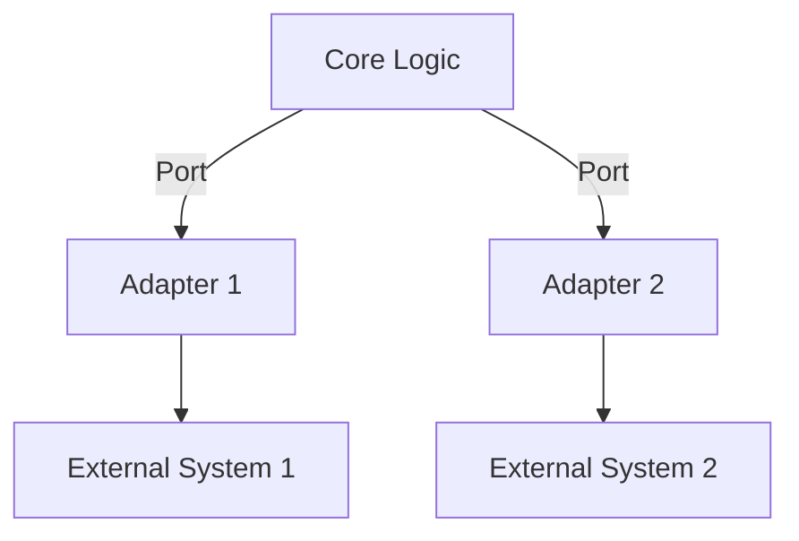

## 12.5 Hexagonal Architecture (Ports and Adapters)

Hexagonal Architecture, also known as the Ports and Adapters pattern, is a software design pattern that aims to create a clear separation between the core logic of an application and its external dependencies. This pattern is particularly well-suited for Haskell due to its strong emphasis on immutability and type safety. In this section, we will explore the key concepts of Hexagonal Architecture, how to implement it using Haskell's unique features, and provide practical examples to illustrate its application.

### Understanding Hexagonal Architecture

Hexagonal Architecture was introduced by Alistair Cockburn to address the challenges of building maintainable and adaptable software systems. The core idea is to isolate the business logic (the "hexagon") from external concerns such as databases, user interfaces, or third-party services. This separation is achieved through the use of ports and adapters.

#### Key Concepts

- **Core Logic**: The central part of the application that contains the business rules and logic. It is independent of any external systems.
- **Ports**: Interfaces that define how the core logic interacts with the outside world. Ports are abstract and do not contain any implementation details.
- **Adapters**: Concrete implementations of the ports that connect the core logic to external systems. Adapters translate between the core logic and the external world.

### Benefits of Hexagonal Architecture

- **Testability**: By isolating the core logic, it becomes easier to test the business rules without involving external systems.
- **Flexibility**: The architecture allows for easy swapping of external systems by changing the adapters without affecting the core logic.
- **Maintainability**: The clear separation of concerns leads to a more organized and maintainable codebase.

### Implementing Hexagonal Architecture in Haskell

Haskell's type system and functional programming paradigm make it an excellent choice for implementing Hexagonal Architecture. We can leverage type classes to define ports and instances to create adapters.

#### Defining Ports with Type Classes

In Haskell, a port can be represented as a type class. This allows us to define a set of operations that the core logic can perform, without specifying how these operations are implemented.

```haskell
-- Define a port for data storage
class DataStorage m where
    saveData :: m -> String -> IO ()
    loadData :: m -> IO String
```

In this example, `DataStorage` is a type class that defines two operations: `saveData` and `loadData`. These operations are abstract and do not specify how data is saved or loaded.

#### Creating Adapters with Instances

Adapters are concrete implementations of the ports. In Haskell, we can create instances of the type class to define how the operations are performed.

```haskell
-- Adapter for file-based storage
data FileStorage = FileStorage FilePath

instance DataStorage FileStorage where
    saveData (FileStorage path) content = writeFile path content
    loadData (FileStorage path) = readFile path
```

Here, `FileStorage` is an adapter that implements the `DataStorage` port using the file system. The `saveData` and `loadData` functions are implemented using Haskell's `writeFile` and `readFile` functions.

### Example: Business Logic Independent of Data Storage

Let's consider a simple example where we have a business logic that processes user data. We want this logic to be independent of how the data is stored.

#### Core Logic

The core logic is implemented as a function that processes user data. It interacts with the data storage through the `DataStorage` port.

```haskell
-- Core logic that processes user data
processUserData :: DataStorage m => m -> String -> IO ()
processUserData storage userData = do
    saveData storage userData
    putStrLn "User data processed and saved."
```

#### Using the Adapter

To use the core logic with a specific storage mechanism, we create an instance of the adapter and pass it to the function.

```haskell
main :: IO ()
main = do
    let fileStorage = FileStorage "user_data.txt"
    processUserData fileStorage "Sample User Data"
```

In this example, we create a `FileStorage` adapter and use it to process and save user data. The core logic remains unchanged regardless of the storage mechanism.

### Visualizing Hexagonal Architecture

To better understand the structure of Hexagonal Architecture, let's visualize it using a Mermaid.js diagram.



**Diagram Description**: The diagram illustrates the core logic in the center, connected to two adapters through ports. Each adapter interfaces with an external system, demonstrating the separation of concerns.

### Design Considerations

When implementing Hexagonal Architecture in Haskell, consider the following:

- **Type Safety**: Leverage Haskell's type system to ensure that ports and adapters are correctly implemented.
- **Immutability**: Use immutable data structures to maintain the integrity of the core logic.
- **Modularity**: Organize the codebase into modules to enhance maintainability and readability.

### Haskell Unique Features

Haskell's strong static typing and type classes provide a robust foundation for implementing Hexagonal Architecture. The use of type classes allows for flexible and reusable interfaces, while instances provide concrete implementations.

### Differences and Similarities

Hexagonal Architecture is often compared to other architectural patterns like Clean Architecture and Onion Architecture. While they share similarities in separating core logic from external concerns, Hexagonal Architecture emphasizes the use of ports and adapters for interaction.

### Try It Yourself

To deepen your understanding of Hexagonal Architecture in Haskell, try modifying the code examples:

- Implement a new adapter for a different storage mechanism, such as a database or an in-memory store.
- Extend the `DataStorage` port with additional operations and update the adapters accordingly.
- Experiment with different types of core logic that interact with the storage.

### Knowledge Check

- What are the main components of Hexagonal Architecture?
- How do ports and adapters contribute to the flexibility of the architecture?
- Why is Haskell well-suited for implementing Hexagonal Architecture?

### Summary

Hexagonal Architecture provides a powerful framework for building maintainable and adaptable software systems. By isolating the core logic from external concerns, it enhances testability, flexibility, and maintainability. Haskell's type system and functional paradigm make it an ideal choice for implementing this pattern.

### References and Further Reading

- [Alistair Cockburn's Hexagonal Architecture](https://alistair.cockburn.us/hexagonal-architecture/)
- [Haskell Type Classes](https://wiki.haskell.org/Type_class)
- [Functional Programming Principles](https://www.fpcomplete.com/haskell/tutorial/)

## Quiz: Hexagonal Architecture (Ports and Adapters)



### What is the primary goal of Hexagonal Architecture?

- [x] To isolate core logic from external concerns
- [ ] To integrate all components into a single module
- [ ] To focus on user interface design
- [ ] To enhance database performance

> **Explanation:** Hexagonal Architecture aims to separate core business logic from external systems, enhancing flexibility and maintainability.

### In Hexagonal Architecture, what is a port?

- [x] An interface that defines how the core logic interacts with the outside world
- [ ] A concrete implementation of a storage mechanism
- [ ] A database connection
- [ ] A user interface component

> **Explanation:** Ports are abstract interfaces that define interactions between the core logic and external systems.

### How are adapters used in Hexagonal Architecture?

- [x] They implement ports to connect core logic with external systems
- [ ] They define the core business logic
- [ ] They serve as user interface components
- [ ] They are used for database indexing

> **Explanation:** Adapters provide concrete implementations of ports, facilitating communication between the core logic and external systems.

### Which Haskell feature is particularly useful for defining ports?

- [x] Type classes
- [ ] Monads
- [ ] Lists
- [ ] IO operations

> **Explanation:** Type classes in Haskell allow for the definition of abstract interfaces, making them ideal for representing ports.

### What is a key benefit of using Hexagonal Architecture?

- [x] Improved testability of the core logic
- [ ] Faster database queries
- [ ] Enhanced user interface design
- [ ] Reduced memory usage

> **Explanation:** By isolating core logic, Hexagonal Architecture makes it easier to test business rules without involving external systems.

### How does Haskell's immutability support Hexagonal Architecture?

- [x] It maintains the integrity of the core logic
- [ ] It speeds up database transactions
- [ ] It simplifies user interface design
- [ ] It reduces code complexity

> **Explanation:** Immutability ensures that the core logic remains consistent and free from side effects, supporting the principles of Hexagonal Architecture.

### What is the role of type classes in Hexagonal Architecture?

- [x] To define abstract interfaces for ports
- [ ] To implement concrete adapters
- [ ] To manage database connections
- [ ] To handle user input

> **Explanation:** Type classes define the abstract interfaces (ports) that the core logic uses to interact with external systems.

### Which of the following is a common alternative to Hexagonal Architecture?

- [x] Clean Architecture
- [ ] Monolithic Architecture
- [ ] Layered Architecture
- [ ] Microservices Architecture

> **Explanation:** Clean Architecture is another pattern that emphasizes the separation of core logic from external concerns, similar to Hexagonal Architecture.

### True or False: Adapters in Hexagonal Architecture can be easily swapped without affecting the core logic.

- [x] True
- [ ] False

> **Explanation:** Adapters are designed to be interchangeable, allowing for flexibility in connecting the core logic to different external systems.

### What is a practical exercise to understand Hexagonal Architecture better?

- [x] Implement a new adapter for a different storage mechanism
- [ ] Rewrite the entire application in a different language
- [ ] Focus solely on user interface design
- [ ] Ignore external dependencies

> **Explanation:** Creating new adapters for different storage mechanisms helps in understanding how Hexagonal Architecture separates core logic from external concerns.



Remember, this is just the beginning. As you progress, you'll build more complex and interactive systems using Hexagonal Architecture. Keep experimenting, stay curious, and enjoy the journey!
