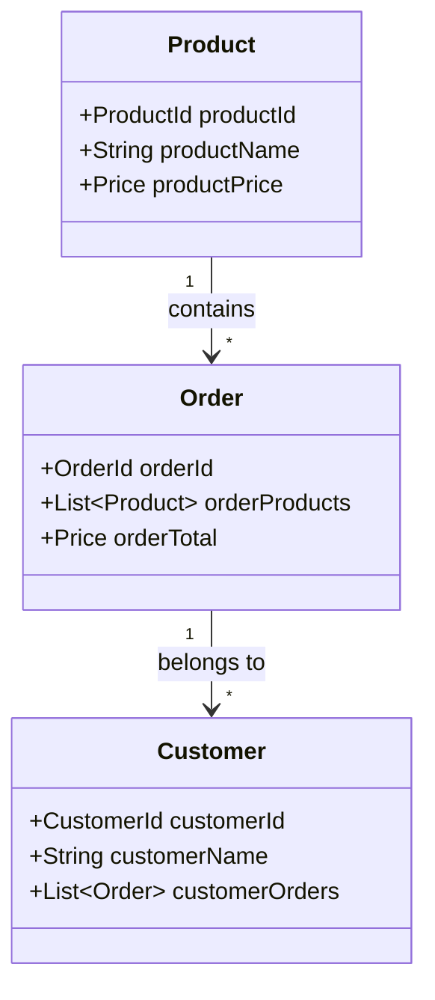

## 12.6 Domain-Driven Design (DDD) in Haskell

Domain-Driven Design (DDD) is a strategic approach to software development that emphasizes collaboration between technical and domain experts to create a shared understanding of the domain model. In Haskell, DDD can be effectively implemented using the language's powerful type system, which allows for precise modeling of domain concepts and business rules.

### DDD Principles

#### Focusing on the Core Domain and Domain Logic

The core domain represents the most critical aspects of the business that provide competitive advantage. In DDD, the focus is on understanding and modeling this core domain accurately. Haskell's expressive type system and functional paradigm make it an ideal choice for implementing DDD principles, as they allow developers to capture domain logic in a clear and concise manner.

#### Ubiquitous Language

Ubiquitous language is a shared language used by both domain experts and developers to ensure that everyone has a common understanding of the domain. This language is reflected in the code, making it easier to maintain and evolve the system. Haskell's syntax and type system facilitate the creation of a ubiquitous language by enabling developers to define domain-specific types and functions that closely mirror the language used by domain experts.

### Implementation

#### Modeling Domain Concepts with Haskell's Type System

Haskell's type system is a powerful tool for modeling domain concepts. By using algebraic data types, type classes, and other advanced features, developers can create precise representations of domain entities, value objects, and aggregates. This precision helps to enforce business rules and invariants at the type level, reducing the likelihood of runtime errors.

##### Example: Representing Complex Business Rules with Precise Types

Consider a domain where we need to model a simple e-commerce system. We can use Haskell's type system to represent various domain concepts such as `Product`, `Order`, and `Customer`. Let's explore how we can model these concepts and enforce business rules using types.

```haskell
-- Define a type for Product with a unique identifier and price
data Product = Product
  { productId :: ProductId
  , productName :: String
  , productPrice :: Price
  }

-- Define a type for Order with a list of products and a total price
data Order = Order
  { orderId :: OrderId
  , orderProducts :: [Product]
  , orderTotal :: Price
  }

-- Define a type for Customer with a name and a list of orders
data Customer = Customer
  { customerId :: CustomerId
  , customerName :: String
  , customerOrders :: [Order]
  }

-- Define a type for Price with a non-negative constraint
newtype Price = Price { getPrice :: Double }
  deriving (Show, Eq, Ord)

-- Ensure that Price is non-negative
mkPrice :: Double -> Maybe Price
mkPrice p
  | p >= 0    = Just (Price p)
  | otherwise = Nothing

-- Example of creating a Product with a valid price
createProduct :: ProductId -> String -> Double -> Maybe Product
createProduct pid name price = do
  validPrice <- mkPrice price
  return $ Product pid name validPrice
```

In this example, we define types for `Product`, `Order`, and `Customer`, each with relevant fields. The `Price` type is a `newtype` that ensures prices are non-negative, enforcing a business rule at the type level. The `mkPrice` function returns a `Maybe Price`, indicating that price creation can fail if the input is invalid.

### Visualizing Domain-Driven Design in Haskell

To better understand how DDD concepts are applied in Haskell, let's visualize the relationships between domain entities using a class diagram.



This diagram illustrates the relationships between `Product`, `Order`, and `Customer`. Each `Order` contains multiple `Products`, and each `Customer` can have multiple `Orders`.

### Key Participants in DDD

- **Entities**: Objects with a distinct identity that persists over time. In our example, `Product`, `Order`, and `Customer` are entities.
- **Value Objects**: Objects that describe some characteristic or attribute but have no identity. The `Price` type is a value object.
- **Aggregates**: A cluster of domain objects that can be treated as a single unit. An `Order` can be considered an aggregate of `Products`.
- **Repositories**: Mechanisms for retrieving and storing aggregates. While not explicitly shown in the example, repositories would handle data access for `Order` and `Customer`.

### Applicability of DDD in Haskell

DDD is particularly useful in complex domains where business logic is intricate and requires precise modeling. Haskell's type system and functional paradigm provide the tools needed to implement DDD effectively, allowing developers to focus on the core domain and enforce business rules at the type level.

### Design Considerations

When applying DDD in Haskell, consider the following:

- **Type Safety**: Leverage Haskell's type system to enforce invariants and business rules.
- **Immutability**: Use immutable data structures to ensure consistency and simplify reasoning about state changes.
- **Function Composition**: Utilize higher-order functions and composition to build complex domain logic from simple, reusable components.

### Haskell Unique Features

Haskell offers several unique features that enhance DDD implementation:

- **Algebraic Data Types**: Enable precise modeling of domain entities and value objects.
- **Type Classes**: Allow for polymorphism and abstraction, facilitating the implementation of domain logic.
- **Monads**: Provide a way to handle side effects and manage state changes in a controlled manner.

### Differences and Similarities with Other Patterns

DDD shares similarities with other architectural patterns, such as Hexagonal Architecture and Clean Architecture, in its emphasis on domain logic and separation of concerns. However, DDD places a stronger focus on collaboration with domain experts and the use of a ubiquitous language.

### Try It Yourself

To deepen your understanding of DDD in Haskell, try modifying the example code to add new domain concepts or business rules. For instance, you could:

- Implement a discount system for `Order` based on `Customer` loyalty.
- Add a new entity, such as `Supplier`, and model its relationship with `Product`.
- Introduce a repository pattern to handle data persistence for `Order` and `Customer`.

### Knowledge Check

- What is the core domain in DDD, and why is it important?
- How does Haskell's type system facilitate the implementation of DDD principles?
- What role does ubiquitous language play in DDD?

### Embrace the Journey

Remember, mastering DDD in Haskell is a journey. As you continue to explore and apply these concepts, you'll gain a deeper understanding of how to model complex domains effectively. Keep experimenting, stay curious, and enjoy the process of building robust, maintainable systems.

## Quiz: Domain-Driven Design (DDD) in Haskell



### What is the primary focus of Domain-Driven Design (DDD)?

- [x] Understanding and modeling the core domain
- [ ] Implementing user interfaces
- [ ] Optimizing database queries
- [ ] Designing network protocols

> **Explanation:** DDD focuses on understanding and modeling the core domain to provide a competitive advantage.

### How does Haskell's type system aid in DDD?

- [x] By allowing precise modeling of domain concepts
- [ ] By simplifying user interface design
- [ ] By optimizing runtime performance
- [ ] By providing dynamic typing

> **Explanation:** Haskell's type system allows for precise modeling of domain concepts, enforcing business rules at the type level.

### What is a ubiquitous language in DDD?

- [x] A shared language used by stakeholders and developers
- [ ] A programming language used for implementation
- [ ] A language for database queries
- [ ] A language for network communication

> **Explanation:** A ubiquitous language is a shared language used by stakeholders and developers to ensure a common understanding of the domain.

### Which of the following is a value object in the provided example?

- [x] Price
- [ ] Product
- [ ] Order
- [ ] Customer

> **Explanation:** The `Price` type is a value object, as it describes an attribute without a distinct identity.

### What is the role of repositories in DDD?

- [x] Mechanisms for retrieving and storing aggregates
- [ ] Tools for optimizing code performance
- [ ] Interfaces for user interaction
- [ ] Protocols for network communication

> **Explanation:** Repositories are mechanisms for retrieving and storing aggregates, handling data access in DDD.

### Which Haskell feature is used to enforce business rules at the type level?

- [x] Algebraic Data Types
- [ ] Lazy Evaluation
- [ ] List Comprehensions
- [ ] Pattern Matching

> **Explanation:** Algebraic Data Types allow for precise modeling and enforcement of business rules at the type level.

### What is an aggregate in DDD?

- [x] A cluster of domain objects treated as a single unit
- [ ] A single domain object with a unique identity
- [ ] A value object without identity
- [ ] A repository for data access

> **Explanation:** An aggregate is a cluster of domain objects that can be treated as a single unit.

### How can immutability benefit DDD in Haskell?

- [x] By ensuring consistency and simplifying reasoning about state changes
- [ ] By allowing dynamic typing
- [ ] By optimizing runtime performance
- [ ] By enabling mutable state

> **Explanation:** Immutability ensures consistency and simplifies reasoning about state changes, which is beneficial in DDD.

### What is the relationship between `Order` and `Product` in the example?

- [x] An `Order` contains multiple `Products`
- [ ] A `Product` contains multiple `Orders`
- [ ] An `Order` is a type of `Product`
- [ ] A `Product` is a type of `Order`

> **Explanation:** An `Order` contains multiple `Products`, as shown in the class diagram.

### True or False: DDD is only applicable to simple domains.

- [ ] True
- [x] False

> **Explanation:** DDD is particularly useful in complex domains where business logic is intricate and requires precise modeling.


