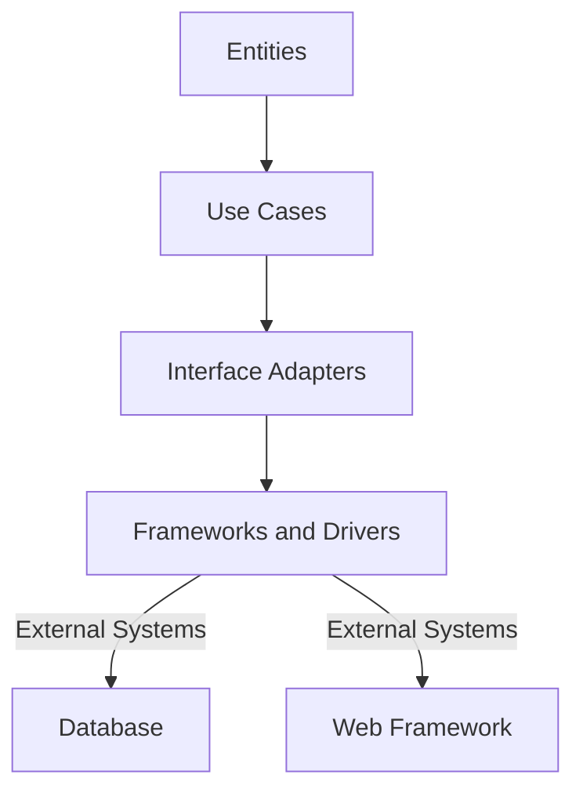

## 12.7 Clean Architecture Principles

Clean Architecture is a software design philosophy that emphasizes the separation of concerns, making systems more maintainable, testable, and scalable. In this section, we will explore how to implement Clean Architecture principles in Haskell, a purely functional programming language known for its strong type system and expressive power.

### Understanding Clean Architecture

Clean Architecture is built on the idea of organizing code into layers with clear dependencies. The core tenets of Clean Architecture include:

- **Independence from Frameworks**: The architecture should not be tied to any specific framework, allowing for flexibility and adaptability.
- **Testability**: Business logic should be easily testable without reliance on external systems.
- **Independence from UI**: The user interface should not dictate the business logic, allowing for changes in the UI without affecting the core system.
- **Independence from Database**: Business rules should not depend on database details, enabling changes in data storage without impacting the logic.
- **Independence from External Agencies**: The core system should not rely on external systems or services, promoting resilience and adaptability.

### Implementing Clean Architecture in Haskell

Implementing Clean Architecture in Haskell involves structuring applications into distinct layers, each with specific responsibilities and dependencies. The typical layers include:

1. **Entities**: Represent the core business logic and rules.
2. **Use Cases**: Define application-specific business rules and orchestrate the flow of data.
3. **Interface Adapters**: Convert data from the use cases to a format suitable for the external world (e.g., UI, database).
4. **Frameworks and Drivers**: Handle interactions with external systems, such as databases and web frameworks.

#### Layered Architecture in Haskell

Let's explore how to structure a Haskell application following Clean Architecture principles.

**Entities Layer**

The Entities layer contains the core business logic, represented as pure functions and data types. This layer is independent of any external systems.

```haskell
-- Define a data type for a User entity
data User = User
  { userId :: Int
  , userName :: String
  , userEmail :: String
  } deriving (Show, Eq)

-- Define a function to validate a User
validateUser :: User -> Bool
validateUser user = not (null (userName user)) && not (null (userEmail user))
```

**Use Cases Layer**

The Use Cases layer orchestrates the application-specific business rules. It interacts with the Entities layer and defines the flow of data.

```haskell
-- Define a use case for registering a user
registerUser :: User -> IO (Either String User)
registerUser user =
  if validateUser user
    then do
      -- Simulate saving the user to a database
      putStrLn "User registered successfully."
      return (Right user)
    else return (Left "Invalid user data.")
```

**Interface Adapters Layer**

The Interface Adapters layer converts data between the Use Cases layer and external systems. This layer is responsible for data transformation and communication.

```haskell
-- Define a function to convert a User to JSON
userToJson :: User -> String
userToJson user = "{\"id\": " ++ show (userId user) ++ ", \"name\": \"" ++ userName user ++ "\", \"email\": \"" ++ userEmail user ++ "\"}"
```

**Frameworks and Drivers Layer**

The Frameworks and Drivers layer handles interactions with external systems, such as databases and web frameworks. This layer is where you integrate with libraries and frameworks.

```haskell
-- Simulate a database interaction
saveUserToDatabase :: User -> IO ()
saveUserToDatabase user = putStrLn ("Saving user to database: " ++ show user)
```

### Visualizing Clean Architecture

To better understand the structure of Clean Architecture, let's visualize the layers and their dependencies using a Mermaid.js diagram.



**Diagram Explanation**: The diagram illustrates the flow of data and dependencies between the layers. The Entities layer is at the core, with Use Cases building upon it. Interface Adapters convert data for external systems, which are managed by the Frameworks and Drivers layer.

### Key Participants in Clean Architecture

- **Entities**: Core business logic and rules.
- **Use Cases**: Application-specific business rules.
- **Interface Adapters**: Data conversion and communication.
- **Frameworks and Drivers**: External system interactions.

### Applicability of Clean Architecture

Clean Architecture is suitable for applications that require:

- **Scalability**: The ability to grow and adapt to changing requirements.
- **Maintainability**: Ease of understanding, modifying, and extending the codebase.
- **Testability**: The ability to test business logic independently of external systems.
- **Resilience**: Independence from external systems, promoting robustness.

### Sample Code Snippet

Let's put together a simple Haskell application that follows Clean Architecture principles.

```haskell
module Main where

-- Import necessary modules
import Data.Maybe (isJust)

-- Define the User entity
data User = User
  { userId :: Int
  , userName :: String
  , userEmail :: String
  } deriving (Show, Eq)

-- Validate a User
validateUser :: User -> Bool
validateUser user = not (null (userName user)) && not (null (userEmail user))

-- Register a User use case
registerUser :: User -> IO (Either String User)
registerUser user =
  if validateUser user
    then do
      saveUserToDatabase user
      return (Right user)
    else return (Left "Invalid user data.")

-- Convert User to JSON
userToJson :: User -> String
userToJson user = "{\"id\": " ++ show (userId user) ++ ", \"name\": \"" ++ userName user ++ "\", \"email\": \"" ++ userEmail user ++ "\"}"

-- Simulate saving User to a database
saveUserToDatabase :: User -> IO ()
saveUserToDatabase user = putStrLn ("Saving user to database: " ++ show user)

-- Main function
main :: IO ()
main = do
  let user = User 1 "Alice" "alice@example.com"
  result <- registerUser user
  case result of
    Right u -> putStrLn ("User registered: " ++ userToJson u)
    Left err -> putStrLn ("Error: " ++ err)
```

### Design Considerations

When implementing Clean Architecture in Haskell, consider the following:

- **Pure Functions**: Leverage Haskell's pure functions to implement business logic in the Entities layer.
- **Type Safety**: Use Haskell's strong type system to enforce data integrity and prevent errors.
- **Separation of Concerns**: Clearly separate the responsibilities of each layer to maintain independence and flexibility.
- **Dependency Injection**: Use Haskell's type classes and monads to inject dependencies and manage side effects.

### Haskell Unique Features

Haskell offers unique features that align well with Clean Architecture principles:

- **Immutability**: Haskell's immutable data structures promote stability and predictability.
- **Type System**: The strong type system ensures data integrity and reduces runtime errors.
- **Monads**: Monads provide a powerful way to manage side effects and dependencies.
- **Lazy Evaluation**: Haskell's lazy evaluation allows for efficient data processing and resource management.

### Differences and Similarities

Clean Architecture shares similarities with other architectural patterns, such as Hexagonal Architecture and Onion Architecture. However, it emphasizes independence from external systems and frameworks more strongly.

### Knowledge Check

- **Question**: What is the primary goal of Clean Architecture?
  - **Answer**: To separate concerns and promote independence from external systems.

- **Question**: How does Haskell's type system support Clean Architecture?
  - **Answer**: By ensuring data integrity and reducing runtime errors.

### Exercises

1. **Modify the Code**: Change the `User` data type to include a phone number and update the validation logic accordingly.
2. **Add a New Use Case**: Implement a use case for updating a user's email address.
3. **Test the Application**: Write test cases for the `registerUser` function using Haskell's testing libraries.

### Embrace the Journey

Remember, implementing Clean Architecture in Haskell is a journey. As you progress, you'll build more robust and maintainable systems. Keep experimenting, stay curious, and enjoy the process!

## Quiz: Clean Architecture Principles



### What is the primary goal of Clean Architecture?

- [x] To separate concerns and promote independence from external systems
- [ ] To tightly couple business logic with the database
- [ ] To focus solely on UI design
- [ ] To eliminate all use of external libraries

> **Explanation:** Clean Architecture aims to separate concerns and ensure that the core system is independent of external systems, promoting flexibility and maintainability.

### Which layer in Clean Architecture contains the core business logic?

- [x] Entities
- [ ] Use Cases
- [ ] Interface Adapters
- [ ] Frameworks and Drivers

> **Explanation:** The Entities layer contains the core business logic and rules, independent of external systems.

### How does Haskell's type system support Clean Architecture?

- [x] By ensuring data integrity and reducing runtime errors
- [ ] By allowing dynamic typing
- [ ] By promoting mutable state
- [ ] By enforcing strict evaluation

> **Explanation:** Haskell's strong type system ensures data integrity and reduces runtime errors, supporting the principles of Clean Architecture.

### What is the role of the Use Cases layer in Clean Architecture?

- [x] To define application-specific business rules and orchestrate data flow
- [ ] To handle database interactions
- [ ] To convert data for external systems
- [ ] To manage UI components

> **Explanation:** The Use Cases layer defines application-specific business rules and orchestrates the flow of data, interacting with the Entities layer.

### Which Haskell feature aligns well with Clean Architecture principles?

- [x] Immutability
- [ ] Mutable state
- [ ] Dynamic typing
- [ ] Global variables

> **Explanation:** Haskell's immutability promotes stability and predictability, aligning well with Clean Architecture principles.

### What is the purpose of the Interface Adapters layer?

- [x] To convert data between the Use Cases layer and external systems
- [ ] To define core business logic
- [ ] To manage UI components
- [ ] To handle database interactions

> **Explanation:** The Interface Adapters layer is responsible for converting data between the Use Cases layer and external systems, ensuring proper communication.

### How can Haskell's monads be used in Clean Architecture?

- [x] To manage side effects and dependencies
- [ ] To enforce strict evaluation
- [ ] To promote mutable state
- [ ] To allow dynamic typing

> **Explanation:** Monads in Haskell provide a powerful way to manage side effects and dependencies, supporting Clean Architecture principles.

### What is a key benefit of separating concerns in Clean Architecture?

- [x] Improved maintainability and testability
- [ ] Increased coupling between layers
- [ ] Reduced flexibility
- [ ] Dependence on specific frameworks

> **Explanation:** Separating concerns in Clean Architecture improves maintainability and testability, making the system more robust and adaptable.

### Which layer handles interactions with external systems?

- [x] Frameworks and Drivers
- [ ] Entities
- [ ] Use Cases
- [ ] Interface Adapters

> **Explanation:** The Frameworks and Drivers layer handles interactions with external systems, such as databases and web frameworks.

### True or False: Clean Architecture promotes independence from UI design.

- [x] True
- [ ] False

> **Explanation:** Clean Architecture promotes independence from UI design, allowing changes in the UI without affecting the core system.


